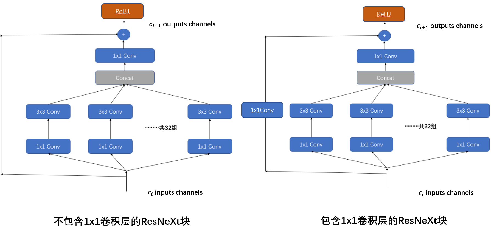
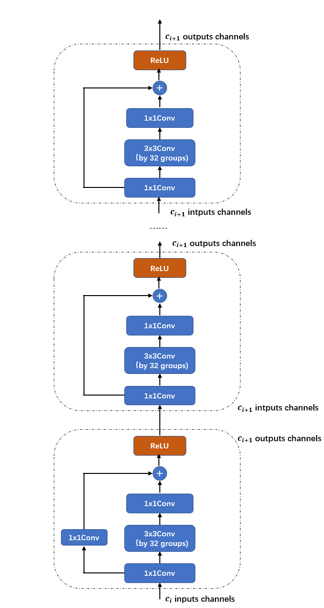
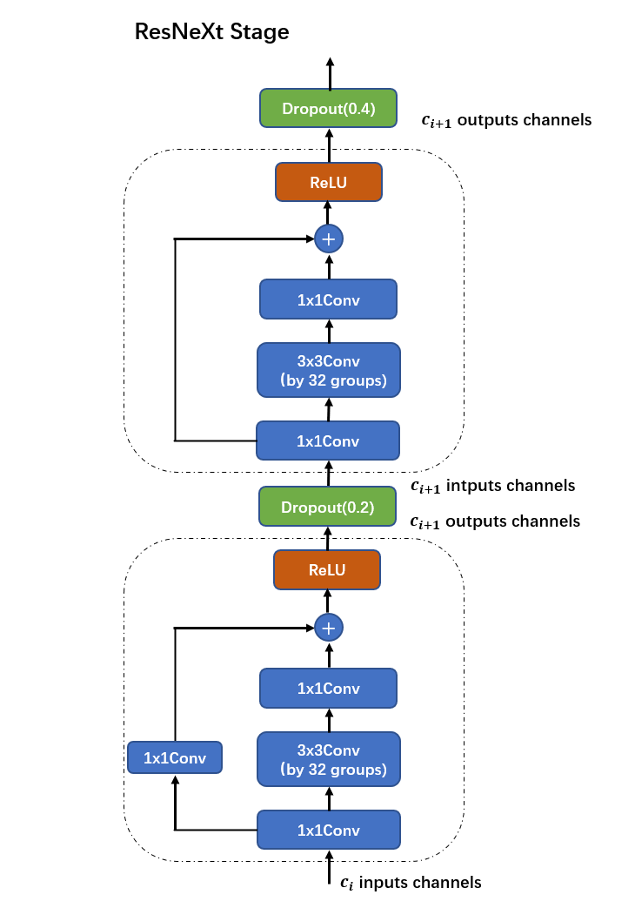
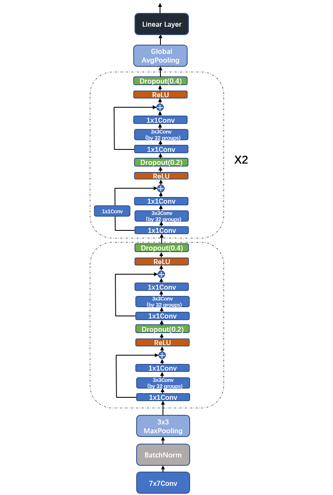
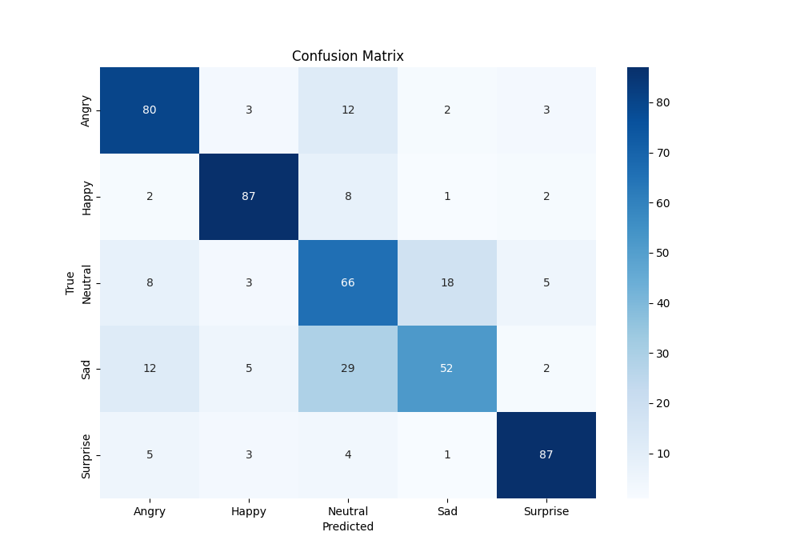
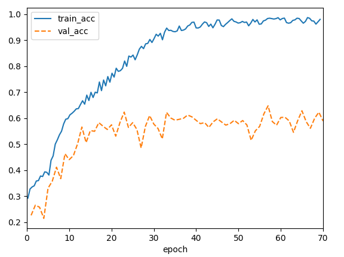
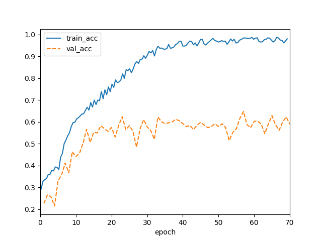
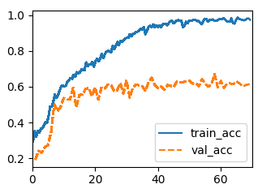
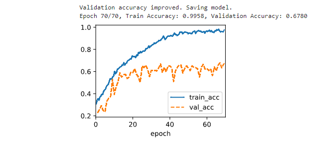
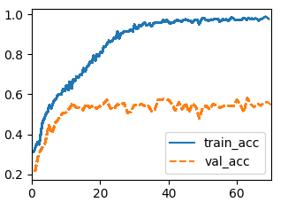

## Facial Expression Recognition实验文档（v2补充版）

> 由于ddl前写实验报告的时候有些仓促，文档中模型架构中设计这部分有很多地方没有说清楚（还有一些地方有错误）。故经同意后提交关于模型架构的补充说明，同时附上了所使用的代码框架的说明，同时订正了一些错误，以便更好地展示和说明所使用模型地架构和设计。
>
> 两个部分整合到了原版的文档中，老师和助教们只需阅读这一份最新实验文档即可，而不必两份来回阅读。

|   学号   |  姓名  |
| :------: | :----: |
| 20319045 | 刘冠麟 |

模型实现参考了**ResNeXt**论文《Aggregated Residual Transformations for Deep Neural Networks》(https://arxiv.org/pdf/1611.05431)，在ResNet-18的基础上参考了ResNeXt进行了改进，**将ResNet中的残差块改成了ResNeXt块，并且加入了dropout层**，同时通过多次对比实验，针对这次数据集简化并改进了模型的架构设计。

得益于数据预处理、强大的ResNeXt架构以及针对数据集的微调，模型整体表现优异，整体预测准确率为**74.4%**，远高于实验baseline给出49.8%，高出了**24.6%**。

### 任务描述

对于给定的人脸图片，输出其表情标签（图像分类任务）。

一共包含五种表情：Angry，Happy，Neutral，Sad，Surprise，已经进行了训练集和测试集的划分，数据规模如下（数据集中存在一定的不平衡）：

| 情绪标签 | 训练集样本数 | 测试集样本数 |
| :------: | :----------: | :----------: |
|  Angry   |     500      |     100      |
|  Happy   |     1500     |     100      |
| Neutral  |     1000     |     100      |
|   Sad    |     1500     |     100      |
| Surprise |     500      |     100      |


#### 代码框架

代码的训练框架参考了李沐老师的**deep into deep learning**（https://d2l.ai/index.html）课程实现。主要包括三个基类：`Module`、`dataModule`、和`Trainer`，分别对应模型、数据集、训练器的基类。代码框架具有较强的通用性，后续要针对特定的任务和数据集进行训练或者设计网络架构，只需对这三个基类进行继承，再定义架构、方法等即可，无需重写全部代码。

##### Module

module基类继承了pytorch库中的`Module`类，主要只拓展了绘图功能，可以实时绘制训练进度以便观测模型效果，同时还继承了`HyperParameters`类，该类主要功能为对输入的超参数进行保存，在类中可以直接使用`self`调用超参数。同时还预先配置了优化方法，这里基类默认为随机梯度下降SGD，具体还要根据任务和模型修改（本实验中使用`adam`优化方法）

```python
class Module(nn.Module, utils.HyperParameters):
    """模型基类"""
    def __init__(self, plot_train_per_epoch=2, plot_valid_per_epoch=1):
        super().__init__()
        self.save_hyperparameters()
        self.board = utils.ProgressBoard(display=True, save_to_file=True)

    def plot(self, key, value, train):
        assert hasattr(self, 'trainer'), 'Trainer is not inited'
        self.board.xlabel = 'epoch'
        if train:
            x = self.trainer.train_batch_idx / \
                self.trainer.num_train_batches
            n = self.trainer.num_train_batches / \
                self.plot_train_per_epoch
        else:
            x = self.trainer.epoch + 1
            n = self.trainer.num_val_batches / \
                self.plot_valid_per_epoch
        self.board.draw(x, utils.numpy(utils.to(value, utils.cpu())),
                        ('train_' if train else 'val_') + key,
                        every_n=int(n))
    def configure_optimizers(self):
		return torch.optim.SGD(self.parameters(), lr=self.lr)
```

由于这次实验是分类任务，所以对`Module`基类进行继承，针对分类任务继承出`Classifier`，主要根据分类任务的特性对损失函数进行定义，使用**交叉熵损失**，同时使用**softmax**对概率进行预测（这一过程集成在了`torch.F`的交叉熵函数中）。然后还定义了训练和验证时每一步中的绘图操作，以便实时观测训练进度和效果。

```python
class Classifier(Module):
    """分类模型基类"""
    def validation_step(self, batch):
        Y_hat = self(*batch[:-1])
        acc = utils.accuracy(Y_hat, batch[-1])
       # self.plot('loss', self.loss(Y_hat, batch[-1]), train=False)
        self.plot('acc', acc, train=False)
        return acc

    def training_step(self, batch):
        Y_hat = self(*batch[:-1])
        l = self.loss(Y_hat, batch[-1])
        #self.plot('loss', l, train=True)
        self.plot('acc', utils.accuracy(Y_hat, batch[-1]), train=True)
        return l

    def loss(self, Y_hat, Y, averaged=True):
        Y_hat = utils.reshape(Y_hat, (-1, Y_hat.shape[-1]))
        Y = utils.reshape(Y, (-1,))
        return F.cross_entropy(
            Y_hat, Y, reduction='mean' if averaged else 'none')
```


##### DataModule

对数据集加载的基类，主要功能为根据数据类别将数据转换成可迭代的`dataloader`格式。其中核心函数`get_dataloader`需要针对特定的数据集进行继承。（后续数据预处理部分中展示）

```python
class DataModule(utils.HyperParameters):
    """数据dataloader基类"""

    def __init__(self, root='../data', num_workers=12):
        self.save_hyperparameters()

    def get_dataloader(self, train):
        raise NotImplementedError

    def train_dataloader(self):
        return self.get_dataloader(train=True)

    def val_dataloader(self):
        return self.get_dataloader(train=False)

    def get_tensorloader(self, tensors, train, indices=slice(0, None)):
        tensors = tuple(a[indices] for a in tensors)
        dataset = torch.utils.data.TensorDataset(*tensors)
        return torch.utils.data.DataLoader(dataset, self.batch_size,
                                           shuffle=train)
```


##### Trainer

`Module`基类及其后续继承的具体模型只是定义了要进行训练的模型，只是一个壳子，`DataModule`（需要进一步针对数据集完善）只是读取并创建了迭代的分批次数据集，而`Trainer`将`Module`和`DataModule`连结在一起，真正要进行训练模型需要在Trainer中进行。

```python
class Trainer(utils.HyperParameters):
    def __init__(self, max_epochs, num_gpus=0, gradient_clip_val=0, checkpoint_path='best_model.pth'):
        self.save_hyperparameters()
        self.gpus = [utils.gpu(i) for i in range(min(num_gpus, utils.num_gpus()))]
        self.best_val_accuracy = 0
        self.checkpoint_path = checkpoint_path
```

Trainer中首先读取传入的模型和数据集，并做相应的预处理，同时将数据和模型移到同一个gpu上，不然无法训练：

```python
    def prepare_data(self, data):
        self.train_dataloader = data.train_dataloader()
        self.val_dataloader = data.val_dataloader()
        self.num_train_batches = len(self.train_dataloader)
        self.num_val_batches = (len(self.val_dataloader)
                                if self.val_dataloader is not None else 0)

    def prepare_model(self, model):
        model.trainer = self
        model.board.xlim = [0, self.max_epochs]
        if self.gpus:
            model.to(self.gpus[0])
        self.model = model

    def prepare_batch(self, batch):
        if self.gpus:
            batch = [utils.to(a, self.gpus[0]) for a in batch]
        return batch

```

然后是训练过程，使用前两个定义的函数读取出数据集和模型，然后再读取出优化方法（通过`module`及其继承类定义的函数），对epoch等初始化后开始迭代max_epochs次训练模型，同时每一次迭代中输出测试集和训练集的准确率。

```python
    def fit(self, model, data):
        self.prepare_data(data)
        self.prepare_model(model)
        self.optim = model.configure_optimizers()
        self.epoch = 0
        self.train_batch_idx = 0
        self.val_batch_idx = 0
        for self.epoch in range(self.max_epochs):
            self.fit_epoch()
            # 输出验证集和测试集的准确率
            train_acc = utils.evaluate_accuracy(model, self, self.train_dataloader)
            val_acc = utils.evaluate_accuracy(model, self, self.val_dataloader)
            print(f'Epoch {self.epoch+1}/{self.max_epochs}, Train Accuracy: {train_acc:.4f}, Validation Accuracy: {val_acc:.4f}')
```

然后在每个epoch中执行训练过程。同时在当前epoch训练完后计算验证集准确率，当验证集准确率高于历史最高值时，自动保存当前epoch的模型参数：

```python
    def fit_epoch(self):
        self.model.train()
        for batch in self.train_dataloader:
            loss = self.model.training_step(self.prepare_batch(batch))
            self.optim.zero_grad()
            with torch.no_grad():
                loss.backward()
                if self.gradient_clip_val > 0:
                    self.clip_gradients(self.gradient_clip_val, self.model)
                self.optim.step()
            self.train_batch_idx += 1
        if self.val_dataloader is None:
            return
        self.model.eval()
        val_acc = utils.evaluate_accuracy(self.model, self, self.val_dataloader)
        if val_acc > self.best_val_accuracy:
            self.best_val_accuracy = val_acc
            print(f'Validation accuracy improved. Saving model.')
            self.save_checkpoint()
```


### 数据预处理的操作

#### 图像增强

由于给出的数据集样本量较少，为了在不增加实际数据数量的情况下扩展训练数据集，从而使模型能够更好地泛化到未见过的数据，需要通过数据增强来对训练数据进行随机变换来生成新的数据，从而增加训练数据的多样性。

在代码实现中，情感数据集模块中定义了`train_transform`，首先对数据集图片reshape成`(224,224)`的尺寸，在统一图像尺寸的同时方便输入网络训练。

然后规定在加载训练数据集时每个epoch中对数据集进行以下数据增强：

- 随机水平翻转、旋转图片。

- 随机调整图片的亮度、对比度、饱和度和色调。

  最后转化成张量并标准化。

```python
self.train_transform = transforms.Compose([  # 对训练集进行图像增强
    transforms.Resize(resize),
    transforms.RandomHorizontalFlip(),
    transforms.RandomRotation(10),
    transforms.ColorJitter(brightness=0.2, contrast=0.2, saturation=0.2, hue=0.1),
    transforms.ToTensor(),
    transforms.Normalize(mean=[0.485, 0.456, 0.406], std=[0.229, 0.224, 0.225])
])
```

实验证明，对图像进行数据增强能显著提升模型性能：

| 数据增强                                       | acc       |
| ---------------------------------------------- | --------- |
| 3 * ResNeXt层 + （0.2，0.4）dropout            | 67.8%     |
| 3 * ResNeXt层 + （0.2，0.4）dropout + 数据增强 | **71.6%** |

训练集和测试集acc曲线如下：


#### 平衡采样器

由任务描述可见，任务数据集的分布明显不均匀，Happy和Sad的数据集要明显多于其他类别的数据。数据分布不均可能造成模型偏差和过拟合，所以本实验中采用了**平衡采样器**，在数据加载时使用自定义采样器来平衡各类样本数量来处理不均匀数据集

在`EmotionDataModule`类中加载训练集时进行平衡采样：

```python
def get_dataloader(self, train):
    if train:
        dataset = EmotionDataset(root_dir=os.path.join(self.root_dir, 'train'), transform=self.train_transform)
        weights = calculate_weights(dataset)
        sampler = WeightedRandomSampler(weights, num_samples=len(weights), replacement=True)
        return DataLoader(dataset, batch_size=self.batch_size, sampler=sampler, num_workers=self.num_workers)
    else:
        dataset = EmotionDataset(root_dir=os.path.join(self.root_dir, 'test'), transform=self.val_transform)
    return DataLoader(dataset, batch_size=self.batch_size, shuffle=train, num_workers=self.num_workers)
```

其中计算数据集权重通过以下函数实现：

```python
def calculate_weights(dataset):
    label_counts = np.bincount(dataset.labels)
    total_samples = len(dataset.labels)
    weights = 1.0 / label_counts
    sample_weights = weights[dataset.labels]
    return sample_weights
```

实验证明，对图像进行数据增强能显著提升模型性能：

| 平衡数据分布                                                 | acc       |
| ------------------------------------------------------------ | --------- |
| 3 * ResNeXt层 + （0.2，0.4）dropout + 数据增强               | 71.6%     |
| 3 * ResNeXt层 + （0.2，0.4）dropout + 数据增强 + 平衡数据分布 | **74.4%** |

训练集和测试集acc曲线如下：


### 超参数设置

经过多次试验后，模型超参数设置如下：

```python
"""超参数"""
batch_size = 32
resize = (224, 224)
max_epochs = 70
num_gpus = 1
lr = 0.005
num_classes = 5
```

同时模型使用Adam优化器进行训练：

```python
def configure_optimizers(self):
    """使用adam优化器"""
    return torch.optim.Adam(self.parameters(), lr=self.lr)
```


### 模型架构设计

模型实现参考了**ResNeXt**论文《Aggregated Residual Transformations for Deep Neural Networks》(https://arxiv.org/pdf/1611.05431)，在ResNet-18的基础上参考了ResNeXt进行了改进，**将ResNet中的残差块改成了ResNeXt块，并且加入了dropout层**，同时通过多次对比实验（见附录），针对这次数据集简化并改进了模型的架构设计。

得益于数据预处理、强大的ResNeXt架构以及针对数据集的微调，模型整体表现优异，整体预测准确率为**74.4%**，远高于实验baseline给出49.8%，高出了**24.6%**。

#### ResNeXt Block

本次实验中将ResNet18所使用的残差块改成了ResNeXtBlock，ResNeXtBlock参考原论文的架构设计实现，同时融合了ResNet和Inception架构的特点。

对于每一个ResNeXt Block，首先会通过1x1卷积减少输入特征图的通道数，同时，然后再通过3x3的分组卷积处理特征图像，最后通过1x1卷积恢复特征图的通道数，同时与ResNet一样还会将输入与输出进行残差连接。

与残差块Residual block一样，ResNeXt Block也需要具有改变特征图通道数和分辨率的的能力（一般情况下就是将通道数翻倍、长宽减半），也就是说对于输出通道数改变的情况，残差连接中还需要对输入进行一个1x1卷积改变通道数和图像分辨率，使得输入和输出通道数和图像尺寸相同，从而可以直接相加、拟合残差。

具体来说，ResNeXt Block的设计架构如下：



由于ResNeXt是融合了ResNet和Inception架构的实现同时拥有了两个模型的关键特征：

- **分组卷积**：ResNeXt Block通过使用分组卷积将通道分成多个组，每个组单独进行卷积操作。这种方式减少了参数数量和计算量，通过增加Cardinality，可以在不显著增加参数数量的情况下增强模型的性能。
- **残差连接**：类似ResNet，ResNeXt Block也使用了残差连接，将输入直接添加到输出中，从而缓解梯度消失问题，加速训练，并提高深层网络的性能。

ResNeXt Block的实现代码如下：

```python
class ResNeXtBlock(nn.Module):
    """ResNeXt block"""
    def __init__(self, num_channels, groups, bot_mul, use_1x1conv=False,
                 strides=1):
        super().__init__()
        bot_channels = int(round(num_channels * bot_mul))
        self.conv1 = nn.LazyConv2d(bot_channels, kernel_size=1, stride=1)
        self.conv2 = nn.LazyConv2d(bot_channels, kernel_size=3,
                                   stride=strides, padding=1,
                                   groups=bot_channels//groups)
        self.conv3 = nn.LazyConv2d(num_channels, kernel_size=1, stride=1)
        self.bn1 = nn.LazyBatchNorm2d()
        self.bn2 = nn.LazyBatchNorm2d()
        self.bn3 = nn.LazyBatchNorm2d()
        if use_1x1conv:
            self.conv4 = nn.LazyConv2d(num_channels, kernel_size=1,
                                       stride=strides)
            self.bn4 = nn.LazyBatchNorm2d()
        else:
            self.conv4 = None

    def forward(self, X):
        Y = F.relu(self.bn1(self.conv1(X)))
        Y = F.relu(self.bn2(self.conv2(Y)))
        Y = self.bn3(self.conv3(Y))
        if self.conv4:
            X = self.bn4(self.conv4(X))
        return F.relu(Y + X)
```

其中参数`use_1x1conv`决定是否将输入进行1x1卷积。


#### ResNeXt Stage

参考ResNet和ResNeXt的网络架构，设计的网络除了输入和输出部分外，中间由多个**ResNeXt Stage**组成，每个ResNeXt Stage包含多个（大于等于2）ResNeXt Block，每个ResNeXt Stage中的第一个ResNeXt Block的残差连接中需要包含1x1的卷积块用以调整图片的通道数，后面的若干个ResNeXt Block则保持通道数不变，只用于提取特征。两种块设计分别对应上图中的两个block。最后整个网络由多个这样的Stage依次堆叠而成，形成一个深层次的卷积神经网络。

每一个ResNeXt Stage的结构示意图如下，这次实验使用的神经网络就是由若干个这样的模块串联而成：



在本次实验的模型架构中参考了ResNet18，将每一个Stage的blocks数目设置为**2**，也就是每一个stage只由两个ResNeXt Block所组成。

针对这次的数据集，由于数据集较小，为了防止过拟合，所以在传统的stage之上进行了改进，在最后两个（本实验中的网络中只有两个）ResNeXtBlock之后分别加入了Dropout。并且通过多次的横向对比实验证明，倒数第二个dropout层和倒数第一个dropout层分别选择0.2和0.4的丢弃率相对更好：

| dropout            | acc     |
| ------------------ | ------- |
| （0，0）(baseline) | 62.8%   |
| （0.2，0.4）       | **65%** |
| （0.3，0.5）       | 64.6%   |

由此，网络架构中的一个stage结构如下：



实现代码如下：

```python
def block(self, num_ResNeXt, num_channels, first_block=False):
    blk = []
    for i in range(num_ResNeXt):
        if i == 0 and not first_block:
            blk.append(ResNeXtBlock(num_channels, 32, 1, use_1x1conv=True, strides=2))
        elif i==num_ResNeXt-2:
            blk.append(ResNeXtBlock(num_channels, 32, 1))
            blk.append(nn.Dropout(0.2))
        elif i==num_ResNeXt-1:
            blk.append(ResNeXtBlock(num_channels, 32, 1))
            blk.append(nn.Dropout(0.4))
    return nn.Sequential(*blk)
```


#### 模型整体架构

模型的输入与输出部分的结构与ResNet18一致，都是首先经过一个7x7、步长为2、padding为3、输出通道为64的卷积层，然后经过批归一化和ReLU后再进行一次3x3步长为2padding为1的最大池化层后送入ResNeXt Stage进行处理。

```python
def b1(self):
    return nn.Sequential(
        nn.LazyConv2d(64, kernel_size=7, stride=2, padding=3),
        nn.LazyBatchNorm2d(), nn.ReLU(),
        nn.MaxPool2d(kernel_size=3, stride=2, padding=1))
```

由于在输入卷积处理部分已经经过了一次最大池化，也就是送入第一个ResNeXt Stage之前已经通过步长为2的最大池化层，所以在第一个ResNeXt Stage中的第一个ResNeXt Block不需要使用1x1卷积。

而在输出阶段，从若干个ResNeXt Stage中获取到最终的特征图像后，对其进行1x1的全局平均池化，得到`(batch_size, num_channels)`尺寸的张量，然后对展平成向量后送入线性层进行处理，并指定输出维度为5，也就是输出各个类别的分数。

模型整体代码如下：(之前`b1`和`block`函数都为ResNeXt的成员函数，这里不再重复展示)

```python
class ResNeXt(Classifier):
    def __init__(self, arch, lr=0.1, num_classes=10):
        super(ResNeXt, self).__init__()
        self.save_hyperparameters()
        self.net = nn.Sequential(self.b1())
        for i, b in enumerate(arch):
            self.net.add_module(f'b{i + 2}', self.block(*b, first_block=(i == 0)))
        self.net.add_module('last', nn.Sequential(
            nn.AdaptiveAvgPool2d((1, 1)), nn.Flatten(),
            nn.LazyLinear(num_classes)))
        self.net.apply(utils.init_cnn)
```

对于ResNeXt Stage的层数选择，我对ResNet-18进行参考，以ResNet-18的网络架构（四层ResNeXt Stage）为baseline，改变stage数目进行多次实验，实验结果显示因为数据集较小，对比实验可知使用三层简化的ResNeXt在此数据集中的表现效果要比原论文的四层的ResNeXt效果要更好，而增加到五层后由于参数量过多，模型过于庞大而导致过拟合，效果反而大幅下降。

| ResNeXt Stage数量                                         | acc       |
| --------------------------------------------------------- | --------- |
| 三层` ((2, 64), (2, 128), (2, 256)) `                     | **67.8%** |
| 四层(baseline) ` ((2, 64), (2, 128), (2, 256), (2, 512))` | 65%       |
| 五层 `((2, 64), (2, 128), (2, 256), (2, 512),  (2, 512))` | 57.8%     |

由于在当前数据集下三层的效果最好，所以最终模型选用了三层的ResNeXt Stage。由于代码的模块化设计，指定模型层数这里只需要修改传入的`arch`参数即可：

```python
class ResNeXt18(ResNeXt):
    def __init__(self, lr, num_classes):
        super().__init__(((2, 64), (2, 128), (2, 256)),
                       lr, num_classes)
```

最终的模型整体架构示意图如下：




#### 验证方法（划分验证集进行验证）

在本次实验中使用了train文件夹中的训练集数据进行训练，并将预先划分好的测试集test作为验证集进行测试。并且进行如下方法进行验证：

- 预测准确率
- 每个类别的召回率
- 每个类别的精准率
- 每个类别的F1-Score
- Macro-F1 


#### 结果分析

运行`test.py`，可以得到如下结果：

| Class    | Precision | Recall | F1-Score |
| -------- | --------- | ------ | -------- |
| Angry    | 0.7477    | 0.8000 | 0.7729   |
| Happy    | 0.8614    | 0.8700 | 0.8657   |
| Neutral  | 0.5546    | 0.6600 | 0.6027   |
| Sad      | 0.7027    | 0.5200 | 0.5977   |
| Surprise | 0.8788    | 0.8700 | 0.8744   |

计算得到的Macro-F1 score为**0.7427**，预测准确率为**74.4%**，远高于实验给出49.8%的baseline。

同时得到如下混淆矩阵：




从实验结果中可以得到如下结论：

- 得益于数据预处理、强大的ResNeXt架构以及针对数据集的微调，模型整体表现优异，整体预测准确率为**74.4%**，远高于实验baseline给出49.8%，高出了**24.6%**。
- **对于Happy、Surprise以及Angry**：这三个类别的精确率、召回率和F1分数都较高，说明模型在识别这三个类别时表现较为稳定和优异，区分能力较强。
- **而对于Neutral和Sad**：这两个类别的精确率和召回率较低，尤其是**Neutural类别的精确率**和**Sad类别的召回率**，从混淆矩阵中也能看到，这两个类别在混淆矩阵中相邻颜色较深，也就是**说模型较为容易对中立和悲伤的表情混淆**，造成准确率下降，这也是模型需要改进的地方。


#### 自己的探索和心得体会

其实在选用ResNeTx作为base model之前也尝试过很多其他的架构，比如AlexNet、VGG、以及ConvNeXt等，最后发现实际上还是ResNet的表现最好。然后又开始尝试在ResNet的基础架构上寻找新的性能更好的模型，最后瞄准了同样较为出名的ResNeTx，经过测试后发现ResNeTx确实比ResNet要好上一点，而且在提供更强大的预测性能的同时由于分组卷积的存在还优化了训练和推理的速度，所以最终选择了ResNeTx。

而在自己尝试在原有模型的基础上改进时，由于给出的数据集较小，我主要的改进方向其实是**不断地更合理地对模型进行“剪枝”**，在模型的深度、宽度以及架构上都进行了尝试（如附录部分所示），最后**以减少过拟合为主要目标**，对模型的深度进行削减，同时增加两层dropout层，对模型针对数据集进行改进。最终结果也符合预期。

最后由于在同样的模型架构下，不进行预处理（**67.8%**）和进行预处理（**74.4%**）之间的差距非常大，这次实验还让我体会到了数据集以及数据集预处理的重要性。


#### 附录

| dropout            | acc     |
| ------------------ | ------- |
| （0，0）(baseline) | 62.8%   |
| （0.2，0.4）       | **65%** |
| （0.3，0.5）       | 64.6%   |

- （0，0）:

  

- （0.2，0.4）

  

- （0.3，0.5）:



| 层数                                                      | acc       |
| --------------------------------------------------------- | --------- |
| 三层` ((2, 64), (2, 128), (2, 256)) `                     | **67.8%** |
| 四层(baseline) ` ((2, 64), (2, 128), (2, 256), (2, 512))` | 65%       |
| 五层 `((2, 64), (2, 128), (2, 256), (2, 512),  (2, 512))` | 57.8%     |

- 三层：

  

- 四层：


- 五层：



| 数据增强                                       | acc       |
| ---------------------------------------------- | --------- |
| 3 * ResNeXt层 + （0.2，0.4）dropout            | 67.8%     |
| 3 * ResNeXt层 + （0.2，0.4）dropout + 数据增强 | **71.6%** |


| 平衡数据分布                                                 | acc       |
| ------------------------------------------------------------ | --------- |
| 3 * ResNeXt层 + （0.2，0.4）dropout + 数据增强               | 71.6%     |
| 3 * ResNeXt层 + （0.2，0.4）dropout + 数据增强 + 平衡数据分布 | **74.4%** |

