# 基于两层GRU架构的Seq2Seq中译英机器翻译模型

|   学号   |  姓名  |
| :------: | :----: |
| 20319045 | 刘冠麟 |

## 摘要

本此实验参考了Pytorch官方文档中的机器翻译教程，实现了基于RNN架构的Seq2Seq中译英机器翻译模型，其中编码器Encoder和解码器Decoder分别采用了**两层GRU**架构实现，并且实现了**注意力机制**，使模型可以动态地选择编码器输出的不同部分以提升翻译的准确性。同时使用**词向量初始化**和**Teacher Foring策略**，令模型拥有更快、更好的收敛效果。

实验中通过修改模型架构，充分对比讨论了RNN层深度、Teaching策略、预训练词向量以及数据集大小对模型收敛能力和效果的影响，并分别在10k和100k数据集上进行了多次对比试验。

实验结果显示，得益于attention机制、使用更大规模的数据集以及预训练词向量，实现的模型通过**100k数据集**训练之后能在验证集上达到**0.03697(3.7%)**的BLEU分数，高于实验给出的0.003的baseline。

## 实验任务

### 任务描述

在给定中英文数据集上进行训练，构建基于GRU或者LSTM的Seq2Seq架构（其中编码器和解码器均深度为2、且为单向）中译英机器翻译模型，并且实现attention机制。

### 数据集描述

训练集共有 4 个 jsonl 文件，分别对应着训练集（小）、训练集（大）、验证集和测试集，它们的大小分别是 100k、10k、500、200。jsonl 文件中的每一行包含一个平行语料样本。模型的性能以测试集的结果为最终标准。

| 数据集名称 | 样本规模 |
| :--------: | :------: |
|    test    |   200    |
|   vaild    |   500    |
| train_10k  |   10k    |
| train_100k |   100k   |

## 数据预处理

对于如下形式的jsonl格式原始数据集：

```json
{"en": "\"Sounds like you are locked,\" the Deputy Commandant replied.", "zh": "“听起来你被锁住了啊，”副司令回复道。", "index": 2}
```

需要将其转换成如下语句对形式的txt文本：

```
sounds like you are locked the deputy commandant replied@@听 起来 你 被 锁住 了 啊 副司令 回复 道
```

### 样本读取

首先读取jsonl文件：

```python
# 读取jsonl文件
def read_jsonl(file_path):
    data = []
    with open(file_path, 'r', encoding='utf-8') as file:
        for line in file:
            data.append(json.loads(line.strip()))
    return data
```

然后根据json文件的前缀判断文本属于哪一种语言并提取：

```python
# 提取需要的字段
def extract_fields(data):
    en_texts = [item['en'] for item in data]
    zh_texts = [item['zh'] for item in data]
    return en_texts, zh_texts
```

### 符号去除与格式标准化

提取出对应的`en_texts`和`zh_texts`文本后，通过引入正则表达式去除文本中可能存在的符号（许多还是数据集原有的异常符号）：

```python
    if lang == 'en':
        # 删除英文标点符号
        text = re.sub(r'[.,?!–\-":;()"’“”\'·/‘’\[\]…`¾]', '', text)
    else:
        # 删除中文标点符号
        text = re.sub(r'[。？，！–\-“”：；（()）、—《》<>·,:;?!./‘’…\[\]"¾]', '', text)
        # 在百分号前加空格
        text = re.sub(r'%', ' %', text)
```

对于中文文本，有的样本中对于人名、地名等特殊名称，会存在用括号内加上英文注释的情况。对于这种情况为了不影响训练效果，需要将整个括号除去，即：

```
作者是保守派英国记者马丁·沃尔夫（Martin Wolf ）
->
作者是保守派英国记者马丁沃尔夫
```

代码如下：

```python
        # 对于括号加英文的形式进行删除
        text = re.sub(r'\([A-Za-z\s]+\)', '', text)
```

同时，数据集中还有许多数字，比如`1999`、·`2008`等，对于这类特殊数字不能简单当作一个词汇（不具有泛化性），而是应该拆分成数字`1`、`9`、`9`、`9`等，即所有的数字组合可以通过10个单个数字的词汇进行表示。这样不仅能够大幅减少词汇量，而且能够提升模型对于数字的处理能力。

由于使用的分词模型不会将数字分开，所以这里还需要对数字进行处理，即在数字之间加入空格，这样分词模型就会将其识别成多个字符：

```python
    # 拆分连续数字
    text = re.sub(r'(\d)', r' \1 ', text)
```

### 分词

然后使用预训练的分词模型将输入句子切分为 tokens，每个子串相对有着完整的语义，便于学习 embedding 表达。

在本次实验中对于英文文本，使用`NLTK`库中的`word_tokenize`分词模型进行分词；对于中文文本则使用`jieba`库进行分词：

```python
# 分词函数
def tokenize(text, lang='en'):
    if lang == 'en':
        tokens = word_tokenize(text)
    else:
        tokens = jieba.lcut(text)
    result = ' '.join(tokens)
    result = re.sub(r'\s+', ' ', result)  # 将多个空格合并为一个空格
    return result
```

### 处理并保存

将读取后的文本中英文单词全部转化为小写（为了表达统一，同时降低词汇表大小）后经过上述函数进行标点处理和分词，然后将句子对拼接在一行中，并使用`@@`标识符表示分割，写入txt文本中。

```python
# 保存处理后的数据为txt文件，使用@@分割句子对
def save_to_txt(en_texts, zh_texts, output_file):
    with open(output_file, 'w', encoding='utf-8') as file:
        for en_text, zh_text in zip(en_texts, zh_texts):
            # 转化为小写
            en_text = en_text.lower()
            zh_text = zh_text.lower()
            # 去除标点符号和拆分连续数字
            en_text = remove_punctuation_and_split_digits(en_text, lang='en')
            zh_text = remove_punctuation_and_split_digits(zh_text, lang='zh')
            # 分词
            en_text = tokenize(en_text, lang='en')
            zh_text = tokenize(zh_text, lang='zh')
            file.write(f'{en_text}@@{zh_text}\n')
```

### 构建词典

#### lang类

创建`lang`类，构建从单词到索引和从索引到单词的映射。同时在`lang`类中定义三个特殊标识符为前三个索引，用来处理词典的特殊情况：

- `<SOS>:0`：表示句子开始
- `<EOS>:1`：表示句子结束
- `<UNK>:2`：表示未知，当处理的词汇不在词汇表中则将其标识为`<UNK>`。

lang类代码如下，类中创建从单词到索引的双向映射，并且通过分词后的空格划分单词，然后构建当前数据集的词汇表：

```python
class Lang:
    def __init__(self, name):
        self.name = name  # 语言的名称
        self.word2index = {}  # 单词到索引的映射
        self.word2count = {}  # 单词出现次数的统计
        self.index2word = {0: "<SOS>", 1: "<EOS>", 2:"<UNK>"}  # 索引到单词的映射，初始包含SOS和EOS以及UNK
        self.n_words = 3  # 单词数目初始化为3

    def addSentence(self, sentence):
        # 将句子拆分成单词，并逐个添加到字典中
        for word in sentence.split(' '):
            self.addWord(word)

    def addWord(self, word):
        # 如果单词不在字典中，添加该单词
        if word not in self.word2index:
            self.word2index[word] = self.n_words  # 给单词分配一个新的索引
            self.word2count[word] = 1  # 初始化单词的计数为1
            self.index2word[self.n_words] = word  # 将新索引和单词添加到索引到单词的映射中
            self.n_words += 1  # 增加单词数目
        else:
            self.word2count[word] += 1  # 如果单词已存在，增加该单词的计数
```

#### 构建语言对象

读取指定语言对的文本文件，通过之前定义的`@@`标识符分割不同类型的语句，然后创建相应的语言对象，并返回这些对象和句子对：

```python
def readLangs(lang1, lang2, reverse=False, text_type='train'):
    print("Reading lines...")
    

    # 读取文件并按行分割
    lines = open('data/sentence_pairs/%s-%s-%s.txt' % (lang1, lang2, text_type), encoding='utf-8').\
        read().strip().split('\n')

    # 将每一行分割成对并进行规范化
    pairs = [[s for s in l.split('@@')] for l in lines] #将每一行按照制表符@@分割成句子对,并且每个句子对都通过标准化处理
```

#### 过滤超出长度的句子

对`train_10k`数据集进行句子长度统计分析，可以得到其长度的数量直方图：

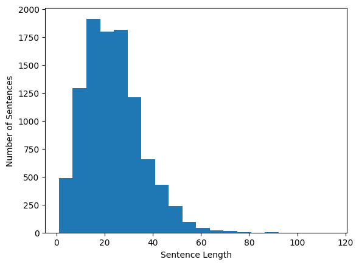

句子随长度大致呈正态分布，绝大多数句子都在长度60以内，所以这里选择过滤掉长度超过50的句子：

```python
"""过滤句子对"""

# 定义最大句子长度
MAX_LENGTH = 60

def filterPair(p):
    # 检查句子对是否符合长度限制
    return len(p[0].split(' ')) < MAX_LENGTH and \
        len(p[1].split(' ')) < MAX_LENGTH

def filterPairs(pairs):
    # 对所有句子对进行过滤，只保留符合条件的句子对
    return [pair for pair in pairs if filterPair(pair)]
```

准备玩数据集后进行读取`train_100k`数据集，可以得到如下输出：

```
Reading lines...
Read 100000 sentence pairs
Trimmed to 97849 sentence pairs
Counting words...
Counted words:
zh 53090
eng 43383
```

即过滤掉了长度超过60的句子后还有97849条句子；与此同时数据集组成的词汇表中共有中文53090个词、以及英文43383个词。

#### 过滤词频过小的词

为了缩减词汇表大小，避免词汇量过大，这里还将对词频小于3的词进行过滤，由此减少数据的维度提升计算效率。

同时频率过低的词往往是噪音，可能是拼写错误、专有名词或者不常用的词语，过滤掉这些词可以提高模型的训练效果；还有助于模型更专注于常见词，提高对测试数据的泛化能力。

利用之前`lang`类中记录的词频，对对词频小于5的词进行过滤：

```python
# 过滤掉词频小于3的词
MIN_COUNT = 3

def trimRareWords(lang, pairs):
    print('trimming rare words...')
    # 仅保留词频大于等于MIN_COUNT的单词
    lang.word2index = {word: idx for word, idx in lang.word2index.items() if lang.word2count[word] >= MIN_COUNT}
    lang.index2word = {idx: word for word, idx in lang.word2index.items()}
    lang.n_words = len(lang.word2index)
    
    print('keep words:', lang.n_words)
    
    return lang

# 过滤掉词频小于3的词
input_lang1 = trimRareWords(input_lang, pairs)
output_lang1 = trimRareWords(output_lang, pairs)
```

可以得到处理后的中英文的词汇表都缩减了`50%`左右的数据。可以看到数据集中起码大约一半左右都是非常用词，将这些词滤除后可以较大提升数据集质量，而且缩减了近一般的维度，可以有效提升训练速度。

```
trimming rare words...
keep words: 23910
trimming rare words...
keep words: 21674
```

### 预训练词向量初始化

由于实验给出的大数据集（100k）对于NLP任务来说依旧算是小数据集，如果从零开始训练词向量很容易导致过拟合，而且无法充分捕捉词汇之间的语义关系和上下文信息。除此之外，如果从零开始训练词向量，意味着需要分配更多的计算资源让模型学习词汇的表示，容易拖慢训练进度。

所以在本次实验中我选择使用预训练词向量对词向量进行初始化。为了保证中英文词向量语义接近从而拥有更好的训练效果,中英文词向量都选用了腾讯AI lab的开源的200维预训练词向量(https://ai.tencent.com/ailab/nlp/en/embedding.html)进行初始化.

#### 读取预训练词向量

由于中英文词向量加载过程相似,这里只展示英文预训练词向量的加载过程.

腾讯的预训练词向量官网中给出的小型英文数据集词汇数量为两百万，为了缩减读取时长，这里只读取词频最高的前50万个预训练词向量：

```python
def load_embeddings(glove_file_path, k):
    embeddings_index = {}
    with open(glove_file_path, 'r', encoding='utf-8') as f:
        for i, line in enumerate(f):
            if i >= k:  # 只读取前k个词
                break
            values = line.split()
            word = values[0]
            coefs = np.asarray(values[1:], dtype='float32')
            embeddings_index[word] = coefs
    return embeddings_index

eng_embeddings = load_embeddings('data/word2vec/tencent-ailab-embedding-en-d200-v0.1.0-s.txt', k=500000)
```

#### 创建预训练词向量字典

根据`eng_embeddings`创建词向量字典，在`output_lang`的词汇表中查找对应的词向量，不在的用随机初始化的词向量代替。初始化的随机向量在初始化的值在$-\sqrt{\frac{1}{dim}}$和$\sqrt{\frac{1}{dim}}$之间均匀采样：

```python
output_embeddings_dim = eng_embeddings['1'].shape[0]
output_lang_embeddings = {}
# 遍历output_lang的所有token，在eng_embeddings中查找对应的词向量
for word in output_lang.word2index.keys():
    if word in eng_embeddings:
        output_lang_embeddings[word] = eng_embeddings[word]
    else:
        # 在-sqrt(1/dim)和sqrt(1/dim)之间均匀采样
        output_lang_embeddings[word] = np.random.uniform(-np.sqrt(1/output_embeddings_dim), np.sqrt(1/output_embeddings_dim), output_embeddings_dim)
```

#### 转换维嵌入矩阵

由于在正式训练的过程中，`nn.embedding`是通过加载`torch`张量的形式读取预训练词向量的，所以还需要将词向量字典转换成`torch`形式备用：

```python
# 将词向量字典转换为嵌入矩阵
def create_embeddings_matrix(embeddings, lang):
    embeddings_matrix = np.zeros((lang.n_words, embeddings['1'].shape[0]))
    for word, idx in lang.word2index.items():
        embeddings_matrix[idx] = embeddings[word]
    return torch.FloatTensor(embeddings_matrix)

output_lang_embeddings_matrix = create_embeddings_matrix(output_lang_embeddings, output_lang)
```

## 模型架构设计

### 基本单元

模型编码器和解码器都基于`RNN`架构实现，其基本单元都选用了比LSTM表现更好的门控循环单元`GRU`，通过引入更新门和重置门来控制信息的流动，从而解决长期依赖问题。更新门决定了前一时刻的信息有多少需要保留到当前时刻，而重置门则控制了前一时刻的信息对当前输入的影响程度，整体结构比LSTM更简单且计算效率更高。

（图片来自李沐老师的`Dive into Deep Learning`教程文档）

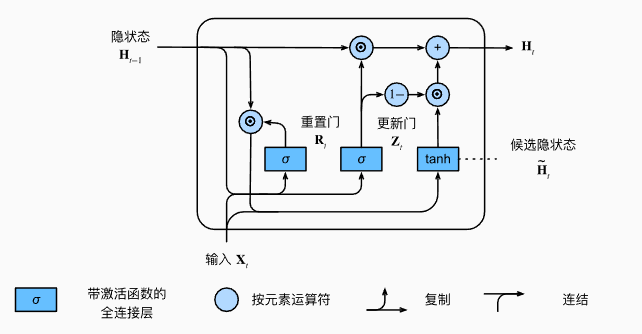

在代码实现中，`GRU`通过调用`torch.nn`库中的`GRU`类来进行实现并且层数指定为2，同时根据层数进行一定程度的`dropout`处理防止过拟合：

```python
nn.GRU(hidden_size, hidden_size, num_layers=num_layers, batch_first=True, dropout=dropout_p if num_layers > 1 else 0)
```

### Encoder

`EncodeRNN`实现了一个基于`GRU`的编码器。在初始化时嵌入层使用在数据预处理时准备好的**预训练词向量**，而且允许在训练过程中进行微调。

嵌入层后的序列输入`GRU`层进行处理，GRU层包含指定数量的层数，并在多层情况下应用Dropout防止过拟合。在前向传播过程中，输入的单词索引首先通过嵌入层和Dropout层，然后经过GRU层，最终得到输出`output`和隐藏状态`hidden`。

```python
# 编码器，将输入序列编码为隐藏状态，供解码器进一步处理
class EncoderRNN(nn.Module):
    def __init__(self, input_size, hidden_size, embedding_matrix, num_layers=2, dropout_p=0.1):
        super(EncoderRNN, self).__init__()
        self.hidden_size = hidden_size
        self.num_layers = num_layers

        # 使用预训练的词向量初始化嵌入层
        self.embedding = nn.Embedding.from_pretrained(embedding_matrix, freeze=False)
        # GRU层，用于处理嵌入向量序列
        self.gru = nn.GRU(hidden_size, hidden_size, num_layers=num_layers, batch_first=True, dropout=dropout_p if num_layers > 1 else 0)
        # Dropout层，防止过拟合
        self.dropout = nn.Dropout(dropout_p)

    def forward(self, input):
        # 将输入单词索引通过嵌入层和Dropout层
        embedded = self.dropout(self.embedding(input))
        # 将嵌入向量序列输入GRU层，得到输出和隐藏状态
        output, hidden = self.gru(embedded)
        
        # 返回GRU的输出和最后的隐藏状态
        return output, hidden
```

其中输出为处理完输入序列后产生的所有时间步（即句子中的每个token）的隐藏状态，其形状为 `(batch_size, sequence_length, hidden_size)`；而隐藏状态是在处理完整个输入序列后产生的最后一个时间步的隐藏状态。其形状为 `(num_layers, batch_size, hidden_size)`。

### 注意力机制的实现

在这一部分中我通过实现不同的对齐函数（`Dot Product`、`Multiplicative`、`additive`）实现了三种注意力机制。

#### Dot Product Attention

Dot Product Attention，即点积注意力。通过直接计算 `query` 和 `keys` 之间的点积来获得注意力值，简单高效。具体流程如下：

1. **计算注意力分数**：通过将 `query` 与 `keys` 进行点积，得到注意力分数 `scores`。
   $$
   \text{scores} = \text{query} \cdot \text{keys}^T
   $$

2. **计算注意力权重**：对注意力分数 `scores` 进行 softmax 操作，得到注意力权重 `weights`
   $$
   \text{weights} = \text{softmax}(\text{scores})
   $$

3. **计算上下文向量**：将注意力权重 `weights` 与 `keys` 相乘，得到上下文向量 `context`。
   $$
   \text{context} = \text{weights} \cdot \text{keys}
   $$

实现代码如下：

```python
class DotProductAttention(nn.Module):
    def __init__(self):
        super(DotProductAttention, self).__init__()

    def forward(self, query, keys):
        # 计算注意力分数
        scores = torch.bmm(query, keys.transpose(1, 2))
        # 计算注意力权重
        weights = F.softmax(scores, dim=-1)
        # 计算上下文向量
        context = torch.bmm(weights, keys)

        return context, weights
```

#### Multiplicative Attention

Multiplicative Attention，也即乘法注意力。与点积注意力类似，但引入了一个可学习的线性变换矩阵 `W`，用来对 `query` 进行变换，再计算与 `keys` 的点积，即：
$$
\text{transformed\_query} = W \cdot \text{query}\\
\text{scores} = \text{transformed\_query} \cdot \text{keys}^T 
$$
实现代码如下：
```python
class MultiplicativeAttention(nn.Module):
    def __init__(self, hidden_size):
        super(MultiplicativeAttention, self).__init__()
        self.W = nn.Linear(hidden_size, hidden_size, bias=False)  # 定义线性层W

    def forward(self, query, keys):
        # 通过线性层W对query进行变换
        transformed_query = self.W(query)
        # 计算注意力分数
        scores = torch.bmm(transformed_query, keys.transpose(1, 2))
        # 计算注意力权重
        weights = F.softmax(scores, dim=-1)
        # 计算上下文向量
        context = torch.bmm(weights, keys)

        return context, weights
```

#### Bahdanau Attention

Bahdanau 注意力也叫Additive 注意力，在前面两个注意力机制的基础上进行更加复杂的改进，引入了前馈神经网络将 `query` 和 `keys` 进行变换再计算它们的相似度，通过另一个线性层 `Va` 变换，得到注意力分数 `scores`。即：
$$
 \text{scores} = \text{Va}(\text{tanh}(\text{Wa}(\text{query}) + \text{Ua}(\text{keys})))
$$
代码如下：

```python
class BahdanauAttention(nn.Module):
    def __init__(self, hidden_size):
        super(BahdanauAttention, self).__init__()
        self.Wa = nn.Linear(hidden_size, hidden_size)  # 定义线性层Wa
        self.Ua = nn.Linear(hidden_size, hidden_size)  # 定义线性层Ua
        self.Va = nn.Linear(hidden_size, 1)  # 定义线性层Va

    def forward(self, query, keys):
        scores = self.Va(torch.tanh(self.Wa(query) + self.Ua(keys)))  # 计算注意力分数
        scores = scores.squeeze(2).unsqueeze(1)  # 调整scores的形状

        weights = F.softmax(scores, dim=-1)  # 计算注意力权重
        context = torch.bmm(weights, keys)  # 计算上下文向量

        return context, weights  # 返回上下文向量和注意力权重
```

#### 三种注意力机制的对比

对比其他两种注意力机制，由于Additive注意力引入非线性变换，拥有更强的表达能力，同时能够处理不同维度的 `query` 和 `keys`，更加灵活，虽然其计算开销更大（**相比之下点积注意力只需要计算矩阵乘法即可，而Additive 注意力需要计算一层前馈神经网络**），但是其性能要比其他两种注意力机制要更好。

为了令模型能有更好的性能，最终版本的代码中选用Additive注意力进行注意力机制的计算。

### Decoder

`AttnDecoderRNN`实现了带注意力机制的双层GRU Decoder。利用了注意力机制来更有效地将编码器生成的**上下文向量**（即Encoder中输出的`outputs`）转换为目标序列。

#### Decoder架构

Decoder包含一个嵌入层、一个注意力机制、一个GRU层和一个输出线性层。嵌入层将输入的词汇索引转换为密集的向量表示，注意力机制使用了`Additive `注意力，计算当前时间步的上下文向量，GRU层通过输入嵌入向量和上下文向量的拼接来生成输出，输出层将GRU层的输出映射到目标词汇表的大小，而Dropout层则用于防止过拟合。

在Deocder中不同的是**由于要输入Encoder中输出的每个时间步的隐藏状态作为上下文向量**，所以这里`GRU`的输入维度为**词向量维度乘以2：**

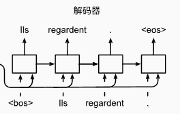

```python
class AttnDecoderRNN(nn.Module):
    def __init__(self, hidden_size, output_size, embedding_matrix, num_layers=2, dropout_p=0.1):
        super(AttnDecoderRNN, self).__init__()
        self.hidden_size = hidden_size
        self.num_layers = num_layers
        self.embedding = nn.Embedding.from_pretrained(embedding_matrix, freeze=False)  # 定义嵌入层
        self.attention = BahdanauAttention(hidden_size)  # 定义注意力机制
        self.gru = nn.GRU(2 * hidden_size, hidden_size, num_layers=num_layers, batch_first=True, dropout=dropout_p if num_layers > 1 else 0)  # 定义GRU层
        self.out = nn.Linear(hidden_size, output_size)  # 定义输出线性层
        self.dropout = nn.Dropout(dropout_p)  # 定义Dropout层
```

#### Decoder前向传播过程

在解码过程中，Decoder的输入初始化为开始标记（`SOS_token`），其隐藏状态初始化为编码器的隐藏状态。Decoder在每个时间步进行一步解码，通过forward_step方法获取当前时间步的输出和注意力权重。这个方法包括通过嵌入层获取输入的嵌入表示，通过注意力机制计算上下文向量，将嵌入表示和上下文向量连接后传递给GRU层，并通过线性层生成最终输出。整个过程在每个时间步循环进行，直到生成完整的目标序列，并将所有时间步的输出和注意力权重分别存储起来。

```python
def forward(self, encoder_outputs, encoder_hidden, target_tensor=None, isTeacherForcing = True):
        if not isTeacherForcing:
            target_tensor = None
        batch_size = encoder_outputs.size(0)  
        decoder_input = torch.empty(batch_size, 1, dtype=torch.long, device=device).fill_(SOS_token)  # 初始化解码器的输入为SOS_token
        decoder_hidden = encoder_hidden 
        decoder_outputs = []  
        attentions = []  

        for i in range(MAX_LENGTH):
            decoder_output, decoder_hidden, attn_weights = self.forward_step(   
                decoder_input, decoder_hidden, encoder_outputs
            )
            decoder_outputs.append(decoder_output)  
            attentions.append(attn_weights)  

            if target_tensor is not None:
                decoder_input = target_tensor[:, i].unsqueeze(1)  # Teacher forcing
            else:
                _, topi = decoder_output.topk(1)		# greedy策略
                decoder_input = topi.squeeze(-1).detach()  # 使用自己的预测作为下一步的输入

        decoder_outputs = torch.cat(decoder_outputs, dim=1)  
        decoder_outputs = F.log_softmax(decoder_outputs, dim=-1)  
        attentions = torch.cat(attentions, dim=1)  

        return decoder_outputs, decoder_hidden, attentions  

def forward_step(self, input, hidden, encoder_outputs):
    embedded = self.dropout(self.embedding(input)) 

    query = hidden.permute(1, 0, 2)  
    context, attn_weights = self.attention(query, encoder_outputs)  
    input_gru = torch.cat((embedded, context), dim=2)  

    output, hidden = self.gru(input_gru, hidden) 
    output = self.out(output)  

    return output, hidden, attn_weights  # 返回输出、隐藏状态和注意力权重
```

#### 训练方法的实现

在Decoder的前向传播过程中可以进行`Teacher Forcing`以及`Free Running`两种策略的选择，当选择Teacher Forcing策略时，模型会选择Ground Truth标签对编码器进行训练；而如果选择Free Running策略进行训练，则模型会使用自己上一时间步生成的输出作为下一时间步的输入对Decoder进行训练。一般情况下训练过程中可以任意选择两种策略（甚至可以指定一定的Teacher Forcing比例），而预测过程中只能进行Free Running。

```python
        if not isTeacherForcing:
            target_tensor = None
        if target_tensor is not None:
            decoder_input = target_tensor[:, i].unsqueeze(1)  # Teacher forcing
        else:
            _, topi = decoder_output.topk(1)
            decoder_input = topi.squeeze(-1).detach()  # 使用自己的预测作为下一步的输入
```

在后面的实验部分中我对两种方法的训练收敛速率进行了直接对比，发现**Teacher Forcing的收敛速度要比Free Running快得多，而且最终的损失值更低、收敛效果更好**。

#### 解码策略的实现

##### 贪心搜索 greedy

上面的代码实现的是greedy贪心解码策略，意在于输出序列的每一时间步𝑡′， 我们都将基于贪心搜索从𝑌中找到具有最高条件概率的词元，

```python
_, topi = decoder_output.topk(1)
decoder_input = topi.squeeze(-1).detach()
```

那么贪心搜索也存在很明显的问题： 现实中，最优序列应该是最大化
$$
\prod_{t'=1}^{T'} P(y_{t'} \mid y_1, \ldots, y_{t'-1}, \mathbf{c})
$$
值的输出序列，这是基于输入序列生成输出序列的条件概率。 然而贪心搜索是无法保证得到最优序列的。

#### 束搜索beam-search

由于每一步都直接搜索当前概率最高的结果，贪心策略无疑是速度最快的，但是效果显然会略差。**而束搜索则在牺牲了一定计算量的同时，增加了搜索精度和效果。**

束搜索是贪心搜索的一个改进版本。 有一个超参数束宽$𝑘$。 在每一个时间步**都选择具有最高条件概率的$𝑘$个词元**。 这𝑘个词元将分别是𝑘个候选输出序列的第一个词元。 在随后的**每个时间步，基于上一时间步的$𝑘$个候选输出序列**， 将继续从$𝑘|𝑌|$个可能的选择中 挑出具有最高条件概率的$𝑘$​个候选输出序列。

（图片来自李沐老师的`Dive into Deep Learning`教程文档）

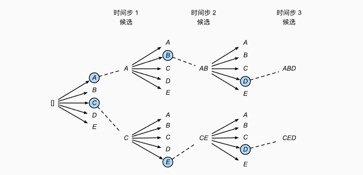

最后选择其中条件概率乘积最高的序列作为输出序列：
$$
\frac{1}{L^\alpha} \log P(y_1, \ldots, y_{L}\mid \mathbf{c}) = \frac{1}{L^\alpha} \sum_{t'=1}^L \log P(y_{t'} \mid y_1, \ldots, y_{t'-1}, \mathbf{c}),
$$
实现代码如下：

```python
 def beam_search_decoding(self, encoder_outputs, decoder_hidden, beam_width):
        batch_size = encoder_outputs.size(0)
        decoder_input = torch.empty(batch_size, 1, dtype=torch.long, device=encoder_outputs.device).fill_(SOS_token)

        sequences = [[[list(), 0.0, decoder_hidden, decoder_input]]] * batch_size  # Initialize with start token

        for _ in range(MAX_LENGTH):
            all_candidates = [[] for _ in range(batch_size)]
            for i in range(batch_size):
                for seq, score, hidden, input_token in sequences[i]:
                    output, hidden, _ = self.forward_step(input_token, hidden, encoder_outputs[i:i+1])
                    log_probs, indices = torch.topk(F.log_softmax(output, dim=-1), beam_width)
                    for log_prob, idx in zip(log_probs[0, 0], indices[0, 0]):
                        candidate = [seq + [idx.item()], score + log_prob.item(), hidden, idx.view(1, 1)]
                        all_candidates[i].append(candidate)

            sequences = [sorted(candidates, key=lambda x: x[1], reverse=True)[:beam_width] for candidates in all_candidates]

        decoded_sequences = []
        for i in range(batch_size):
            decoded_sequences.append(sequences[i][0][0])  # 选择前k个最佳选择

        return torch.tensor(decoded_sequences, dtype=torch.long, device=encoder_outputs.device), None, None
```

为了保证模型的训练效果，最终版本的代码中选择`束搜索`策略进行解码。

## 训练和推理

### 数据集Dataloader的构建

`get_dataloader`首先调用`prepareData`函数准备数据集。然后将每个句子对转换为索引列表，并在列表末尾添加结束标记（EOS_token）创建TensorDataset对象。

最后使用`RandomSampler`随机抽取样本，指定的批量大小创建DataLoader对象。返回源语言序列以及目标语言序列的`lang`类和训练时进行迭代的DataLoader对象。

```python
"""data loader"""
def get_dataloader(batch_size, text_type='train'):
 	# 调用prepareData函数，获取输入语言对象、输出语言对象和句子对列表
    input_lang, output_lang, pairs = prepareData('eng', 'zh', True, text_type)
   
	# 初始化用于存储输入和目标句子索引的数组，形状为（句子对数量, 最大句子长度）
    n = len(pairs)
    input_ids = np.zeros((n, MAX_LENGTH), dtype=np.int32)
    target_ids = np.zeros((n, MAX_LENGTH), dtype=np.int32)
    

    for idx, (inp, tgt) in enumerate(pairs):        
        inp_ids = indexesFromSentence(input_lang, inp)
        tgt_ids = indexesFromSentence(output_lang, tgt)
		# 在每个索引列表末尾添加结束标记EOS_token
        inp_ids.append(EOS_token)
        tgt_ids.append(EOS_token)
		# 将索引列表填充到数组中
        input_ids[idx, :len(inp_ids)] = inp_ids
        target_ids[idx, :len(tgt_ids)] = tgt_ids
        
    # 创建TensorDataset对象
    train_data = TensorDataset(torch.LongTensor(input_ids).to(device),
                               torch.LongTensor(target_ids).to(device))
    train_sampler = RandomSampler(train_data)

    # 创建DataLoader对象
    train_dataloader = DataLoader(train_data, sampler=train_sampler, batch_size=batch_size)

    # 返回输入语言对象、输出语言对象和DataLoader对象
    return input_lang, output_lang, train_dataloader
```

### 训练

指定训练的epochs后对整个模型进行`n_epochs`次迭代：

```python
    for epoch in range(1, n_epochs + 1):
        # 训练一个epoch
        loss = train_epoch(train_dataloader, encoder, decoder, encoder_optimizer, decoder_optimizer, criterion)
        print_loss_total += loss  # 累加当前epoch的损失
        plot_loss_total += loss  # 累加当前epoch的损失
```

在每个迭代epoch中，首先初始化总损失，然后对编码器和解码器的梯度进行清零。将转化为张量形式的源语言序列送入`encoder`后输出所有时间步（即句子中的每个token）的隐藏状态和处理完整个输入序列后产生的最后一个时间步的隐藏状态；然后再和目标语言序列的张量形式一起送入解码器计算得到输出。最后计算当前epoch的损失并反向传播更新参数。

每一个epoch的训练过程如下：

```python
def train_epoch(dataloader, encoder, decoder, encoder_optimizer,
                decoder_optimizer, criterion):
    total_loss = 0  # 初始化总损失

    for data in dataloader:
        input_tensor, target_tensor = data  

        encoder_optimizer.zero_grad()  # 清零梯度
        decoder_optimizer.zero_grad()  

        encoder_outputs, encoder_hidden = encoder(input_tensor)  # 通过编码器
        decoder_outputs, _, _ = decoder(encoder_outputs, encoder_hidden, target_tensor, isTeacherForcing = True)  # 通过解码器

        # 计算损失
        loss = criterion(
            decoder_outputs.view(-1, decoder_outputs.size(-1)),
            target_tensor.view(-1)
        )
        loss.backward()  # 反向传播计算梯度

        encoder_optimizer.step()  # 更新参数
        decoder_optimizer.step()  

        total_loss += loss.item()  # 累加损失

    return total_loss / len(dataloader)  # 返回平均损失
```

### 预测

预测与训练基本一致，不同的地方在于只使用FreeRunning策略，并且最终将得到的输出转换为索引并且根据词汇表得到单词序列并返回。

```python
def evaluate(encoder, decoder, sentence, input_lang, output_lang, beam_width=5):
    with torch.no_grad():
        input_tensor = tensorFromSentence(input_lang, sentence)
        # 前向传播
        encoder_outputs, encoder_hidden = encoder(input_tensor)
        # 使用束搜索并且使用FreeRuning策略
        decoded_sequences, decoder_hidden, decoder_attn = decoder.beam_search_decoding(encoder_outputs, encoder_hidden, beam_width)

        # 选择概率最高的序列
        decoded_ids = decoded_sequences[0]

        # 将索引转换为单词
        decoded_words = []
        for idx in decoded_ids:
            if idx.item() == EOS_token:
                decoded_words.append('<EOS>')  # 如果遇到结束标记，则停止翻译
                break
            decoded_words.append(output_lang.index2word[idx.item()])

    # 返回翻译的单词列表和注意力权重
    return decoded_words, decoder_attn
```

### BLEU评估标准的实现

本次实验使用`BLEU`评估标准来衡量翻译质量。BLEU是一种用于评估机器翻译系统输出质量的指标。其基本思想是通过比较机器翻译结果和一个或多个参考译文之间的 n-gram 精确匹配程度来评估翻译质量。主要步骤包括计算 n-gram 精确度、惩罚机制和综合评分。

#### 计算 n-gram 精确度

$$
P_n = \frac{\sum_{C \in \{Candidates\}} \sum_{ngram \in C} \min(\text{Count}_{clip}(ngram), \text{Count}_{ref}(ngram))}{\sum_{C \in \{Candidates\}} \sum_{ngram \in C} \text{Count}_{C}(ngram)}
$$

其中，$\text{Count}_{clip}(ngram)$ 是候选翻译中 n-gram 的数量，$\text{Count}_{ref}(ngram)$$是参考译文中 n-gram 的数量。

实现代码如下：

```python
def n_gram_precision(candidate, references, n):
    candidate_n_grams = Counter([tuple(candidate[i:i+n]) for i in range(len(candidate)-n+1)])
    references_n_grams = Counter(chain(*[Counter([tuple(reference[i:i+n]) for i in range(len(reference)-n+1)]) for reference in references]))

    clipped_count = {ngram: min(count, references_n_grams[ngram]) for ngram, count in candidate_n_grams.items()}
    precision = sum(clipped_count.values()) / max(sum(candidate_n_grams.values()), 1)

    return precision
```

#### 计算 Brevity Penalty长度惩罚

$$
BP = \begin{cases} 
   1 & \text{if } c > r \\
   e^{(1 - \frac{r}{c})} & \text{if } c \leq r 
   \end{cases}
$$

其中，$c$是候选翻译的长度，$r$​是参考译文的长度。

实现代码如下：

```python
def brevity_penalty(candidate, references):
    c = len(candidate)
    r = min((abs(len(reference) - c), len(reference)) for reference in references)[1]

    if c > r:
        return 1
    else:
        return math.exp(1 - r/c)
```

#### 计算 BLEU 分数

$$
\text{BLEU} = BP \cdot \exp \left( \sum_{n=1}^{N} w_n \log P_n \right)
$$

通常$w_n$是均匀分布的，即$w_n = \frac{1}{N}$​。

代码实现如下：

```python
def BLEU(candidate, references, n=4):
    weights = [1/n] * n
    p_n = [n_gram_precision(candidate, references, i) for i in range(1, n+1)]
    score = brevity_penalty(candidate, references) * math.exp(sum(w * math.log(p) for w, p in zip(weights, p_n) if p > 0))

    return score
```

### 参数设置

在本次实验中选择`batch_size`批量大小为32

```python
batch_size = 32
```

并且选择`Adam`作为优化器，选择`NLLOSS`负对数似然损失作为损失函数，并且`学习率`设置为0.001：

```python
    # 初始化优化器
    encoder_optimizer = optim.Adam(encoder.parameters(), lr=learning_rate)
    decoder_optimizer = optim.Adam(decoder.parameters(), lr=learning_rate)
  	# 定义损失函数
    criterion = nn.NLLLoss()
    learning_rate=0.001
```

## 实验

本次实验中总共通过改变**模型层数、是否使用预训练词向量、训练策略、数据集大小**进行了多次横向对比。

不同结构模型的训练过程通过`tensorboard`记录。整体实验结果如下：

| 层数 | 预训练词向量 | 训练策略        | 数据集大小 | 训练时长     | 最终loss值 | 测试集BLEU值      |
| ---- | ------------ | --------------- | ---------- | ------------ | ---------- | ----------------- |
| 一层 | 否           | Teacher Forcing | 10k        | 2.722 hr     | 0.1145     | 0.01948(1.9%)     |
| 一层 | 是           | Teacher Forcing | 10k        | 2.853 hr     | **0.0131** | 0.02669(2.7%)     |
| 一层 | 是           | Running Free    | 10k        | **2.706 hr** | 1.1078     | 0.00934(0.9%)     |
| 两层 | 是           | Teacher Forcing | 10k        | 3.782 hr     | 0.0616     | 0.02257(2.3%)     |
| 两层 | 是           | Teacher Forcing | 100k       | 30.58 hr*    | 0.0616     | **0.03697(3.7%)** |

\*由于训练时间过长，100k的数据集只跑了不到200个Epochs。

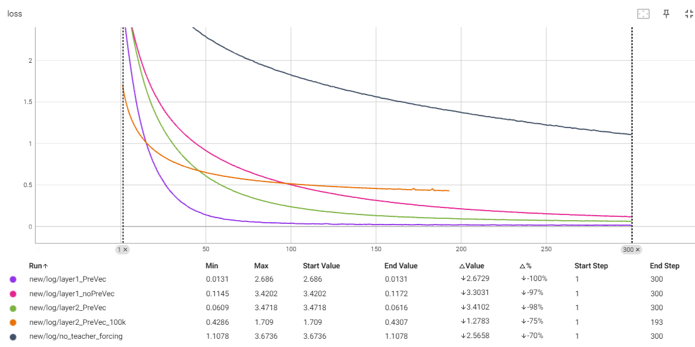

### Teacher Forcing与Running Free策略对比

| 层数 | 预训练词向量 | 训练策略        | 数据集大小 | 训练时长     | 最终loss值 | 测试集BLEU值  |
| ---- | ------------ | --------------- | ---------- | ------------ | ---------- | ------------- |
| 一层 | 否           | Teacher Forcing | 10k        | 2.722 hr     | 0.1145     | 0.01948(1.9%) |
| 一层 | 是           | Running Free    | 10k        | **2.706 hr** | 1.1078     | 0.00934(0.9%) |

通过图表和训练曲线可以看到，Teacher Forcing拥有比Running Free**更快的收敛速度**，因为模型总是接收到正确的输入，梯度更稳定，模型可以更快地学习到正确的序列生成。

同时，Teacher Forcing的训**练也更加稳定，损失值更低**，因为TracherForcing使用真实的目标序列作为输入，而Runing Free使用自己预测的前一个输出作为下一时刻的输入，容易导致**误差累积**，以至于训练效果不佳，在所有模型测试中达到了最低的0.9%。

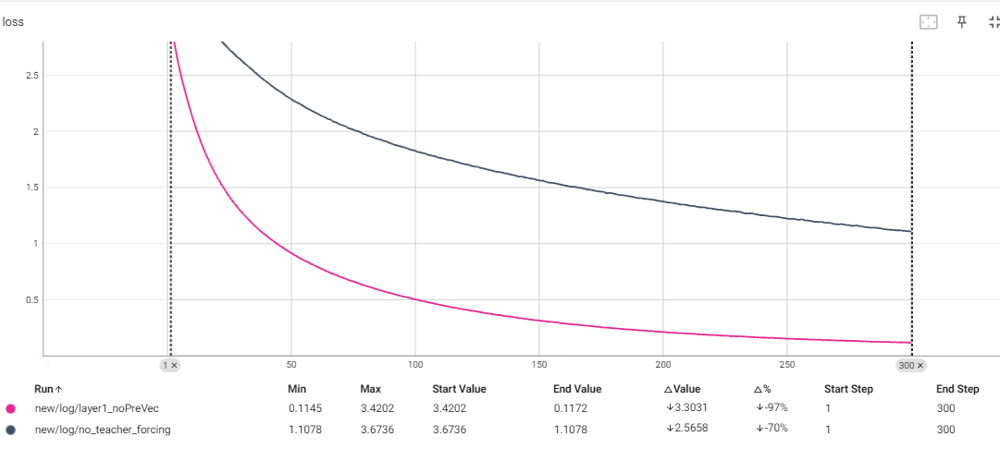

虽然根据理论，使用Teachering Forcing在训练过程中，模型总是接收到正确的前一个时间步的输出作为当前时间步的输入，而在实际的生成过程中，模型必须使用自己前一个时间步的输出。由此可能会产生**曝光偏差（Exposure Bias）**会导致模型在测试时表现不佳，因为它没有学会在错误累积的情况下进行调整。但是由于实验数据集较小，对比测试做的也不够充分，在本次实验中没有体现出来。

### 是否使用预训练词向量

| 层数 | 预训练词向量 | 训练策略        | 数据集大小 | 训练时长     | 最终loss值 | 测试集BLEU值      |
| ---- | ------------ | --------------- | ---------- | ------------ | ---------- | ----------------- |
| 一层 | 否           | Teacher Forcing | 10k        | **2.722 hr** | 0.1145     | 0.01948(1.9%)     |
| 一层 | 是           | Teacher Forcing | 10k        | 2.853 hr     | **0.0131** | **0.02669(2.7%)** |

通过图表和训练曲线可以看到，使用预训练词向量的模型收敛速度比不使用预训练词向量的**收敛速度更快**，而且最终的损失值远低于从零开始训练词向量的情况，这是因为预训练词向量已经在大量文本数据上进行了训练，这些词向量已经学习到了丰富的语义和上下文信息，能够更好地捕捉到同义词之间的关系以及词与词之间的相关性。

这意味着在模型训练开始时使用预训练的词向量已经具备了较高质量的初始表示，能有助于模型更快地理解和处理语言数据；而且预训练词向量提供了更稳定的初始梯度，减少了训练初期的震荡。

再者，**由于使用的数据集对于NLP任务来说实际上非常小**，无论哪个模型都存在严重的过拟合现象，而预训练词向量由于在大规模语料库上进行训练，**具备了一定的泛化能力**，能一定程度减少过拟合，在验证集上表现更好，比不使用预训练词向量的模型**增加大约50%的性能**。

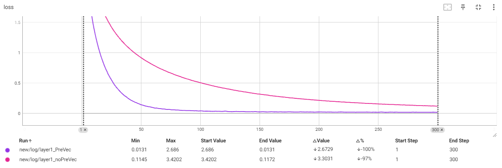

### 模型层数

| 层数 | 预训练词向量 | 训练策略        | 数据集大小 | 训练时长 | 最终loss值 | 测试集BLEU值      |
| ---- | ------------ | --------------- | ---------- | -------- | ---------- | ----------------- |
| 一层 | 是           | Teacher Forcing | 10k        | 2.853 hr | **0.0131** | **0.02669(2.7%)** |
| 两层 | 是           | Teacher Forcing | 10k        | 3.782 hr | 0.0616     | 0.02257(2.3%)     |

通过图表和训练曲线可以看到对于两层的模型由于增加了参数量，所以训练时长更长。但是正如前面提到的，由于使用的数据集对于NLP任务来说实际上非常小，对于较小的数据集在增加模型层数提高模型复杂度的情况下只会产生反作用。

可以看到对比一层的模型，两层更高复杂度情况下的模型不仅最终loss值更高，而且在测试集上的泛化性能也不及一层的模型。

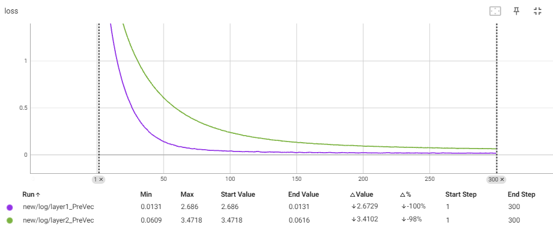

### 训练集大小

| 层数 | 预训练词向量 | 训练策略        | 数据集大小 | 训练时长  | 最终loss值 | 测试集BLEU值      |
| ---- | ------------ | --------------- | ---------- | --------- | ---------- | ----------------- |
| 两层 | 是           | Teacher Forcing | 100k       | 30.58 hr* | 0.0616     | **0.03697(3.7%)** |

通过图表和训练曲线可以看到在增加数据及大小以后，虽然训练时长成倍增加(基本上是随数据集大小同样增加十倍)，但是由于使用了**更大的数据集**，虽然由于数据集增大导致损失函数更难下降（虽然我认为模型的性能的bottleneck并不在是否充分拟合），模型的**泛化能力得到了很好的提升**，达到了所有模型测试中最高的**0.03697(3.7%)**.这证明对于NLP机器翻译任务来说，除了数据集的质量以外，数据集的规模、是否拥有较好的泛化性一样及其重要。

### 过拟合

对于100k数据集的训练过程中，每5个step记录一次测试集的BLEU值，可以得到如下趋势：

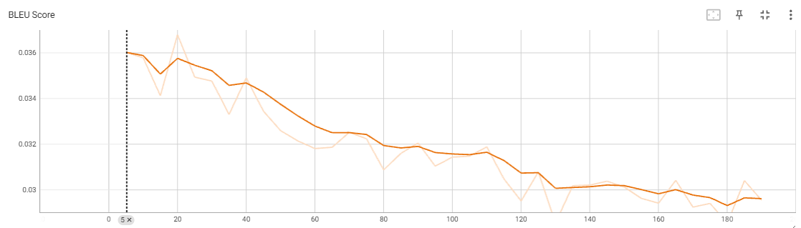

可以看到模型的在测试集上的BLEU值不仅不增长，反而是随着训练迭代次数增多而呈现下降趋势，这也再一次证明了本次实验中由于数据集规模相对较小，模型基本都存在过拟合现象。即模型的bottleneck并不在是否充分拟合，而是受限于数据集规模。随着训练进度的加深模型的泛化性能反而越来越差，在测试集上的效果也就越来越差，（我自己在训练集上随机采样测试过，训练集的BLEU很多都能达到20%以上，而在测试集中只有4%不到）。

### attention可视化

attention可视化效果如下：

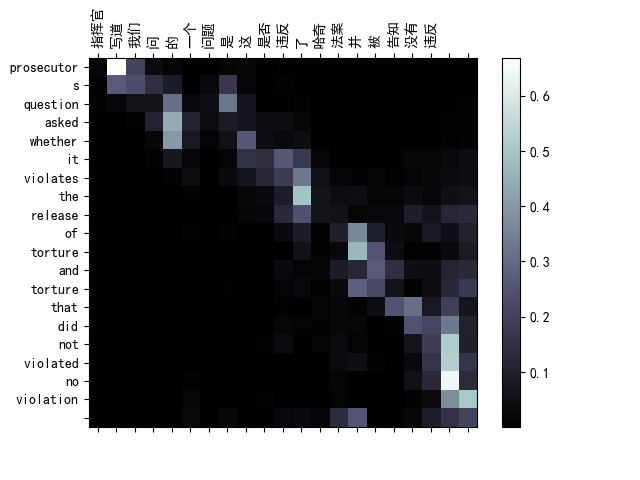

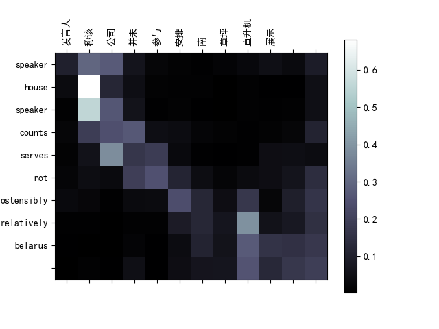

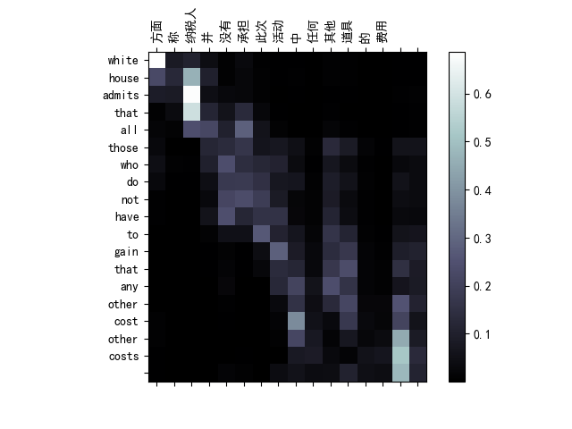

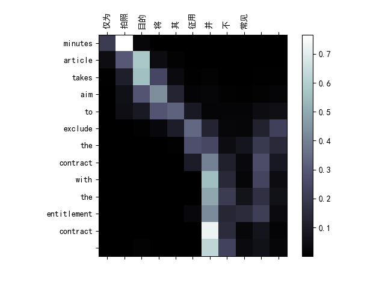

可以看到attention可视化可以一定程度体现模型的注意力机制，比如在翻译”发言人“和”称“时，模型中的注意力分数在"speaker"上的注意力分数明显较高，而"speaker"的语义也与”发言人和”称”所相接近。这也反映了模型通过attention机制捕捉到了不同语种词汇之间的语义关联。

## 自己的探索和心得体会

在本次实验中，我选择了Seq2Seq模型进行中译英翻译，最初选择了双层GRU作为编码器和解码器的主要结构是因为GRU在处理序列数据时计算效率较高，并且可以在较长的序列上保持较好的性能表现。注意力机制的引入则是为了克服传统Seq2Seq模型在长序列翻译中的不足，能够动态地关注输入序列的不同部分，提高了翻译的准确性和流畅度。

其实由于整体代码是在pytorch官方给出的框架上实现的，最难的部分反而在数据预处理阶段，首先对于符号的过滤和数据的清洗就花费了我很长时间，因为数据集可能是通过视觉方式采集的，有很多奇奇怪怪的符号出现，需要肉眼逐个排查还有哪些符号没有过滤。

其次是预训练词向量的加载，由于现有的预训练词向量基本都是百万级别起步的，我使用的腾讯AI lab的两个预训练词向量解压之后加起来快10个G了，光是下载就花了很长时间，而且每次训练加载都要加载好久。

然后是训练，这次算是我整个大学生生涯中跑过的最大的神经网络模型了，光是小数据集跑一次都需要接近三个小时，而大数据集更是跑了超过30个小时（辛苦我的电脑了），整个实验周期下来也拉得很长，是挺耗费精力的一件事。

最后我通过这次试验也了解到什么叫“数据为王”，哪怕实验的模型架构已经尽可能地优化，但是由于数据集太小，模型的泛化能力依旧不理想。也体会到了深度学习的工作真的很耗费时间和金钱，没有好的显卡的计算资源根本跑不起太大的模型。

总的来说这次实验让我学到了很多东西，在这次实验中我通过改变模型架构和训练方法，横向对比了多种方法和架构的模型效果，让我对Seq2Seq模型架构的理解更深了，在实验过程中我也重新学习和理解了Teacher Forcing、束搜索以及三种attention机制的概念和实现方法，令我受益匪浅，让我在以后的学习和研究中有更好的基础。

## 代码使用方法

- log文件中储存了各个模型的训练损失曲线
- saved_models文件中存放了保存的checkpoints模型
- 运行`pre_process.py`可以对对应的数据集进行预处理
- 运行`train.py`可以对模型进行训练，模型会自行保存check_points以及日志。
- 运行`evaluate.py`可以对数据集进行预测。
- 由于预训练词向量数据集过大，src中没有保存预训练的word2vec数据集，可能需要自行下载。

