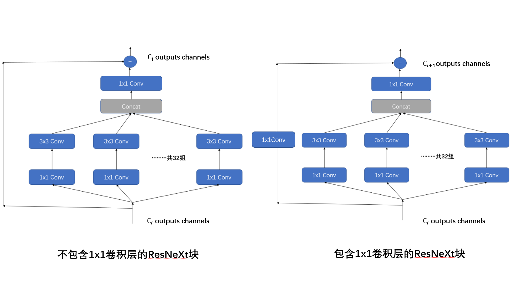

## 关于期中作业模型架构的补充

|   学号   |  姓名  |
| :------: | :----: |
| 20319045 | 刘冠麟 |

> 由于写实验报告的时候有些仓促，文档中模型架构中设计这部分有很多地方没有说清楚（还有一些地方有错误），故此提交关于模型架构的补充说明，同时附上了所使用的代码框架的说明，以便更好地展示和说明所使用模型地架构和设计。

### 模型架构设计

模型实现参考了**ResNeXt**论文《Aggregated Residual Transformations for Deep Neural Networks》(https://arxiv.org/pdf/1611.05431)，在ResNet-18的基础上参考了ResNeXt进行了改进，**将ResNet中的残差块改成了ResNeXt块，并且加入了dropout层**，同时通过多次对比实验（见原文档的附录），针对这次数据集简化并改进了模型的架构设计。

得益于数据预处理、强大的ResNeXt架构以及针对数据集的微调，模型整体表现优异，整体预测准确率为**74.4%**，远高于实验baseline给出49.8%，高出了**24.6%**。

#### ResNeXt Block

本次实验中将ResNet18所使用的残差块改成了ResNeXtBlock，ResNeXtBlock参考原论文的架构设计实现，同时融合了ResNet和Inception架构的特点。

对于每一个ResNeXt Block，首先会通过1x1卷积减少输入特征图的通道数，然后再通过3x3的分组卷积处理特征图像，最后通过1x1卷积恢复特征图的通道数，同时与ResNet一样还会将输入与输出进行残差连接。与残差块Residual block一样，ResNeXt Block也需要具有改变通道数的能力，也就是说对于输出通道数改变的情况，残差连接中还需要对输入进行一个1x1卷积改变通道数，使得输入和输出通道数相同，从而可以直接相加、拟合残差。

具体来说，ResNeXt Block的设计架构如下：



由于ResNeXt是融合了ResNet和Inception架构的实现同时拥有了两个模型的关键特征：

- **分组卷积**：ResNeXt Block通过使用分组卷积将通道分成多个组，每个组单独进行卷积操作。这种方式减少了参数数量和计算量，通过增加Cardinality，可以在不显著增加参数数量的情况下增强模型的性能。
- **残差连接**：类似ResNet，ResNeXt Block也使用了残差连接，将输入直接添加到输出中，从而缓解梯度消失问题，加速训练，并提高深层网络的性能。

ResNeXt Block的实现代码如下：


对于每一个ResNeXt层，由于数据集较小，为了防止过拟合，在两层ResNeXtBlock之间后加入了Dropout，并且通过实验证明，倒数第二个dropout层和倒数第一个dropout层分别选择0.2和0.4的丢弃率相对更好：

| dropout            | acc     |
| ------------------ | ------- |
| （0，0）(baseline) | 62.8%   |
| （0.2，0.4）       | **65%** |
| （0.3，0.5）       | 64.6%   |

实现代码如下：

```python
def block(self, num_ResNeXt, num_channels, first_block=False):
    blk = []
    for i in range(num_ResNeXt):
        if i == 0 and not first_block:
            blk.append(ResNeXtBlock(num_channels, 32, 1, use_1x1conv=True, strides=2))
        elif i==num_ResNeXt-2:
            blk.append(ResNeXtBlock(num_channels, 32, 1))
            blk.append(nn.Dropout(0.2))
        elif i==num_ResNeXt-1:
            blk.append(ResNeXtBlock(num_channels, 32, 1))
            blk.append(nn.Dropout(0.4))
    return nn.Sequential(*blk)
```


然后参考ResNet-18，对ResNeXt进行简化，因为数据集较小，对比实验可知使用三层简化的ResNeXt在此数据集中的表现效果要比原论文的四层的ResNeXt效果要更好，而增加到五层后由于参数量过多，模型过于庞大而导致过拟合：

| 层数                                                      | acc       |
| --------------------------------------------------------- | --------- |
| 三层` ((2, 64), (2, 128), (2, 256)) `                     | **67.8%** |
| 四层(baseline) ` ((2, 64), (2, 128), (2, 256), (2, 512))` | 65%       |
| 五层 `((2, 64), (2, 128), (2, 256), (2, 512),  (2, 512))` | 57.8%     |

由于在当前数据集下三层的效果最好，所以最终模型选用了三层的ResNeXt层。

实现代码如下：

```python
class ResNeXt18(ResNeXt):
    def __init__(self, lr, num_classes):
        super().__init__(((2, 64), (2, 128), (2, 256)),
                       lr, num_classes)
```


