## lab4

### 实验一

#### 1. 测试网络连通性

由于本实验中实现的防火墙会阻止正常用户主机与某些主机的通信。为便于验证防火墙效果，需要在实验开始前，测试正常用户主机的与其它主机的连通性。具体进行以下测试：

1. **测试正常用户是否可以`ping`通代理服务器；**

   可以ping通：

   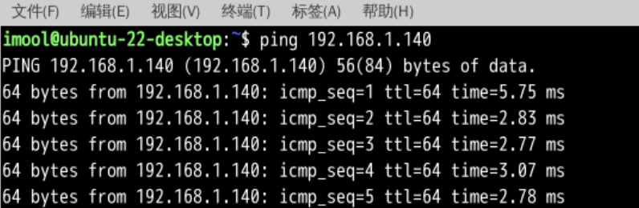

2. **测试正常用户是否可以通过浏览器访问`sysu.edu.cn`**

   可以访问：

   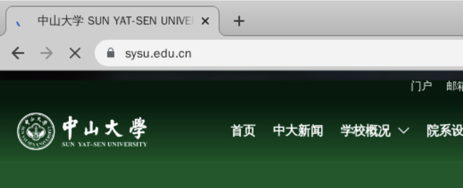

3. **测试正常用户是否可以通过浏览器访问代理服务器的网站 http://192.168.1.140/；**

   可以访问：

   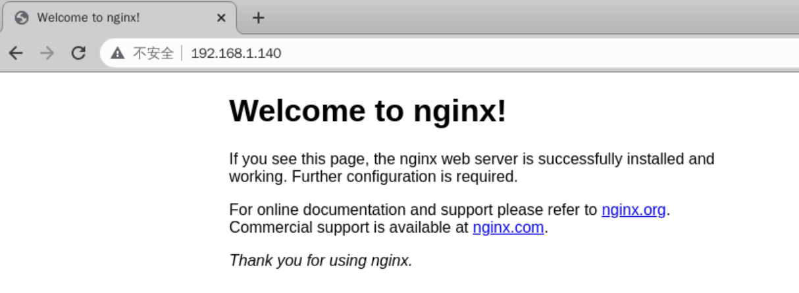

4. **测试正常用户与代理服务器之间是否可以通过ssh命令互相连接。**

   可以连接：

   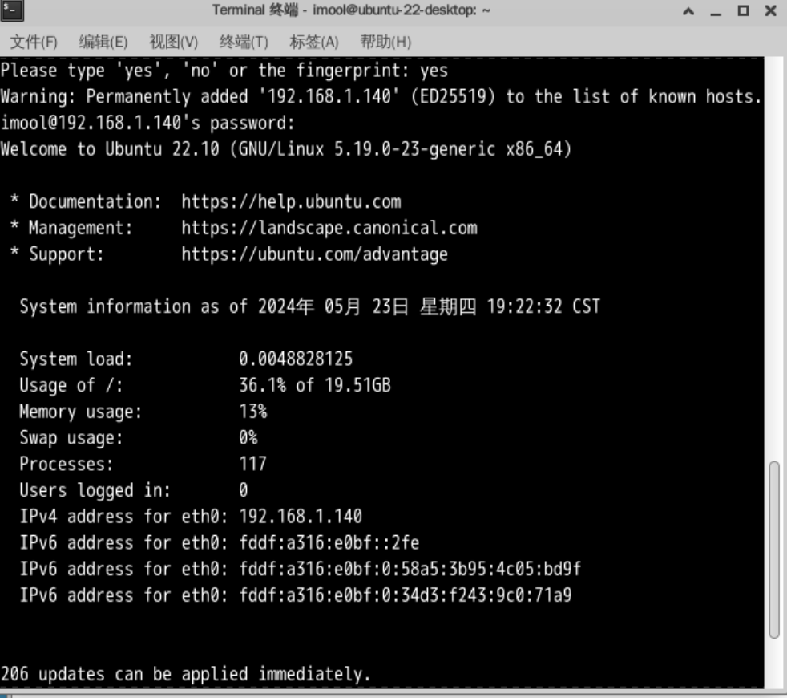

#### 2. 实现简单的包过滤防火墙

> 由于内核模块的编写比较复杂，因此本小节给出了一份示例代码。该示例代码实现了两个功能：

- 规则1：丢弃源IP地址为` `的数据包；
- 规则2：丢弃所有的ICMP数据包。

本步骤需验证以上2条防火墙规则的有效性。

##### 2.1 下载示例代码并仔细阅读

1）下载代码：在Linux中，实现内核模块至少需要为其编写C文件与Makefile文件。示例代码的源代码和Makefile文件可以在[这里](https://pan.baidu.com/s/188jlj1k0hg1CSEci7kveRg?pwd=SYSU)下载。

2）阅读代码，了解重要函数的功能。
代码中的两个比较重要的函数：`nf_blockipaddr_handler`和`nf_blockipaddr_handler`。
`nf_blockipaddr_handler`函数的作用是过滤特定源IP地址的IP报文。该函数首先获取报文的IP地址，并将其与全局变量`ip_addr_rule`（即字符串`202.116.64.8`）进行比较，若二者相等则该函数会输出信息并返回NF_DROP（即告知netfilter将此报文丢弃）。

```
// nf_blockipaddr_handler 源码
// 过滤指定的IP地址
static unsigned int nf_blockipaddr_handler(void *priv, struct sk_buff *skb, const struct nf_hook_state *state)
{
	if (!skb) return NF_ACCEPT;
	char *str = (char *)kmalloc(16, GFP_KERNEL);
	struct iphdr *iph = ip_hdr(skb);
	u32 sip = ntohl(iph->saddr);
	sprintf(str, "%u.%u.%u.%u", IPADDRESS(sip));
	if(!strcmp(str, ip_addr_rule)) {
		printk(KERN_INFO "Dropping ip packet to: %s\n", str);
		return NF_DROP;
	}
	return NF_ACCEPT;
}
```

`nf_blockipaddr_handler`函数的作用则是过滤特定协议（ICMP）报文。该函数直接判断报文的协议是否为`ICMP`，若是`ICMP`报文则该函数会输出信息并返回NF_DROP（即告知netfilter将此报文丢弃）。

```
// 过滤 ICMP 数据包
static unsigned int nf_blockicmppkt_handler(void *priv, struct sk_buff *skb, const struct nf_hook_state *state)
{
	if(!skb) return NF_ACCEPT;
	struct iphdr *iph = ip_hdr(skb);
	if (iph->protocol == IPPROTO_ICMP) {
		printk(KERN_INFO "Dropping ICMP packet \n");
		return NF_DROP;
	}
	return NF_ACCEPT;
}
```

##### 2.2 防火墙代码编译并加载至内核

获得示例代码后，使用如下命令编译示例代码，生成内核模块，并将该内核模块加载到内核中：

```
# make # 编译内核代码以便生成内核模块
# insmod netfilter.ko # 加载内核模块
```

##### 2.3 防火墙效果测试

加载完毕后，使用`ping`命令`ping`任意的地址，同时尝试使用浏览器访问`sysu.edu.cn`检查内核模块是否生效（重要结果截图）。


ping结果：

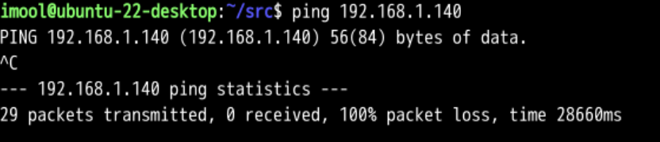

此时已经无法ping通。


浏览器访问`sysu.edu.cn`，可知无法访问：

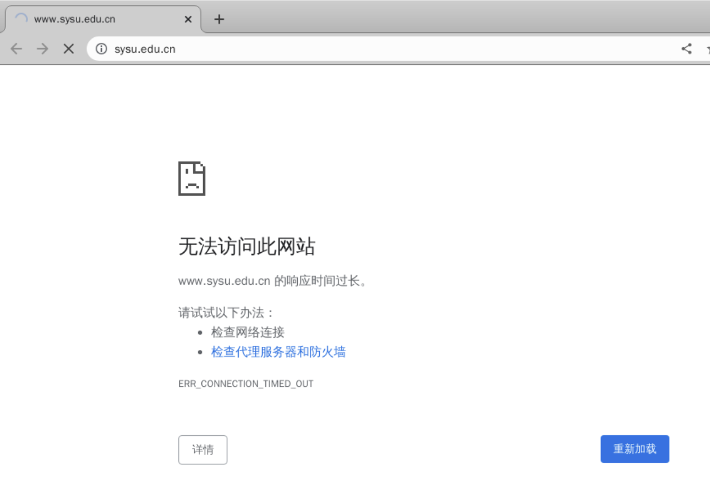


##### 2.4 卸载编写的内核模块

测试完毕后，可以使用下面的命令卸载内核模块。

```
# rmmod netfilter
```

##### 2.5 编码实现一个基本防火墙

通过阅读前面的示例代码，可以发现防火墙的过滤规则是通过`hook`函数来实现的。
具体来说，将过滤规则插入到netfilter中包括三步：

1. 定义一个`hook`函数实现过滤规则，其返回值向netfilter指定了对报文的操作（NF_ACCEPT表示继续传递，NF_DROP表示直接丢弃）；
2. 初始化一个`nf_hook_ops`结构体
3. 将`nf_hook_ops`结构体作为参数调用`nf_register_net_hook`以注册定义的`hook`函数。

请在示例代码基础上**添加**两个额外的`hook`函数`forbidden_http_only`以及`forbidden_ssh_from_out`，以实现以下2个过滤规则：

1. 禁止正常用户主机访问代理服务器上的`Web`服务（http://192.168.1.140/），但允许其访问代理服务器上的其它服务。
2. 禁止任何外部主机通过SSH连接正常用户主机，但允许正常用户主机通过SSH连接自己。


##### 增加禁止正常用户主机访问代理服务器上的Web服务的代码

```C++
// 禁止正常用户主机访问代理服务器上的Web服务
static unsigned int nf_forbidden_http_only_handler(void *priv, struct sk_buff *skb, const struct nf_hook_state *state)
{
    if (!skb) return NF_ACCEPT;
    struct iphdr *iph = ip_hdr(skb);
    struct tcphdr *tcph;
    u32 daddr = ntohl(iph->daddr);
    char *src_ip = (char *)kmalloc(16, GFP_KERNEL);
    sprintf(src_ip, "%u.%u.%u.%u", IPADDRESS(daddr));
    if (!strcmp(src_ip, proxy_server_ip) && iph->protocol == IPPROTO_TCP) {
        tcph = tcp_hdr(skb);
        if (ntohs(tcph->source) == 80) { // HTTP port
            printk(KERN_INFO "Dropping HTTP packet to: %s\n", dest_ip);
            kfree(src_ip);
            return NF_DROP;
        }
    }
    kfree(src_ip);
    return NF_ACCEPT;
}
```

代码具体思路是：

- 首先检测数据包，如果数据包为空，直接接受该数据包；
- 然后取出该数据包的ip头部，并从中读取出发送数据包的源目标ip，然后将其转换为字符串；
- 对比源目标ip和要禁止访问web服务的ip地址进行对比，如果是同一个ip，并且数据包为TCP报文，则进行拦截；
- 拦截方法是取出数据包的tcp头部，如果源端口为80端口（HTTP端口），那么在内核message中打印丢弃信息并且返回`NF_DROP`表示拒绝该数据包。


然后使用如下代码在`nf_minifirewall_init`中对钩子函数进行注册：

```C++
nf_forbidden_http_only_ops = (struct nf_hook_ops*)kcalloc(1, sizeof(struct nf_hook_ops), GFP_KERNEL);
    if (nf_forbidden_http_only_ops != NULL) {
        nf_forbidden_http_only_ops->hook = (nf_hookfn*)nf_forbidden_http_only_handler;
        nf_forbidden_http_only_ops->hooknum = NF_INET_PRE_ROUTING;
        nf_forbidden_http_only_ops->pf = NFPROTO_IPV4;
        nf_forbidden_http_only_ops->priority = NF_IP_PRI_FIRST + 2;
        nf_register_net_hook(&init_net, nf_forbidden_http_only_ops);
    }
```


##### 禁止任何外部主机通过SSH连接正常用户主机的代码：

```C++
// 禁止任何外部主机通过SSH连接正常用户主机
static unsigned int nf_forbidden_ssh_from_out_handler(void *priv, struct sk_buff *skb, const struct nf_hook_state *state)
{
    if (!skb) return NF_ACCEPT;
    struct iphdr *iph = ip_hdr(skb);
    struct tcphdr *tcph;
    u32 daddr = ntohl(iph->daddr);
    u32 saddr = ntohl(iph->saddr);
    char *src_ip = (char *)kmalloc(16, GFP_KERNEL);
    char *dest_ip = (char *)kmalloc(16, GFP_KERNEL);
    sprintf(src_ip, "%u.%u.%u.%u", IPADDRESS(saddr));
    sprintf(dest_ip, "%u.%u.%u.%u", IPADDRESS(daddr));
    if (iph->protocol == IPPROTO_TCP) {
        tcph = tcp_hdr(skb);
        if (ntohs(tcph->dest) == 22 && strcmp(src_ip, dest_ip)) { // SSH port
            printk(KERN_INFO "Dropping SSH packet from: %s to %s\n", src_ip, dest_ip);
            kfree(src_ip);
            kfree(dest_ip);
            return NF_DROP;
        }
    }
    kfree(src_ip);
    kfree(dest_ip);
    return NF_ACCEPT;
}
```

代码具体思路与上一个函数相似，只不过这里同时取出了源ip地址和目标ip地址，然后比对两个ip，当源ip和目标ip不是同一个并且目标端口号为22（ssh端口号）时在内核message中打印丢弃信息并且返回`NF_DROP`表示拒绝该数据包。这样就能保证用户主机可以用ssh连接自己，但是任何外部主机都无法通过SSH连接正常用户主机。


然后编写注册函数如下：

```C++
    nf_forbidden_ssh_from_out_ops = (struct nf_hook_ops*)kcalloc(1, sizeof(struct nf_hook_ops), GFP_KERNEL);
    if (nf_forbidden_ssh_from_out_ops != NULL) {
        nf_forbidden_ssh_from_out_ops->hook = (nf_hookfn*)nf_forbidden_ssh_from_out_handler;
        nf_forbidden_ssh_from_out_ops->hooknum = NF_INET_PRE_ROUTING;
        nf_forbidden_ssh_from_out_ops->pf = NFPROTO_IPV4;
        nf_forbidden_ssh_from_out_ops->priority = NF_IP_PRI_FIRST + 3;
        nf_register_net_hook(&init_net, nf_forbidden_ssh_from_out_ops);
    }
```

由于这里参数`hooknum`指定为`NF_INET_PRE_ROUTING`，即只注册接收而不注册发送，这样外部就不能通过ssh连接用户主机。

最后按照前面的步骤进行安装：


#### 3. 测试并验证包过滤防火墙效果

根据实验要求完成两个新的`hook`函数后，重新编译并加载内核模块，并重新测试正常主机与其它主机的连通性，即

1. **测试正常用户是否可以通过浏览器访问代理服务器上Web服务（http://192.168.1.140/）；**

   可见无法正常访问：

   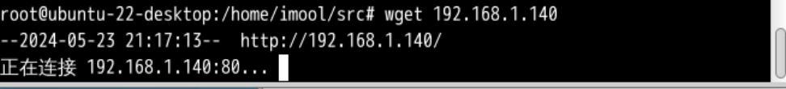

   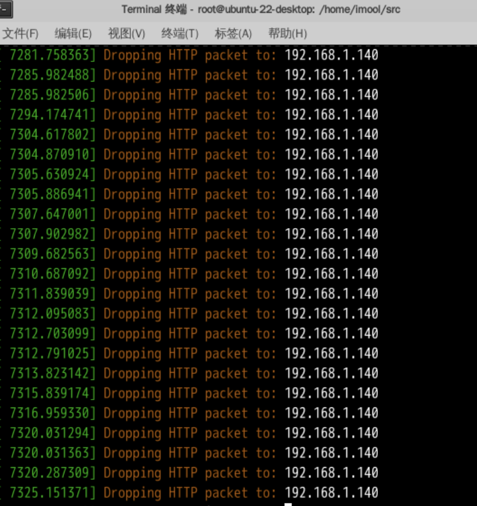

   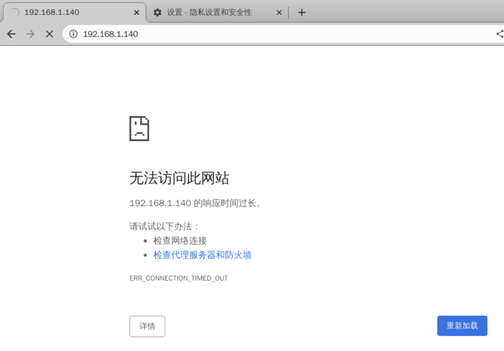

2. **测试正常用户与代理服务器之间是否可以通过ssh命令互相连接。**

   由于注册函数中参数`hooknum`指定为`NF_INET_PRE_ROUTING`，即只注册接收而不注册发送，这样外部就不能通过ssh连接用户主机。

   所以用户主机可以通过ssh连接代理服务器:

   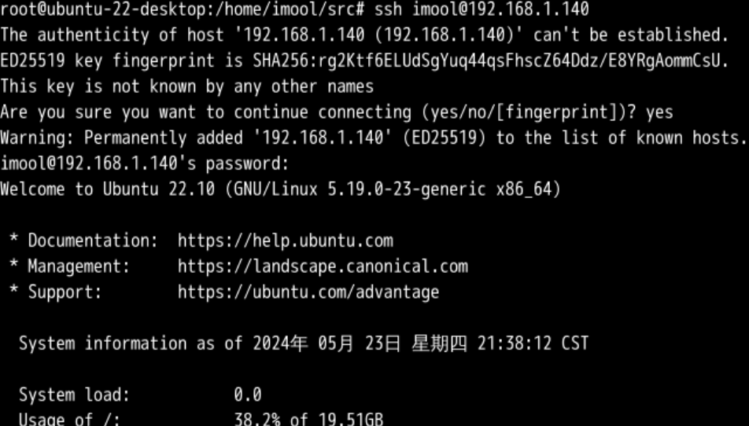

   但是代理服务器不可以通过ssh连接用户主机:

   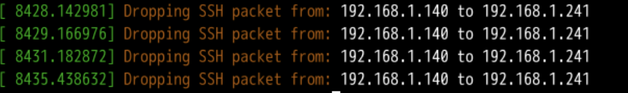

   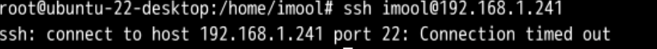

#### 4. 包过滤防火墙绕过

本实验中实现的包过滤防火墙仅通过包过滤规则（如判断端口号、IP地址等）来决定是否阻塞某些网络流量。正常用户可以通过代理的方式绕过包过滤防火墙的限制。这里简单介绍下基于`SSH`自带的socks代理绕过包过滤防火墙技术。

**实验过程**：

首先在正常用户主机上开启socks代理服务：

```shell
ssh -D 1080 imool@192.168.1.140
```

其中`-D`参数的作用是令SSH客户端在本地的指定端口开启一个socks代理服务，以供其它软件使用。

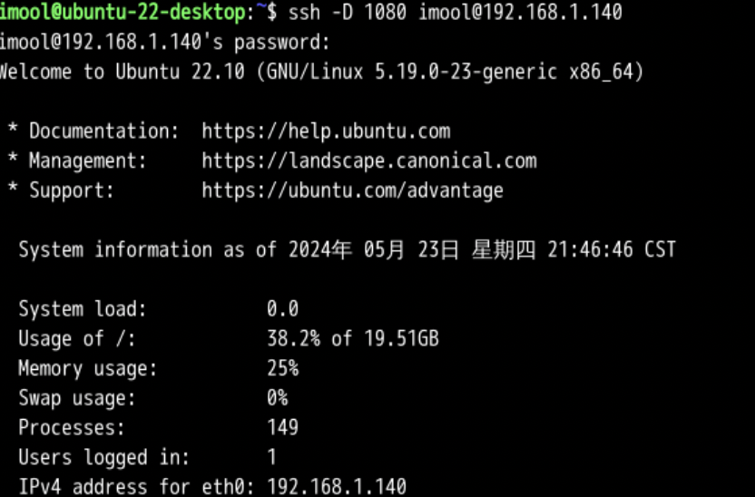

然后对访问网络的软件进行配置，使其通过指定的socks代理服务访问网络资源。使用`--socks5`参数指定要使用的`socks5`代理服务器。

```shell
curl --socks5 socks5://localhost:1080 https://www.sysu.edu.cn
```

此时通过这种方式已经可以访问，访问结果如下：

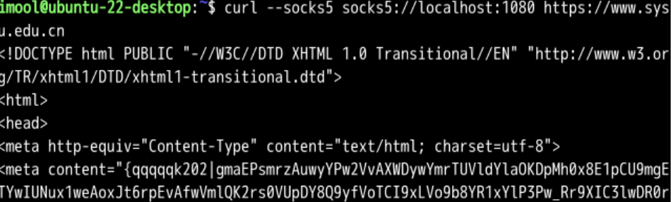

#### 5. 思考

1. 如何使用`netfilter`实现状态检测防火墙？