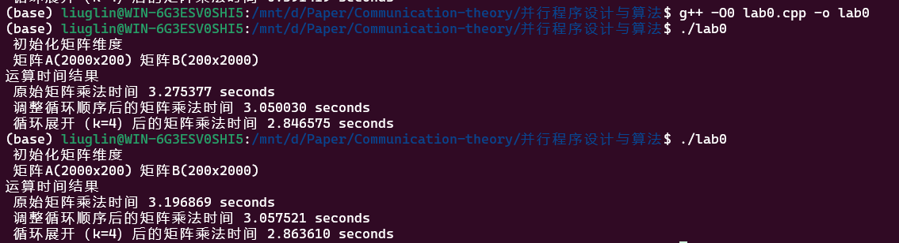

## Lab0-环境设置与串行矩阵乘法

### 环境设置

本次实验选择在自己的主机上安装WSL2来进行实验，如下图所示，已经安装好WSL2，能在windows11主机上运行Ubuntu 22.04子系统：


按照实验文档执行如下代码分别按照OpenMPI和MKL：

```shell
sudo apt-get update
sudo apt-get install libopenmpi-dev –y
sudo apt-get install vim -y
```

```shell
// 下载intel 公钥
sudo wget https://apt.repos.intel.com/intel-gpg-keys/GPG-PUB-KEY-INTEL-SW-PRODUCTS.PUB
sudo apt-key add GPG-PUB-KEY-INTEL-SW-PRODUCTS.PUB

// Add the APT Repository
sudo sh -c 'echo deb https://apt.repos.intel.com/mkl all main > /etc/apt/sources.list.d/intel-mkl.list'
sudo apt-get update

// Install 
sudo apt-get install intel-mkl-64bit-2020.2
source /opt/intel/compilers_and_libraries_2020/linux/mkl/bin/mklvars.sh intel64 ilp64

```

安装完毕后环境配置完成。


### python实现

由于numpy等科学计算库中对矩阵乘法等计算在底层或者硬件层面有很多加速操作，为了体现出python原生的计算速度，这里只引用了random库和time库，分别用来随机初始化矩阵以及计时。

使用嵌套列表生成矩阵A和矩阵B和C，最后再用三层循环对A和B通过通用矩阵乘法计算得到C的值并计时，核心代码如下：

```python
# 用列表生成m x n的矩阵A,每个元素为[512,2048]之间的随机数
A = [[random.uniform(512, 2048) for j in range(n)] for i in range(m)]
B = [[random.uniform(512, 2048) for j in range(k)] for i in range(n)]

start_time = time.time()
# 对A和B进行乘法运算
C = [[0 for j in range(k)] for i in range(m)]
for i in range(m):
    for j in range(k):
        for l in range(n):
            C[i][j] += A[i][l] * B[l][j]

end_time = time.time()
use_time = end_time - start_time
print("time: ", use_time, "s")
```

运行文件，结果如下：


### C/C++实现

为了初始化方便，这里使用了C++实现。首先为A、B、C矩阵分配空间，在C++中使用数组来模拟矩阵：

```C++
    A = (double *) malloc(m * k * sizeof(double));
    B = (double *) malloc(k * n * sizeof(double));
    C = (double *) malloc(m * n * sizeof(double));
```

然后定义随机数生成器，保证生成的数值为512-2048之间的随机浮点数

```C++
    // 定义随机数生成器
    random_device rd;
    mt19937 gen(rd());
    uniform_real_distribution<double> dis(512.0, 2048.0);
```

对三个矩阵进行随机初始化之后进行矩阵乘法并计时，矩阵乘法代码与python一致，都是通过三层循环用通用矩阵乘法计算得到：

```C++
    // 计时开始
    clock_t start, end;
    start = clock();

    // 矩阵乘法
    for (i = 0; i < m; i++)
        for (j = 0; j < n; j++)
            for (int p = 0; p < k; p++)
                C[i * n + j] += A[i * k + p] * B[j + p * n];

    // 计时结束
    end = clock();
```


### 调整循环顺序

其他代码不变，将主循环代码第一二层调换：

```C++
//调整循环顺序   
for (j = 0; j < n; j++)
       for (i = 0; i < m; i++)
           for (int p = 0; p < k; p++)
               C[i * n + j] += A[i * k + p] * B[j + p * n];
```


### 循环展开

进行展开数为x的循环展开，具体思路是对最后一层循环遍历的维度进行展开（这里为k），由于k不一定是x的倍数，所以先对`k-k%x`，先对能整除的部分进行循环展开，最后再对余数单独进行一次for循环读取，代码如下：

```C++
    // 计时开始
    start = clock();
    int x = 4;
    // 矩阵乘法
    for (i = 0; i < m; i++) {
        for (j = 0; j < n; j++) {
            for (int p = 0; p < (k - k % x); p += 4) {
                C[i * n + j] += A[i * k + p] * B[j + p * n];
                C[i * n + j] += A[i * k + (p + 1)] * B[j + (p + 1) * n];
                C[i * n + j] += A[i * k + (p + 2)] * B[j + (p + 2) * n];
                C[i * n + j] += A[i * k + (p + 3)] * B[j + (p + 3) * n];
            }
            // 处理剩余的元素
            for (int p = k - k % x; p < k; p++) {
                C[i * n + j] += A[i * k + p] * B[j + p * n];
            }
        }
    }
```

经过多次试验后发现x=4的情况下进行循环展开提升的速度最多，这里选择x=4.


使用如下命令行进行无优化编译：

```shell
g++ -O0 lab0.cpp -o lab0
```

为了确定代码在不进行编译优化的情况下的运行情况，这里编译优化级别设置成0，编译优化标志不开启（经测试，-ffast-math开启与否无显著区别；-funroll-loops开启后运行速度甚至会变慢；-fomit-frame-pointer由于代码未用到函数，所以开启也没有意义）

运行得到如下结果：



多次取平均后原始矩阵乘法大概在3.2s左右，调整循环顺序后大概在3.05左右，而循环展开后的乘法时间大概在2.85s。


### 编译优化

<<<<<<< HEAD
这里编译优化等级开启最快的`-Ofast`，编译优化标志开启`-ffast-math`以及`-funroll-loops`，由于代码为用到函数，所以`-fomit-frame-pointer`不开启。

编译代码如下：

```shell
g++ -Ofast -ffast-math -funroll-loops lab0.cpp -o lab0
```

运行结果如下：


可以看到三种计算矩阵的方式计算速度都有了极大的提升，其中循环展开的提升幅度最大。


### Intel MKL

测试MKL的代码参考了提供的实例example.c并进行了一定修改。核心的矩阵计算部分与example.c一样：

```C
	time_t start, end;
    start = clock();
    cblas_dgemm(CblasRowMajor, CblasNoTrans, CblasNoTrans, 
                m, n, k, alpha, A, k, B, n, beta, C, n);
    end = clock();
```

使用如下代码进行编译：

```shell
g++ lab0_mkl.c -lmkl_rt
```

运行结果如下：


可以看到使用mkl进行计算比最高级的编译优化还要快上几倍。


### 性能对比表

以下运行时间除python外都取多次测量的均值，由于$m=2000,k=200,n=2000$，并且每一次最内层循环运行了$k$次乘法和$k-1$次加法，所以共执行了$2×m×n×k−m×n=1.60\times10^9$次操作，则浮点性能为$\frac{1.60}{\text{Running Time}} \text{Gflops}$​.

电脑峰值性能的计算公式为：`核心数 × 每核心最大频率(GHz) × 每周期浮点运算数 = 峰值性能(GFLOPS)`

使用`lscpu`查看处理器详细信息：


可以看到共有12个逻辑核心，每个核心的最大时钟频率为2.60GHZ，并且Intel Core i7-10750H CPU架构允许每个时钟周期内每个核心进行8次双精度浮点运算，所以电脑的峰值性能为：
$$
6×2.60×8=124.8 GFLOPS
$$

| 版本 |   实现描述   | 运行时间(sec.) | 相对加速比（%） | 绝对加速比 | 浮点性能(GFLOPS) | 峰值性能百分比 |
| :--: | :----------: | :------------: | :-------------: | :--------: | :--------------: | :------------: |
|  1   |    Python    |      160       |        /        |     /      |       0.01       |     0.01%      |
|  2   |    C/C++     |      3.35      |      4776%      |   47.76    |      0.4776      |     0.38%      |
|  3   | 调整循环顺序 |      3.04      |      110%       |   52.63    |       0.53       |     0.42%      |
|  4   |   编译优化   |     0.4169     |      729%       |   383.78   |      3.837       |     3.07%      |
|  5   |   循环展开   |     0.1337     |      312%       |  1196.70   |      11.96       |     9.58%      |
|  6   |  Intel MKL   |     0.0477     |      280%       |  3354.29   |      33.54       |     26.88%     |


#### 不同因素对最终性能的影响

- Python：由于python是基于解释的语言，而且在使用过程中没有使用numpy等底层运算的科学计算库，只使用了python中最基础的`if`和`for`循环语句，代码在执行时会被一行一行地解释执行，而不是预先编译为机器语言，这个过程消耗的时间要多很多，外加上python是动态类型（变量在运行时动态确定类型）所以python的速度比C/C++等预编译的语言要慢很多。
- C/C++：在执行之前被编译为直接在特定硬件上执行的机器代码，减少了解释执行的开销，使代码运行效率更高，并且还能直接对内存进行管理。而且C/C++使用静态类型，减少了执行时检查类型的开销。
- 调整循环顺序：在涉及多维数组或矩阵操作时，调整内外循环与数据的访问模式和缓存利用率有关。当CPU缓存是按照列优先的方式工作的，那么列优先遍历可能会比行优先遍历更加高效，因为它减少了缓存失效的次数。
- 编译优化：实验中开启的是最高级的编译优化级别`-Ofast`，这个选项会开启所有优化，包括那些可能会增加编译时间的优化。同时开启了`-ffast-math`关闭了某些数学函数的严格准确性检查，以换取更高的性能，对浮点运算有帮助；以及开启了`-funroll-loops`减少循环控制的开销。
- 循环展开：本次实验中使用了x=4的循环展开，通过减少循环终止条件检查和循环索引更新的次数来提高代码性能。这样可以减少循环的迭代次数、减少分支预测错误的可能性，从而提高代码的运行效率。
- Intel MKL：MKL是针对Intel架构优化的数学库，它利用了最新的Intel处理器上的特性，提供了高度优化的算法实现，这些实现经过专门设计以充分利用处理器的多核和向量处理能力，所以使用MKL进行矩阵运算通常比最高级的编译优化还要快上许多。
=======
这里开启最快的优化级别`-Ofast`，
>>>>>>> refs/remotes/origin/main
