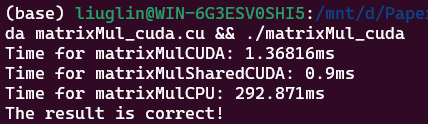

## 第十次实验 CUDA并行矩阵乘法

|   学号   |  姓名  |
| :------: | :----: |
| 20319045 | 刘冠麟 |


#### 问题描述

CUDA实现并行通用矩阵乘法，并通过实验分析不同线程块大小，访存方式、数据/任务划分方式对并行性能的影响。

**输入：**三个整数，每个整数的取值范围均为[128, 2048]

**问题描述：**随机生成的矩阵及的矩阵，并对这两个矩阵进行矩阵乘法运算，得到矩阵.

**输出**：三个矩阵，及矩阵计算所消耗的时间。

**要求：**使用CUDA实现并行矩阵乘法，分析不同线程块大小，矩阵规模，访存方式，任务/数据划分方式，对程序性能的影响。CUDA实现并行通用矩阵乘法，并通过实验分析不同线程块大小，访存方式、数据/任务划分方式对并行性能的影响。


#### 实验过程与核心代码

##### 串行矩阵乘法

串行矩阵乘法如下，由于串行的矩阵乘法已经写过多次，原理和思路不再赘述：

```C++
// 串行计算矩阵乘法
void matrixMulCPU(double *C, double *A, double *B, int m, int n, int k) {
    for (int i = 0; i < m; i++) {
        for (int j = 0; j < k; j++) {
            double value = 0.0;
            for (int l = 0; l < n; l++) {
                value += A[i * n + l] * B[l * k + j];
            }
            C[i * k + j] = value;
        }
    }
}
```


##### 全局内存计算矩阵乘法

首先需要确定线程负责计算的区域，确定线程应该要计算的是结果矩阵$C$的元素，也就是说**每一个线程负责计算矩阵C中的一个元素**，因此可以根据矩阵乘法的串行代码写出每一个线程要执行的函数：

```C++
// CUDA计算矩阵乘法
__global__ void matrixMulCUDA(double *C, double *A, double *B, int m, int n, int k) {
    int col = blockIdx.x * blockDim.x + threadIdx.x;
    int row = blockIdx.y * blockDim.y + threadIdx.y;

    if (row <= m && col <= k) {
        double value = 0.0;
        for (int i = 0; i < n; ++i) {
            value += A[row * n + i] * B[i * k + col];
        }
        C[row * k + col] = value;
    }
}
```

这里首先由块idx和线程idx计算出当前线程负责的元素索引，然后执行串行矩阵乘法中的最后一个for循环，也就是计算矩阵$C$​对应索引中的元素值。


##### 共享内存的矩阵乘法

首先使用`__shared__`定义共享内存，创建矩阵A和B各自的共享内存矩阵：

```C++
    __shared__ double shared_A[BLOCK_SIZE][BLOCK_SIZE];
    __shared__ double shared_B[BLOCK_SIZE][BLOCK_SIZE];
```

和共享内存的矩阵乘法一样，每一个线程负责结果矩阵C中的特定位置的元素的值。对于每一个线程来说，首先计算出其负责的索引：

```
    int row = blockIdx.y * blockDim.y + threadIdx.y;
    int col = blockIdx.x * blockDim.x + threadIdx.x;
```

然后是共享内存乘法的关键部分，为了充分利用共享内存**按块存取**更快的优势，共享内存乘法中将A、B两个大矩阵划分成若干个`(block_size, block_size)`大小的块进行计算，最终每个线程能够计算得出自己负责索引元素的最终值：

```C++
double value = 0;
    for (int i = 0; i < (n + BLOCK_SIZE - 1) / BLOCK_SIZE; ++i) {
        if (row < m && i * BLOCK_SIZE + threadIdx.x < n) {
            shared_A[threadIdx.y][threadIdx.x] = A[row * n + i * BLOCK_SIZE + threadIdx.x]; // A[row][i * BLOCK_SIZE + threadIdx.x];
        } else {
            shared_A[threadIdx.y][threadIdx.x] = 0.0;
        }
        if (col < k && i * BLOCK_SIZE + threadIdx.y < n) {
            shared_B[threadIdx.y][threadIdx.x] = B[(i * BLOCK_SIZE + threadIdx.y) * k + col]; // B[i * BLOCK_SIZE + threadIdx.y][col];
        } else {
            shared_B[threadIdx.y][threadIdx.x] = 0.0;
        }

        __syncthreads();

        for (int i = 0; i < BLOCK_SIZE; ++i) {
            value += shared_A[threadIdx.y][i] * shared_B[i][threadIdx.x];
        } 

        __syncthreads();
    }
```

这个for循环的核心思想是将A、B两个大矩阵切分成子块，然后A中是按行对子块取值，B中是按列对子块取值，将子块的值各自存到对应的共享内存中，这样就完成了**对矩阵的按块存取**。

然后第一个`__syncthreads()`线程同步，是为了同步同一个块中的所有线程，确保已经将子块完整存到共享块中。

接下来对于每一个线程，计算当前两个子块`shared_A,shared_B`在线程位置上的乘积。因为如果正常要计算C中对应元素索引的最终值，就要对A中一行的所有元素和B中一列的所有元素都计算一遍，而这里对子块进行计算，实际上就是计算最终值的一小部分，也就是每一块中对应行列计算得到的值。

然后使用for循环对所有切分的子块都遍历一遍，每遍历一个子块就对`value`累加一次，最终遍历完所有子块后，`value`的值就是A中完整一行的所有元素和B中完整一列的所有元素相乘再相加的值。第二次执行的`__syncthreads()`是为了确保遍历块时所有线程都计算完毕再遍历下一个块。

最终将得到的值存入结果矩阵的对应元素中：

```C++
    if (row < m && col < k) {
        C[row * k + col] = value;
    }
```


##### 调用线程函数并计时

首先定义三个矩阵的大小，这里实验方便起见统一定义为相同大小的方阵。同时定义线程块大小。

```C++
// 矩阵维度
#define M 512 
#define N 256
#define K 512
#define BLOCK_SIZE 16
```

然后定义块的size以及CUDA网格，这里由于是用CUDA并行对矩阵$C$进行计算，所以是对结果矩阵$C$的维度`(m,k)`进行网格size的计算：

```C++
    // 定义CUDA网格和块结构
    dim3 dimBlock(BLOCK_SIZE, BLOCK_SIZE);
    dim3 dimGrid((K + BLOCK_SIZE - 1) / BLOCK_SIZE, (M + BLOCK_SIZE - 1) / BLOCK_SIZE);
```

在`main`函数调用CUDA并行函数前，还需要将内存中的数据复制到GPU上，否则无法利用CUDA进行计算：

```C++
    // 分配GPU内存
    cudaMalloc((void **)&d_A, M * N * sizeof(double));
    cudaMalloc((void **)&d_B, N * K * sizeof(double));
    cudaMalloc((void **)&d_C, M * K * sizeof(double));
    cudaMalloc((void **)&d_C_shared, M * K * sizeof(double));

	// 将数据从主机复制到GPU
    cudaMemcpy(d_A, A, M * N * sizeof(double), cudaMemcpyHostToDevice);
    cudaMemcpy(d_B, B, N * K * sizeof(double), cudaMemcpyHostToDevice);
```

最后调用上面定义的线程函数进行计算，并以之前定义的网格和块结构划分线程块。同时调用cuda库中进行计时的函数，计算输出并行计算执行的时间。

```C++
    // 计时
    cudaEvent_t start, stop;
    float elapsedTime;
    cudaEventCreate(&start);
    cudaEventCreate(&stop);
	
	// 开始计时
    cudaEventRecord(start, 0);
    // 调用CUDA内核函数
    matrixMulCUDA<<<dimGrid, dimBlock>>>(d_C, d_A, d_B, M, N, K);
    cudaEventRecord(stop, 0);
    cudaEventSynchronize(stop);
    cudaEventElapsedTime(&elapsedTime, start, stop);
    std::cout << "Time for matrixMulCUDA: " << elapsedTime << "ms" << std::endl;
```

计算结果存储在GPU上的矩阵`d_C`里，所以还需要将其挪回到内存上：

```C++
    // 将结果从设备复制回主机
    cudaMemcpy(C, d_C, M * K * sizeof(double), cudaMemcpyDeviceToHost);
```

这里展示的是全局内存的调用方式，共享内存同理，只是函数名字有变化，不再赘述。


#### 编译运行

使用如下代码编译运行：

```shell
nvcc -o matrixMul_cuda matrixMul_cuda.cu 
./matrixMul_cuda
```

运行后在命令行输出如下结果：



#### 结果分析

##### 不同线程块

使用矩阵大小为`(2048, 2048)`，分别讨论不同大小线程块对程序性能的影响。

虽然线程块宽度为16的倍数，但是`8x8`也能正常计算并且输出正确结果。其他块维度会显示计算错误，超过`64x64`维度的块会显示Error表示使用过多的共享数据。

| 线程块 |  全局内存方式  | 共享内存方式 |
| :----: | :------------: | :----------: |
|  8x8   |   107.433 ms   |   90.831ms   |
| 16x16  | **103.516** ms |   88.67 ms   |
| 32x32  |   105.351 ms   | **80.64 ms** |

- 横向对比可以看到，无论哪一种线程块大小，共享内存都比全局内存要更快。
- 纵向对比，在共享内存方式中随着线程块大小的增加会计算时间会减少，所以对于共享内存方式的CUDA并行存储来说一般选择较大的块会更好。
- 不同的是在全局内存方式中线程块对效率的影响较小，基本变化不大，并且没有明显规律。但是线程块维度为`16x16`时表现最好。


##### 不同矩阵规模

使用块大小为`(16, 16)`，分别讨论不同大小矩阵规模对程序性能的影响。为了实验量化方便，这里三个矩阵规模统一使用同一大小的方阵。

(**由于进行计算的设备不同，CPU串行的数据不与GPU的计算时间直接比较，只用于衡量改变条件造成时间变化的baseline**)

| 矩阵规模 \ 时间 | 全局内存方式 |  共享内存方式  |  CPU串行  |
| :-------------: | :----------: | :------------: | :-------: |
|     128x128     |  0.1925 ms   | **0.0998** ms  |  6.04 ms  |
|     256x256     |  0.3906 ms   | **0.2413** ms  |  70.83ms  |
|     512x512     |  1.7166 ms   | **1.7096** ms  |  904.025  |
|    1024x1024    |  14.1704 ms  | **13.9008** ms |  8029 ms  |
|    2048x2048    |  103.516 ms  |  **88.67** ms  | 166813 ms |

计算矩阵规模增加后计算时间与上一个规模所用时间之比的表格：

| 矩阵规模 \ 时间倍数增长 | 全局内存方式 | 共享内存方式 | CPU串行 |
| :---------------------: | :----------: | :----------: | :-----: |
|         128x128         |      \       |      \       |    \    |
|         256x256         |   **2.02**   |    2.417     |  11.73  |
|         512x512         |   **4.39**   |     7.08     |  12.76  |
|        1024x1024        |     8.25     |   **8.13**   |   8.9   |
|        2048x2048        |     7.35     |   **6.33**   |  20.77  |

由以上实验和分析可以得到：

- 随着矩阵规模的增大，计算量肯定会增多，可以看到全局内存方式和共享内存方式的计算时间都随着矩阵规模的增大而增大。
- 可以看到所有的矩阵规模下，共享内存的计算时间都小于全局访存的计算时间，可以说明共享内存的效率和性能要优于全局访存方式；但是效率差别也随矩阵规模有所差异，当矩阵规模较小时，共享内存的时间只有全局内存的一般，即性能要高大约50%。但是随着矩阵规模的增大，共享内存的效率优势逐渐减少，到`2048x2048`这一规模时，大约只比全局内存快10%。
- 同时时间随矩阵规模的增大而增长的时间倍数也有所差异，随着矩阵规模的增大，可以看到无论是全局内存还是共享内存，当其规模成倍增长时，其增加的时间倍数都明显少于CPU串行。由此不仅说明使用CUDA并行计算能够在矩阵规模增大带来计算量激增的情况下可以保证较小的计算时间增加。

##### 访存方式

不同访存方式的对比已经结合在上面两个实验中，由上面的实验可以知道在一般情况下共享内存方式的性能都明显优于全局内存方式，但是优势程度和规律随矩阵规模以及线程块大小而变化。


##### 任务/数据划分和映射方式

为了证明按块存取能明显提升存取效率，这里尝试不使用按块存取的技巧，修改共享内存线程函数的存取逻辑，让每个线程直接计算出A的一整行和B的一整列对应的结果：

```C++
__global__ void matrixMulSharedCUDA(double *C, double *A, double *B, int m, int n, int k) {
    __shared__ double shared_A[BLOCK_SIZE];
    __shared__ double shared_B[BLOCK_SIZE];

    int row = blockIdx.y * blockDim.y + threadIdx.y;
    int col = blockIdx.x * blockDim.x + threadIdx.x;
    double value = 0;

    // 遍历A的一行和B的一列
    for (int i = 0; i < (n + BLOCK_SIZE - 1) / BLOCK_SIZE; ++i) {
        if (row < m && i * BLOCK_SIZE + threadIdx.x < n) {
            shared_A[threadIdx.x] = A[row * n + i * BLOCK_SIZE + threadIdx.x];
        } else {
            shared_A[threadIdx.x] = 0.0;
        }
        if (col < k && i * BLOCK_SIZE + threadIdx.y < n) {
            shared_B[threadIdx.y] = B[(i * BLOCK_SIZE + threadIdx.y) * k + col];
        } else {
            shared_B[threadIdx.y] = 0.0;
        }

        __syncthreads();

        for (int j = 0; j < BLOCK_SIZE; ++j) {
            value += shared_A[j] * shared_B[j];
        }

        __syncthreads();
    }

    if (row < m && col < k) {
        C[row * k + col] = value;
    }
}
```

修改后通过测试表明，在共享内存方法中直接使用共享内存来处理整个行和列的计算效率在所有的数据规模中都**明显低于**按块存取的共享内存效率，说明在共享内存版本的线程函数中使用特定技巧进行按块存取矩阵数据，能明显加快存取速度和计算效率：


| 数据规模\时间 | 处理整个行和列 |    按块存取    |
| :-----------: | :------------: | :------------: |
|    128x128    |   0.2231 ms    | **0.0998** ms  |
|    256x256    |   0.2565 ms    | **0.2413** ms  |
|    512x512    |    2.779 ms    | **1.7096** ms  |
|   1024x1024   |   14.8732 ms   | **13.9008** ms |
|   2048x2048   |   109.299 ms   |  **88.67** ms  |


（块大小选用为`16x16`）