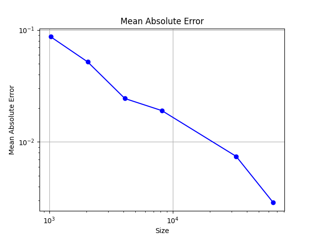

## 第四次实验 Pthreads并行方程求解及蒙特卡洛

|   学号   |  姓名  |
| :------: | :----: |
| 20319045 | 刘冠麟 |

### 实验一 一元二次方程求解

#### 实验任务

使用Pthread编写多线程程序，求解一元二次方程组的根，结合数据及任务之间的依赖关系，及实验计时，分析其性能。

**输入**：$a,b,c$三个浮点数，取值范围为$[-100,100]$

**输出**：求解一元二次方程$ax^2+bx+c=0$的解$x_1,x_2$，以及求解消耗时间$t$

**要求**：使用Pthreads编写多线程程序，根据求根公式求解一元二次方程。求根公式的中间值由不同线程计算，并使用条件变量识别何时线程完成了所需计算。讨论其并行性能。

#### 实验代码和思路

一元二次方程求根公式如下：
$$
x = \frac{-b ± \sqrt{b^2-4ac}}{2a}
$$
我的实现思路是先用线程1计算得出delta的值$\sqrt{b^2-4ac}$，等待线程1完成计算后用两个线程x2和x3并行计算方程的两个根x1和x2。

核心代码如下：

首先创建结构体：

```C++
typedef struct {
    double a, b, c;      // 方程参数
    double discriminant; // 判别式
    double root1, root2; // 两个根
    pthread_mutex_t mutex;
    pthread_cond_t cond;
    int ready;           // 用于条件变量的标志
} SharedData;
```

结构体中保存各个中间变量以及保证线程间依赖关系的互斥锁和条件变量。

##### 计算delta

```C++
void* calculate_discriminant(void *param) {
    SharedData *data = (SharedData *)param;
    pthread_mutex_lock(&data->mutex);
    data->discriminant = data->b * data->b - 4 * data->a * data->c;
    data->ready = 1;
    pthread_cond_broadcast(&data->cond); // 使用broadcast，因为多个线程等待这个条件
    pthread_mutex_unlock(&data->mutex);
    end_time1 = clock();
    return NULL;
}
```

此线程负责计算方程的判别式，用于判断方程根的性质（即是否有实数根，有两个实数根还是一个重根，或是复数根）。

在计算前先使用`pthread_mutex_lock(&data->mutex);`锁定互斥量，保证线程安全，防止进程2和进程3访问数据，在delta计算完成前先计算根。

计算完成后将结果存储在共享结构体中，并更新条件变量相关的状态，然后使用broadcast广播通知其他线程判别式已准备好。


##### 计算两个根的线程

计算两个根的函数基本一致，只有计算的符号不同，这里只展示root1的计算。

```C++
void* calculate_root1(void *param) {
    SharedData *data = (SharedData *)param;
    pthread_mutex_lock(&data->mutex);
    while (!data->ready) {
        pthread_cond_wait(&data->cond, &data->mutex);
    }
    pthread_mutex_unlock(&data->mutex);

    if (data->discriminant >= 0) {
        data->root1 = (-data->b + sqrt(data->discriminant)) / (2 * data->a);
    } else {
        data->root1 = NAN; // 复数根不计算
    }
    end_time2 = clock();
    return NULL;
}
```

函数保证了线程在线程1中delta计算完成前不会进行根的计算，当收到广播以及ready条件变量满足后进行根的计算，最后对线程完成时间进行计时，以便分析各个线程的完成时间关系。


#### 程序编译

按照如下指令进行编译：

```C++
gcc -o lab1 lab1.c -lpthread -lm
```


#### 程序运行

执行

```
 ./lab1 1 5 6
```

程序运行结果如下：


#### 结果分析

##### 计算任务依赖关系分析：

- 可以看到实验结果中负责delta计算的线程1始终最先完成，因为在代码中规定了负责根计算的线程2和线程3必须等待delta计算完成后才能进行计算。即线程2和线程3依赖于线程1。
- 由于计算两个根的线程2和线程3相互之间没有依赖关系，即两个线程是并行计算的，所以计算的完成时间有先有后。

##### 程序并行性能

直接编写按照顺序计算的串行代码：

```C++
    // 计算根
    discriminant = b * b - 4 * a * c;
    root1 = (-b + sqrt(discriminant)) / (2 * a);
    root2 = (-b - sqrt(discriminant)) / (2 * a);
    printf("根1 = %.2lf 和 根2 = %.2lf\n", root1, root2);
    printf("复数根: %.2lf+%.2lfi 和 %.2lf-%.2lfi\n", realPart, imagPart, realPart, imagPart);
```

运行时间如下：


可以看到时间比并行快了一个量级。这是因为一元二次方程的计算本身是一个非常简单的计算任务，并不复杂或耗时。而线程的创建、同步（等待和信号机制）引入额外的开销远远比两个根之间的并行带来的提升要大，所以这种情况下串行的计算效率反而快上许多。


### 实验二 蒙特卡洛求圆周率π的近似值

#### 实验任务

基于Pthreads编写多线程程序，使用蒙特卡洛方法求圆周率$\pi$近似值。

**输入**：整数$n$，取值范围为$[1024,65536]$

**输出**：总点数n，落在内切圆内点数m，估算的$\pi$值以及消耗的时间t。

**要求**：基于Pthreads编写多线程程序，使用蒙特卡洛方法求圆周率，讨论程序并行性能。


#### 实验代码和思路

通过pthread并行地抽样生成随机点，即p个线程负责$n/p$个点的生成和统计，代码如下：

```C++
void* compute_pi(void *rank)
{
    long my_rank = (long)rank;
    long long int local_n = n / thread_count;
    long long int my_first_i = my_rank * (n / thread_count);
    long long int my_last_i = my_first_i + (n / thread_count);
    long long int local_m = 0;

    for (long long int i = my_first_i; i < my_last_i; i++)
    {
        double x =(double)rand() / RAND_MAX;
        double y =(double)rand() / RAND_MAX;
        if (x * x + y * y <= 1)
        {
            local_m++;
        }
    }
    pthread_mutex_lock(&mutex);
    m += local_m ;
    pthread_mutex_unlock(&mutex);
    return NULL;
}
```

然后在main中创建和等待线程完成

```C++
    start_time = clock();
    // 创建线程
    for (thread = 0; thread < thread_count; thread++)
        pthread_create(&thread_handles[thread], NULL, compute_pi, (void*) thread);
    
    for (thread = 0; thread < thread_count; thread++)
        pthread_join(thread_handles[thread], NULL);
    
    end_time = clock();
```


#### 程序编译

按照如下指令进行编译：

```C++
gcc -o lab2 lab2.c -lpthread -lm
```


#### 运行结果

运行结果如下：


更改线程数和规模，可以得到下表：

**运行时间：**

| 线程数\规模 | 1024     | 2048     | 4096     | 8192     | 32768    | 65535    |
| ----------- | -------- | -------- | -------- | -------- | -------- | -------- |
| 1           | 0.00004  | 0.000047 | 0.000040 | 0.000039 | 0.000055 | 0.000048 |
| 2           | 0.000075 | 0.000084 | 0.000314 | 0.001584 | 0.011540 | 0.017001 |
| 4           | 0.000225 | 0.000193 | 0.000433 | 0.002304 | 0.010564 | 0.022071 |
| 8           | 0.000386 | 0.000308 | 0.000528 | 0.002294 | 0.027974 | 0.061420 |
| 16          | 0.000692 | 0.000543 | 0.000606 | 0.002082 | 0.43030  | 0.099674 |

可以看到随着线程数量增大，消耗时间反而增多，而随着规模的增大，计算时间也会增加。

**平均误差：**

| 规模               | 1024     | 2048     | 4096     | 8192    | 32768    | 65535    |
| ------------------ | -------- | -------- | -------- | ------- | -------- | -------- |
| 与真值平均绝对误差 | 0.086905 | 0.051749 | 0.024423 | 0.01903 | 0.007438 | 0.002873 |



**加速比如下：**

| 线程\规模 | 1024  | 2048  | 4096  | 8192  | 32768  | 65535  |
| --------- | ----- | ----- | ----- | ----- | ------ | ------ |
| 1         | 1.000 | 1.000 | 1.000 | 1.000 | 1.000  | 1.000  |
| 2         | 0.533 | 0.560 | 0.127 | 0.025 | 0.005  | 0.003  |
| 4         | 0.178 | 0.244 | 0.092 | 0.017 | 0.005  | 0.002  |
| 8         | 0.104 | 0.153 | 0.076 | 0.017 | 0.002  | 0.001  |
| 16        | 0.058 | 0.087 | 0.066 | 0.019 | 0.0001 | 0.0005 |

**各个线程计算时间随规模变化趋势如图：**


#### 结果分析

##### 与真值误差

可以看到随着计算规模的增大，计算结果与真值的误差逐渐减小。这是由于大数定理，当实验次数增多时，频率就会越加接近于真实概率，也就是真实的$\pi$值。

##### 并行性能分析

- 从图中看到，随着线程数量的增多，计算耗时反而增大，这可能是由于任务本身的计算开销很小，而线程的创建、同步（等待和信号机制）引入额外的开销远远比对任务并行本身带来的提升要大，所以随着线程数量的增多，引入的线程开销也逐渐增大，耗时也增多。
- 可以看到线程数为1时的计算时间远远比其他线程数量的计算时间要小得多，这是可能是因为当线程数量为1时直接不开启并行和线程机制，直接进行串行计算，所得时间也就只有计算任务本身的开销，所以线程数为1时耗时远远低于其他线程数。