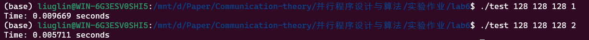
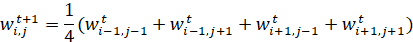
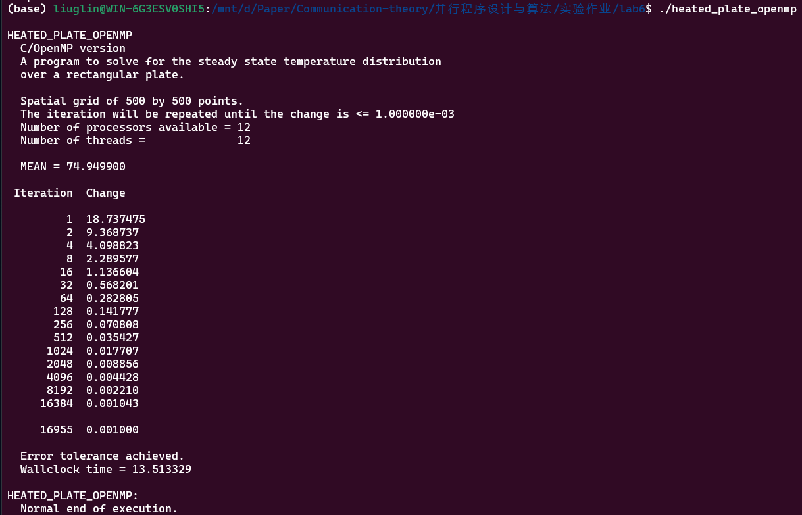
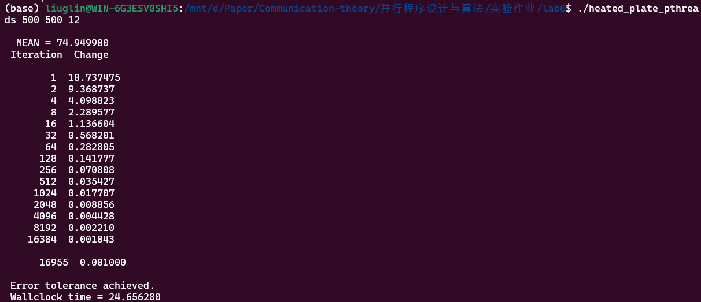

## 第六次实验 Pthreads并行构造

|   学号   |  姓名  |
| :------: | :----: |
| 20319045 | 刘冠麟 |

### 实验一 构造基于Pthreads的并行for循环分解、分配、执行机制

#### 实验任务

模仿OpenMP的`omp_parallel_for`构造基于Pthreads的并行for循环分解、分配及执行机制。此内容延续上次实验，在本次实验中完成。

**问题描述：**生成一个包含`parallel_for`函数的动态链接库（.so）文件，该函数创建多个Pthreads线程，并行执行parallel_for函数的参数所指定的内容。

**函数参数：**`parallel_for`函数的参数应当指明被并行循环的索引信息，循环中所需要执行的内容，并行构造等。以下为`parallel_for`函数的基础定义，实验实现应包括但不限于以下内容：

```C++
parallel_for(int start, int end, int inc, void *(*functor)( int,void*), void *arg, int num_threads)
```

-  start, end, inc分别为循环的开始、结束及索引自增量；
- functor为函数指针，定义了每次循环所执行的内容；
- arg为functor的参数指针，给出了functor执行所需的数据；
- num_threads为期望产生的线程数量。
- 选做：除上述内容外，还可以考虑调度方式等额外参数。

**要求：**完成parallel_for函数实现并生成动态链接库文件，并以矩阵乘法为例，测试其实现的正确性及效率。

#### 实验代码和思路

##### 定义用于传递线程参数的结构体

定义一个结构体 `ThreadArg`，用于传递给线程的参数。结构体包含了迭代的起始和结束索引、一个函数指针和一个参数，还有线程的ID。

```C++
typedef struct {
    int start;
    int end;
    void *(*functor)(int, void*);
    void *arg;
    int thread_id;
} ThreadArg;
```


##### 线程函数 `thread_func`

线程实际执行的函数，该函数会从传递给它的参数中获取迭代的起始和结束索引，然后在这个范围内执行给定的函数指针 `functor`，并将参数 `arg` 传递给这个函数，指定范围内的任务由 `functor` 执行。

```C++
void* thread_func(void* arg) {
    ThreadArg* thread_arg = (ThreadArg*)arg;
    for (int i = thread_arg->start; i < thread_arg->end; i++) {
        thread_arg->functor(i, thread_arg->arg);
    }
    return NULL;
}
```


##### 并行迭代函数 `parallel_for`：

`parallel_for` 接受迭代的起始和结束索引、迭代步长、执行迭代的函数指针、函数参数以及要使用的线程数作为参数。

函数首先动态分配了存储线程句柄和线程参数的内存，然后计算了每个线程处理的数据块大小，将总数据范围平均分配给每个线程。接着为每个线程创建一个线程参数结构 `ThreadArg`，设置起始和结束索引、函数指针、参数和线程ID，并使用 `pthread_create` 函数创建线程并且传入线程函数 `thread_func`。

最后等待所有线程执行完成然后释放动态分配的内存。

```C++
void parallel_for(int start, int end, int inc, void *(*functor)(int, void*), void *arg, int num_threads) {
    pthread_t* threads = malloc(num_threads * sizeof(pthread_t));
    ThreadArg* thread_args = malloc(num_threads * sizeof(ThreadArg));

    int range = end - start;
    int chunk_size = range / num_threads;

    for (int i = 0; i < num_threads; i++) {
        thread_args[i].start = start + i * chunk_size;
        thread_args[i].end = i == num_threads - 1 ? end : thread_args[i].start + chunk_size;
        thread_args[i].functor = functor;
        thread_args[i].arg = arg;
        thread_args[i].thread_id = i;
        pthread_create(&threads[i], NULL, thread_func, &thread_args[i]);
    }

    for (int i = 0; i < num_threads; i++) {
        pthread_join(threads[i], NULL);
    }

    free(threads);
    free(thread_args);
}
```

函数的思路是将大任务分割成小块，然后由多个线程并行处理这些小块，最终合并结果。由此完成构造基于Pthreads的并行for循环分解、分配和执行机制。

#### 头文件

编写对应的库头文件`parallel_for.h`

```C++
#ifndef PARALLEL_FOR_H
#define PARALLEL_FOR_H

void parallel_for(int start, int end, int inc, void *(*functor)(int, void*), void *arg, int num_threads);

#endif 
```


#### 测试代码

测试代码在之前的矩阵乘法代码上进行更改，引入之前写好的`parallel_for`库:

```C++
#include "parallel_for.h"
```

编写如下矩阵乘法代码：

```C++
typedef struct {
    float **A, **B, **C;
    int n;
} MatrixArgs;

void* matrix_multiply(int idx, void* args){
    MatrixArgs *args_data = (MatrixArgs*) args;
    int i = idx / args_data->n;
    int j = idx % args_data->n;
    args_data->C[i][j] = 0;
    for(int k = 0; k < args_data->n; k++)
        args_data->C[i][j] += args_data->A[i][k] * args_data->B[k][j];
    return NULL;
}
```

然后在计算矩阵乘法的部分替换成如下代码：

```C++
    MatrixArgs args = {A, B, C, n};
    parallel_for(0, m*k, 1, matrix_multiply, (void*)&args, p);
```


#### 编译运行

##### 编译并生成动态链接库

1. 编译源文件生成对象文件 `parallel_for.o`:

   ```shell
   gcc -fPIC -Wall -O2 -c parallel_for.c -o parallel_for.o
   ```

2. 链接对象文件生成动态链接库 `libparallel_for.so`:

   ```shell
   gcc -shared -o libparallel_for.so parallel_for.o
   ```

##### 编译运行测试文件

```C++
gcc -L. -Wall -o test test.c -lparallel_for
export LD_LIBRARY_PATH=.:$LD_LIBRARY_PATH
./test 128 128 128 1
```

其中

- `-L.` 告诉编译器在当前目录中查找库。
- `-lparallel_for` 链接 `libparallel_for.so`。
- `export LD_LIBRARY_PATH=.:$LD_LIBRARY_PATH` 临时将当前目录添加到库路径中以便执行文件 `test` 能够找到新创建的 `.so` 文件。


#### 实验结果

执行结果如下：



##### 测试其实现的正确性及效率

见下表格：

| 线程数\规模 | 128      | 256     | 512    | 1024  | 2048  |
| ----------- | -------- | ------- | ------ | ----- | :---- |
| 1           | 0.009669 | 0.09396 | 0.7178 | 7.734 | 75.23 |
| 2           | 0.005711 | 0.04359 | 0.3946 | 3.651 | 38.52 |
| 4           | 0.003933 | 0.02557 | 0.2538 | 2.231 | 24.32 |
| 8           | 0.002384 | 0.01868 | 0.1523 | 1.403 | 14.52 |
| 16          | 0.002114 | 0.01531 | 0.1340 | 1.422 | 12.67 |

可以看到达到了 较好的并行性能，说明正确性及效率达标。


### 实验二 

#### 实验任务

parallel_for并行应用

使用此前构造的parallel_for并行结构，将heated_plate_openmp改造为基于Pthreads的并行应用。

**heated plate问题描述：**

规则网格上的热传导模拟，其具体过程为每次循环中通过对邻域内热量平均模拟热传导过程，即：



其OpenMP实现见课程资料中的heated_plate_openmp.c。

**要求：**使用此前构造的parallel_for并行结构，将heated_plate_openmp实现改造为基于Pthreads的并行应用。测试不同线程、调度方式下的程序并行性能，并与原始heated_plate_openmp.c实现对比。


#### 实验代码和思路

具体思路是首先将`heated_plate_openmp.c`中的代码全部去openmp化，即将其转换为串行代码，然后引入`parallel_for`和`pthread`库，

具体为：

```C++
#include "parallel_for.h"
#include <pthread.h>
```

然后创建对应的数据结构体：

```C++
typedef struct {
    double **u;
    double **w;
    int M;
    int N;
    double epsilon;
    double diff;
    pthread_mutex_t mutex;
} IterationData;
```

初始化和释放部分保持不变（因为这部分不纳入计时，采用串行也不影响），对于真正要计时的即进行计算的`While`循环，对其中的三个for循环进行如下对应更改：

原始代码：

```C++
# pragma omp parallel shared ( u, w ) private ( i, j )
    {
/*
  Save the old solution in U.
*/
# pragma omp for
      for ( i = 0; i < M; i++ ) 
      {
        for ( j = 0; j < N; j++ )
        {
          u[i][j] = w[i][j];
        }
      }
/*
  Determine the new estimate of the solution at the interior points.
  The new solution W is the average of north, south, east and west neighbors.
*/
# pragma omp for
      for ( i = 1; i < M - 1; i++ )
      {
        for ( j = 1; j < N - 1; j++ )
        {
          w[i][j] = ( u[i-1][j] + u[i+1][j] + u[i][j-1] + u[i][j+1] ) / 4.0;
        }
      }
    }
/*
  C and C++ cannot compute a maximum as a reduction operation.

  Therefore, we define a private variable MY_DIFF for each thread.
  Once they have all computed their values, we use a CRITICAL section
  to update DIFF.
*/
    diff = 0.0;
# pragma omp parallel shared ( diff, u, w ) private ( i, j, my_diff )
    {
      my_diff = 0.0;
# pragma omp for
      for ( i = 1; i < M - 1; i++ )
      {
        for ( j = 1; j < N - 1; j++ )
        {
          if ( my_diff < fabs ( w[i][j] - u[i][j] ) )
          {
            my_diff = fabs ( w[i][j] - u[i][j] );
          }
        }
      }
# pragma omp critical
      {
        if ( diff < my_diff )
        {
          diff = my_diff;
        }
      }
    }
```

将其三个双重for循环更改为三个独立的函数：

```C++
void* compute_iteration(int idx, void* arg) {
    IterationData *data = (IterationData*)arg;
    int i = idx;
    int j;
    int N = data->N;
    double **u = data->u;
    double **w = data->w;

    for ( j = 1; j < N - 1; j++ )
    {
        w[i][j] = ( u[i-1][j] + u[i+1][j] + u[i][j-1] + u[i][j+1] ) / 4.0;
    }
    return NULL;
}

void* update_values(int idx, void* arg) {
    IterationData *data = (IterationData*)arg;
    int i = idx;
    int j;
    int N = data->N;
    double **u = data->u;
    double **w = data->w;

    for ( j = 0; j < N; j++ )
    {
        u[i][j] = w[i][j];
    }

    return NULL;
}

void* compute_diff(int idx, void* arg) {
    IterationData *data = (IterationData*)arg;
    int i = idx;
    int j;
    int M = data->M;
    int N = data->N;
    double **u = data->u;
    double **w = data->w;
    double diff_local = 0.0;

    for (j = 1; j < N - 1; j++) {
        diff_local = fmax(diff_local, fabs(u[i][j] - w[i][j]));
    }

    pthread_mutex_lock(&data->mutex);
    if (data->diff < diff_local) {
        data->diff = diff_local;
    }
    pthread_mutex_unlock(&data->mutex);

    return NULL;
}
```

并在`while`循环中调用对应的函数以及封装好的`parallel_for`函数直接对函数进行并行化：

```C++
while (diff >= epsilon) {
        data.diff = 0.0;
        parallel_for(0, M, 1, update_values, (void*)&data, p);
        parallel_for(1, M - 1, 1, compute_iteration, (void*)&data, p);
        parallel_for(1, M - 1, 1, compute_diff, (void*)&data, p);
        diff = data.diff;
        iterations++;
        if (iterations == iterations_print) {
            printf(" %8d  %f\n", iterations, diff);
            iterations_print = 2 * iterations_print;
        }
    }
```


#### 编译运行

使用如下代码进行编译和运行

```shell
gcc -L. -Wall -o heated_plate_pthreads heated_plate_pthreads.c -lparallel_for -lm
./heated_plate_pthreads 500 500 12
```


#### 实验结果

openmp的运行结果如下：



pthread的运行结果如下：




可以看到使用pthread的**程序稍慢**，用时大概是openmp的两倍左右，原因可能是基于线程的pthread在进行多线程计算时存在大量的线程的创建与销毁，这一部分占据了一定的开销，由此导致速度变慢。