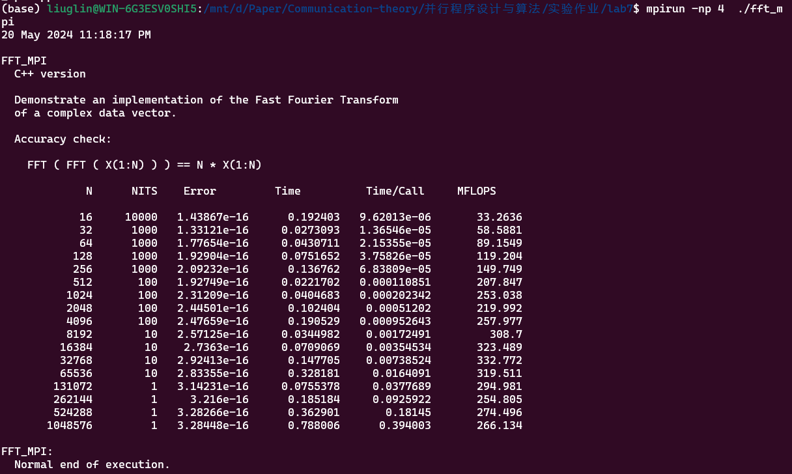
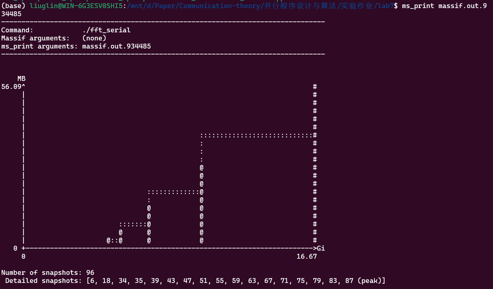
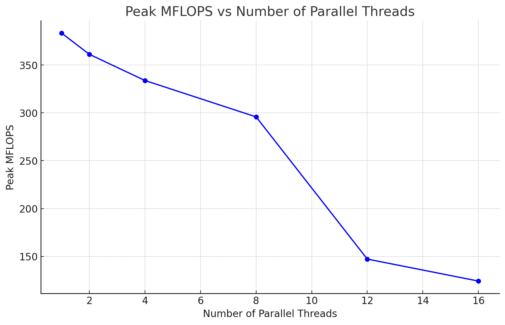
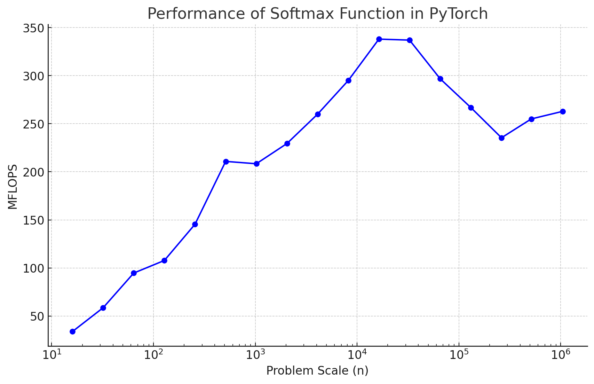

## 第七次实验 MPI并行应用

|   学号   |  姓名  |
| :------: | :----: |
| 20319045 | 刘冠麟 |

### 实验任务

使用MPI对快速傅里叶变换进行并行化

**问题描述：**阅读参考文献中的串行傅里叶变换代码(`fft_serial.cpp`、`fft_openmp`)，使用MPI对其进行并行化（可能需要对原代码进行调整）。

**要求：**

1. 并行化：使用MPI多进程对fft_serial.cpp进行并行化。为适应MPI的消息传递机制，可能需要对fft_serial代码进行一定调整。
2. 优化：使用MPI_Pack/MPI-Unpack或MPI_Type_create_struct对数据重组后进行消息传递。
3. 分析：
   - a) 改变并行规模（进程数）及问题规模（N），分析程序的并行性能；
   - b) 通过实验对比，分析数据打包对于并行程序性能的影响；
   - c) 使用Valgrind massif工具集采集并分析并行程序的内存消耗。注意Valgrind命令中增加--stacks=yes 参数采集程序运行栈内内存消耗。

### 实验过程与核心代码

##### 修改main函数

修改`fft_serial.cpp`，首先引入`mpi.h`，然后在`main`函数中进行mpi初始化：

```C++
	MPI_Init(NULL, NULL);
    MPI_Comm_rank(MPI_COMM_WORLD, &my_rank);
	MPI_Comm_size(MPI_COMM_WORLD, &comm_sz);
```

然后初始化数组和变量，为每个进程分配内存空间，准备并行计算所需的数据结构。

```c++
	PER_NUM = n / comm_sz;
    if (my_rank == 0)
    {
      w = new double[n];
      x = new double[2 * n];
      y = new double[2 * n];
      z = new double[2 * n];
      gather_a = new double[n];
      gather_b = new double[n];
      gather_c = new double[n];
      gather_d = new double[n];
      gather_w = new double[n];
      c_index = new int[n / 2];
      d_index = new int[n / 2];
    }
    local_a = new double[PER_NUM];
    local_b = new double[PER_NUM];
    local_c = new double[PER_NUM];
    local_d = new double[PER_NUM];
    local_w = new double[PER_NUM];
```


##### 修改step函数

对代码中的step函数进行以下修改：

- **对数据进行scatter**：在主进程（rank为0)中，将数据准备好后存储在`gather_a`、`gather_b`、`gather_w`中，并记录索引`c_index`和`d_index`。

  然后使用`MPI_Scatter`将数据分发给所有进程，包括`gather_a`、`gather_b`和`gather_w`。

- **并行计算**：每个进程接收分配给它的局部数据，每个进程在其局部数据上进行计算，生成局部结果`local_c`和`local_d`。

- **最后对数据进行收集**：使用`MPI_Gather`将每个进程的局部结果`local_c`和`local_d`收集到主进程的`gather_c`和`gather_d`中。主进程将收集到的结果合并到最终的`c`和`d`数组中，根据之前记录的索引`c_index`和`d_index`。

修改后的step函数如下：

```C++
void step(int n, int mj, double a[], double b[], double c[],
          double d[], double w[], double sgn)
{
  if (my_rank == 0)
  {
    int j;
    int ja;
    int jb;
    int jc;
    int jd;
    int jw;
    int k;
    int lj;
    int mj2;
    double wjw[2];

    mj2 = 2 * mj;
    lj = n / mj2;

    int cnt = 0;
    for (j = 0; j < lj; j++)
    {
      jw = j * mj;
      ja = jw;
      jb = ja;
      jc = j * mj2;
      jd = jc;

      wjw[0] = w[jw * 2 + 0];
      wjw[1] = w[jw * 2 + 1];

      if (sgn < 0.0)
      {
        wjw[1] = -wjw[1];
      }

      for (k = 0; k < mj; k++)
      {
        gather_a[cnt * 2 + 0] = a[(ja + k) * 2 + 0];
        gather_a[cnt * 2 + 1] = a[(ja + k) * 2 + 1];
        gather_b[cnt * 2 + 0] = b[(jb + k) * 2 + 0];
        gather_b[cnt * 2 + 1] = b[(jb + k) * 2 + 1];
        gather_w[cnt * 2 + 0] = wjw[0];
        gather_w[cnt * 2 + 1] = wjw[1];
        c_index[cnt] = jc + k;
        d_index[cnt] = jd + k;
        cnt++;
      }
    }
  }
  MPI_Scatter(gather_a, PER_NUM, MPI_DOUBLE, local_a, PER_NUM, MPI_DOUBLE, 0, MPI_COMM_WORLD);
  MPI_Scatter(gather_b, PER_NUM, MPI_DOUBLE, local_b, PER_NUM, MPI_DOUBLE, 0, MPI_COMM_WORLD);
  MPI_Scatter(gather_w, PER_NUM, MPI_DOUBLE, local_w, PER_NUM, MPI_DOUBLE, 0, MPI_COMM_WORLD);

  int num_units = PER_NUM / 2 ;
  for (int i = 0; i < num_units; i++)
  {
    local_c[i * 2 + 0] = local_a[i * 2 + 0] + local_b[i * 2 + 0];
    local_c[i * 2 + 1] = local_a[i * 2 + 1] + local_b[i * 2 + 1];
    double ambr = local_a[i * 2 + 0] - local_b[i * 2 + 0];
    double ambu = local_a[i * 2 + 1] - local_b[i * 2 + 1];
    local_d[i * 2 + 0] = local_w[i * 2 + 0] * ambr - local_w[i * 2 + 1] * ambu;
    local_d[i * 2 + 1] = local_w[i * 2 + 1] * ambr + local_w[i * 2 + 0] * ambu;
  }
  
  MPI_Gather(local_c, PER_NUM, MPI_DOUBLE, gather_c, PER_NUM, MPI_DOUBLE, 0, MPI_COMM_WORLD);
  MPI_Gather(local_d, PER_NUM, MPI_DOUBLE, gather_d, PER_NUM, MPI_DOUBLE, 0, MPI_COMM_WORLD);
  
  if (my_rank == 0)
  {
    for (int i = 0; i < n / 2; i++)
    {
      c[c_index[i] * 2 + 0] = gather_c[i * 2 + 0];
      c[c_index[i] * 2 + 1] = gather_c[i * 2 + 1];
      d[d_index[i] * 2 + 0] = gather_d[i * 2 + 0];
      d[d_index[i] * 2 + 1] = gather_d[i * 2 + 1];
    }
  }
  return;
}
```

最后在主函数`main`中执行 `MPI_Finalize();`

#### 优化

在 `step` 函数中，使用 `MPI_Pack` 和 `MPI_Unpack` 代码，用于将数据打包成一个单一的消息，然后使用 `MPI_Bcast` 广播打包的数据，以确保所有进程都能收到这些数据。

然后在解包数据之后进行计算，并再次打包结果数据。使用 `MPI_Gather` 收集各个进程打包的结果数据，并在根进程进行解包。

```C++
int position = 0;
  int buffer_size = 0;
  if (my_rank == 0) {
    int temp_size;
    MPI_Pack_size(PER_NUM * 2, MPI_DOUBLE, MPI_COMM_WORLD, &temp_size);
    buffer_size += temp_size; 
    MPI_Pack_size(PER_NUM * 2, MPI_DOUBLE, MPI_COMM_WORLD, &temp_size);
    buffer_size += temp_size; 
    MPI_Pack_size(PER_NUM * 2, MPI_DOUBLE, MPI_COMM_WORLD, &temp_size);
    buffer_size += temp_size; 
    MPI_Pack_size(PER_NUM, MPI_INT, MPI_COMM_WORLD, &temp_size);
    buffer_size += temp_size; 
    MPI_Pack_size(PER_NUM, MPI_INT, MPI_COMM_WORLD, &temp_size);
    buffer_size += temp_size; 
  }


  MPI_Bcast(&buffer_size, 1, MPI_INT, 0, MPI_COMM_WORLD);

  char *buffer = new char[buffer_size];
  if (my_rank == 0) {
    position = 0;
    MPI_Pack(gather_a, PER_NUM * 2, MPI_DOUBLE, buffer, buffer_size, &position, MPI_COMM_WORLD);
    MPI_Pack(gather_b, PER_NUM * 2, MPI_DOUBLE, buffer, buffer_size, &position, MPI_COMM_WORLD);
    MPI_Pack(gather_w, PER_NUM * 2, MPI_DOUBLE, buffer, buffer_size, &position, MPI_COMM_WORLD);
    MPI_Pack(c_index, PER_NUM, MPI_INT, buffer, buffer_size, &position, MPI_COMM_WORLD);
    MPI_Pack(d_index, PER_NUM, MPI_INT, buffer, buffer_size, &position, MPI_COMM_WORLD);
  }


  MPI_Bcast(buffer, buffer_size, MPI_PACKED, 0, MPI_COMM_WORLD);


  position = 0;
  MPI_Unpack(buffer, buffer_size, &position, local_a, PER_NUM * 2, MPI_DOUBLE, MPI_COMM_WORLD);
  MPI_Unpack(buffer, buffer_size, &position, local_b, PER_NUM * 2, MPI_DOUBLE, MPI_COMM_WORLD);
  MPI_Unpack(buffer, buffer_size, &position, local_w, PER_NUM * 2, MPI_DOUBLE, MPI_COMM_WORLD);
  MPI_Unpack(buffer, buffer_size, &position, c_index, PER_NUM, MPI_INT, MPI_COMM_WORLD);
  MPI_Unpack(buffer, buffer_size, &position, d_index, PER_NUM, MPI_INT, MPI_COMM_WORLD);

  delete[] buffer;

  int num_units = PER_NUM / 2;
  for (int i = 0; i < num_units; i++)
  {
    local_c[i * 2 + 0] = local_a[i * 2 + 0] + local_b[i * 2 + 0];
    local_c[i * 2 + 1] = local_a[i * 2 + 1] + local_b[i * 2 + 1];
    double ambr = local_a[i * 2 + 0] - local_b[i * 2 + 0];
    double ambu = local_a[i * 2 + 1] - local_b[i * 2 + 1];
    local_d[i * 2 + 0] = local_w[i * 2 + 0] * ambr - local_w[i * 2 + 1] * ambu;
    local_d[i * 2 + 1] = local_w[i * 2 + 1] * ambr + local_w[i * 2 + 0] * ambu;
  }


  buffer_size = 0;
  MPI_Pack_size(PER_NUM * 2, MPI_DOUBLE, MPI_COMM_WORLD, &buffer_size);
  buffer_size *= 2; 

  buffer = new char[buffer_size];
  position = 0;
  MPI_Pack(local_c, PER_NUM * 2, MPI_DOUBLE, buffer, buffer_size, &position, MPI_COMM_WORLD);
  MPI_Pack(local_d, PER_NUM * 2, MPI_DOUBLE, buffer, buffer_size, &position, MPI_COMM_WORLD);

 
  char *recv_buffer = nullptr;
  if (my_rank == 0) {
    recv_buffer = new char[buffer_size * comm_sz];
  }
  MPI_Gather(buffer, buffer_size, MPI_PACKED, recv_buffer, buffer_size, MPI_PACKED, 0, MPI_COMM_WORLD);

  delete[] buffer;


  if (my_rank == 0)
  {
    for (int i = 0; i < comm_sz; i++)
    {
      position = 0;
      MPI_Unpack(recv_buffer + i * buffer_size, buffer_size, &position, gather_c + i * PER_NUM * 2, PER_NUM * 2, MPI_DOUBLE, MPI_COMM_WORLD);
      MPI_Unpack(recv_buffer + i * buffer_size, buffer_size, &position, gather_d + i * PER_NUM * 2, PER_NUM * 2, MPI_DOUBLE, MPI_COMM_WORLD);
    }

    for (int i = 0; i < n / 2; i++)
    {
      c[c_index[i] * 2 + 0] = gather_c[i * 2 + 0];
      c[c_index[i] * 2 + 1] = gather_c[i * 2 + 1];
      d[d_index[i] * 2 + 0] = gather_d[i * 2 + 0];
      d[d_index[i] * 2 + 1] = gather_d[i * 2 + 1];
    }

    delete[] recv_buffer;
  }

```


### 编译运行

使用如下代码编译并运行

```shell
mpic++ -o fft_mpi fft_mpi.cpp
mpirun -np 4  ./fft_mpi
```

如果指定的进程数过多，数量超过了Open MPI在系统中分配的slots数目，会出现报错，这个时候调整运行指令，使用--oversubscribe 选项来告诉Open MPI允许进程数量超过可用的槽 位数。这样就可以让Open MPI忽略槽位数的限制：

```shell
mpirun --oversubscribe -np 8  ./fft_mpi
```

如果要采集程序运行栈内内存消耗，使用：

```shell
 mpirun -np 2 valgrind --tool=massif ./fft_mpi
```

运行结果如下所示：






### 结果

#### 改变并行规模

| 并行数 | 峰值MFLOPS |
| :----: | :--------: |
|   1    |  383.292   |
|   2    |  361.136   |
|   4    |  333.786   |
|   8    |  295.776   |
|   12   |  147.235   |
|   16   |  124.265   |

可以看到，随着并行数的逐渐增加，峰值MFLOPS一直呈下降趋势。



#### 改变问题规模

以并行数4为例，MFLOPS随着问题规模的增大的变化趋势如下：

| 问题规模 | MFLOPS  |
| :------: | :-----: |
|    16    | 33.7888 |
|    32    | 58.5253 |
|    64    | 94.6475 |
|   128    | 107.756 |
|   256    | 145.463 |
|   512    | 210.83  |
|   1024   | 208.371 |
|   2048   | 229.423 |
|   4096   | 259.98  |
|   8192   | 294.949 |
|  16384   | 338.037 |
|  32768   | 337.017 |
|  65536   | 296.758 |
|  131072  | 266.864 |
|  262144  | 235.407 |
|  514288  | 255.002 |
| 1048576  | 262.925 |

可以看到MFLOPS随着问题规模的增大的变化趋势为逐渐增大到峰值后又之间下降，最终在一个低于峰值的值之间波动。




### 分析

#### 改变并行规模

可以看到随着并行数的逐渐增加，峰值MFLOPS一直呈下降趋势。这是因为机器CPU的计算性能是固定的，即总量不变，随着并行数的增加，线程或进程之间的同步、通信和管理开销也会增加。而且也会带来负载不均衡、资源竞争和缓存失效等问题，所以随着线程数量增大性能会下降。

#### 改变问题规模

可以又结果可以看到随着问题规模的增加，MFLOPS随着问题规模的增大的变化趋势为逐渐增大到峰值后又之间下降，最终在一个低于峰值的值之间波动。在规模数较低时MFLOPS极差，这是因为刚开始时规模太小，小规模问题的计算量较低，CPU和GPU等计算资源的利用率不高，导致性能未能充分发挥。同时在处理小规模问题时，启动计算任务和调度线程所需的开销在总计算时间中占比相对较大，从而影响整体性能。

而随着规模的增大，MFLOPS到达峰值，说明规模最大性能也会增大，但是当规模过大时性能又会降低，这可能是因为在大规模问题中，并行化处理的开销（如线程同步、通信、负载均衡等）会显著增加。线程之间的通信和同步开销可能会抵消并行处理带来的性能提升。