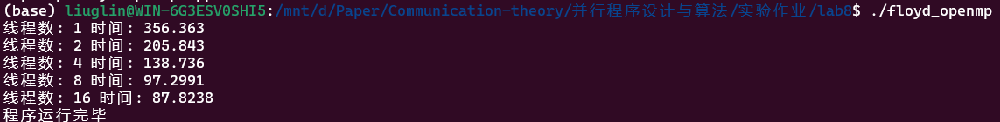
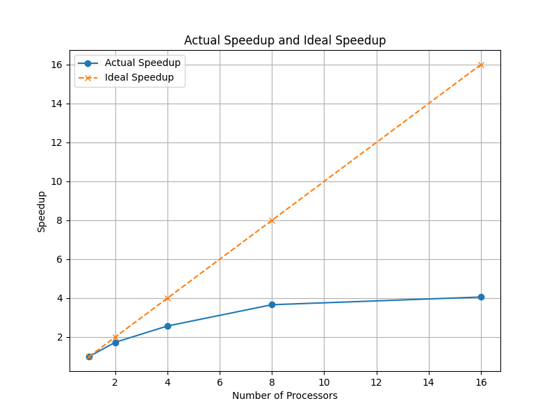
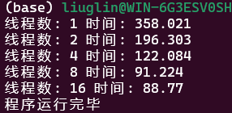
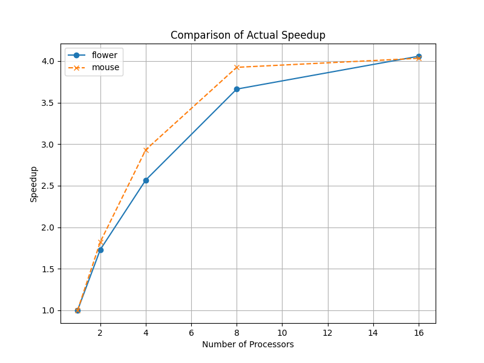
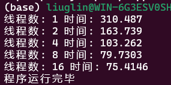
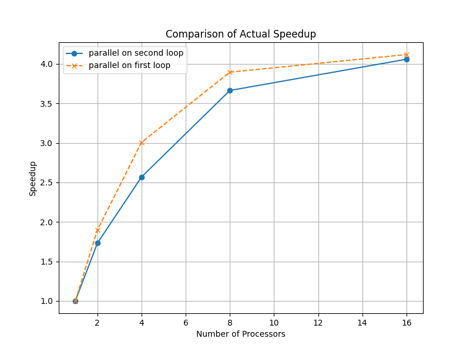

## 第八次实验 并行多源最短路径搜索

|   学号   |  姓名  |
| :------: | :----: |
| 20319045 | 刘冠麟 |

### 实验任务

使用任意并行框架实现多源最短路径搜索

**问题描述：**使用OpenMP/Pthreads/MPI中的一种实现无向图上的多源最短路径搜索，计算所有顶点对之间的最短路径距离，并通过实验分析在不同进程数量、数据下该实现的性能。

- **输入：**
  - 邻接表文件，其中每行包含两个整型（分别为两个邻接顶点的ID）及一个浮点型数据（顶点间的距离）。上图（a）中为一个邻接表的例子。注意在本次实验中忽略边的方向，都视为无向图处理；邻接表中没有的边，其距离视为无穷大。
  - 测试文件，共行，每行包含两个整型（分别为两个邻接顶点的ID)。
- **输出**：多源最短路径计算所消耗的时间；及个浮点数，每个浮点数为测试数据对应行的顶点对之间的最短距离。
- **要求：**使用OpenMP/Pthreads/MPI中的一种实现并行多源最短路径搜索，设置不同线程数量（1-16）通过实验分析程序的并行性能。讨论不同数据（节点数量，平均度数等)及并行方式对性能可能存在的影响。

### 实验过程与核心代码

#### 读取图数据并构造邻接矩阵

根据文件给出邻接图数据的格式写出读取数据的代码如下：

```C++
// 从CSV文件中读取图数据
void readData(vector<vector<double>>& graph) {
    ifstream csvData(fileName);
    if (!csvData) {
        cerr << "打开文件失败" << endl;
        exit(1);
    }

    string line;
    getline(csvData, line); // 跳过CSV文件的第一行

    // 读取每一行数据
    while (getline(csvData, line)) {
        istringstream sin(line);
        vector<string> tokens;
        string token;

        // 按照逗号分隔符解析每一行
        while (getline(sin, token, ',')) {
            tokens.push_back(token);
        }

        // 将解析后的数据存入图的邻接矩阵中
        int pointA = stoi(tokens[0]);
        int pointB = stoi(tokens[1]);
        double distance = stod(tokens[2]);

        graph[pointA][pointB] = distance;
        graph[pointB][pointA] = distance;
    }
}
```

通过读取文件中的每一行数据，将节点之间的边及其权重解析出来并存储到邻接矩阵中。解析完一行数据后提取 tokens向量中的元素，其中`tokens[0]` 和 `tokens[1]` 分别表示边的两个节点 `pointA` 和 `pointB`，用 `stoi` 函数转换为整数，`tokens[2]` 表示边的权重（距离），用 `stod` 函数转换为浮点数。

最后将解析得到的距离值存入邻接矩阵 `graph` 中。由于无向图的边是双向的，所以同时更新 `graph[pointA][pointB]` 和 `graph[pointB][pointA]`。

#### 使用openmp将floyd最短路径算法并行化

根据数据结构与算法上学过的知识写出floyd算法如下：

```C++
    for (int k = 0; k < SIZE; k++) {
        for (int i = 0; i < SIZE; i++) {
            for (int j = 0; j < SIZE; j++) {
                if (graph[i][k] != INF && graph[k][j] != INF && graph[i][k] + graph[k][j] < graph[i][j]) {
                    graph[i][j] = graph[i][k] + graph[k][j];
                    next[i][j] = next[i][k]; 
                }
            }
        }
    }
```

使用openmp对其进行并行化，即在第一个循环后加入`#pragma omp parallel`语句，并且传入并行的线程数，修改如下：

```C++
// Floyd算法并行实现
void floyd(vector<vector<double>>& graph, vector<vector<double>>& next, int threadNum) {
    for (int k = 0; k < SIZE; k++) {
        #pragma omp parallel for num_threads(threadNum)
        for (int i = 0; i < SIZE; i++) {
            for (int j = 0; j < SIZE; j++) {
                if (graph[i][k] != INF && graph[k][j] != INF && graph[i][k] + graph[k][j] < graph[i][j]) {
                    graph[i][j] = graph[i][k] + graph[k][j];
                    next[i][j] = k;
                }
            }
        }
    }
}
```

#### 输出

使用`while(getline(testData, line))`逐行读取数据集中的每一行并输出最短路径和距离如下：

```C++
// 输出最短路径距离和路径
string result = (graph[pointA][pointB] == INF) ? "INF" : to_string(graph[pointA][pointB]);
output << pointA << " " << pointB << " " << result << " ";

if (graph[pointA][pointB] != INF) {
    output << "Path: " << pointA << "->";
    int k = next[pointA][pointB];
    while (k != -1) {
        output << k << "->";
        k = next[k][pointB];
    }
    output << pointB << endl;
}
```

根据 `graph[pointA][pointB]` 的值判断最短路径距离是否为无穷大（即不存在路径）。如果是无穷大则将 `result` 设置为 "INF"；否则将其设置为对应的距离值。然后将起点、终点和最短路径距离输出到结果文件，如果存在路径，则从`pointA`出发通过不断从`next`矩阵中寻找下一个路径直到`pointB`，依次输出路径信息。

路径信息的格式如下：

```C++
Path: 起点->中继节点1->中继节点2->...->终点
```


#### 计时

在`main`中循环将1、2、4、8、16线程的并行计算时间全部计算一次并输出结果，因为使用openmp并行计算，`clock`在多线程下计算不准确，所以通过`omp_get_wtime()`获取时间：

```C++
// 读取数据
readData(graph);

// 执行floyd算法并输出运行时间
for (int i = 1; i <= 16; i *= 2) {
    double start = omp_get_wtime();
    floyd(graph, next, i);
    double end = omp_get_wtime();
    cout << "线程数: " << i << " 时间: " << end - start << endl;
}

// 输出结果
Output(graph, next);
```


### 编译运行

使用如下代码编译并运行

```shell
g++ -fopenmp -o floyd_openmp floyd_openmp.cpp
./floyd_openmp
```

代码中选择`updated_flower.csv`文件计算最短路径，也可以在代码中修改文件名称对`updated_mouse`进行测试。同时使用python脚本生成了由100行两个随机节点序号组成的测试文件`test_data.txt`，文件格式如下：

```
30 544
725 761
755 436
410 887
46 541
810 817
...
```

运行结果如下所示：



计算结果输出在`result.txt`中，包含了测试数据中每个节点对的路径以及最短距离：

```python
30 544 10.000000 Path: 30->912->905->583->554->525->544
725 761 7.000000 Path: 725->903->902->6->761
755 436 7.000000 Path: 755->907->438->409->436
410 887 7.000000 Path: 410->907->873->887
46 541 9.000000 Path: 46->912->905->583->554->525->541
810 817 3.000000 Path: 810->786->4->817
...
```


### 结果

#### 改变并行规模

| 并行数 | 运行时间 |
| :----: | :------: |
|   1    | 356.363  |
|   2    | 205.843  |
|   4    | 138.736  |
|   8    | 97.2991  |
|   16   | 87.8238  |


### 分析

#### 改变并行规模

计算结果加速比和并行效率如下：

| 并行数 | 运行时间 | 加速比 | 并行效率 |
| :----: | :------: | :----: | :------: |
|   1    | 356.363  | 1.0000 |  1.0000  |
|   2    | 205.843  | 1.7315 |  0.8657  |
|   4    | 138.736  | 2.5680 |  0.6420  |
|   8    | 97.2991  | 3.6625 |  0.4578  |
|   16   | 87.8238  | 4.0585 |  0.2537  |

实际加速比与理想加速比对比如下：



- 可以看到运行时间随着核数的增多而减小，也就是说随着核数的增多程序加速比得到提升。说明对程序并行化可以提升求解速率。

- 但是从实际加速比与理想加速比的对比以及并行效率来看，可以看到随着核数的增多并行效率也逐渐降低，实际加速比与理想加速比也差距更大，在16核的情况下加速比才勉强达到了4，而且从曲线趋势来看再增加并行数最多也只有4出头的加速比。

- 主要原因可能是程序的加速比受限于程序中无法并行化的部分，当并行数足够多时，串行的部分将会成为程序的瓶颈，即使增加并行数量，受制于串行部分的时间加速比也很难再提高；其次随着并行数量的增加，并行计算引入的额外开销包括通信、同步以及负载均衡等开销也会增大从而影响加速比。

  

#### 不同数据下的性能对比

使用`updated_mouse.csv`测试并行效率，这两个文件在相似边数的情况下（`updated_mouse.csv`为14692，`updated_flower.csv`为13522），`updated_mouse.csv`的节点数量更少（只有523，约为`updated_flower.csv`节点数量930的一半）而平均度数更高。

测试结果如下：



| 并行数 | 运行时间 |
| :----: | :------: |
|   1    | 358.021  |
|   2    | 196.303  |
|   4    | 122.084  |
|   8    |  91.224  |
|   16   |  88.77   |

计算结果加速比和并行效率如下：

| 并行数 | 运行时间 | 加速比 | 并行效率 |
| :----: | :------: | :----: | :------: |
|   1    | 358.021  | 1.0000 |  1.0000  |
|   2    | 196.303  | 1.8238 |  0.9119  |
|   4    | 122.084  | 2.9326 |  0.7331  |
|   8    |  91.224  | 3.9246 |  0.4906  |
|   16   |  88.770  | 4.0331 |  0.2521  |



可以看到，对于更少节点数量、节点平均度数更多的情况下，mouse数据在并行数量较低地情况下性能明显优于flower地数据，更快地达到了加速比瓶颈（4）。


#### 节点数量与平均度数带来的影响

**平均度数**

平均度数越高，节点之间的的平均连接数越多，连接也就越复杂，计算最短路径的复杂度也越高。对于高平均度数的图，计算量更大，节点更密集，并行化算法可以更有效地分配计算任务提高并行效率。相对于较低的平均度数的数据而言由于节点之间连结稀疏，计算数据量较少，可能导致并行化时每个线程的工作量不均衡，同时线程的创建销毁开销占比更大，从而减少并行效率。由两个数据的实验对比也可以看出来平均度数更高的数据能更好地利用线程并行能力。

**节点数量**

一般来说随着节点数量的增加，并行的效率会更高，因为节点数量越多，图的规模越大，计算最短路径的复杂度也越高。使得并行化算法在处理大规模图时能够有效分摊计算负载，从而减少单个处理器的工作量，提高整体计算效率。

这里对比中更少节点数量的``数据利用线程并行的能力更好，一方面是因为mouse数据的节点数量相对更多，另一方面其平均度数也远高于另一个数据，将节点数量更少带来的并行效率差距抵消了。同时由于实验使用的算法为Floyd算法，而且是在第二层循环中进行的并行化，算法并行中每个节点度数带来的影响更大一些。


#### 并行方式对性能可能存在的影响

更改并行方式，尝试在最外层循环中执行并行语句，即改为：

```C++
// Floyd算法并行实现
void floyd(vector<vector<double>>& graph, vector<vector<double>>& next, int threadNum) {
#pragma omp parallel for num_threads(threadNum)
	for (int k = 0; k < SIZE; k++) {
        for (int i = 0; i < SIZE; i++) {
            for (int j = 0; j < SIZE; j++) {
                if (graph[i][k] != INF && graph[k][j] != INF && graph[i][k] + graph[k][j] < graph[i][j]) {
                    graph[i][j] = graph[i][k] + graph[k][j];
                    next[i][j] = k;
                }
            }
        }
    }
}
```

测试结果如下：



| 并行数 | 运行时间 |
| :----: | :------: |
|   1    | 310.487  |
|   2    | 163.739  |
|   4    | 103.262  |
|   8    | 79.7303  |
|   16   | 75.4146  |

计算结果加速比和并行效率如下：

| 并行数 | 运行时间 | 加速比 | 并行效率 |
| :----: | :------: | :----: | :------: |
|   1    | 310.4870 | 1.0000 |  1.0000  |
|   2    | 163.7390 | 1.8962 |  0.9481  |
|   4    | 103.2620 | 3.0067 |  0.7516  |
|   8    | 79.7303  | 3.8942 |  0.4867  |
|   16   | 75.4146  | 4.1170 |  0.2573  |

以`updated_flower.csv`为例，更改并行方式的对比如下：



可以看到与更改数据相似的结果，可以明显看到将并行代码改在第一个循环之中时在并行数量较低地情况下性能明显优于将并行代码放在第二个循环之上，更快地达到了加速比瓶颈（4），也即有更好的并行效率，能更好地利用和挖掘线程并行能力。这可能是因为外层循环中地迭代之间通常依赖最少，更适合进行并行计算。

