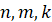
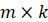
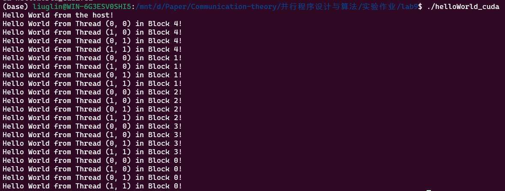
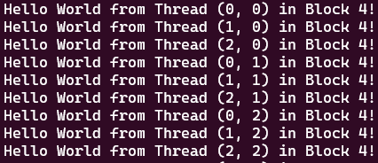
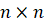
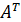
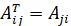
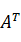
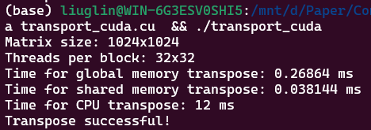

## 第九次实验 CUDA矩阵转置

|   学号   |  姓名  |
| :------: | :----: |
| 20319045 | 刘冠麟 |

### 实验一 CUDA Hello World

#### 问题描述

本实验为CUDA入门练习，由多个线程并行输出“Hello World！”。

**输入：**三个整数，其取值范围为[1,32]

**问题描述：**创建个线程块，每个线程块的维度为，每个线程均输出线程块编号、二维块内线程编号及Hello World！（如，“Hello World from Thread (1, 2) in Block 10!”）。主线程输出“Hello World from the host!”。

**要求：**完成上述内容，观察输出，并回答线程输出顺序是否有规律？

#### 实验过程与核心代码

##### **CUDA 内核函数**：

```cpp
__global__ void helloWorldKernel() {
    int blockId = blockIdx.x;
    int threadIdX = threadIdx.x;
    int threadIdY = threadIdx.y;
    
    printf("Hello World from Thread (%d, %d) in Block %d!\n", threadIdX, threadIdY, blockId);
}
```

创建CUDA内核函数，函数从CUDA的内置变量`blockIdx`获取当前线程所在的线程块的索引（块的索引），使用`threadIdx`获取当前线程在线程块中的索引（块中线程的索引）。

函数在每个线程上执行，并输出线程的ID和线程块的ID。

##### **主函数**：

```C++
cpp复制代码int main() {
    int n = 5; // 线程块数量
    int x = 2; // 线程块的x维度
    int y = 2; // 线程块的y维度

    dim3 threadsPerBlock(x, y); // 每个线程块内线程的二维维度
    dim3 blocksPerGrid(n);      // 线程块数量

    // 启动CUDA内核
    helloWorldKernel<<<blocksPerGrid, threadsPerBlock>>>();

    // 主线程输出
    std::cout << "Hello World from the host!" << std::endl;

    // 确保CUDA设备完成所有任务
    cudaDeviceSynchronize();

    return 0;
}
```

主函数设置线程块和线程的维度，并启动CUDA内核。同时在主线程中输出“Hello World from the host!”。在程序结束前调用`cudaDeviceSynchronize()`确保所有CUDA任务完成。

#### 编译运行

使用如下代码编译运行：

```shell
nvcc -o helloWorld_cuda helloWorld_cuda.cu
./helloWorld_cuda
```

#### 实验结果

实验结果如下所示：



在实验多次后，由于线程是按块分区执行的，可以看到：

- 块之间的输出并没有特定顺序，也就是说块并不是按id顺序或者按其他顺序执行的。
- 可以看到块之间线程的输出都是连续的，也就是说同一时间内只能执行一个块的线程，当一个块中的所有线程都执行完毕后才能执行下一个块。

而块内线程的输出则是有一定规律：

- 增加块内维度：

  

  可以看到线程的输出顺序是先 `threadIdx.x、。` 再 `threadIdx.y`，也就是说块内线程的输出顺序是按照列优先的顺序按照id来执行的，先输出列再输出行。每个 `threadIdx.y` 的所有 `threadIdx.x` 线程会先输出，然后再输出下一个 `threadIdx.y` 的所有 `threadIdx.x` 线程。


### 实验二  CUDA矩阵转置

使用CUDA对矩阵进行并行转置。

**输入：**整数，其取值范围均为[512, 2048]

**问题描述：**随机生成的矩阵，对其进行转置得到。转置矩阵中第行列上的元素为原矩阵中$j$行$i$列元素，即。

**输出**：矩阵及其转置矩阵，及计算所消耗的时间。

**要求：**使用CUDA实现并行矩阵转置，分析不同线程块大小，矩阵规模，访存方式（全局内存访问，共享内存访问），任务/数据划分和映射方式，对程序性能的影响。

#### 实验过程与核心代码

##### 全局内存的矩阵转置

```C++
__global__ void transposeGlobalMemory(float* A, float* A_T, int n) {
    // 计算当前线程在全局矩阵中的位置
    int x = blockIdx.x * blockDim.x + threadIdx.x;
    int y = blockIdx.y * blockDim.y + threadIdx.y;

    // 检查索引是否在矩阵范围内
    if (x < n && y < n) {
        // 将A中的元素转置后存储到A_T中
        A_T[x * n + y] = A[y * n + x];	// 采取列优先索引
    }
}
```

全局内存版本的矩阵转置较为简单直接，由于CUDA并行程序将矩阵分为了多个线程块，只需在指定线程块的维度后（每个块的线程数量）计算当前函数线程下要计算的x方向和y方向上的偏移量即可。

##### 共享内存的矩阵转置

首先使用`__shared__`定义共享内存，创建共享内存矩阵tile：

```C++
    const int block_size = 32;
	// 定义共享内存
    __shared__ float tile[block_size][block_size + 1]; // 附加一列避免内存体冲突
```

这里为了避免从共享内存拷贝至全局内存中产生的内存体冲突，给共享内存矩阵tile多分配了一列空白数据。如果不分配空白数据的话，经测试会**使计算时长增加20%以上**。

然后使用块索引和线程索引计算当前线程要进行映射的全局矩阵索引，再检查是否在矩阵范围内后映射到共享内存矩阵中：

```C++
    // 计算全局索引
    int x = blockIdx.x * block_size + threadIdx.x;
    int y = blockIdx.y * block_size + threadIdx.y;

    // 检查索引是否在矩阵范围内
    if (x < n && y < n) {
        tile[threadIdx.y][threadIdx.x] = A[y * n + x];  // 采取列优先索引
    }
```

然后使用`__syncthreads()`同步线程，确保在一个块内的所有线程的共享内存填充完成之前都不会继续执行下一步操作：

```C++
// 同步线程，确保共享内存填充完毕
__syncthreads();
```

在之前的全局内存读取以及常规的并行矩阵翻转操作中，是直接读取一个位置的数据并写入转置后的位置，这样会导致内存访问会变得不连续，使得全局内存访问效率低下。

为了利用共享内存的优势，尝试一个块内的所有线程一次性读取对应一个块的数据，在保证数据连续访问的情况下将数据块加载到共享内存中，使得线程块内的所有线程可以快速访问数据。经测试，块翻转+块内转置的共享内存方式比直接翻转读取的共享内存方式速度快**50%**。

也就是一次性只读一个块，在翻转矩阵的操作中在翻转块的同时，也要进行块内转置：

```C++
	// 整个块在矩阵中位置翻转
    x = blockIdx.y * 32 + threadIdx.x;
    y = blockIdx.x * 32 + threadIdx.y; // 此时A_T[x * n + y]就是转置块的位置

    // 检查索引是否在矩阵范围内
    if (x < n && y < n) {
        A_T[y * n + x] = tile[threadIdx.x][threadIdx.y];	//块内转置
    }
}
```

##### 调用线程函数并计时

分配块内的线程数量和矩阵规模：

```C++
    int n = 1024; // 矩阵规模
    int threads = 32;
    
    // 配置线程块和网格维度
    dim3 threadsPerBlock(threads, threads);
    dim3 blocksPerGrid((n + 1) / threads, (n + 1) / threads);
```

然后启动CUDA内核：

```C++
 	// 启动CUDA内核
    cudaEvent_t start, stop;
    float elapsedTime;

    cudaEventCreate(&start);
    cudaEventCreate(&stop);
```

计时部分使用了CUDA进行计时的API`cudaEventRecord`以及`cudaEventElapsedTime`，最后分别执行全局内存以及共享内存版本的线程函数：

```C++
	// 全局内存版本
    cudaEventRecord(start, 0);
    transposeGlobalMemory<<<blocksPerGrid, threadsPerBlock>>>(d_A, d_A_T, n);
    cudaEventRecord(stop, 0);
    cudaEventSynchronize(stop);
    cudaEventElapsedTime(&elapsedTime, start, stop);
    std::cout << "Time for global memory transpose: " << elapsedTime << " ms" << std::endl;

    // 共享内存版本
    cudaEventRecord(start, 0);
    transposeSharedMemory<<<blocksPerGrid, threadsPerBlock>>>(d_A, d_A_T_shared, n);
    cudaEventRecord(stop, 0);
    cudaEventSynchronize(stop);
    cudaEventElapsedTime(&elapsedTime, start, stop);
    std::cout << "Time for shared memory transpose: " << elapsedTime << " ms" << std::endl;
```

最后将结果从显存中复制回host：

```C++
    cudaMemcpy(h_A_T, d_A_T, bytes, cudaMemcpyDeviceToHost);
    cudaMemcpy(h_A_T_shared, d_A_T_shared, bytes, cudaMemcpyDeviceToHost);
```

同时使用串行版本的函数计算一次矩阵转置的结果，用于检查计算结果是否正确，当两种方式都正确时才输出转置成功：

```C++
    // CPU版本转置
    float* h_A_T_CPU = (float*)malloc(bytes);
    transposeCPU(h_A, h_A_T_CPU, n);

    // 检查结果是否正确
    bool correct = true;
    for (int i = 0; i < n * n; i++) {
        if (fabs(h_A_T[i] - h_A_T_CPU[i]) > 1e-5 || fabs(h_A_T_shared[i] - h_A_T_CPU[i]) > 1e-5) {
            correct = false;
            break;
        }
    }
```

#### 编译运行

使用如下代码编译运行：

```shell
 nvcc -o transport_cuda transport_cuda.cu
 ./transport_cuda
```

运行后在命令行输出如下结果：



#### 结果分析

##### 不同线程块

使用矩阵大小为`(2048, 2048)`，分别讨论不同大小线程块对程序性能的影响。

虽然线程块宽度为16的倍数，但是`8x8`也能正常计算并且输出正确结果。其他块维度会显示计算错误，超过`64x64`维度的块会显示Error表示使用过多的共享数据。

| 线程块 | 全局内存方式  | 共享内存方式  |
| :----: | :-----------: | :-----------: |
|  8x8   | **0.2681** ms |   0.1249 ms   |
| 16x16  |   0.3210 ms   | **0.1182** ms |
| 32x32  |   0.5383 ms   |   0.1384 ms   |

- 可以看到，在全局内存方式中随着线程块维度的增加，会导致计算时间增大，所以对于全局内存方式的CUDA并行存储来说一般选择较小的块会更好。
- 不同的是在共享内存方式中线程块对效率的影响较小，基本变化不大，并且没有明显规律。但是线程块维度为`16x16`时表现最好，猜测可能是由于刚好使用了一个线程块基块的原因；而`8x8`表现较差可能是选择的块size过小（不足以填满最小`16x16`的线程块，导致有多的空间浪费了），导致计算次数增多。

##### 不同矩阵规模

使用块大小为`(16, 16)`，分别讨论不同大小矩阵规模对程序性能的影响。

(**由于进行计算的设备不同，CPU串行的数据不与GPU的计算时间直接比较，只用于衡量改变条件造成时间变化的baseline**)

| 矩阵规模 \ 时间 | 全局内存方式 |  共享内存方式  | CPU串行 |
| :-------------: | :----------: | :------------: | :-----: |
|     512x512     |  0.1981 ms   | **0.0206** ms  |  2 ms   |
|    1024x1024    |  0.2035 ms   | **0.03482** ms |  12 ms  |
|    2048x2048    |  0.3210 ms   | **0.1182** ms  |  56 ms  |


| 矩阵规模 \ 时间倍数 | 全局内存方式 | 共享内存方式 | CPU串行 |
| :-----------------: | :----------: | :----------: | :-----: |
|       512x512       |      1       |      1       |    1    |
|      1024x1024      |  **1.027**   |     1.69     |    6    |
|      2048x2048      |   **1.62**   |     4.55     |   23    |

- 随着矩阵规模的增大，计算量肯定会增多，可以看到全局内存方式和共享内存方式的计算时间都随着矩阵规模的增大而增大。
- 但是增大的倍数有所差异，矩阵规模从`512x512`到`2048x2048`，CPU串行时间增加了23倍，但是共享内存只增加了4.55倍，而全局内存的存储方式更是只增加了**1.62**倍.
- 由此不仅说明使用CUDA并行计算能够在矩阵规模增大带来计算量激增的情况下可以保证较小的计算时间增加，而且表明全局内存方式比共享内存对矩阵规模**更具有不敏感性**。
- 因此全局内存方式的并行计算可能更适合大矩阵的计算任务，而共享内存方式更适合较小规模矩阵的计算。（实验证明，

##### 访存方式

由上面的实验可以知道：

- 在小矩阵的情况下，共享内存方式的性能都明显优于全局内存方式。

- 但是由于全局内存方式对矩阵规模更具有不敏感性，当矩阵规模增大时，全局内存方式的并行计算可能更适合。

- 实验表明，当矩阵规模达到`8096x8096`时，全局内存方式与共享内存方式的计算时间达到持平，当矩阵规模再往上增加时，全局内存方式的计算性能实现了反超：

  | 矩阵规模 \ 时间倍数 |  全局内存方式  | 共享内存方式  |
  | :-----------------: | :------------: | :-----------: |
  |      8096x8096      |   3.2178 ms    | **3.1268** ms |
  |     16192x16192     | **12.8576** ms |  13.1871 ms   |

##### 任务/数据划分和映射方式

这一环节以共享内存方式为例进行讨论。

##### 不对共享内存分配空白数据

为了避免拷贝过程中产生的内存体冲突，需要给共享内存矩阵tile多分配了一列空白数据，如果在代码中将多分配的这一列去掉，会导致从共享内存拷贝至全局内存的存储体冲突：

```C++
    // 分配空白列
    __shared__ float tile[block_size][block_size+1]; 
    // 不分配空白列
    __shared__ float tile[block_size][block_size]; 
```

测试表明，如果不解决内存体冲突，会导致一定程度性能损耗，使任务时长增加五倍以上：

| 共享内存划分方式 | 全局内存方式 |
| :--------------: | :----------: |
|   不分配空白列   |   0.1528ms   |
|    分配空白列    |  0.1189 ms   |


##### 数据划分

共享内存的主要优势是其高带宽和低延迟。通过将数据块加载到共享内存中，线程块内的所有线程可以快速访问数据。

上述实验中的共享内存方式都是在CUDA矩阵转置过程中翻转两次（块位置和块内部）实现的，目的是为了确保每个线程块都处理一个小的子矩阵，这样可以利用共享内存的高带宽，如果直接读取一个位置的数据并写入转置后的位置，内存访问会变得不连续，这会导致全局内存访问效率低下，无法充分利用共享内存的优势。

实验证明，在共享内存中采用块位置+块内部转置的方式实现的映射方式能比和全局内存一样直接映射，增加50%以上的运行效率：

|  数据划分方式   | 全局内存方式 |
| :-------------: | :----------: |
|    直接映射     |  0.1761 ms   |
| 块转置+块内转置 |  0.1189 ms   |

#### 

##### 存取共享内存方式

在实验一中证明了块内线程的读取顺序是按照列优先的顺序来执行的，如果存取共享内存时应该采取与线程读取顺序一致的读取方式，保证内存和线程访问顺序的一致性，可以拥有更快的存取效率。

实验证明，使用与线程读取顺序一致的列优先存取，可以比使用行优先的读取方式**使效率提高一倍多**。

更改代码存取共享内存时的顺序，采用行优先：

```C++
__global__ void transposeSharedMemory(float* A, float* A_T, int n) {
    const int block_size = 16;
    // 定义共享内存
    __shared__ float tile[block_size][block_size+1]; 

    // 计算全局索引
    int x = blockIdx.x * block_size + threadIdx.x;
    int y = blockIdx.y * block_size + threadIdx.y;

    // 检查索引是否在矩阵范围内
    if (x < n && y < n) {
        tile[threadIdx.x][threadIdx.y] = A[x * n + y];	// 采取行优先索引
    }

    // 同步线程，确保共享内存填充完毕
    __syncthreads();

    // 计算新的全局索引
    x = blockIdx.y * block_size + threadIdx.x;
    y = blockIdx.x * block_size + threadIdx.y;
    
    // 检查索引是否在矩阵范围内
    if (x < n && y < n) {
        A_T[x * n + y] = tile[threadIdx.y][threadIdx.x];  // 采取行优先索引
    }
}
```

实验结果如下：

| 数据划分方式 | 全局内存方式 |
| :----------: | :----------: |
|  行优先索引  |  0.2402 ms   |
|  列优先索引  |  0.1189 ms   |