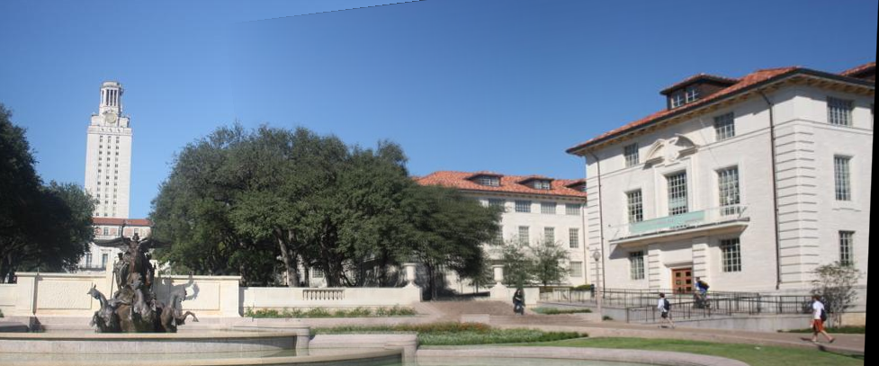

## 模式识别作业一

|   学号   |  姓名  |
| :------: | :----: |
| 20319045 | 刘冠麟 |

### 实验目的

1. 熟悉 Harris 角点检测器的原理和基本使用
2. 熟悉 RANSAC 抽样一致方法的使用场景
3. 熟悉 HOG 描述子的基本原理

### 实验要求

1. 提交实验报告，要求有适当步骤说明和结果分析，对比
2. 将代码和结果打包提交
3. 实验可以使用现有的特征描述子实现

### 实验内容

1. 使用 Harris 焦点检测器寻找关键点。
2. 构建描述算子来描述图中的每个关键点，比较两幅图像的两组描述子，并进行匹配。
3. 根据一组匹配关键点，使用 RANSAC 进行仿射变换矩阵的计算。
4. 将第二幅图变换过来并覆盖在第一幅图上，拼接形成一个全景图像。
5. 实现不同的描述子，并得到不同的拼接结果。

### 实验过程

### Harris角点算法

#### 算法原理

Harris角点检测算法基本思想是使用一个固定窗口在图像上进行任意方向上的滑动，比较滑动前与滑动后两种情况窗口中的像素灰度变化程度，如果存在任意方向上的滑动，都有着较大灰度变化，那么我们可以认为该窗口中存在角点。

根据Harris的算法基本思想可以直接得到其数学描述：
$$
E(u,v) = \sum_{x,y} w(x,y) [I(x+u,y+v)-I(x,y)]^2
$$
其中$E(u,v)$为能量函数，u v体现窗口的移动；$w(x,y)$为每个像素值上的权重，体现对整体的贡献度，一般选用高斯滤波核。$I(x+u,y+v)-I(x,y)$为角点移动前后的灰度差。

对$I(x+u,y+v)$进行泰勒展开，可以得到
$$
I(x+u,y+v) = I(x,y) +uI_x + vI_y
$$
其中$I_x,I_y$为在x,y处像素点在x和y方向上的梯度。

带入$E(u,v)$中可以得到：
$$
E(u,v) = \sum_{x,y} w(x,y) (uI_x + vI_y)^2\\=w(x,y)\sum_{x,y}  (u^2I_x^2 + uvI_xI_y + v^2I_y^2)
$$
写成矩阵形式：
$$
E(u,v)=[u, v] \cdot w(x, y)\sum_{x, y} \begin{bmatrix} I_x^2 & I_x I_y \\ I_x I_y & I_y^2 \end{bmatrix} \cdot \begin{bmatrix} u \\ v \end{bmatrix}
$$
令
$$
M=w(x, y)\sum_{x, y} \begin{bmatrix} I_x^2 & I_x I_y \\ I_x I_y & I_y^2 \end{bmatrix}
$$
可以得到：
$$
\\A=w(x, y)\sum_{x,y}I_x^2,\\B=w(x, y)\sum_{x,y}I_xI_y,\\C=w(x, y)\sum_{x,y}I_y^2
$$
可以通过计算矩阵$M$的行列式以及迹来计算响应函数$R$
$$
\text{det}M=AC-B^2\\
\text{trace}M=A+C\\
R=\text{det}M-k(\text{trace}M)^2
$$
其中k为常数。对于所有像素点的角点响应函数在局部邻域内选取具有最大角点响应值的像素作为候选角点。

最后再对候选角点进行阈值化筛选，即可得到图像的角点。

#### 算法实现

对应算法原理中的步骤，可以用python配合opencv库实现对应算法：

首先对图像进行灰度处理：

```python
# 灰度化图像
gray = cv2.cvtColor(image, cv2.COLOR_BGR2GRAY)
gray = np.float32(gray)
```

然后计算$I_x，I_y$：

```python
# 计算x和y方向的梯度
grad_x = cv2.Sobel(gray, cv2.CV_64F, 1, 0, ksize=ksize)
grad_y = cv2.Sobel(gray, cv2.CV_64F, 0, 1, ksize=ksize)
```

由原理中的公式，可以直接通过$I_x,I_y$计算得到计算R所需的$A,B,C$。

其中权重$w(x,y)$在本次实验中选择用高斯滤波器实现：

```python
# 计算梯度的乘积和平方
Ixx = grad_x ** 2
Ixy = grad_x * grad_y
Iyy = grad_y ** 2

# 乘上权重
A = cv2.GaussianBlur(Ixx, (block_size, block_size), 0)
B = cv2.GaussianBlur(Ixy, (block_size, block_size), 0)
C = cv2.GaussianBlur(Iyy, (block_size, block_size), 0)
```

最后再利用得到的A、B、C计算矩阵M的行列式和迹，最终得到响应reponse

```python
# Harris角点响应
det = A * C - B ** 2
trace = A + C
response = det - k * trace ** 2
```

然后再对得到的候选角点进行阈值化，其中阈值由调用函数时传入参数所决定：

```python
# 阈值化
corners = response > threshold * response.max()
corners = np.array(corners, dtype=np.uint8)
```

将代码封装进函数`harris_corners`中，使用opencv库读取图像并应用函数进行角点检测，并保存。

```python
# 读取图像
image = cv2.imread('images/sudoku.png')

# 应用Harris角点检测
result_image = harris_corners(image, block_size=3, ksize=3, k=0.04, threshold=0.01)
# 显示结果
plt.imshow(cv2.cvtColor(result_image, cv2.COLOR_BGR2RGB))
plt.show()
# 保存结果
cv2.imwrite('results/sudoku_keypoints.jpg', result_image)
```

#### 实验结果

实验结果如下，图片保存在results/目录下，命名为 sudoku_keypoints.png。


### 关键点描述与匹配

使用实现的 Harris 角点检测算法提取` images/uttower1.jpg `和 `images/uttower2.jpg` 的关键点，并将提取的关键点检测结果保存到` results/`目录下，命名为 `uttower1_keypoints.jpg` 和 `uttower2_keypoints.jpg`:

结果如下：


#### 使用SIFT进行特征描述

##### SIFT算法思想

SIFT（尺度不变特征变换）是一种用于计算图像局部特征的算法。SIFT算法通过检测图像中的关键点，并为每个关键点计算描述其局部特征的向量，这些特征向量具有尺度不变性和旋转不变性。SIFT算法的主要步骤包括：

1. **尺度空间极值检测**：通过在图像的高斯金字塔上应用尺度空间拉普拉斯算子来实现在不同尺度和位置上检测图像中的极值点（关键点）。通过对图像进行高斯模糊处理并不断减小模糊程度，得到一系列尺度空间的图像。然后对每个像素点在尺度空间中的相邻像素进行比较，找到局部极值点，这些点被认为是图像中的关键点。
2. **关键点定位**：对于检测到的极值点通过在尺度空间和图像中的梯度信息计算其准确位置和尺度。
3. **方向分配**：通过在关键点周围的图像区域内计算梯度方向直方图来实现对每个关键点分配一个或多个主要方向。梯度方向直方图的峰值即为主要方向，可以通过插值来提高精度。
4. **描述子生成**：在每个关键点周围的图像区域内以关键点为中心，在确定的尺度和方向上构建一个局部块。然后在这个局部块中计算图像梯度的方向和幅度，并将其转换为一个局部特征向量
5. **描述子匹配**：使用描述子匹配算法（本实验中使用**最近邻算法knn**）来比较不同图像中的关键点描述子，并找到最佳匹配。一般通过计算描述子之间的距离（本实验中按照题目要求使用**欧氏距离**）来度量它们之间的相似性。

在本次实验中使用opencv库中关于SIFT的配套API来完成对于图像的SIFT特征描述。

##### SIFT处理步骤

首先创建SIFT特征描述子

```python
sift = cv2.SIFT_create()
```

然后使用SIFT特征描述子获取图像的关键点以及关键点对应特征

```python
keypoints1, descriptors1 = sift.detectAndCompute(image1, None)
keypoints2, descriptors2 = sift.detectAndCompute(image2, None)
```

然后使用暴力匹配器BFMatcher创建一个对象，并且按照题目要求指定度量特征的方式为欧几里得距离。然后使用knn最邻近算法计算得到针对每个查询描述符列表`descriptors1`中的每一个描述子的前k 个在`decriptors2`列表中描述子的最佳匹配：

```python
bf = cv2.BFMatcher(normType=cv2.NORM_L2)
# 使用knn临近匹配算法
matches = bf.knnMatch(descriptors1, descriptors2, k=2)
```

这里指定k=2，即返回与每个描述符`descriptors1[i]`在`decriptors2`列表中通过欧氏距离计算得到的前两个最佳匹配。

这里其实可以直接通过match函数进行匹配，但是通过knnmatch可以返回前两个最佳匹配，这样就可以通过比值测试，挑选出相对更为正确的匹配，比值测试的思想就是计算得出最佳匹配`m`和次佳匹配`n`，当最佳匹配的距离小于次佳匹配距离的某一比值时则说明最佳匹配是较为正确的匹配。

即如果没有相同特征的关键点，那么最佳的匹配点和其他匹配点拉不开差距，那么就说明要淘汰；反之说明最佳匹配点远比其他匹配点更符合，合理匹配的可能性更大。比值测试挑选出较好匹配的代码如下：

```python
# 应用比值测试
good_matches = []
for m, n in matches:
    if m.distance < 0.60 * n.distance:
        good_matches.append(m)
```

然后使用`cv2.drawMatches`函数绘制匹配结果

```python
image_matches = cv2.drawMatches(image1, keypoints1, image2, keypoints2, good_matches, None, flags=cv2.DrawMatchesFlags_NOT_DRAW_SINGLE_POINTS)
```

##### SIFT处理结果

匹配结果如下，匹配结果保存到 results/目录下，命名为 uttower_match_sift.png 。

不进行比值测试结果：


比值测试为比值`0.75`结果：


多次测试后发现比值为`0.6`时效果最好，结果如下：


#### 使用HOG进行特征描述

##### HOG算法思想

HOG，即方向梯度直方图。是一种用于表征图像局部梯度方向和梯度强度分布特性的描述符，通过计算图像局部区域内的梯度方向的分布来捕捉物体的形状和外观信息。HOG的主要结果下面几个步骤：

1. **预处理**：首先对图像由RGB通过如下公式转换为灰度图像
   $$
   Gray = 0.3R+0.59G+0.11B
   $$
   然后进行gamma矫正，对灰度直方图进行平衡：
   $$
   Y(x,y) = I(x,y)^\gamma
   $$

2. **梯度计算**：对预处理后的图像进行水平和垂直方向的梯度计算，梯度算子为：
   $$
   G_x(x,y) = I(x+1,y)-I(x-1,y)\\
   G_y(x,y) = I(x,y+1)-I(x,y-1)\\
   G(x,y) = \sqrt {G_x(x,y)^2 + G_y(x,y)^2}\\
   \theta(x,y) = \arctan(\frac{G_y(x,y)} {G_x(x,y)})
   $$

3. **划分图像成cells**：将图像分割成多个小的连接区域，即cells。每个cell包含若干像素。然后将若干单元组成更大的block。如图所示：

4. **计算方向梯度直方图**：在每个cell中计算梯度方向的直方图，直方图的每个bin对应一个梯度方向区间。bin的分配范围类似下图（示例，图源题目给出的参考网站）：

   

5. **计算特征**：统计每个cell的梯度直方图（不同梯度的个数），形成每个cell的descriptor，然后将每几个cell组成一个block（3*3），一个block内所有cell的特征**串联**起来得到该block的HOG特征descripitor

在本次实验中使用opencv库中关于HOG的配套API来完成对于图像的HOG特征描述。

##### HOG处理步骤

首先创建HOG特征描述子

```python
hog = cv2.HOGDescriptor()
```

与SIFT不同的是，**HOG只能描述给定区域或者图像的特征，无法像SIFT一样计算得出keypoints**，所以要通过第一问编写的Harris角点检测算法检测出来的角点作为keypoints：

```python
# 使用Harris角点检测算法提取关键点
keypoints1 = harris_corners(image1, block_size=3, ksize=3, k=0.04, threshold=0.01)
keypoints2 = harris_corners(image2, block_size=3, ksize=3, k=0.04, threshold=0.01)
```

`opencv`库中关于HOG的API`cv2.HOGDescriptor.compute`提供了`locations`参数，为int类型的坐标列表，可以指定在图像上计算HOG特征的确切位置。在本次实验中首先将keypoints转换成整数坐标对，然后将`keypoints`传入`locations`计算关键点周围的特征值：

```python
# 将坐标变为整数
locations1 = [(int(k.pt[0]), int(k.pt[1])) for k in keypoints1]
locations2 = [(int(k.pt[0]), int(k.pt[1])) for k in keypoints2]
# 对每个关键点周围的区域计算HOG描述子
descriptors1 = hog.compute(image1, locations=locations1)
descriptors2 = hog.compute(image2, locations=locations2)
```

由于HOG算法是将得到的所有特征**串联**起来，所以得到的是一个**一维向量**：


要令其能通过BFMatcher进行特征值的匹配计算，要对其reshape成`(num_keypoints, num_features)`的形状，如下：

```python
descriptors1 = descriptors1.reshape(len(keypoints1), -1)
descriptors2 = descriptors2.reshape(len(keypoints2), -1)
```


然后就得到了`keypoints1`，`descriptors1`， `keypoints2`，`descriptors2`，后面的匹配和绘制步骤和SIFT一致，不再赘述。

##### HOG处理结果

匹配结果如下，匹配结果保存到 results/目录下，uttower_match_hog.png。

不进行比值测试结果：


HOG计算得到的比值阈值较高，多次测试为`0.95`附近可以取得最优：


#### 使用RANSAC求解仿射变换矩阵

使用opencv库中的`findHomography`中指定参数method为cv2.RANSAC使用RANSAC求解得到仿射变换矩阵：

```python
# 使用RANSAC算法求解仿射变换矩阵
H, _ = cv2.findHomography(right_points, left_points, method=cv2.RANSAC, ransacReprojThreshold=5)
```

然后通过仿射变换矩阵对image2求出透视变化定点后进行透视变换，最后再对左右图像进行拼接。·`warp_corner`函数和`Seam_Left_Right`可详见代码的utils文件。

```python
# 求出右图像的透视变化顶点
warp_point = warp_corner(H, image2)
# 求出右图像的透视变化图像
imagewarp = cv2.warpPerspective(image2, H, (image1.shape[1] + image2.shape[1], image2.shape[0]))
# 对左右图像进行拼接
result = Seam_Left_Right(image1, imagewarp, H, warp_point, with_optim_mask=False)
```

将最后拼接的结果保存到 results/目录下， 命名为 uttower_stitching_sift.png uttower_stitching_hog.png。

##### SIFT拼接结果

SIFT拼接结果如下：


可以看到SIFT的拼接结果很好，**几乎完全重合**。

##### HOG拼接结果

HOG拼接结果如下：



对比发现可以看到**SIFT效果明显好于HOG**。

HOG中只对于树顶和左侧屋顶部分有较好匹配，而对于下面的水池部分由匹配图可以看到并没有识别出较好的匹配：


所以在图片的下侧即花坛部分有明显的重影。

##### SIFT与HOG在关键点匹配过程中的差异

在SIFT中通过尺度空间极值检测、差分高斯金字塔以及高斯拟合插值来获取关键点的精确定位，也就是说SIFT可以直接计算出关键点。

而SIFT不同的是，**HOG只能描述给定区域或者图像的特征，无法像SIFT一样计算得出keypoints**，所以要通过第一问编写的Harris角点检测算法检测出来的角点或者使用SIFT计算得到的keypoints来作为keypoints。

而在关键点的匹配过程中，通过实验发现通过HOG计算出来的两张图特征点描述子的区分最佳匹配和次佳匹配的阈值比SIFT要高不少，也就是说通过HOG计算的最佳匹配与其他匹配拉不开差距、好得不够明显。即HOG区分特征的能力较弱，实验结果也符合这一结论，可以看到HOG的匹配结果中无法对花坛部分的关键点进行识别和匹配，拼接结果也逊于SIFT。


#### 多图拼接

请将基于 SIFT + RANSAC 的拼接方法用到多张图像上，对 images/yosemite1.png, images/yosemite2.png, images/yosemite3.png,images/yosemite4.png 进行拼接。

对1图、2图拼一次，3图、4图拼一次，最后再将两张大图拼一次，得到最终的全景图如下，图片保存在results/目录下，命名为 yosemite_stitching.png。

**拼接图1**：


**拼接图2**：


**全景图**：


### 实验感想

我在本次实验中手写了Harris角点检测，深刻理解了角点在图像分析中的重要性。角点是图像中信息密集的关键区域，能够提供丰富的信息用于图像的理解和处理。与此同时我还熟悉了对图像进行SIFT和HOG对特征的提取方法以及关键点匹配，详细了解了SIFT算法和HOG算法的各个步骤，最后还实现了图像拼接。通过这次实验使我能够处理和匹配不同尺度和角度的图像，为我在计算机视觉领域的学习打下了坚实的基础，让我受益匪浅。