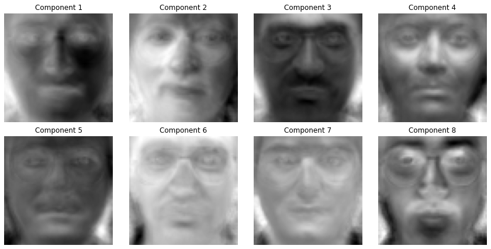
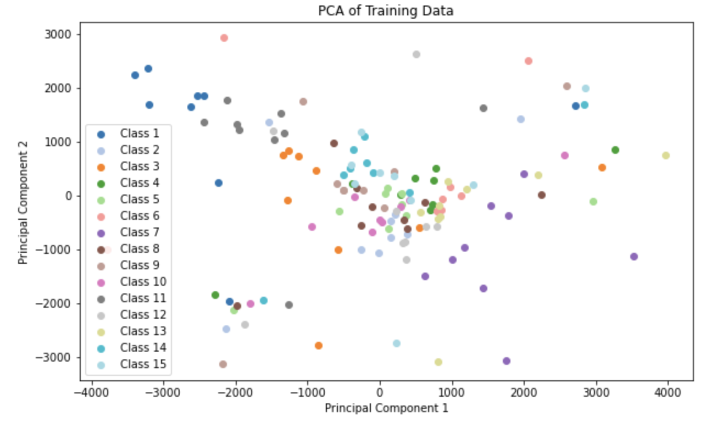
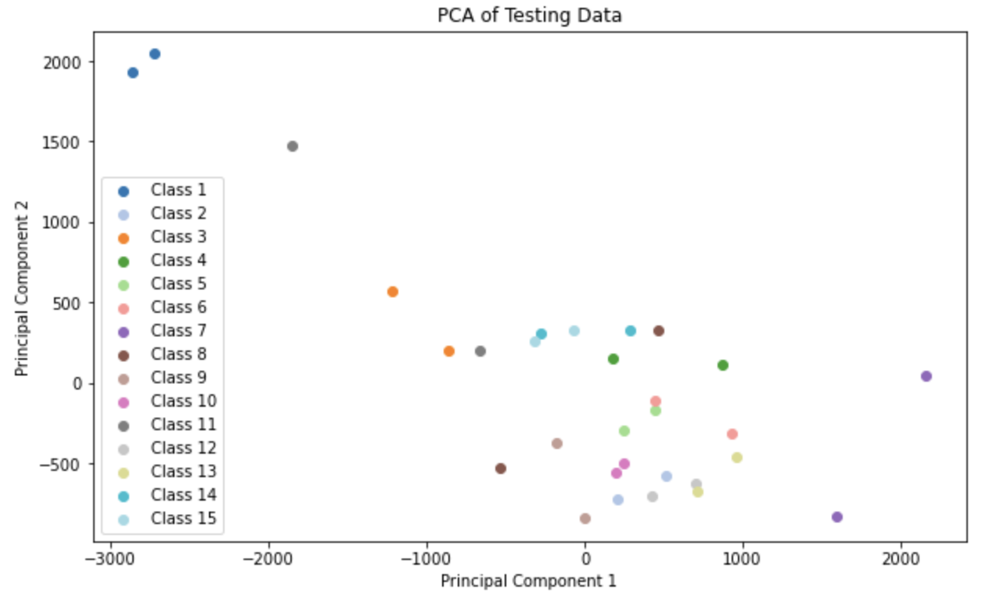
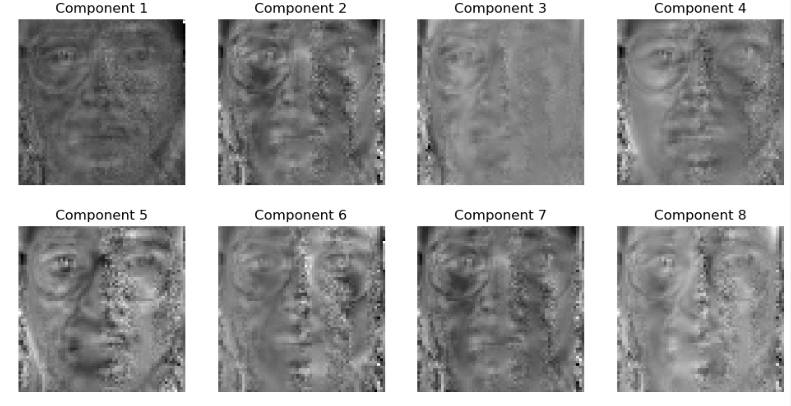
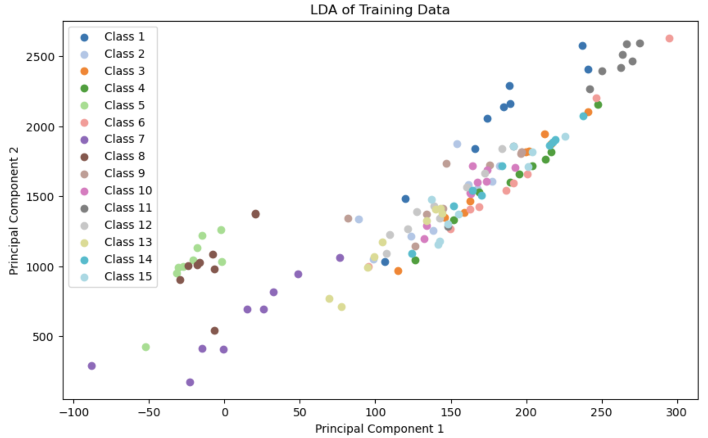
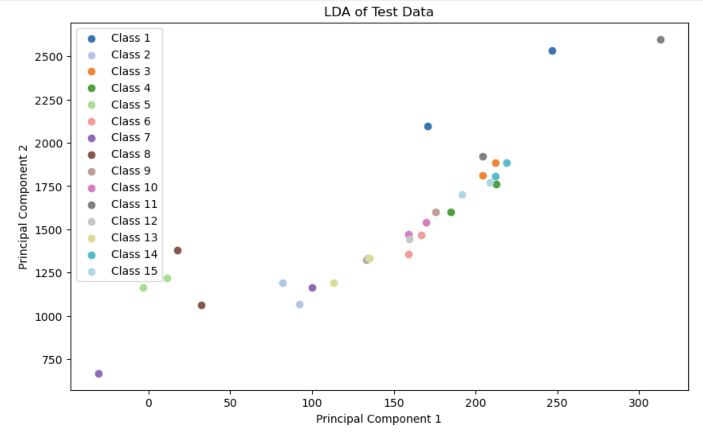
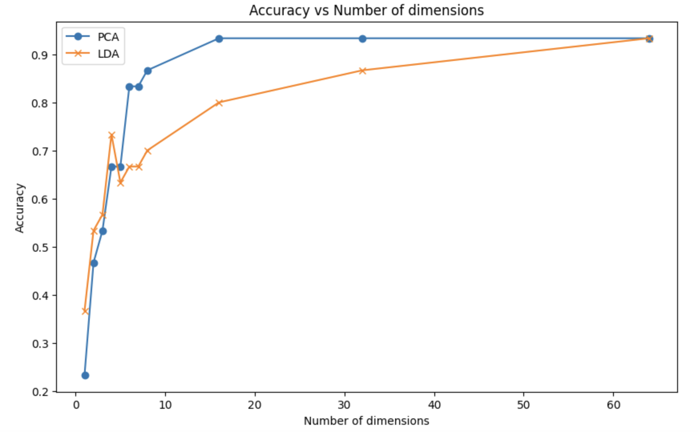
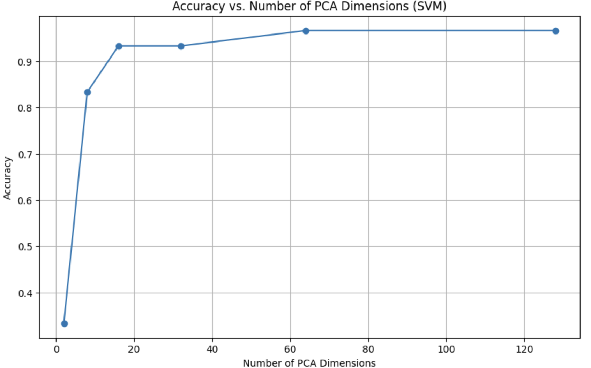
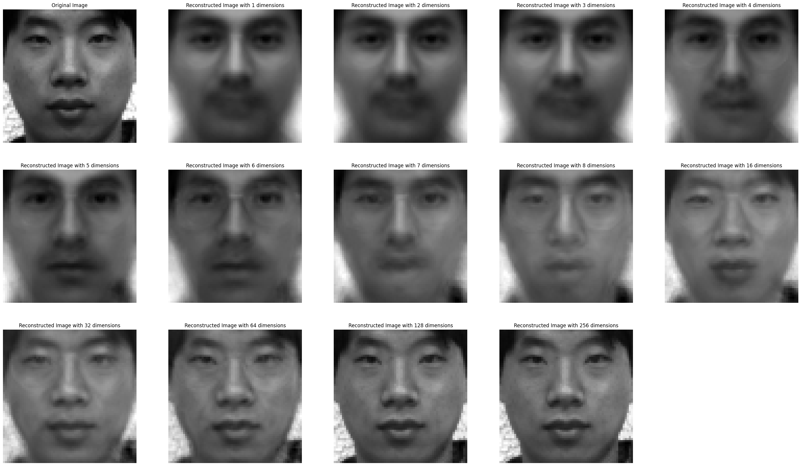

# 模式识别第二次作业

|   学号   |  姓名  |
| :------: | :----: |
| 20319045 | 刘冠麟 |

## 实验目的

1. 熟悉并掌握PCA、LDA的基本原理，并应用PCA和LDA实现数据降维 
2. 熟悉利用KNN分类器对样本进行分类


## 实验要求

1. 提交实验报告，要求有适当步骤说明和结果分析
2. 将代码和结果打包提交
3. 不能直接调用现有的库函数提供的PCA、LDA、KNN接口


## 实验内容

1. 自己实现PCA和LDA数据降维算法以及KNN分类器 
2. 利用实现的两种降维算法对数据进行降维
3. 利用降维后的结果，用KNN进行训练和测试


## 实验过程

### 一.实现 PCA 函数接口

#### 数据预处理

首先确认数据的输入shape为`(num_class, num_features)`，由于图像的尺寸为`64x64`，其共有`4096`个特征，为了使每个特征都具有相同的均值（为0），首先对其进行标准化，对每个样本减去样本的特征均值：
$$
X_{\text{meand}} = ={X - \mu}
$$
代码实现如下：

```python
  # 数据标准化
  X_std = (X - np.mean(X, axis=0)) / np.std(X, axis=0)
```

#### 计算协方差矩阵

对数据计算协方差矩阵：
$$
\Sigma = \frac{1}{n-1} X_{\text{meand}}^T X_{\text{meand}}
$$
代码实现如下，将之前求出的`X_std`转置后计算协方差：

```python
covariance_matrix = np.cov(X_std.T)
```

#### SVD分解

然后对协方差矩阵进行奇异值分解，将计算后的协方差矩阵`covariance_matrix`使用SVD 将其分解为三个矩阵的乘积：
$$
\text{covariance-matrix} = U \Sigma V^T
$$

- $U$ 为左奇异矩阵，列向量为左奇异向量。
- $\Sigma $对角线上的元素为奇异值，非对角线元素为零。PCA中将奇异值作为特征值，反映对应主成分的方差大小。
- $V^T$ 为正交矩阵，其行向量被称为右奇异向量，每一行代表一个特征向量。

这里调用`np`库中`linalg.svd`函数：

```python
U, S, Vt = np.linalg.svd(covariance_matrix)
```

返回得到的Vt就是特征向量矩阵，其shape为`(num_dim, num_features)`。

#### 得到特征值和特征向量

要计算出数据前n_components个奇异值和特征向量，只需对返回的`S`和`Vt`取前n_components个值即可：

```python
components = Vt[:n_components]
explained_variance = S[:n_components]
```

#### 数据降维

最后将将中心化后的数据与选择的主成分（特征向量）的转置相乘，从而得到降维后的数据，将原始数据投影到新空间中：
$$
X_{\text{n-components}} = X_{\text{meand}} W^T
$$


```python
X_pca = np.dot(X_meaned, components.T)
```

对于训练集数据，其shape为`(num_sampler, num_features)`，`components.shape`为`(n_components, num_features)`，转置后相乘得到降维后的数据投影，其shape为`(num_sampler, n_components)`。由此将数据降维成特定维度。


### 二、实现 LDA 函数接口

首先获取类别数并计算全局均值以供后续使用，同时对$S_W$和$S_B$进行初始化

```python
  # 获取类别
  class_labels = np.unique(y)
  # 计算总体均值
  mean_overall = np.mean(X, axis=0)

  # 初始化类内散度矩阵和类间散度矩阵
  S_W = np.zeros((X.shape[1], X.shape[1]))
  S_B = np.zeros((X.shape[1], X.shape[1]))
```

#### 计算类内散度矩阵和类间散度矩阵

然后按照获取的类别数，对数据中的每一个类别，求出并不断更新类内散度矩阵和类间散度矩阵。

##### 类内散度矩阵

类内散度矩阵衡量同一类别样本的散布情况。首先计算出类别数，对每个类别 $c$其均值向量$ \mu_c$。
$$
\mu_c = \frac{1}{n_c} \sum_{x_i \in X_c} x_i
$$
对于每一个类别，计算出类别$c$的散度矩阵
$$
S_c = \sum_{x_i \in X_c} (x_i - \mu_c)(x_i - \mu_c)^T
$$
然后不断更新类内散度矩阵，对类别的散度矩阵求和得到$S_W$
$$
S_W = \sum_{c=1}^{C} S_c
$$

##### 类间散度矩阵

类间散度矩阵衡量不同类别之间均值向量的散布情况。

对于每一个类别，求出该类别的样本数量，然后计算总的类间散度矩阵：
$$
S_B = \sum_{c=1}^{C} n_c (\mu_c - \mu)(\mu_c - \mu)^T
$$
代码实现如下：

```python
  for c in class_labels:
      # 获取属于当前类别的样本
      X_c = X[y == c]
      # 计算当前类别的均值向量
      mean_c = np.mean(X_c, axis=0)
      # 计算类内散度矩阵
      S_W += np.dot((X_c - mean_c).T, (X_c - mean_c))
      # 计算类间散度矩阵
      n_c = X_c.shape[0]
      mean_diff = (mean_c - mean_overall).reshape(-1, 1)
      S_B += n_c * np.dot(mean_diff, mean_diff.T)
```

 

#### 求解特征值

此时已经得到类内散度矩阵$S_W$和类间散度矩阵$S_B$通，此时可以通过求解：
$$
S_B v = \lambda S_W v
$$
得到特征向量，稍加变换后可以得到：
$$
S_W^{-1} S_B v = \lambda v
$$
此时可以得到特征向量$v$和特征值$\lambda$。代码如下：

```python
    # 计算 S_W^-1 * S_B
    A = np.linalg.pinv(S_W).dot(S_B)

    # 对矩阵 A 进行特征值分解
    eigenvalues, eigenvectors = np.linalg.eigh(A)
```

注意这里要使用`pinv`对矩阵$S_W$求出伪逆，直接用`inv`对$S_W$求逆会得到错误的结果，对前8维进行可视化得到的图像全部是马赛克（我在这里卡了很久）。

同时进行特征值分解时可以使用`eigh`，得到的求解质量更高。

最后根据特征值进行排序后得到的特征向量就是前k个最佳投影方向，由此构成投影矩阵

```python
  # 按特征值从大到小排序
  sorted_indices = np.argsort(eigenvalues)[::-1]
  eigenvalues = eigenvalues[sorted_indices]
  eigenvectors = eigenvectors[:, sorted_indices]

  # 选择前 n_components 个特征向量
	components = eigenvectors[:, :n_components]
```

#### 将数据投影到新的子空间

同PCA将原始数据$X$投影到新的子空间，由于计算方式的差异，lda中输出的特征向量矩阵维度为`(num_originalFeatures, n_components)`，所以直接与原数据矩阵相乘即可：

$$
X' = X W
$$

```python
  # 将数据投影到新空间
  X_lda = np.dot(X, components)
```


### 三、利用数据降维算法对输入数据进行降维

 读取 yale face 数据集 Yale_64x64.mat，将数据集划分为训练和测试集，只用训练集数据来学习 PCA 和 LDA 算法中的投影矩阵，并分别将两个方法相应的前 8 个特征向量变换回原来图像的大小进行显示，然后对训练和测试数据用 PCA 和 LDA 分别进行数据降维(使用所学习的投影矩阵)。

最后对采取 reduced_dim=2，即降维到 2 维后的训练和测试数据进行可视化，展示降维的效果。

#### PCA

调用先前编写的pca接口，得到降维后的数据以及特征向量

```python
# 进行PCA降维，保留前8个主成分
X_pca, components, explained_variance = pca(train_data, 8)
```

##### 8 个特征向量的可视化

对得到的特征向量reshape成原来图像的`64x64`的形状，然后展示前8个特征向量的可视化图像：

```python
# 将特征向量reshape回原来的大小
components = components.reshape(-1, 64, 64)

# 显示前8个特征向量
fig, axes = plt.subplots(2, 4, figsize=(12, 6))
for i, ax in enumerate(axes.flat):
    ax.imshow(np.rot90(components[i],-1), cmap='gray')
    ax.set_title(f'Component {i+1}')
    ax.axis('off')

plt.tight_layout()
plt.show()
```

可得八个特征向量的可视化结果如下：（为了更好地可视化，对所有的图像都进行了90度顺时针旋转）



##### 降维到 2 维后的训练和测试数据进行可视化

对训练集调用函数进行PCA降维，并且得到投影矩阵，然后对测试集进行投影降维：

```python
# 进行PCA降维，保留前2个主成分
X_train_pca, components, explained_variance = pca(train_data, 2)
# 使用已经训练好的投影矩阵（即components）对测试数据进行分类
X_test_mean = test_data - np.mean(test_data, axis=0)
X_test_pca = np.dot(X_test_mean, components.T)
```

然后分别对降维后的测试数据和训练数据进行可视化，分别将第一维特征作为横坐标、第二维特征作为纵坐标，得到如下分类可视化图像：

**训练数据：**



**测试数据：**



在训练集的两个维度的可视化分类中可以初步地看到分类效果（比如蓝色、灰色、橙色和紫色），但是由于训练的数据量较少，而且维度压缩得比较厉害，所以仅靠两维大部分数据无法进行可视化区分（较大部分类别集中在中心区域）。

同时用训练集训练好的投影矩阵对测试集进行降维，如蓝色、橙色和紫色可以明显地区分出来，并且测试集中这些类别点的坐标与训练集中相近，这也一定地体现了分类效果。


#### LDA

调用代码如下，LDA函数只返回降维后的数据以及投影矩阵：

```python
# 进行LDA降维，保留前8个主成分
X_pca, eigVects = lda(train_data, train_label, 8)
```

##### 8 个特征向量的可视化

将前8 个特征向量可视化后可得如下结果：



##### 降维到 2 维后的训练和测试数据进行可视化

对训练集调用函数进行LDA降维，并且得到投影矩阵，提取出前两维，然后对测试集和训练集进行投影降维：

```python
# 提取出前两维对原数据进行投影压缩
eigVects_top2 = eigVects[:, :2]
X_lda = np.dot(train_data, eigVects_top2)
# 使用训练得到的投影矩阵对测试数据进行投影压缩
X_lda_test = np.dot(test_data, eigVects_top2)
```

然后分别对降维后的测试数据和训练数据进行可视化，分别将第一维特征作为横坐标、第二维特征作为纵坐标，得到如下分类可视化图像：





在训练集的两个维度的可视化分类中可以也初步地看到分类效果（比如蓝色、灰色和紫色）。比较容易进行区分的类别与PCA中一致，说明这些类别有比较显著的易于提取特征用于分类。

同样由于训练的数据量较少，而且维度压缩得比较厉害，所以仅靠两维大部分数据无法进行可视化区分（较大部分类别集中在中心区域）。

同时用训练集训练好的投影矩阵对测试集进行降维，测试集中的类别点的坐标与训练集中相近（比如蓝色、紫色等都坐落在与训练集大致相同的范围内），这也一定地体现了分类效果。


### 四、利用KNN算法进行训练和测试

利用降维后的训练数据作为 KNN 算法训练数据，降维后的测试数据作 为评估 KNN 分类效果的测试集，分析在测试集上的准确率(压缩后的维度对准确率的影响，至少要给出压缩到 8 维的准确率)。

#### 算法原理

KNN算法的核心思想是对于每一个数据点，根据距离度量找到训练数据集中与该数据点最近的$K$个数据点，利用这$K$个邻居类别中数量最多的类别来确定新数据点的类别。利用训练集的样本分布并划分好的类别可以用来对测试数据进行分类。

这种方法简单高效，而且不需要训练，可以直接计算出结果。但是较为依赖训练集的质量，而且计算复杂度较高，并且需要存储所有的数据点（相比之下SVM只需存储临近超平面的点）。

实验中选择了**欧几里得距离**进行距离度量，并且测试后发现对于**PCA来说$K=5$时分类准确性最佳，而对于LDA来说$K=3$效果最好**（$K$过大时准确率反而会下降）。

算法实现如下，对于每一个测试样本点，计算其对于其他所有类别的欧式距离，然后判断离这个点最近的前$K$个训练样本点中最多的类别来判别这个点的类别。代码如下：

```python
  def _predict(self, x):
      # 计算x与所有训练样本之间的距离
      distances = [np.linalg.norm(x - x_train) for x_train in self.X_train]
      # 获取最近的k个样本的索引
      k_indices = np.argsort(distances)[:self.k]
      # 获取最近的k个样本的标签
      k_nearest_labels = [self.y_train[i] for i in k_indices]
      # 返回出现次数最多的标签
      most_common = Counter(k_nearest_labels).most_common(1)
      return most_common[0][0]
```

测试过程就是利用训练集划分好的类别和分布来鉴定测试数据的类别，对于测试数据中的每一个样本点应用相同的测试过程：

```python
  def predict(self, X_test):
      predictions = [self._predict(x) for x in X_test]
      return np.array(predictions)
```

#### 分类结果

为了避免重复计算浪费时间，这里首先使用pca和lda同时计算出一个较高的压缩维度：

```python
# 进行降维，保留前256个主成分
_, pca_components, explained_variance = pca(train_data, 256)
_, lda_components = pca(train_data, 256)
```

然后选择维度组成一个要测试的维度列表，在循环中不断迭代列表中的维度，取特征向量的前n个行向量（也就是进行对应n维的压缩投影矩阵）

```python
# 测试不同压缩维度对准确率的影响
dimensions = [1, 2, 3, 4, 5, 6, 7, 8, 16, 32, 64]
accuracies_pca = []
accuracies_lda = []

X_train_meaned = train_data - np.mean(train_data, axis=0)
X_test_meaned = test_data - np.mean(test_data, axis=0)
```

后再直接对均值化后的原始训练、测试数据进行投影，对投影的数据使用$K=5$的KNN进行分类：

```python
for dim in dimensions:

    X_train_pca = np.dot(X_train_meaned, pca_components[:dim].T)
    X_test_pca = np.dot(X_test_meaned, pca_components[:dim].T)

    # 对PCA降维的数据进行测试
    knn_pca = KNN(k=5)
    knn_pca.fit(X_train_pca, train_label)
    predictions_pca = knn_pca.predict(X_test_pca)

    accuracy_pca = accuracy_score(test_label, predictions_pca)
    accuracies_pca.append(accuracy_pca)
    print(f'Accuracy with {dim} dimensions: {accuracy_pca * 100:.2f}%')
```

LDA同理，不过由于维度差异转换、投影方式略有不同（转置），这里不再赘述。需要注意的是与LDA在$K=3$下KNN的分类效果最好，而PCA是$K=5$

得到预测准确率曲线如下：



可以看到两种降维方式都能达到较好的预测和降维效果，虽然在极低维度下表现不如LDA，但是总体来说PCA的降维效果要比LDA更好，能更快地达到峰值，在压缩到第16维时达到了93%后趋于稳定不再提升。

LDA在极低维度下分类性能较为优秀，1-4各个维度下分类准确率均比PCA要高，在第4维时就达到了73.33%，说明LDA适合较低维度的压缩。但是在第四个维度以后性能略有下降，并且上升缓慢，在压缩维度在64维后达到了93%的准确率后基本趋于稳定。（**猜测93%的分类效果的瓶颈在KNN而不在PCA或者LDA**）。

详细的分类准确率表格如下：（由于实现中LDA投影矩阵的获取是通过对$S_W^{-1} * S_B$维度为`(num_features, num_features)`求解特征值和特征向量获取的，所以最多可以有`num_features`个维度，而不是类别数-1）

| 维数 |    PCA     |    LDA     |
| :--: | :--------: | :--------: |
|  1   |   23.33%   |   36.67%   |
|  2   |   46.67%   |   53.33%   |
|  3   |   53.33%   |   56.67%   |
|  4   |   66.67%   |   73.33%   |
|  5   |   66.67%   |   63.33%   |
|  6   |   83.33%   |   66.67%   |
|  7   |   83.33%   |   70.00%   |
|  8   |   86.67%   |   80.00%   |
|  16  | **93.33%** |   86.67%   |
|  32  |   93.33%   |   76.67%   |
|  64  |   93.33%   | **93.33%** |


### 五、拓展：利用SVM算法进行训练和测试

尝试使用SVM对算法进行分类和测试，这一部分调库实现。

得到正确率曲线如下：



详细正确率随维度变化如下：

| 维度 |   准确率   |
| :--: | :--------: |
|  2   |   33.33%   |
|  8   |   83.33%   |
|  16  |   93.33%   |
|  32  |   93.33%   |
|  64  | **96.67%** |
| 128  |   96.67%   |

可以看到使用SVM作为分类器进行分类，最高可以达到96.67%的准确率，比KNN的准确率瓶颈要更高，切实说明SVM的分类效果更好。

### 六、拓展：在不同维度下对图像进行重构并可视化

对压缩后的图像进行重构就是使用训练集训练得到的投影矩阵，将其转置后（维度`(n_components, num_orginalFeatures)`对压缩后的测试集图像进行点乘，得到原尺寸大小的复原图像。

复原函数如下：

```python
def reconstruct(X_pca, components, mean):
    return np.dot(X_pca, components) + mean
```

在每个维度下对测试集图像复原：

```python
for dim in dims:
    X_test_pca = np.dot(X_test_meaned, pca_components[:dim].T)  # PCA降维
    X_reconstructed = reconstruct(X_test_pca, pca_components[:dim], np.mean(train_data, axis=0)) # 重构图像
```

重构图像可视化结果如下：



可以看到，在维度很低时，基本只能复原出大致的人脸形状，而无法辨别出人脸的具体特征。随着维度的增高人脸的特征（比如对于这个人眼睛大小、嘴巴和眉毛的特定形状以及发型，表情等）开始逐渐显现，到128维时基本能肉眼辨认出图像人物的具体特征。