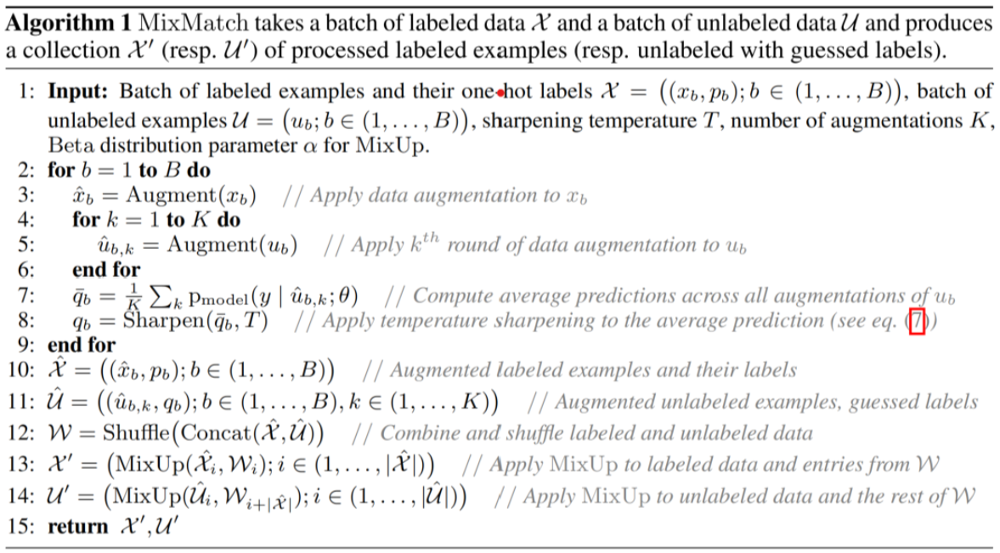
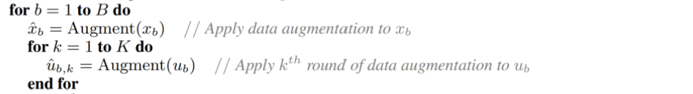
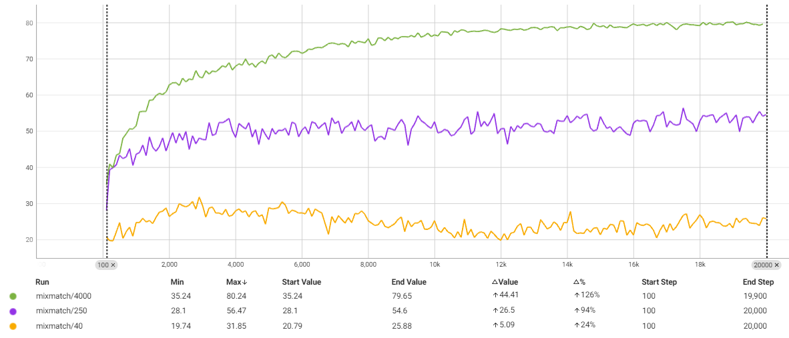
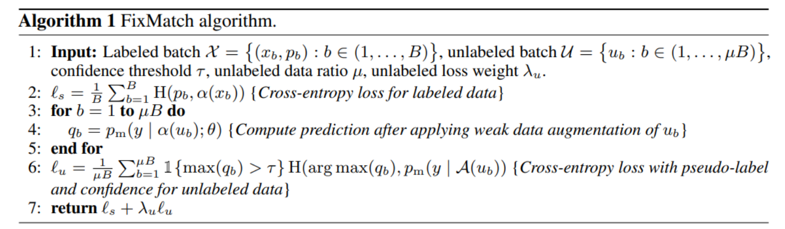
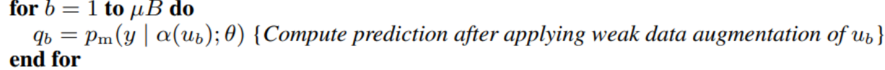
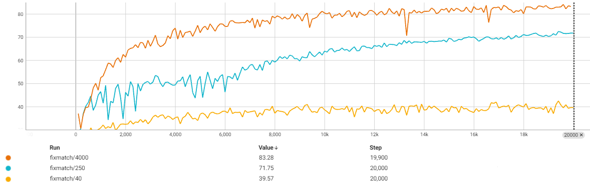
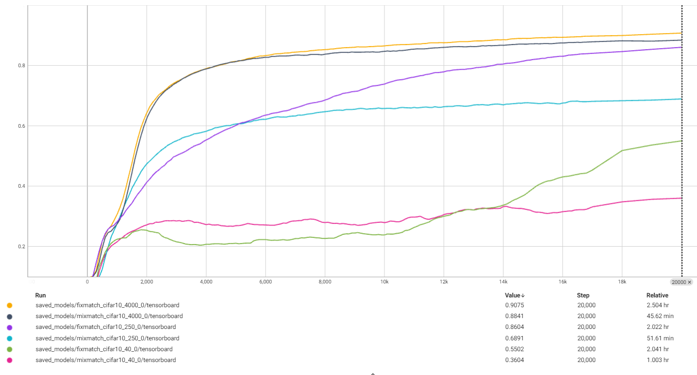
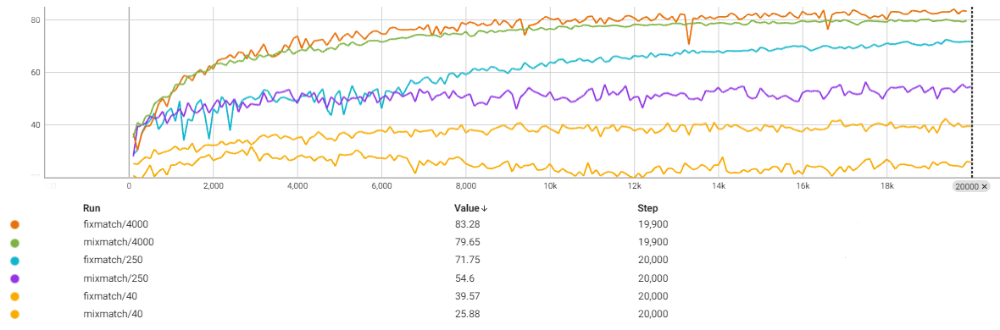

# 模式识别第三次实验报告

| 学号     | 姓名   |
| -------- | ------ |
| 20319045 | 刘冠麟 |

## 实验目的

1. 了解半监督学习概念，掌握半监督学习方法。
2. 能够阅读FixMatch、MixMatch算法论文。
3. 掌握FixMatch、MixMatch算法思想，并能够复现代码。
4. 能够使用类似TorchSSL等库进行半监督训练。

## 实验要求

1. 基于 Pytorch 分别实现 MixMatch 和 FixMatch 半监督图像分类算法，使用WideResNet-28-2作为BackBone网络，报告算法在分别使用 40, 250, 4000 张标注数据的情况下的图像分类效果。

2. 使用 TorchSSL中提供的 MixMatch 和 FixMatch 的实现进行半监督训练和 测试，对比自己实现的算法和 TorchSSL 中的实现的效果。

3. 结合代码分析MixMatch 和 FixMatch 中对数据集数据的处理步骤以及算法的主要实现步骤，并分析对比两种算法的相同点和不同点。

## 实验内容

### 基于 MixMatch 的 CIFAR-10 数据集半监督图像分类

#### 算法思想

`MixMatch`主要采用两种方式来利用无标注数据，即**熵最小化**和**一致性正则化**，通过充分利用少量标注数据和大量未标注数据来提升模型的分类性能。

`MixMatch`首先对未标注数据进行K次数据增强后使用当前模型预测其标签，并通过温度缩放和平均归一化处理（即`Sharpening`操作）获得平滑的伪标签；然后使用`MixUp`策略，将经过一次增强的标注数据和K次增强的未标注数据通过线性插值生成新的训练样本和标签；最后损失函数中结合有监督的分类损失（基于标注数据）和无监督的均方误差损失（基于伪标签），共同优化模型的总损失函数，以此在标注数据较少的半监督场景中显著提升神经网络性能。

#### 数据预处理

首先获取CIFAR-10数据集：

```python
# 数据预处理
transform = transforms.Compose([transforms.ToTensor(), transforms.Normalize((0.5, 0.5, 0.5), (0.5, 0.5, 0.5))])

# 加载CIFAR-10数据集
trainset = torchvision.datasets.CIFAR10(root='./data', train=True, download=True, transform=transform)
```

在半监督场景中分为有标签数据和无标签数据，在训练时是有标签数据和无标签数据各取一份进行训练，所以首先要准备两组数据（有标签和无标签）。

而且按照论文原文的描述，假如使用`m`张图片作为有标签数据，那么每个类别的图片数量应该为`m/num_class`，即每个类别的有标签图像数量应该相等。因此首先遍历CIFAR-10数据集，取出所有所有图片并按照标签进行分类，然后再对所有类别均匀取样：

```python
# 分别使用40, 250, 4000张标注数据
num = 4000

# 按类别分类样本
class_samples = defaultdict(list)
for idx, (image, label) in enumerate(trainset):
    class_samples[label].append(idx)

# 设定每个类别取样数量
num_per_class = num//class_samples.keys().__len__()
labeled_indices = []

# 从每个类别中均匀取样
for label, indices in class_samples.items():
    labeled_indices.extend(random.sample(indices, num_per_class))
```

然后从总训练样本中除去标签样本，剩下的样本视为无标签样本：

```python
# 剩下的作为无标签数据集
all_indices = set(range(len(trainset)))
unlabeled_indices = list(all_indices - set(labeled_indices))
```

最后根据索引创建有标签数据子集和无标签数据子集，并创建迭代器：

```python
# 创建数据子集
labeled_set = torch.utils.data.Subset(trainset, labeled_indices)
unlabeled_set = torch.utils.data.Subset(trainset, unlabeled_indices)

labeled_loader = torch.utils.data.DataLoader(labeled_set, batch_size=64, shuffle=True)
unlabeled_loader = torch.utils.data.DataLoader(unlabeled_set, batch_size=64, shuffle=True)
test_loader = torch.utils.data.DataLoader(testset, batch_size=64, shuffle=False)
```

这里只是进行最基础的数据预处理，算法步骤中的数据增强则在MixMatch过程中分别对有标签数据集和无标签数据集实现。

#### 算法主要实现步骤

根据论文给出的算法步骤：



##### 算法输入

根据论文给出的算法步骤，算法有如下输入：

- 标注数据批次 $\mathcal{X} = \{(x_b, p_b); b \in (1, \ldots, B)\}$，其中 $p_b$ 是`one-hot`形式的标签。
- 未标注数据批次$\mathcal{U} = \{u_b; b \in (1, \ldots, B)\}$。
- 锐化温度 $T$，增强次数 $K$，MixUp的Beta分布参数$\alpha$。

在`train`函数的迭代步骤中，根据算法输入首先取出一轮迭代所需要的有标签数据$\mathcal{X} = \{(x_b, p_b); b \in (1, \ldots, B)\}$和无标签数据$\mathcal{U} = \{u_b; b \in (1, \ldots, B)\}$，并且得到有标签数据的标签的`one-hot`向量$p_b$：

```python
    labeled_iter = iter(labeled_loader)             
    unlabeled_iter = iter(unlabeled_loader)         
    for _, (x, y) in enumerate(labeled_iter):       # 有标签数据
        try:
            u, _ = next(unlabeled_iter)             # 无标签数据
        except StopIteration:
            unlabeled_iter = iter(unlabeled_loader)
            u, _ = next(unlabeled_iter)

        x, y, u = x.to(device), y.to(device), u.to(device)
        # 得到one-hot标签p_b
        y_onehot = torch.zeros(y.size(0), 10).to(device).scatter_(1, y.view(-1, 1), 1)  
 
```

然后将有标签数据及其`one-hot`形式标签和无标签数据作为参数输入`MixMatch`函数执行算法流程，得到

```python
loss = mixmatch(model, x, y_onehot, u)
```

其中`mixmatch`所需参数如下：

```python
def mixmatch(model, x, y, u, K=2, T=0.5, alpha=0.75):
    # 输入：有标签数据x,y；无标签数据u；模型model
    # K：数据增强次数；T：温度系数；alpha：Beta分布参数
```

其中按照原论文分别设置默认值为K=2, T=0.5, alpha=0.75。

##### 数据增强

数据输入算法后首先进行数据增强，可以知道`MixMatch`算法中首先对有标签数据进行一次增强，对无标签数据进行K次增强：



代码如下：

```python
    # 对有标签数据进行增强
    x_aug = augment(x)

    # 对无标签数据进行K次增强
    u_aug = [augment(u) for _ in range(K)]
```

增强函数如下，主要进行随机裁剪和水平翻转：

```python
def augment(x):
    # 数据增强函数，包含随机裁剪和随机水平翻转
    transform = transforms.Compose([
        transforms.RandomCrop(32, padding=4),  # 随机裁剪
        transforms.RandomHorizontalFlip(),  # 随机水平翻转
    ])

    x_aug = torch.zeros_like(x)
    for i in range(x.size(0)):
        x_aug[i] = transform(x[i])

    return x_aug
```

##### 生成伪标签

首先计算未标注数据的平均预测值
$$
\bar{q}_b = \frac{1}{K} \sum_{k} P_{\text{model}}(y | \hat{u}_{b,k}; \theta)
$$

```python
    with torch.no_grad():
        # 对每次增强后的无标签数据进行伪标签预测
        p_aug = [torch.softmax(model(u_aug_k), dim=1) for u_aug_k in u_aug]
        # 平均所有增强后的预测
        p_avg = sum(p_aug) / K
```

然后对平均预测值应用锐化操作，得到
$$
\tilde{q}_b = \text{Sharpen}(\bar{q}_b, T)\\
\text{Sharpen}(p, T)_i = \frac{p_i^{\frac{1}{T}}}{\sum_{j=1}^L p_j^{\frac{1}{T}}}
$$

```python
        # 温度缩放 (即论文中的 sharpening操作)
        p_avg = p_avg ** (1 / T)
        targets_u = p_avg / p_avg.sum(dim=1, keepdim=True)
        targets_u = targets_u.detach()
```

##### 合并数据集

生成伪标签后得到标注数据集和未标注数据集：
$$
\hat{\mathcal{X}} = \{(\hat{x}_b, p_b); b \in (1, \ldots, B)\}\\

\hat{\mathcal{U}} = \{(\hat{u}_{b,k}, \tilde{q}_b); b \in (1, \ldots, B), k \in (1, \ldots, K)\}
$$
即

```python
X_hat = [(x_aug, y_onehot)]
U_hat = [(u_aug_k, targets_u) for u_aug_k in u_aug]
```

将标注数据和未标注数据结合并打乱，得到集合
$$
\mathcal{W} = \text{Shuffle}(\text{Concat}(\hat{\mathcal{X}}, \hat{\mathcal{U}}))
$$

```python
# 合并有标签数据和无标签数据(concat X_hat and U_hat)
all_inputs = torch.cat([x_aug, *u_aug], dim=0)
all_targets = torch.cat([y] + [targets_u] * K, dim=0)

# Shuffle操作
shuffle_idx = torch.randperm(all_inputs.size(0))
all_inputs = all_inputs[shuffle_idx]
all_targets = all_targets[shuffle_idx]
```

##### MixUp

最后分别对标注数据集和未标注数据集以及集合$W$进行MixUp操作：
$$
\mathcal{X}' = \text{MixUp}(\hat{\mathcal{X}}, \mathcal{W})\\
\mathcal{U}' = \text{MixUp}(\hat{\mathcal{U}}, \mathcal{W})
$$
`MixUp`操作首先生成混合系数$ \lambda$​，使用Beta分布生成一个混合系数，公式为：
$$
\lambda \sim \text{Beta}(\alpha, \alpha)\\
\lambda = \max(\lambda, 1 - \lambda)
$$

```python
    # Mixup操作将有标签数据和无标签数据混合
    l = np.random.beta(alpha, alpha)
    l = max(l, 1 - l)
```

然后使用生成的混合系数对选定的两个样本进行线性插值，生成新的混合样本和标签：
$$
\tilde{x} = \lambda x_i + (1 - \lambda) x_j\\


\tilde{y} = \lambda y_i + (1 - \lambda) y_j
$$

```python
    idx = torch.randperm(all_inputs.size(0))

    input_a, input_b = all_inputs, all_inputs[idx]
    target_a, target_b = all_targets, all_targets[idx]

    mixed_input = l * input_a + (1 - l) * input_b
    mixed_target = l * target_a + (1 - l) * target_b
```

##### 损失函数

得到`mixed_input`和`mixed_target`后进行损失函数的计算，首先计算半监督损失函数$  L $ ：

- 首先计算标注数据集$\mathcal{X}$上的损失$ L_x$

$$
L_x = \frac{1}{|\mathcal{X}'|} \sum_{(x, p) \in \mathcal{X}'} H(p, P_{\text{model}}(y|x; \theta))
$$

​	其中$H(\cdot) $是交叉熵损失函数，$p$是真实标签，$P_{\text{model}}(y|x; \theta) $为预测标签。

- 其次计算未标注数据集$\mathcal{U}'$ 上的损失 $L_u$,，通过计算预测和伪标签的均值方差损失来计算：

$$
L_u = \frac{1}{|\mathcal{U}'|} \sum_{(u, q) \in \mathcal{U}'} \| q - P_{\text{model}}(y|u; \theta) \|_2^2
$$

- 最后合并标注数据和未标注数据的损失得到`MixMatch`算法的总损失：

$$
L = L_x + \lambda_u L_u
$$

其中$\lambda_u$​控制未标注数据损失对总损失影响的权重。

实现代码如下：

```python
    # 计算有标签数据的损失
    Lx = F.cross_entropy(logits_x, mixed_target[:x.size(0)].argmax(dim=1))
    # 计算无标签数据的损失
    Lu = F.mse_loss(sharpen(logits_u, T), mixed_target[x.size(0):])

    # 总损失
    L = Lx + lambda_u * Lu
```

#### 实验结果

按照原始论文的设置，使用 `WideResNet-28-2 `作为 Backbone 网络，即深度为 28，扩展因子为 2， 在 CIFAR-10 数据集上进行半监督图像分类实验，设置model:

```python
from BackboneModel import WideResNet

model = WideResNet(depth=28, num_classes=10, widen_factor=2).to(device)
```

WideResNet在BackboneModel中实现，使用了原论文中的模型代码。

然后分别设置num为40, 250, 4000进行实验：

```python
# 分别使用40, 250, 4000张标注数据
num = 4000
```

得到如下实验结果：

| 有标签样本数 | 正确率 |
| ------------ | :----- |
| 40           | 31.05% |
| 250          | 56.47% |
| 4000         | 80.24% |

可以明显看到正确率随着有标签样本数的增加而增加，正确率随着迭代次数的曲线图如下：




### 基于 FixMatch 的 CIFAR-10 数据集半监督图像分类

#### 算法思想

`FixMatch`结合了伪标签和一致性正则化来实现对无标注数据的高效利用，训练过程包括两个部分**有监督训练**和**无监督训练**两个部分。

其中有监督训练就是直接对有标注数据进行直接预测，而无监督训练对未标注数据进行弱增强和强增强：对弱增强的未标注数据进行预测，如果预测的置信度超过某个阈值，则将其作为伪标签；然后再对未标注数据进行强增强，并使用其伪标签进行训练，最后通过**一致性损失**确保模型对相同输入的不同增强版本具有一致的输出，显著提高了在标注数据较少情况下的分类性能。

#### 数据预处理

代码实现中`Fixmatch`与`Mixmatch`的预处理部分一致，都是对CIFAR-10数据集根据有标注样本数对数据集进行均匀采样，准备有监督和无监督两份子数据集并创建迭代器，这里不再赘述。

而`FixMatch`算法中要对未标注数据进行弱增强和强增强两个步骤则在算法迭代内部进行，这里分析实验中使用的弱增强和强增强方法：

##### 弱增强

参照`TorchSSL`中的实现，弱增强主要对数据进行随机水平翻转以及标准的旋转和移位：

```python
def weak_augment(x):
    # 弱增强：随机裁剪和随机水平翻转
    transform = transforms.Compose([
        transforms.RandomCrop(32, padding=4),  # 随机裁剪
        transforms.RandomHorizontalFlip(),  # 随机水平翻转
        transforms.RandomAffine(degrees=15, translate=(0.1, 0.1)),  # 旋转和移位
    ])
```

##### 强增强

参照`TorchSSL`中的实现，对未标注数据集的强增强则在弱增强的基础上进行`RandAugment`随机增强，`RandAugment`通过调用`torchvision.transforms` 库实现，通过随机应用一系列预定义的图像增强操作来生成更多样化的训练样本，包括**几何变换（旋转、平移、裁切、翻转）**、**颜色变换（亮度、对比度、饱和度、色相）、滤镜效果（模糊、锐化、均衡化）**和**随机反转图像的颜色**等操作，从而实现对未标注数据集的强扩增：

```python
from torchvision.transforms import RandAugment  # 引入 RandAugment

def strong_augment(x):
    # 强增强：使用 RandAugment 进行更强的数据增强
    transform = transforms.Compose([
        transforms.RandomHorizontalFlip(),
        transforms.RandomCrop(32, padding=4),
        RandAugment(num_ops=2, magnitude=9)  # 使用 RandAugment
    ])
```

#### 算法主要实现步骤

根据论文给出的算法步骤：



##### 算法输入

根据论文给出的算法步骤，算法有如下输入：

- 标注数据批次$\mathcal{X} = \{(x_b, p_b) : b \in (1, \ldots, B)\}$

- 未标注数据批次$\mathcal{U} = \{u_b : b \in (1, \ldots, \mu B)\}$

- 置信度阈值$ \tau$

- 未标注损失权重 $\lambda_u$​

  与`MixMatch`算法相似，在`train`函数的迭代步骤中，根据算法输入首先取出一轮迭代所需要的有标签数据及其标签$\mathcal{X} = \{(x_b, p_b); b \in (1, \ldots, B)\}$和无标签数据$\mathcal{U} = \{u_b; b \in (1, \ldots, B)\}$，不同的是这里并不需要`one-hot`形式的标签：

  ```python
      labeled_iter = iter(labeled_loader)             
      unlabeled_iter = iter(unlabeled_loader)         
      for _, (x, y) in enumerate(labeled_iter):       # 有标签数据
          try:
              u, _ = next(unlabeled_iter)             # 无标签数据
          except StopIteration:
              unlabeled_iter = iter(unlabeled_loader)
              u, _ = next(unlabeled_iter)
  
          x, y, u = x.to(device), y.to(device), u.to(device)
  ```


然后将有标签数据、标签和无标签数据作为参数输入`FixMatch`函数执行算法流程，得到

```python
loss = fixmatch(model, x, y, u)
```

其中`Fixmatch`所需参数如下：

```python
def fixmatch(model, x, y, u, tau=0.95, lambda_u=1.0):
    # 输入：有标签数据x,y；无标签数据u；模型model
    # tau：置信度阈值；lambda_u：无标签损失权重
```

其中按照原论文分别设置默认值为tau=0.95, lambda_u=1.0。

##### 对有标签数据进行正常预测

数据输入算法后首先对有标签数据进行正常预测，即对标注数据$(x_b, p_b)$计算交叉熵损失：
$$
\ell_s = \frac{1}{B} \sum_{b=1}^{B} H(p_b, \alpha(x_b))
$$
其中$H$是交叉熵损失函数，$\alpha$​ 是弱增强函数。

```python
    # 对有标签数据进行弱增强
    x_w = weak_augment(x)

    # 计算有标签数据的损失
    logits_x = model(x_w)
    loss_x = nn.CrossEntropyLoss()(logits_x, y)
```

##### 对无标签数据进行弱增强并计算预测值

对应算法伪代码中的：



对每个未标注数据$u_b$，进行弱增强$ \alpha(u_b)$并计算模型预测值$q_b = p_m(y | \alpha(u_b); \theta)$:

```python
    # 对无标签数据进行弱增强并计算伪标签
    u_w = weak_augment(u)
    with torch.no_grad():
        q = torch.softmax(model(u_w), dim=1)
        max_q, max_idx = torch.max(q, dim=1)
        mask = max_q > tau
        pseudo_labels = max_idx[mask]
```

##### **生成伪标签并计算未标注数据的损失**

对于每个未标注数据，如果模型预测的最大置信度$  \max(q_b) $超过阈值 $\tau$，则生成伪标签，并计算未标注数据的交叉熵损失：
$$
\ell_u = \frac{1}{\mu B} \sum_{b=1}^{\mu B} \mathbf{1}\{\max(q_b) > \tau\} H(\arg\max(q_b), p_m(y | \mathcal{A}(u_b)))
$$
其中 $\mathcal{A} $是强增强函数。

对应代码如下：

```python
    # 对无标签数据进行强增强
    u_s = strong_augment(u[mask])
    # 计算无标签数据的损失
    if u_s.size(0) > 0:
        logits_u = model(u_s)
        loss_u = nn.CrossEntropyLoss()(logits_u, pseudo_labels)
    else:
        loss_u = torch.tensor(0.0).to(loss_x.device)
```

##### 返回总损失

最后返回总损失：
$$
\ell_s + \lambda_u \ell_u
$$

```python
    # 返回总损失
    return loss_x + lambda_u * loss_u
```

由此完成对未标注数据的伪标签生成和一致性正则化提升半监督学习的效果。

#### 实验结果

同样按照原始论文的设置，使用 `WideResNet-28-2 `作为 Backbone 网络，即深度为 28，扩展因子为 2， 在 CIFAR-10 数据集上进行半监督图像分类实验，分别设置num为40, 250, 4000进行实验，得到如下实验结果：

| 有标签样本数 | 正确率 |
| ------------ | :----- |
| 40           | 39.57% |
| 250          | 71.15% |
| 4000         | 83.28% |

可以明显看到正确率随着有标签样本数的增加而增加，并且在相同有标签样本数下正确率都高于`MixMatch`。正确率随着迭代次数的曲线图如下：



### 使用 TorchSSL中提供的 MixMatch 和 FixMatch 的实现进行半监督训练和测试

根据TorchSSL Github页面（https://github.com/StephenStorm/TorchSSL）中的文档，首先配置环境：

```shell
conda env create -f environment.yml
```

然后运行文件：

```shell
python fixxmatch.py --c config/fixxmatch/fixmatch_cifar10_40_0.yaml
```

对`FixMatch`、`MixMatch`在`40, 250, 4000`有标签样本数下进行实验，可以得到如下结果：

| MixMatch      | 正确率 | FixMatch      | 正确率 |
| ------------- | ------ | ------------- | ------ |
| Mixmatch-40   | 36.04% | Fixmatch-40   | 55.02% |
| Mixmatch-250  | 68.91% | Fixmatch-250  | 86.04% |
| Mixmatch-4000 | 88.41% | Fixmatch-4000 | 90.75% |

正确率随着迭代次数的曲线图如下：



## 实验分析

### 分析对比 MixMatch 和 FixMatch 的效果以及相同点和不同点

#### 效果

对比自己实现的`MixMatch`和`FixMatch`，可以得到如下表格以及曲线：

| MixMatch      | 正确率 | FixMatch      | 正确率 |
| ------------- | ------ | ------------- | ------ |
| Mixmatch-40   | 31.05% | Fixmatch-40   | 39.57% |
| Mixmatch-250  | 56.47% | Fixmatch-250  | 71.15% |
| Mixmatch-4000 | 80.24% | Fixmatch-4000 | 83.28% |



可以从实验表格和图标看到，无论是自己实现的算法还是调用`TorshSSL`库实现的算法，`FixMatch`算法在同等有标注数据集数量的情况下均比`MixMatch`效果要更好。

#### 相同点

1. 两个算法都是**半监督学习算法**，旨在利用少量标注数据和大量未标注数据来提高模型的性能。
2. 都通过对未标注数据**生成伪标签**来利用未标注数据。
3. 都使用**数据增强技术**来增加数据多样性，提高模型的鲁棒性。
4. 都通过**一致性正则化**确保模型对相同输入的不同增强版本具有一致的输出。

#### 不同点

1. **对于有标签数据集的利用：**
   - **MixMatch**：MixMatch 使用 MixUp 技术将有标签数据和未标签数据混合，将有标签数据集及其标签、无标签数据集及其伪标签进行线性组合来生成新的训练样本。
   - **FixMatch**：对于有标签数据FixMatch直接计算交叉熵损失。与 MixMatch 不同的是FixMatch 不进行 MixUp 操作，而是直接使用增强后的有标签数据进行训练。
2. **增强方式**：
   - **MixMatch**：结合了多次数据增强、MixUp和一致性正则化等技术。MixMatch通过对未标注数据进行多次增强，并对其预测结果求平均，然后对平均预测结果进行锐化，生成伪标签。之后，通过MixUp技术将标注数据和未标注数据混合。
   - **FixMatch**：通过弱增强和强增强相结合的方式。FixMatch对未标注数据进行弱增强，生成伪标签，然后对原始未标注数据进行强增强，利用生成的伪标签进行训练。FixMatch使用固定阈值来过滤低置信度的伪标签。
3. **伪标签处理**：
   - **MixMatch**：对多次增强后的未标注数据进行预测，计算平均预测结果，并对其进行锐化处理。
   - **FixMatch**：对弱增强后的未标注数据进行预测，只有当预测的置信度超过预设阈值时，才将其作为伪标签。
4. **复杂度**：
   - **MixMatch**：因为需要对未标注数据进行多次增强，计算平均预测结果并进行MixUp操作，整体计算复杂度较高。
   - **FixMatch**：只需要进行一次弱增强和一次强增强并且使用固定阈值筛选伪标签，相对而言计算复杂度较低。

### 对比自己实现的算法和 TorchSSL 中的实现的效果

| 自己实现      | 正确率 | 调用库实现    | 正确率 |
| ------------- | ------ | ------------- | ------ |
| Mixmatch-40   | 31.05% | Mixmatch-40   | 36.04% |
| Mixmatch-250  | 56.47% | Mixmatch-250  | 56.47% |
| Mixmatch-4000 | 80.24% | Mixmatch-4000 | 88.41% |
| Fixmatch-40   | 39.57% | Fixmatch-40   | 55.02% |
| Fixmatch-250  | 71.15% | Fixmatch-250  | 86.04% |
| Fixmatch-4000 | 83.28% | Fixmatch-4000 | 90.75% |

从实验结果可以看出，自己实现的算法和调用库实现的算法的大致趋势一致，即FixMatch正确率高于MixMatch，而且随着有标签样本数增大正确率增大，但是也可以看到自己实现的算法正确率都略低于调用库的实现，原因可能在于：

- 在实现过程中，对数据增强、伪标签生成或超参数调优的细节处理有所不同，TorchSSL可能用了效果更好的数据增强和超参数；
- TorchSSL实现了更好的训练算法，比如`EMA`训练方法，其本身全监督训练的正确率上限就高于自己实现的算法，半监督效果自然也就更好。

## 代码使用方法

打开`FixMatch.py`,`MixMatch.py`直接运行即可，代码会自动保存模型和log。
