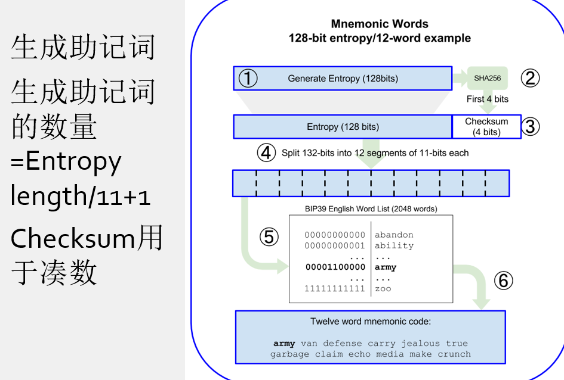
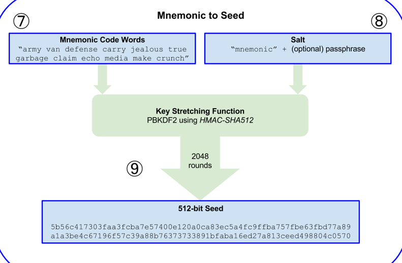
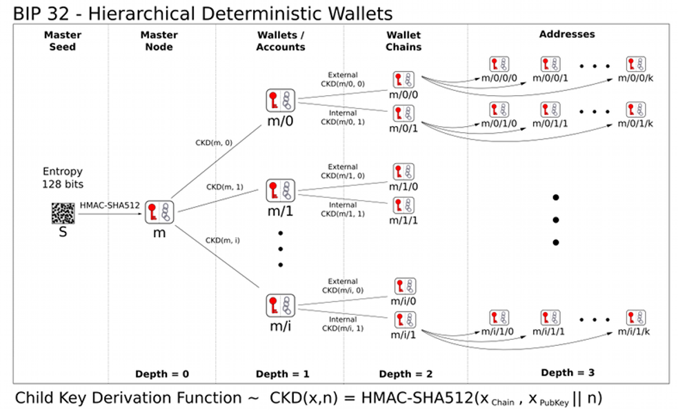
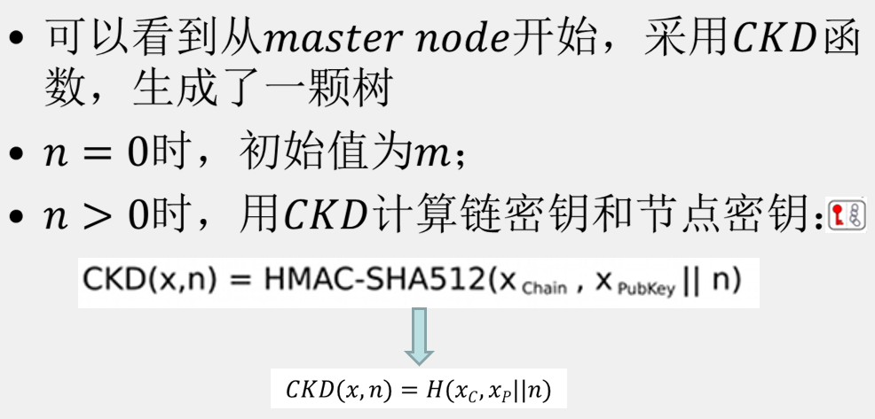
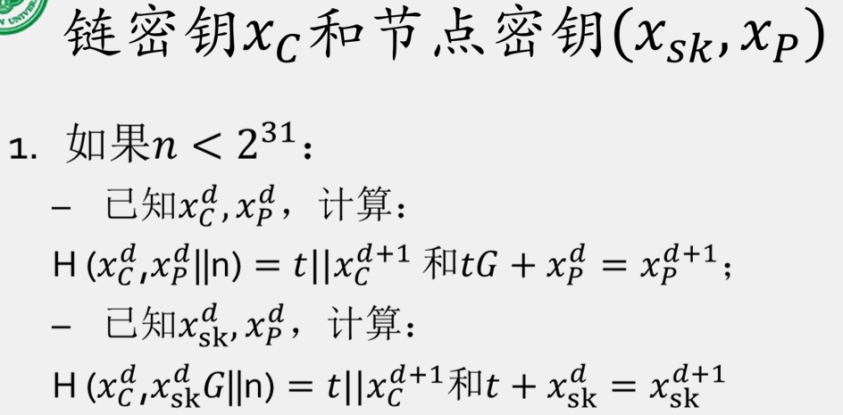
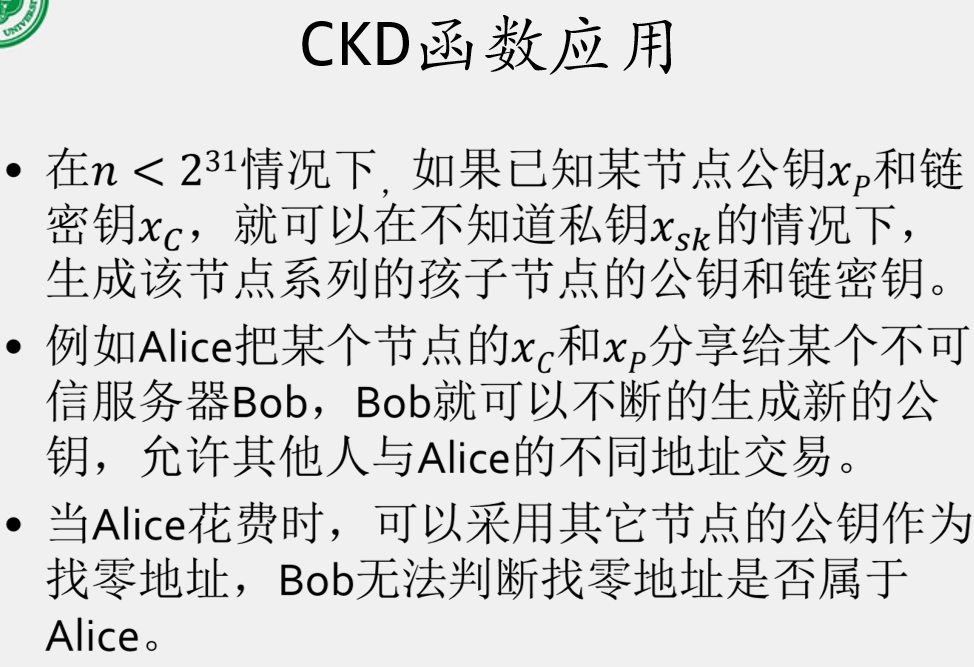
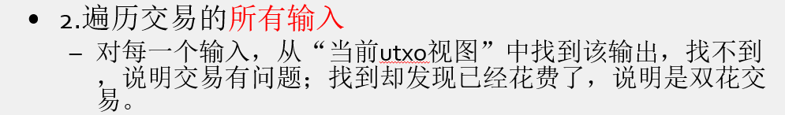

# 小测

## 第一次

### 1.PKI为什么是可信的？

公钥基础设施（PKI，Public Key Infrastructure）是一种用于安全数据传输的技术框架。它依赖于一系列组件、政策和软件来创建、管理、分发、使用和撤销数字证书，并通过这些证书实现数据加密和身份验证。PKI（公钥基础设施）之所以可信，主要是因为它利用了数学和加密技术为数字通信提供安全性和可信性。下面是PKI可信的几个主要原因：

1. **加密技术**：PKI使用一对密钥（公钥和私钥）来实现数据的加密和解密。公钥可公开，而私钥必须保密。这种加密技术确保只有持有相应私钥的接收者才能解密由公钥加密的信息。

2. **数字证书**：PKI系统中的数字证书包含公钥及其所有者的身份信息，并由可信的第三方——证书颁发机构（CA）签名。证书的签名保证了公钥和身份信息的真实性，用户可以通过验证证书来确认公钥的可信性。

3. **证书颁发机构（CA）**：CA是PKI的核心，负责发行和管理数字证书。CA的信誉和安全措施是其证书被广泛接受的基础。CA还维护一个撤销列表（CRL），用于列出被撤销或失效的证书，增强系统的安全性。

4. **证书链和根证书**：在PKI中，证书可以通过由多个证书构成的“证书链”进行验证，直至一个被广泛信任的根证书。根证书通常由操作系统或应用程序预置，是信任链的起点。

5. **安全协议**：PKI支持多种安全协议，例如SSL/TLS，这些协议用于安全地传输数据，保护数据不被截取或篡改。

因此，通过这些严格的技术和流程，PKI能够提供高度的安全性和可信性，使其在保护数字交易和通信中发挥关键作用。

、

### 2.PKI中主要包含哪些要素？

**PPT：**

公钥基础设施是标准、CA、多CA结构、证书路径发现算法、操作协议、管理协议、互操作规程、法律法规所形成的集合体。

PKI（公钥基础设施）是一个集合体，它由以下要素组成：

1. **标准（Standards）**：一系列商定的标准，确保PKI的各个组成部分能够协同工作。

2. **证书颁发机构（Certification Authorities, CA）**：负责颁发和管理数字证书的实体。

3. **多个CA之间的结构（Structure between multiple CAs）**：定义了不同CA之间如何相互关联和交互。

4. **证书路径发现算法（Methods to discover and validate Certification Paths）**：用于确定和验证从一个CA到另一个CA的路径的方法。

5. **操作协议（Operational Protocols）**：规定了证书生命周期中的操作流程，如证书的申请、颁发、更新和吊销。

6. **管理协议（Management Protocols）**：涉及PKI的管理和维护，如密钥恢复和证书吊销。

7. **互操作规程（Interoperability Procedures）**：确保不同PKI系统之间能够顺利交互和协作。

8. **法律法规（Supporting Legislation）**：为PKI的运作提供法律框架和支持。

这些要素共同构成了PKI系统，使其能够在电子商务、安全通信和其他依赖于公钥加密的应用中发挥作用。PKI的主要目标是为实体提供一个安全的环境，以确保他们的身份、交易的完整性和保密性。


### 3.PKI的CRL有什么作用，主要包含那些内容？

PKI（公钥基础设施）中的CRL（证书撤销列表）是一个非常重要的组成部分，用于提高整个系统的安全性和可信度。

CRL的主要作用是

- **列出已经被撤销的数字证书。**这些证书可能因为多种原因被撤销，如私钥泄露、证书持有者身份变更、证书发行错误等。
- “用户”需要下载CRL，以验证一张证书是否被吊销了


**PPT：**

CRL主要包含以下内容：

> Certificate Revocation List 
>
> Issuer (CA) Distinguished Name (DN) e.g. C=UK,oU=Test CA, O=xxxx plc 
>
> Time of this update 
>
> Time of next update
>
>  list of revoked certificate seria!berswith dates & reasons 
>
> Signing algorithm parameterse.g.SHA-1, RSA 
>
> CA Signature

证书撤销列表（Certificate Revocation List, CRL）包含一系列已被证书颁发机构（CA）撤销的数字证书的信息。CRL 用于告知系统和用户哪些证书不再可信，不应继续使用。一个典型的CRL将包括以下主要内容：

1. **颁发者（CA）的可辨认名称（DN）**：这是描述证书颁发机构身份的信息，通常包括国家代码（C）、组织单位（OU）、组织名称（O）等。这有助于确定是哪个CA颁发的CRL。

2. **本次更新时间**：表示CRL发布的时间，用户和系统可以知道这份列表从何时起有效。

3. **下次更新时间**：表示下一版CRL预计发布的时间，帮助用户和系统了解何时可以获取最新的撤销信息。

4. **撤销证书列表**：列出被撤销证书的序列号、撤销日期及撤销原因。每个条目通常包括证书的序列号和对应的撤销日期，有时还会包括撤销原因（如密钥妥协、CA妥协、更换证书、终止操作等）。

5. **签名算法参数**：如SHA-1、RSA等，这说明了CA用于对CRL进行数字签名的加密算法，确保CRL的完整性和防篡改性。

6. **CA的签名**：CA使用其私钥对CRL进行签名，任何接收方都可以使用CA的公钥验证这一签名，以确保CRL未被篡改并且是由合法的CA发布的。

这些信息共同确保了CRL的安全性和有效性，使得使用者能够检查并避免使用被撤销的证书进行通信。


### 4.数字证书主要包含哪些内容？

**PPT：**

> （发行人）Issuer (CA) Distinguished Name (DN)  e.g. C=GB, o=Baltimore Technologies, OU=PSD
> Serial number (allocated by CA)
> Validity period (typically a year)
> （主体）User (Subject) Distinguished Name
> User public Key parameters e.g.RSA
> User public Key
> （主体公钥）Extensions e.g.Alternative user name(e.g. e-mail address), Key usage e.g.digital signature, key encipherment
> Signing algorithm parameters e.g.SHA-1,MD5
> （发行人数字签名）CA Signature

数字证书是一种用于确认公钥所有者身份的电子文件，由证书颁发机构（CA）签发。一个典型的数字证书包含以下主要内容：

1. **发行人（Issuer）的可辨认名称（Distinguished Name, DN）**：包括国家代码（C）、组织名称（O）、组织单位名称（OU）等，描述了证书颁发机构的详细信息。

2. **序列号（Serial number）**：由证书颁发机构分配的唯一标识符，用于区分发行的每一份证书。

3. **有效期（Validity period）**：证书的有效开始和结束日期，通常是一年或更长时间，指明了证书的使用时间范围。

4. **主体（Subject）的可辨认名称**：证书持有者（如个人、组织、设备等）的详细信息，通常包括国家代码、组织名称、组织单位名称等。

5. **用户公钥（User public key）**：包含算法名称（如RSA）和公钥本身。公钥是与私钥对应的，用于加密信息或验证数字签名。

6. **主体公钥扩展（Extensions）**：
   - **备用用户名**：如电子邮件地址等，为证书持有者提供额外的标识信息。
   - **密钥用途**：定义公钥的使用目的，如数字签名、密钥加密等。

7. **签名算法参数**：如SHA-1、MD5等，这指明了用于对证书进行数字签名的加密算法。

8. **发行人的数字签名（CA Signature）**：证书颁发机构使用其私钥对证书进行的签名，以确保证书的内容未被篡改，接收者可以使用CA的公钥验证这一签名的有效性。

这些组成部分共同确保了证书的安全性和可靠性，允许用户和系统在数字环境中验证通信方的身份。


## 第二次

### 1.SET中的数字信封和双签名是什么？有什么作用？

**数字信封（Digital Envelope）**：（结合SET通信过程来理解）

- 数字信封是通过使用接收方B的公钥对发送方A对称密钥进行加密得到的信息。（**公钥加密对称密钥**）

- 功能：数字信封主要用于安全地传输信息。通过数字信封，只有通过B的对称密钥才可获取A的对称密钥（用来解密加密消息），可以确保A中的对称密钥安全地传送到B处，以保护传输过程中的信息不被未经授权的第三方访问或修改。


**双签名**


**双重签名（Dual Signature）**：

- **功能**：双重签名的目的是为了让交易双方同时验证支付和订单信息，同时又确保支付信息对商家是不可见的，而订单信息对银行是不可见的，从而保护用户的隐私。

  双重签名的目的在连结两个不同接收者消息。在这里，消费者想要发送订单信息OI到特约商店，且发送支付命令PI给银行。特约商店并不需要知道消费者的信用卡卡号，而银行不需要知道消费者订单的详细信息。消费者需要将这两个消息分隔开，而受到额外的隐私保护。在必要的时候这两个消息必须要连结在一起，才可以解决可能的争议、质疑。这样消费者可以证明这个支付行为是根据他的订单来执行的，而不是其它的货品或服务。

- **工作原理**：首先，对支付信息和订单信息分别进行哈希处理。然后，将这两个哈希值连接起来，再对连接后的结果进行一次哈希处理。最后，用户使用私钥对这个最终的哈希值进行加密，创建双重签名。这个双重签名随后可以被拥有相应公钥的接收者验证。


**SET通信流程：**

ppt图：


中文版：


**工作流程**：

1. **密钥交换**：在通信开始之前，Alice和Bob使用某种形式的密钥交换算法（Key-Exchange），A具有B的公钥(public key-exchange)，与之对应的是B具有B的私钥(private key-exchange)，可以用来解密B公钥加密的文件。

2. **数字签名**：Alice根据财产（property）生成消息摘要(Message Digest)，然后使用Alice自己的私人签名密钥(Alice's Private Signature Key)对消息摘要进行加密生成电子签名(Digital Signature)。

   

3. **生成加密消息**：（property + 电子签名 + A的证书）经过对称密钥(Symmetric Key)后生成加密消息。

   

4. **加密对称密钥**：Bob使用他的公钥（Bob's Public Key）加密之前交换的对称密钥，生成加密的对称密钥（Encrypted Symmetric Key）。

   

   也就是说数字信封就是A手上的对称密钥（步骤3中用来生成加密消息的密钥）经过B手上的对称密钥生成的【**加密的对称密钥**】。

   

5. **发送**：Alice将数字信封（加密的对称密钥）和加密的消息一起发送给Bob。

6. **解密对称密钥**：Bob使用他的私钥（Bob's Private Key）解密收到的加密的对称密钥，恢复出原始的对称密钥。（A手中的）

   

   

7. **解密消息**：Bob使用恢复出的对称密钥解密加密的消息，得到原始的消息(property+数字签名+A的证书）。

   

8. **验证数字签名**：Bob使用Alice的公钥（Alice's Public Key）验证消息的数字签名，确保消息未被篡改且确实来自Alice。

   

9. **比较数字信封**：对比两种方式（通过解密加密消息和通过数字信封）得到的数字签名：

   


### 2.简述SET的基本处理流程


1. **客户浏览并决定购买**（Customer browses and decides to purchase）

2. **SET发送订单和支付信息**（SET sends order and payment information）

3. **商户将支付信息转发给商户银行**（Merchant forwards payment information to bank）

4. **银行与发卡机构确认支付授权**（Bank checks with issuer for payment authorization.）

5. **发卡机构授权支付给商户银行**（Issuer authorizes payment.）

6. **商户银行授权支付给商户**(Bank authorizes payment)

7. **商户完成订单**（Merchant completes order.）

8. **商户捕获交易**（Merchant captures transaction）

9. **客户银行向客户发送信用卡账单**（Issuer sends credit card bill to customer.）

   


### 3.以RSA为例给出盲签名的流程。


**一种有特殊属性的数字签名**

1. **客户端盲化消息**

   设客户端待签署消息为$m$，服务器公钥为$(e,n)$，则客户端：

   - 用户选择一个随机数$r<n$
   - 用户计算盲化消息$m' = r^e * h(m) mod \space n$，其中`h(m)`是消息`m`的哈希值。

2. **服务器盲签署**

   收到盲化消息`m'`，并使用其私钥`d`计算签名$σ' = m'\space ^d mod \space n$。

3. **客户端去盲化**

   用户收到盲化签名`σ'`，并计算真实的签名$σ = σ' * r^-1 mod \space n$


### 4.简述基于盲签名的电子现金发行、流通和回笼的过程。


1. **发行（银行发行电子货币给用户）**

      - 银行用户和用户建立可靠的认证通道
      - 用户生成一个唯一的序列号或信息表示一定数量的电子货币，并对该信息进行盲化处理。

      - 用户将盲化的信息发送给银行以请求签名。

      - 银行扣除用户的账户相应的金额，并对盲化信息进行签名，不了解实际的序列号或信息内容。

      - 银行将签名的盲化信息返回给用户。

      - 用户取消盲化，从而获得银行的签名但银行不知道序列号，此时用户持有有效的电子货币。


2. **流通（用户使用电子货币进行支付）**

      - 不需要任何信道，不需要知道谁在买东西
      - 当用户想要使用电子现金进行支付时，他们将电子货币和银行的签名提供给商家。

      - 商家可以通过查验银行的签名来验证电子现金的真实性和有效性。

      - 如果验证成功，商家接受电子货币并提供商品或服务给用户。


3. **回笼（商家将电子货币兑换成实际货币）**

   （银行将货币放回已花费现金库）

      - 商家收到用户的电子货币后，向银行提交以获取等值的现金或存款。

      - 银行验证电子货币的签名以及是否被重复使用（防止双重支付）。

      - 如果验证成功且电子货币没有被重复使用，银行接受电子货币，并在商家的账户上存入相应的金额。


在整个过程中，由于使用了盲签名，银行在签名用户的电子货币时并不知道实际的序列号。因此，用户的支付是匿名的，银行无法追踪用户如何使用其电子货币。这保障了用户的隐私，同时也通过银行的签名机制防止了伪造和双重支付。然而，电子现金系统需要对抗多种欺诈行为，比如双重支付，因此需要有复杂的机制来确保系统的安全性和完整性。


### 5.简述NetCash现金发行、流通和回笼的过程。

老师上课讲的：

netcash和央行货币很像，都有真正的电子现金，为银行发行的、不用盲签名，银行按照格式签名就可以了。

二者都有现金库，存储的都是有效的发行的电子现金。

不同地方在于：对应的字段不一样。

**netcash现金发行、流通和回笼的过程：**

- 发行：是用netcash的现金服务器发行现金；央行货币是用央行来发行的。
- 流通：买方直接给卖方。消费者给商家提供netcash现金以后，商家是要进行兑换的（商家给现金服务器）。
- 回笼：netcash里面属于是用户自己用netcash兑换成正经的支票或者现金；央行货币里面用的是商行现金库。


补充：央行现金发行、流通和回笼过程：

1. **央行现金的发行**：
   - 中央银行是发行现金的主体。中央银行决定发行新的货币以满足经济增长、替换破损货币或应对需求变化。
   - 发行前，中央银行会进行详细的计划，包括设计安全特征以防伪造，以及确定需要发行的货币数量。
   - 然后，中央银行会委托印钞厂进行印制，确保货币具有必要的安全性和质量。
2. **央行现金的流通**：
   - 印制好的现金从中央银行运送到各商业银行。商业银行再将现金通过ATM机、银行柜台等渠道分发给公众。
   - 公众通过提款、支付等方式使用现金进行日常交易。这些交易包括购物、餐饮、服务支付等。
   - 现金在个人和企业之间流动，作为交易的媒介。
3. **央行现金的回笼**：
   - 商业银行定期将收集到的现金存回中央银行，或是通过夜间保管箱等方式暂时保管。
   - 中央银行对回笼的现金进行清点、检验，不合格的旧钞将从流通中撤出，以确保流通中的现金质量。
   - 根据经济情况和现金状况，中央银行会决定是否需要销毁旧钞或重新发行新钞。


### 6.谈谈你对央行数字货币的理解

**AI回答**：

央行数字货币（CBDC，Central Bank Digital Currency）是由中央银行发行的数字形式的法定货币。它旨在补充或在某些情况下替代传统的实体货币（如纸币和硬币），并提供一个更加现代化的、高效的支付系统。下面是对央行数字货币的一些主要特点和潜在影响的探讨：

1. **直接由央行发行**：与传统货币不同，CBDC 是直接由国家的中央银行发行和管理的，这意味着它具有中央银行的全面支持和信誉保证。

2. **操作效率**：CBDC 可以提高支付系统的效率，减少交易成本和时间。例如，它可以实现跨境支付的快速清算，减少中间环节。

3. **金融包容性**：央行数字货币可以扩大金融服务的覆盖范围，特别是在偏远地区和未银行化的人群中，因为它能够通过智能手机或其他简单的数字设备进行操作。

4. **隐私和安全问题**：虽然CBDC能够提高交易的安全性，防止欺诈和洗钱等犯罪活动，但同时也引发了关于用户隐私保护的担忧。不同国家和地区在设计CBDC时必须平衡监管需求和个人隐私权的保护。

5. **对传统银行业的影响**：CBDC 的实施可能会重新定义银行和其他金融机构的角色，因为中央银行可以直接与消费者进行交互，减少对传统银行系统的依赖。

6. **宏观经济政策工具**：CBDC 可以作为实施宏观经济政策的一个工具，比如通过调整数字货币的供应量来影响经济，或者直接向公众发送经济刺激资金。

全球范围内，许多国家都在研究或试点央行数字货币项目。例如，中国的数字人民币（e-CNY）已经开始在多个城市进行试点，旨在探索其在日常经济活动中的应用。

CBDC 的设计和实施是一个复杂的过程，涉及技术、法律、金融以及社会各方面的考量。不同国家会根据自己的经济状况、法律框架和市场需求，设计符合自身特色的CBDC 系统。


**网络回答**：

> 作者：小恐龙
> 链接：https://www.zhihu.com/question/389188103/answer/1448926587
> 来源：知乎
> 著作权归作者所有。商业转载请联系作者获得授权，非商业转载请注明出处。

央行数字货币就是人民币的一种数字形式，它本身不是新的货币。数字人民币是由人民银行发行，由指定运营机构参与运营并向公众兑换，以广义[账户体系](https://www.zhihu.com/search?q=账户体系&search_source=Entity&hybrid_search_source=Entity&hybrid_search_extra={"sourceType"%3A"answer"%2C"sourceId"%3A1448926587})为基础，支持银行账户[松耦合](https://www.zhihu.com/search?q=松耦合&search_source=Entity&hybrid_search_source=Entity&hybrid_search_extra={"sourceType"%3A"answer"%2C"sourceId"%3A1448926587})功能，与纸钞和硬币等价，并具有价值特征和[法偿性](https://www.zhihu.com/search?q=法偿性&search_source=Entity&hybrid_search_source=Entity&hybrid_search_extra={"sourceType"%3A"answer"%2C"sourceId"%3A1448926587})的可控匿名的支付工具。

具体而言，首先，数字人民币由人民银行发行，是有国家信用背书、有法偿能力的法定货币。**与[比特币](https://www.zhihu.com/search?q=比特币&search_source=Entity&hybrid_search_source=Entity&hybrid_search_extra={"sourceType"%3A"answer"%2C"sourceId"%3A1448926587})等虚拟币相比，数字人民币是法币，与法定货币等值，其效力和安全性是最高的，而比特币是一种[虚拟资产](https://www.zhihu.com/search?q=虚拟资产&search_source=Entity&hybrid_search_source=Entity&hybrid_search_extra={"sourceType"%3A"answer"%2C"sourceId"%3A1448926587})，没有任何价值基础，也不享受任何主权[信用担保](https://www.zhihu.com/search?q=信用担保&search_source=Entity&hybrid_search_source=Entity&hybrid_search_extra={"sourceType"%3A"answer"%2C"sourceId"%3A1448926587})，无法保证价值稳定。这是央行数字货币与比特币等加密资产的最根本区别。**

在发行和兑换方面，数字人民币采取了双层运营体系。即人民银行不直接对公众发行和兑换央行数字货币，而是先把数字人民币兑换给指定的运营机构，比如商业银行或者其他商业机构，再由这些机构兑换给公众。这种双层运营体系和纸钞发行基本一样，因此不会对现有金融体系产生大的影响，也不会对实体经济或者金融稳定产生大的影响。

**央行为什么要发行数字货币呢？**

第一：首要目的是为了保护货币主权和[法币](https://www.zhihu.com/search?q=法币&search_source=Entity&hybrid_search_source=Entity&hybrid_search_extra={"sourceType"%3A"answer"%2C"sourceId"%3A1448926587})地位。同时，数字人民币的出现会提高[支付系统](https://www.zhihu.com/search?q=支付系统&search_source=Entity&hybrid_search_source=Entity&hybrid_search_extra={"sourceType"%3A"answer"%2C"sourceId"%3A1448926587})效率，提升人民币支付的便利化水平。

第二：解决纸钞和硬币容易匿名、伪造，存在被用于洗钱、[恐怖融资](https://www.zhihu.com/search?q=恐怖融资&search_source=Entity&hybrid_search_source=Entity&hybrid_search_extra={"sourceType"%3A"answer"%2C"sourceId"%3A1448926587})的风险；

第三：节约成本。现有的纸币和硬币印制[发行成本](https://www.zhihu.com/search?q=发行成本&search_source=Entity&hybrid_search_source=Entity&hybrid_search_extra={"sourceType"%3A"answer"%2C"sourceId"%3A1448926587})高、携带不便，因此存在数字化的必要性。而央行数字货币一旦启用，会极大节约造币所需各项成本。

**对微信和支付宝的影响**

使用移动支付时，人们有时会遇到一些尴尬场景：比如在没有网络的地下停车场缴费，或者在信号不佳的飞机、邮轮上购物，除非身上有现金，否则连买瓶水都很困难。使用央行数字货币就可以避免这类问题。在应用场景方面，央行数字货币能够像纸钞一样实现“双[离线支付](https://www.zhihu.com/search?q=离线支付&search_source=Entity&hybrid_search_source=Entity&hybrid_search_extra={"sourceType"%3A"answer"%2C"sourceId"%3A1448926587})”，即在收支双方都离线的情况下仍能进行支付。未来只要手机安装了数字人民币的钱包，不需要网络，也不需要信号，只要手机有电，两个手机相互碰一碰就能实现转账或支付。

同时，央行数字货币还可以满足人们一些正常的匿名支付需求。目前的支付工具如[互联网支付](https://www.zhihu.com/search?q=互联网支付&search_source=Entity&hybrid_search_source=Entity&hybrid_search_extra={"sourceType"%3A"answer"%2C"sourceId"%3A1448926587})、银行卡支付都是跟传统银行账户体系绑定的，无法满足匿名需求。数字人民币则不依赖于银行账户，拥有可控匿名的功能，对于一些合理合法的小额支付行为，可以实现匿名状态支付，从而保护个人隐私和信息安全。

央行数字货币不会对目前的移动支付产生过大的影响，而是会给人们带来更丰富的支付工具选择，满足更多的支付需求。目前支付宝、微信是使用商业银行[存款货币](https://www.zhihu.com/search?q=存款货币&search_source=Entity&hybrid_search_source=Entity&hybrid_search_extra={"sourceType"%3A"answer"%2C"sourceId"%3A1448926587})进行支付。在央行数字货币推出以后，它实际上是把钱包里的钱，由商业银行存款货币转换成央行货币，钱包本身并没有变，只是钱包里钱的形式或种类发生了变化，微信或支付宝依然是作为钱包为老百姓提供支付服务。

**是否会代替纸币？**

央行[数字货币](https://www.zhihu.com/search?q=数字货币&search_source=Entity&hybrid_search_source=Entity&hybrid_search_extra={"sourceType"%3A"answer"%2C"sourceId"%3A1448926587})是否会完全替代现金？[穆长春](https://www.zhihu.com/search?q=穆长春&search_source=Entity&hybrid_search_source=Entity&hybrid_search_extra={"sourceType"%3A"answer"%2C"sourceId"%3A1448926587})表示，从世界范围来看，现钞无论从绝对量还是相对量上，都出现了下降的趋势，包括中国在内的许多国家都进入了[轻现金社会](https://www.zhihu.com/search?q=轻现金社会&search_source=Entity&hybrid_search_source=Entity&hybrid_search_extra={"sourceType"%3A"answer"%2C"sourceId"%3A1448926587})。央行数字货币的出现和流通，能在多大程度、多快速度上对原来的纸钞进行替代，取决于各国央行数字货币的设计能否满足大众的需求，能否便利老百姓的支付。这不是一个强制的过程，而是一个市场化选择的过程。我们从老百姓的需求出发设计数字人民币，也是从市场化的角度来实现数字人民币的发行和使用。


### 7.简述电子支票的基本流程

**PPT：**

1. 用户在提供电子支票服务的银行注册，输入信用卡和银行账户信息用于开具支票。用户用“电子支票簿”获取有银行签名的电子支票。
2. 出票用户用软件填写支付人姓名、账户名、接收人姓名、支票金额。用出票用户的私钥签名
3. 出票用户通过网络向商家发出电子支票，同时向银行发出付款通知单
4. 商家验证电子支票，背书电子支票，填写进账单（含有收付双方的姓名和账号），并签署进账单。背书的电子票和进账单发给商家的开户银行
5. 银行验证付款方和收款方的数字签名后，发给付款方开户行
6. 付款方银行验证收款方银行和付款方的数字签名后，从付款方账户划出款项


### 8.比较银行转账和去中心化支付（比特币）的异同。

老师上课讲的：

银行转账和比特币转账相同点本质上差不多：

- 银行转账，告诉银行向某个账户转多少钱
- 比特币转账告诉矿工向某个地址转多少钱

不同点：

- 银行转账是告诉银行。
- 比特币告诉矿工、分布式等等


AI：

**相同点**：

1. **支付功能**：两者都提供了转移资金的功能，用户可以利用它们向他人支付或转账。
2. **数字化操作**：两种方式都支持通过数字平台进行操作，用户可以通过互联网进行交易。

**不同点**：

1. **中心化与去中心化**：
   - **银行转账**：依赖于中心化的金融机构，如银行或其他支付服务提供商。这些机构掌握着交易的批准权，也负责记录和验证所有的交易信息。
   - **比特币**：是一种去中心化的支付方式，不依赖于任何中央机构。它通过区块链技术维护一个公开且不可篡改的交易账本。
2. **安全性和隐私**：
   - **银行转账**：虽然通过银行的安全措施保护，但用户的交易信息通常对银行是可见的。
   - **比特币**：提供更高的匿名性，交易双方的真实身份可以不被公开。然而，交易的记录是公开的，任何人都可以查看交易详情（不包括身份信息）。
3. **交易费用和速度**：
   - **银行转账**：费用和速度取决于银行的政策和交易类型（如国内转账、国际汇款等）。国际转账可能需要几天时间，并伴有较高手续费。
   - **比特币支付**：通常有较低的交易费用，尤其是在跨国交易中。比特币交易确认速度取决于网络状况和交易手续费（支付给矿工的费用）的高低，有时几分钟内可完成。
4. **法规与监管**：
   - **银行转账**：受到各国金融监管机构的严格规定和监督，需要遵守反洗钱和“了解你的客户”（KYC）政策。
   - **比特币**：监管程度较低，尽管越来越多的国家开始探索对加密货币的监管政策，但相比传统银行系统，其监管框架通常较为宽松。
5. **法定货币与加密货币**：
   - **银行转账**：使用法定货币，即政府发行的货币。
   - **比特币支付**：使用比特币这种非政府背书的加密货币。
6. 此外，比特币转账是全天候可用的，而传统银行转账通常只在工作日和特定时间段内进行处理。比特币转账可以在任何时间进行，无论是白天还是夜晚，周末还是节假日，都可以进行交易。
7. 最后，比特币转账具有更高的安全性。比特币转账使用了加密技术和区块链技术，使交易记录被公开验证和确认，从而提供了更高的安全性和防篡改能力。与之相比，传统银行转账可能存在风险和安全漏洞，需要依赖银行的安全措施。

## 第三章

了解这个图就了解比特币：


### 1.解释POW共识的含义和作用

老师讲的：

- 作用：共识，所有矿工页面维护一个一致的账本
- 含义：通过算哈希。。。。。作为一个一致的。。。。（听不清）


> POW共识算法只主要是通过计算难度值来决定谁来出块。POW的工作是是指方程式求解，谁先解出来，谁就有权利出块。方程式是通过前一个区块的哈希值和随机值nonce来计算下一个区块的哈希值，谁先找到nonce，谁就能最先计算出下一个区块的哈希值，这种方式之所以被称为计算难度值是因为方程式没有固定解法，只能不断的尝试，这种解方程式的方式称为哈希碰撞，是概率事件，碰撞的次数越多，方程式求解的难度就会越大。比特币就是采用POW共识算法

**AI**:

POW，即工作量证明（Proof of Work），是一种在区块链技术中广泛使用的共识机制。它的核心目的是确保网络中的所有参与者对数据的一致性达成共识，同时防止恶意攻击，如双重支付和其他网络攻击。下面是关于POW共识机制的详细解释和作用：

##### 含义

POW要求网络中的节点（通常称为矿工）解决一个复杂的数学难题，以证明它们已经完成了一定量的计算工作。这个难题通常涉及到计算一个哈希值，这个哈希值必须满足特定的条件，比如比一个目标值小。解决这个难题需要大量的计算资源和时间，但验证解决结果的正确性却相对容易和快速。


##### 作用

1. **分布式共识**：在没有中心权威机构的情况下，工作量证明帮助网络中的所有节点就区块链的当前状态（即哪些交易是有效的）达成一致。只有当大部分计算力同意时，新区块才会被添加到区块链上。
2. **维护网络安全**：通过解决计算问题，矿工证明他们投入了一定的计算资源。这种“工作量”使得对区块链进行任意修改非常困难，因为需要重新计算修改后的所有区块的工作量证明。这种设计提高了篡改区块链的成本，保障了网络的安全。
3. **防止双重支付**：工作量证明通过确认交易并将其纳入不可逆的公共账本中，防止了货币的重复使用。这对于维护加密货币系统的信用和功能至关重要。
4. **网络去中心化**：理论上，任何人都可以通过解决数学问题并验证交易来参与挖矿和区块链的维护。虽然实际上挖矿可能因为硬件要求而集中在拥有高性能计算资源的手中，POW机制本身是为去中心化设计的。
5. **发行新货币**：在比特币等许多加密货币中，挖矿也是新货币进入流通的方式。每当矿工成功挖出一个新区块，系统会奖励他们一定数量的货币，这也是新货币被创造和分配的方式。

### 2.解释矿工的挖矿过程并阐述挖矿过程中可能遇到的事件

整理代码就行。

##### 挖矿过程：

```
enOffset, err := wire.RandomUint64()
for extraNonce := uint64(0); extraNonce < maxExtraNonce; extraNonce++ {
                 m.g.UpdateExtraNonce(msgBlock, blockHeight, extraNonce+enOffset)
                for i := uint32(0); i <= maxNonce; i++ {
                        ...
                        header.Nonce = i
                        hash := header.BlockHash()
                        ....
                        }
                    }
```

挖矿的核心是找到一个使得区块的哈希值满足网络当前难度要求的“Nonce”值。具体步骤如下：

1. **选择交易**：矿工从交易池中选择一批待确认的交易，并验证这些交易的有效性。

2. **构建区块**：将这些选中的交易打包进一个新的区块。除了交易数据外，区块还包括区块头信息，如前一个区块的哈希、时间戳、难度值和Nonce。

3. **计算哈希值**：矿工通过前一个区块的信息以及随机值Nonce找到一个特定的哈希值，这个哈希值必须低于当前的难度目标（一个网络共识决定的数字）。矿工会不断改变一个称为“nonce”的数字来重新计算哈希值，直到找到一个满足条件的哈希值。

   1. **随机偏移量的生成**：

      1. `enOffset, err := wire.RandomUint64()`
      2. 这一行代码生成一个随机数`enOffset`，用于后续在计算Nonce时引入一定的随机性。有助于每个挖矿尝试都有不同的起点，提高解决难题的可能性，降低冲突。

   2. **外部Nonce (`extraNonce`) 的循环**:

      ```
      goCopy codefor extraNonce := uint64(0); extraNonce < maxExtraNonce; extraNonce++ {
          m.g.UpdateExtraNonce(msgBlock, blockHeight, extraNonce+enOffset)
      ```

      在这个循环中，`extraNonce`是一个外部的Nonce，用于调整和更新区块内容，以便每次尝试都产生不同的区块哈希。

   3. **内部Nonce的迭代和哈希计算**：

      1. `for i := uint32(0); i <= maxNonce; i++`
      2. 这个循环是挖矿的核心，它不断地尝试不同的`Nonce`值。
      3. `header.Nonce = i`
      4. `hash := header.BlockHash()`
      5. 对于每一个Nonce值，计算当前区块头部的哈希值，如果这个哈希值满足区块链网络设定的目标条件（通常是一个低于某个目标的值），那么挖矿成功。

4. **工作量证明（Proof of Work, PoW）**：找到合适的哈希值后，这个哈希值就作为工作量的证明，证明矿工花费了计算资源来解决这个难题。

5. **区块广播**：一旦矿工成功找到满足条件的哈希值，整个区块就会被发送到比特币网络中。其他节点将验证这个区块的有效性，包括其中交易的合法性和哈希值的正确性。

6. **区块链接**：一旦验证通过，这个区块就会被添加到区块链的末端，而且矿工会获得新生成的比特币和交易费用作为奖励。

   

##### 挖矿过程中可能遇到的事件

> 可能遇到的事件： 
>
> 1.出现了新区块 停止当前挖矿 
>
> 2.有新的交易导致交易池发生变化，且当前的挖矿已经进行了至少1分钟 停止当前挖矿，返回worker进程重新生成区块模板 
>
> 3.超时事件 更新区块头部的时间戳（15秒一次超时）

1. **出现了新区块**：
   - 如果在挖掘过程中其他矿工成功挖出了新区块并广播到网络，当前矿工需要停止当前挖掘，接受这个新的区块，因为继续在旧的区块基础上挖掘已经没有意义。
2. **交易池变化**：
   - 如果有新的交易被网络接受，这可能会影响当前矿工选定的交易集合。如果挖矿已经进行了至少1分钟，矿工可能会选择停止当前挖掘，重新从交易池中选择交易，以构建一个更新的区块模板。
3. **超时事件**：
   - 在挖矿过程中，为了保证区块时间戳的准确性，矿工可能需要定期（如每15秒）更新区块头的时间戳。如果在较长时间内没有成功找到符合条件的哈希值，更新时间戳可以确保区块在被网络接受时仍然有效。


### 3.解释区块链中区块和交易的完整性是如何得到保证的

> 交易：
>
> 有发送方签名，签署后的内容具有完整性和不可否认性（发送方签字行为、发送签字行为，矿工节点接收到交易的行为均不可否认）
>
> 区块体：
>
> 有默克尔根，哈希函数的抗碰撞性保证区块体的完整性
>
> 区块头：
>
> 新区块头含有旧区块头的哈希值，只要新区块头是普遍认可的（得到见证），旧区块头就具有完整性和不可否认性

老师讲的：

- 交易：依据**默克尔根**。交易一旦改变，默克尔根也会被改变，所以根据默克尔根来检查交易是否完整。
- 区块完整性：通过区块头部的**哈希**字段以及**共识算法**。每一个新的区块的头部都有上一个区块的哈希，通过这个哈希来保证完整性。POW共识算法之下的区块完整性得到保证。

#### 交易的完整性和不可否认性

1. **加密签名**：

   - 交易的发送方会用其私钥对交易进行签名。这种签名保证了交易的不可否认性和完整性，因为只有持有相应私钥的用户才能生成有效的签名。其他用户可以使用发送方的公钥来验证签名的真实性。
   - 加密签名不仅确保了交易内容的完整性，也使得发送方的行为（即发送交易的行为）和接收方矿工节点接收到交易的行为均具有不可否认性。一旦签名，发送方不能否认其发送了该交易；一旦交易被网络中的节点接收并验证无误后，就被视为有效。节点在接受交易时的行为也是不可否认的，因为它们公开地广播并记录了这些交易。

2. **默克尔根**：

   - 区块中的交易被组织成一个默克尔树结构 。每个交易首先被哈希处理，然后这些哈希值成对地再次哈希，直到最终形成一个单一的哈希值——默克尔根。

   - 默克尔根是区块头的一部分，它通过哈希函数的抗碰撞性（即难以找到两个不同的输入值产生同一个输出值）保证了区块体中所有交易数据的完整性。

#### 区块的完整性和不可否认性

1. **区块头哈希**：
   - 每个新区块的头部都包含前一个区块头的哈希值。这种链接方法意味着任何对旧区块的更改都会导致从该区块起后续所有区块的哈希值改变，从而被网络检测到。
   - 这个链式结构不仅确保了区块的完整性，还增强了其不可篡改性，因为要更改任何区块的信息都需要重新计算该区块及其之后所有区块的哈希值，这在计算上是不可行的。
2. **共识机制**：
   - 除此以外区块的完整性还和共识有关。区块的有效性需要通过网络中多数节点的共识。一旦一个区块被网络广泛接受（比如通过POW工作量证明等机制），它就被认为是验证过的。这种见证过程确保了新区块头的普遍认可，从而保障了其前一个区块头的完整性和不可否认性。

### 4.解释区块链钱包涉及的助记词和密钥推演过程

老师讲的：

- 助记词：bip39.做了一个规划，做了一个表，表里面的每一行是一个应用单词。

- 密钥推演过程：属于Bip32。从一个种子出发，形成一个链密钥，公钥。包含密钥推演函数。


#### 助记词

助记词通常是一组12、15、18或24个单词，由一个预定义的单词列表中随机选择生成。这些单词是基于随机数（种子）生成的，可以被用来恢复钱包。助记词的生成和使用遵循BIP-39（Bitcoin Improvement Proposal 39）标准，该标准定义了助记词的生成方法和使用过程。助记词的主要目的是帮助用户以一种更为人类友好的方式记忆和记录他们的私钥。

生成过程：





#### 密钥推导过程



1. **生成种子**：首先，助记词将通过一个加密算法（如HMAC-SHA512）转换成一个种子。这通常还包括一个可选的密码短语，作为额外的安全层。种子是一个256位或512位的随机数，用作生成密钥的基础。

2. **生成主密钥**：使用上述种子，可以通过密钥派生函数（如PBKDF2或其他类似机制）生成主私钥和链码。这个主私钥是所有其他密钥的“根”源。

3. **派生链密钥**：从主密钥出发，使用一种称为分层确定性钱包（HD Wallet，遵循BIP-32标准）的技术来派生出一系列的私钥和公钥。这些密钥可以通过一个树状结构进行组织，其中每个密钥都可以派生出下一级的多个密钥，派生过程（master node->Wallets / Account -> Wallet Chains）通过密钥推演函数CKD函数完成。

   

4. **地址生成**：公钥通过一系列加密转换（例如，使用椭圆曲线加密和RIPEMD-160哈希函数）被转换成区块链地址。这些地址是用户用来接收和发送数字资产的公开标识符。


通过这一系列步骤，用户可以利用助记词安全地恢复和管理他们的钱包，即使他们失去了设备或数据，只要记住助记词，就可以在任何支持BIP-39和BIP-32的钱包软件中恢复访问权。这种机制不仅提高了安全性，还提高了用户对钱包的控制度。


### 5.解释区块链钱包是如何让一个没有私钥的服务器代替用户生成用户公钥的？

老师讲的：

是Bip32里面密钥推演函数CKD的具体应用。bip32的密钥推演函数每次都会输出两部分内容：有一部分是作为下一部分的链码，还有一部分作为一个所谓t值，这个t值经过(标量常运算，听不清)即所谓tG运算可以计算得出一个临时公钥；而直接把这个t值和私钥加一起可以生成一个新的私钥。将这个临时公钥和上一级的公钥乘在一起（ppt里面是加）就可以得到这个新的私钥对应的新的公钥。这就可以让没有私钥的服务器通过公开的运算得到新的潜在的公钥。

可以结合PPT内容回答：



实际例子，就是解释这道题的：




### 6.解释区块链中的矿工是如何防止双花的？

老师讲的：

对应的区块链矿工对交易的验证。  验证有专门的ppt来讲，验证的时候涉及到一个新的数据结构叫做比特币的UTXO，通过输入是否在UTXO里面以及有没有被标志过（没听清）通过这两个来确认是否交易。

即主要看两个条件：

- 是否在UTXO中
- 即使在UTXO中，也要看有没有被标记




AI:

在区块链技术中，矿工扮演着重要的角色，尤其是在预防所谓的“双花”攻击中。双花问题指的是一种潜在的攻击方式，其中同一份数字货币被非法地使用两次或多次。比特币和许多其他区块链使用了UTXO（未花费交易输出）模型来防止双花。下面是矿工如何使用UTXO和相关机制来防止双花的几个关键步骤：

1. **理解UTXO**：在UTXO模型中，交易不直接转移币的余额，而是使用一种称为“交易输出”的方式。每笔交易都有输入（input）和输出（output）。交易输入引用之前的交易输出作为资金来源，而交易输出则创建新的资金目的地（即未花费的交易输出）。一旦交易输出被作为另一笔交易的输入使用，它就不能再被使用。

2. **检查是否被标志为已花费**：当一个新的交易被提出时，矿工首先检查这笔交易的输入是否引用了任何已经被标记为“已花费”的输出。如果交易试图使用已被花费的输出，矿工将拒绝这笔交易，并不会将其包括在区块中。

3. **确认交易**：当矿工接收到一笔新的交易请求时，他们不仅检查交易是否合法，还会通过比对公开的区块链历史来验证交易的有效性。这意味着矿工会查看交易输入所引用的输出是否真的存在，并确保它们未在区块链的任何先前的部分被花费。

4. **区块确认**：一旦矿工验证交易并认为它是有效的，交易就会被包括在一个新的区块中。每个新区块都需要通过网络中大多数节点的验证和确认。这个过程进一步确保了一旦交易被包括在一个区块中，修改这笔交易的历史将非常困难。

5. **网络共识**：区块链依赖于网络中的节点达成共识来确认交易和区块的有效性。这意味着即使有矿工或节点试图执行双花，其他遵守规则的节点将拒绝接受这样的区块。

通过这些机制，UTXO模型及其在区块链中的实施有效地帮助防止了双花攻击，确保了交易的安全性和透明度。


### 7.解释比特币中的UTXO概念和作用

**AI回答:**

UTXO代表“未花费的交易输出”（Unspent Transaction Output），是比特币系统中交易方式的核心概念之一。UTXO模型与传统银行账户系统不同，后者追踪每个账户的余额，而比特币的UTXO模型则是追踪每笔交易产生的未花费输出。

#### UTXO的概念

在比特币网络中，每次交易都会引用之前一笔或多笔交易的输出作为新交易的输入，并生成新的输出。简单来说，UTXO就是指在某个时点上尚未被消费（即未被再次作为输入使用）的输出。

每个UTXO都记录了一定数量的比特币和它可以被用于消费的地址（即比特币的所有者的地址）。当一个用户需要进行交易时，他的比特币钱包会搜索所有属于该用户的UTXO，选择足够的UTXO以满足交易金额及可能的交易费用。

#### UTXO的作用

1. **确保交易的合法性**：通过UTXO，网络能够验证交易中引用的比特币确实存在且属于交易发起人。每个UTXO只能被消费一次，这防止了双重支付问题。

2. **隐私性增强**：与账户余额模型不同，UTXO模型在每次交易后可以生成新的地址来接收找零，这增加了追踪交易史的难度，从而提高了用户的隐私保护。

3. **更灵活的交易结构**：交易可以同时引用多个UTXO作为输入，并且可以生成多个输出，这使得在一次交易中实现复杂的支付逻辑成为可能，如批量支付和找零。

4. **并行处理交易**：由于每个UTXO独立存在，不同的交易可以同时使用不同的UTXO集合作为输入，这有助于提高网络处理交易的效率。

UTXO模型是比特币区块链技术的一个重要特点，它不仅确保了系统的安全性和隐私性，还提供了高度的灵活性和扩展性。


**网络回答：**

UTXO，全称Unspent Transaction Output，直译即未花费交易输出。

每笔比特币交易都有输入和输出，别人付给你的钱是“交易输入”，你收到的钱是“交易输出”。只不过当你没支付出去之前是“未花费的交易输出”，一旦你支付出去，就变成了真正的“交易输出”。

UTXO简单理解就是：取代了传统账户，用来快速计算你有多少数字资产余额的一种设计。

为什么中本聪采用UTXO的方式，而没用余额方式呢？

假设比特币和传统货币一样，使用账户余额系统，首先需要一个数据库，记录所有人的余额。这里假设全世界使用BTC的用户有10亿用户，每个人每天交易10次，那么平均每秒余额变动将达11万次，如果按照这个频次继续下去，用不了多久相关数据就会撑爆线上的服务器。

而UTXO的方案简单到极致：**只确认交易本身**，具有极大的优越性：

1. UTXO不能分割，只能被消耗，独立的数据结构大大减少了计算量；
2. UTXO配合地址使用，具备天然的匿名性，保证了账户的安全；
3. 因为地址的存在，UTXO的销毁和产生，都可追溯，很难伪造；

我们举个简单的例子：

以现金购买商品为例，我的钱包中有一张10元、一张5元和一张1元的纸币，一共16元。如果我买了一包烟，需要花费13元，需要拿出10元和5元的纸币，随后找零得到一张2元纸币。

这时候我要看自己的余额，钱包里剩下一张2元纸币和一张1元纸币，可以直接得出还剩3元。

但如果在区块链上，由于账本记录的都是交易记录，在查余额的时候，一共要进行3笔交易的计算（15元-13元+1元=3元）。

在这里如果使用UTXO的概念，之前的10元和5元由于已经花掉（消耗）了，便不再是UTXO了，再看钱包里的金额，相当于您只有两条记录，一条是找零新产生的2元，一条是原有的1元，这样计算量就减少了。表面单看这一笔并没减少太多计算量，但是随着交易量的无限增加，UTXO的数据会小很多。

正如，中本聪在比特币白皮书上说：

It should be noted that fan-out, where a transaction depends on several transactions, and those transactions depend on many more, is not a problem here. There is never the need to extract a complete standalone copy of a transaction’s history.

当一笔交易基于之前的多笔交易时，这些交易又各自基于多笔交易，但这并不存在任何问题。因为这个系统永远不需要提取一份所有历史交易的完整记录。


### 8.比特币脚本有哪些类型，各有什么主要特点？

比特币脚本（Bitcoin script）是一种堆栈式编程语言，用于定义比特币交易中输出的使用条件。这种语言相对简单，主要目的是保证交易的灵活性和安全性。比特币脚本不是图灵完备的，这意味着它不能执行任意复杂的计算任务，这一设计是为了避免网络在执行交易时可能出现的安全风险。

以下是一些比特币中常见的脚本类型及其主要特点：

#### 1. P2PK（Pay to Public Key）
- **特点**：直接通过公钥来锁定比特币。花费这些比特币时，需要提供与公钥相匹配的数字签名。
- **用途**：主要用于早期的比特币交易。现在较少使用，因为它公开了公钥，相比之下使用哈希值可以更好地保护公钥的隐私。

#### 2. P2PKH（Pay to Public Key Hash）
- **特点**：通过公钥的哈希来锁定比特币。花费比特币时，需要提供公钥和与该公钥相匹配的签名。
- **用途**：这是最常见的比特币交易类型，它提供了比P2PK更好的安全性和隐私性。

#### 3. P2SH（Pay to Script Hash）
- **特点**：通过一个脚本的哈希来锁定比特币。花费比特币时，需要提供满足原始脚本条件的数据（如签名、公钥等）以及原始脚本本身。
- **用途**：P2SH用于更复杂的交易类型，如多签名钱包。它可以隐藏复杂的条件，只在花费比特币时才公开。

#### 4. P2WPKH（Pay to Witness Public Key Hash）
- **特点**：是隔离见证（SegWit）的一部分，与P2PKH类似，但将签名和公钥信息放在见证数据部分，不占用传统区块空间。
- **用途**：提高了交易的效率和扩展性，同时降低了交易费用。

#### 5. P2WSH（Pay to Witness Script Hash）
- **特点**：与P2SH类似，但适用于隔离见证。它将所有见证信息放在交易的特定部分，优化了数据的大小和处理。
- **用途**：用于更复杂的交易类型，如多签名交易，同时提升了效率和安全性。

#### 6. 多签名脚本（Multisig）
- **特点**：要求多个私钥的签名才能花费比特币。例如，“2-of-3”多签名脚本要求三个公钥中的任意两个提供签名。
- **用途**：增加了安全性，常用于共同基金和其他需要多方认证的场景。

比特币脚本的灵活性使得可以设计各种复杂的支付条件，但也带来了理解和实施的复杂性。随着技术的发展，可能会出现新的脚本类型，以满足更多样化的需求和提高网络效率。


## 第四次