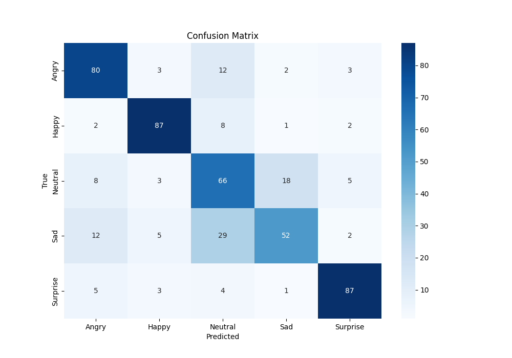

## Facial Expression Recognition (FER)

|   学号   |  姓名  |
| :------: | :----: |
| 20319045 | 刘冠麟 |

模型实现参考了**ResNeXt**，在ResNet-18的基础上参考了ResNeXt进行了改进，**将ResNet中的残差块改成了ResNeXt块，并且加入了dropout层**，同时通过多次对比实验（见附录），针对这次数据集简化并改进了ResNeXt。得益于数据预处理、强大的ResNeXt架构以及针对数据集的微调，模型整体表现优异，整体预测准确率为**74.4%**，远高于实验baseline给出49.8%，高出了**24.6%**。

### 任务描述

对于给定的人脸图片，输出其表情标签（图像分类任务）。

一共包含五种表情：Angry，Happy，Neutral，Sad，Surprise，已经进行了训练集和测试集的划分，数据规模如下（数据集中存在一定的不平衡）：

| 情绪标签 | 训练集样本数 | 测试集样本数 |
| :------: | :----------: | :----------: |
|  Angry   |     500      |     100      |
|  Happy   |     1500     |     100      |
| Neutral  |     1000     |     100      |
|   Sad    |     1500     |     100      |
| Surprise |     500      |     100      |


### 数据预处理的操作

#### 图像增强

由于给出的数据集样本量较少，为了在不增加实际数据数量的情况下扩展训练数据集，从而使模型能够更好地泛化到未见过的数据，需要通过数据增强来对训练数据进行随机变换来生成新的数据，从而增加训练数据的多样性。

在代码实现中，情感数据集模块中定义了`train_transform`，首先对数据集图片reshape成`(224,224)`的尺寸，在统一图像尺寸的同时方便输入网络训练。

然后规定在加载训练数据集时每个epoch中对数据集进行以下数据增强：

- 随机水平翻转、旋转图片。

- 随机调整图片的亮度、对比度、饱和度和色调。

  最后转化成张量并标准化。

```python
self.train_transform = transforms.Compose([  # 对训练集进行图像增强
    transforms.Resize(resize),
    transforms.RandomHorizontalFlip(),
    transforms.RandomRotation(10),
    transforms.ColorJitter(brightness=0.2, contrast=0.2, saturation=0.2, hue=0.1),
    transforms.ToTensor(),
    transforms.Normalize(mean=[0.485, 0.456, 0.406], std=[0.229, 0.224, 0.225])
])
```

实验证明，对图像进行数据增强能显著提升模型性能：

| 数据增强                                       | acc       |
| ---------------------------------------------- | --------- |
| 3 * ResNeXt层 + （0.2，0.4）dropout            | 67.8%     |
| 3 * ResNeXt层 + （0.2，0.4）dropout + 数据增强 | **71.6%** |

训练集和测试集acc曲线如下：


#### 平衡采样器

由任务描述可见，任务数据集的分布明显不均匀，Happy和Sad的数据集要明显多于其他类别的数据。数据分布不均可能造成模型偏差和过拟合，所以本实验中采用了**平衡采样器**，在数据加载时使用自定义采样器来平衡各类样本数量来处理不均匀数据集

在`EmotionDataModule`类中加载训练集时进行平衡采样：

```python
def get_dataloader(self, train):
    if train:
        dataset = EmotionDataset(root_dir=os.path.join(self.root_dir, 'train'), transform=self.train_transform)
        weights = calculate_weights(dataset)
        sampler = WeightedRandomSampler(weights, num_samples=len(weights), replacement=True)
        return DataLoader(dataset, batch_size=self.batch_size, sampler=sampler, num_workers=self.num_workers)
    else:
        dataset = EmotionDataset(root_dir=os.path.join(self.root_dir, 'test'), transform=self.val_transform)
    return DataLoader(dataset, batch_size=self.batch_size, shuffle=train, num_workers=self.num_workers)
```

其中计算数据集权重通过以下函数实现：

```python
def calculate_weights(dataset):
    label_counts = np.bincount(dataset.labels)
    total_samples = len(dataset.labels)
    weights = 1.0 / label_counts
    sample_weights = weights[dataset.labels]
    return sample_weights
```

实验证明，对图像进行数据增强能显著提升模型性能：

| 平衡数据分布                                                 | acc       |
| ------------------------------------------------------------ | --------- |
| 3 * ResNeXt层 + （0.2，0.4）dropout + 数据增强               | 71.6%     |
| 3 * ResNeXt层 + （0.2，0.4）dropout + 数据增强 + 平衡数据分布 | **74.4%** |

训练集和测试集acc曲线如下：


### 超参数设置

经过多次试验后，模型超参数设置如下：

```python
"""超参数"""
batch_size = 32
resize = (224, 224)
max_epochs = 70
num_gpus = 1
lr = 0.005
num_classes = 5
```

同时模型使用Adam优化器进行训练：

```python
def configure_optimizers(self):
    """使用adam优化器"""
    return torch.optim.Adam(self.parameters(), lr=self.lr)
```


### 模型架构设计

模型实现参考了**ResNeXt**论文《Aggregated Residual Transformations for Deep Neural Networks》(https://arxiv.org/pdf/1611.05431)，在ResNet-18的基础上参考了ResNeXt进行了改进，**将ResNet中的残差块改成了ResNeXt块，并且加入了dropout层**，同时通过多次对比实验（见附录），针对这次数据集简化并改进了ResNeXt。

对于每一个ResNeXt Block，其设计架构如下：


对于每一个ResNeXt层，由于数据集较小，为了防止过拟合，在两层ResNeXtBlock之间后加入了Dropout，并且通过实验证明，倒数第二个dropout层和倒数第一个dropout层分别选择0.2和0.4的丢弃率相对更好：

| dropout            | acc     |
| ------------------ | ------- |
| （0，0）(baseline) | 62.8%   |
| （0.2，0.4）       | **65%** |
| （0.3，0.5）       | 64.6%   |

实现代码如下：

```python
def block(self, num_ResNeXt, num_channels, first_block=False):
    blk = []
    for i in range(num_ResNeXt):
        if i == 0 and not first_block:
            blk.append(ResNeXtBlock(num_channels, 32, 1, use_1x1conv=True, strides=2))
        elif i==num_ResNeXt-2:
            blk.append(ResNeXtBlock(num_channels, 32, 1))
            blk.append(nn.Dropout(0.2))
        elif i==num_ResNeXt-1:
            blk.append(ResNeXtBlock(num_channels, 32, 1))
            blk.append(nn.Dropout(0.4))
    return nn.Sequential(*blk)
```


然后参考ResNet-18，对ResNeXt进行简化，因为数据集较小，对比实验可知使用三层简化的ResNeXt在此数据集中的表现效果要比原论文的四层的ResNeXt效果要更好，而增加到五层后由于参数量过多，模型过于庞大而导致过拟合：

| 层数                                                      | acc       |
| --------------------------------------------------------- | --------- |
| 三层` ((2, 64), (2, 128), (2, 256)) `                     | **67.8%** |
| 四层(baseline) ` ((2, 64), (2, 128), (2, 256), (2, 512))` | 65%       |
| 五层 `((2, 64), (2, 128), (2, 256), (2, 512),  (2, 512))` | 57.8%     |

由于在当前数据集下三层的效果最好，所以最终模型选用了三层的ResNeXt层。

实现代码如下：

```python
class ResNeXt18(ResNeXt):
    def __init__(self, lr, num_classes):
        super().__init__(((2, 64), (2, 128), (2, 256)),
                       lr, num_classes)
```


#### 验证方法（划分验证集进行验证）

在本次实验中使用了train文件夹中的训练集数据进行训练，并将预先划分好的测试集test作为验证集进行测试。并且进行如下方法进行验证：

- 预测准确率
- 每个类别的召回率
- 每个类别的精准率
- 每个类别的F1-Score
- Macro-F1 


#### 结果分析

运行`test.py`，可以得到如下结果：

| Class    | Precision | Recall | F1-Score |
| -------- | --------- | ------ | -------- |
| Angry    | 0.7477    | 0.8000 | 0.7729   |
| Happy    | 0.8614    | 0.8700 | 0.8657   |
| Neutral  | 0.5546    | 0.6600 | 0.6027   |
| Sad      | 0.7027    | 0.5200 | 0.5977   |
| Surprise | 0.8788    | 0.8700 | 0.8744   |

计算得到的Macro-F1 score为**0.7427**，预测准确率为**74.4%**，远高于实验给出49.8%的baseline。

同时得到如下混淆矩阵：




从实验结果中可以得到如下结论：

- 得益于数据预处理、强大的ResNeXt架构以及针对数据集的微调，模型整体表现优异，整体预测准确率为**74.4%**，远高于实验baseline给出49.8%，高出了**24.6%**。
- **对于Happy、Surprise以及Angry**：这三个类别的精确率、召回率和F1分数都较高，说明模型在识别这三个类别时表现较为稳定和优异，区分能力较强。
- **而对于Neutral和Sad**：这两个类别的精确率和召回率较低，尤其是**Neutural类别的精确率**和**Sad类别的召回率**，从混淆矩阵中也能看到，这两个类别在混淆矩阵中相邻颜色较深，也就是**说模型较为容易对中立和悲伤的表情混淆**，造成准确率下降，这也是模型需要改进的地方。


#### 自己的探索和心得体会

其实在选用ResNeTx作为base model之前也尝试过很多其他的架构，比如AlexNet、VGG、以及ConvNeXt等，最后发现实际上还是ResNet的表现最好。然后又开始尝试在ResNet的基础架构上寻找新的性能更好的模型，最后瞄准了同样较为出名的ResNeTx，经过测试后发现ResNeTx确实比ResNet要好上一点，而且在提供更强大的预测性能的同时由于分组卷积的存在还优化了训练和推理的速度，所以最终选择了ResNeTx。

而在自己尝试在原有模型的基础上改进时，由于给出的数据集较小，我主要的改进方向其实是**不断地更合理地对模型进行“剪枝”**，在模型的深度、宽度以及架构上都进行了尝试（如附录部分所示），最后**以减少过拟合为主要目标**，对模型的深度进行削减，同时增加两层dropout层，对模型针对数据集进行改进。最终结果也符合预期。

最后由于在同样的模型架构下，不进行预处理（**67.8%**）和进行预处理（**74.4%**）之间的差距非常大，这次实验还让我体会到了数据集以及数据集预处理的重要性。


#### 附录

| dropout            | acc     |
| ------------------ | ------- |
| （0，0）(baseline) | 62.8%   |
| （0.2，0.4）       | **65%** |
| （0.3，0.5）       | 64.6%   |

- （0，0）:

  

- （0.2，0.4）

  

- （0.3，0.5）:


| 层数                                                      | acc       |
| --------------------------------------------------------- | --------- |
| 三层` ((2, 64), (2, 128), (2, 256)) `                     | **67.8%** |
| 四层(baseline) ` ((2, 64), (2, 128), (2, 256), (2, 512))` | 65%       |
| 五层 `((2, 64), (2, 128), (2, 256), (2, 512),  (2, 512))` | 57.8%     |

- 三层：

  

- 四层：


- 五层：


| 数据增强                                       | acc       |
| ---------------------------------------------- | --------- |
| 3 * ResNeXt层 + （0.2，0.4）dropout            | 67.8%     |
| 3 * ResNeXt层 + （0.2，0.4）dropout + 数据增强 | **71.6%** |


| 平衡数据分布                                                 | acc       |
| ------------------------------------------------------------ | --------- |
| 3 * ResNeXt层 + （0.2，0.4）dropout + 数据增强               | 71.6%     |
| 3 * ResNeXt层 + （0.2，0.4）dropout + 数据增强 + 平衡数据分布 | **74.4%** |

