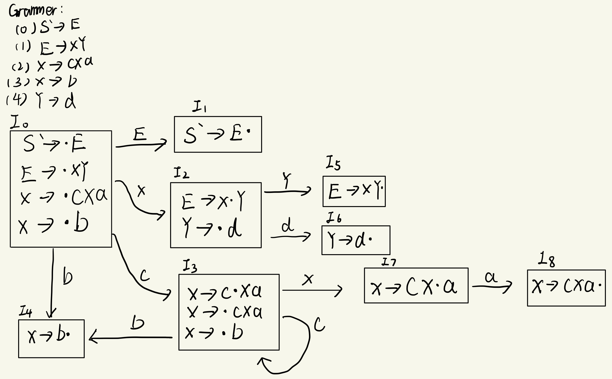
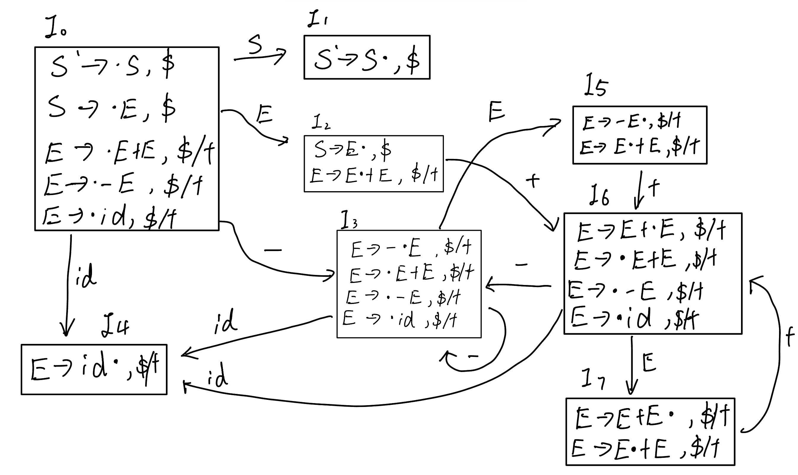

## hw3

#### 第一题

##### （1）求文法G的增广文法G'

增广文法 G'是在原文法G的基础上新增一个起始符号S'并引入相应的产生式

所以增广文法为：

```
S' -> E
E -> XY
X -> cXa|b
Y -> d
```

##### (2)



##### (3)

| State | ACTION |      |      |      |      | GOTO |      |      |      |
| :---: | :----: | :--: | :--: | :--: | :--: | :--: | :--: | :--: | :--: |
|       |   a    |  b   |  c   |  d   |  $   |  E   |  X   |  Y   |      |
|   0   |        |  s4  |  s3  |      |      |  1   |  2   |      |      |
|   1   |        |      |      |      | acc  |      |      |      |      |
|   2   |        |      |      |  s6  |      |      |      |  5   |      |
|   3   |        |  s4  |  s3  |      |      |      |  7   |      |      |
|   4   |   r3   |  r3  |  r3  |  r3  |  r3  |      |      |      |      |
|   5   |   r1   |  r1  |  r1  |  r1  |  r1  |      |      |      |      |
|   6   |   r4   |  r4  |  r4  |  r4  |  r4  |      |      |      |      |
|   7   |   s8   |      |      |      |      |      |      |      |      |
|   8   |   r2   |  r2  |  r2  |  r2  |  r2  |      |      |      |      |

##### (4)

在表中添加了一列以表述更清晰。

| State Stack | Stack | Input | Action |
| :---------: | :---: | :---: | ------ |
|      0      |   $   | cbad$ | s3     |
|     0 3     |  $c   | bad$  | s4     |
|    0 3 4    |  $cb  |  ad$  | r3     |
|    0 3 7    |  $cX  |  ad$  | s8     |
|   0 3 7 8   | $cXa  |  d$   | r2     |
|     0 2     |  $X   |  d$   | s6     |
|    0 2 6    |  $Xd  |   $   | r4     |
|    0 2 5    |  $XY  |   $   | r1     |
|     0 1     |  $E   |   $   | acc    |


#### 第二题

##### (1)构建该⽂法 LR(1)解析的 DFA

G的拓展文法G'如下：

```
S' -> S
S -> E
E -> E + E
E -> -E
E -> id
```

带向前搜索符的项目规范族如下：

```
I0 = 
S' -> .S, $
S -> .E, $
E -> .E+E, $/+
E -> -E, $/+
E -> id, $/+
```

由此构建出DFA：



##### (2)对每⼀个含有冲突的状态，列出状态的编号、引起冲突的输⼊符号、以及冲突 的类型；

| 状态编号 | 输入符号 |   冲突类型    |
| :------: | :------: | :-----------: |
|    I2    |    $     | 移进-规约冲突 |
|    I5    |   $/+    | 移进-规约冲突 |
|    I7    |   $/+    | 移进-规约冲突 |

##### (3)