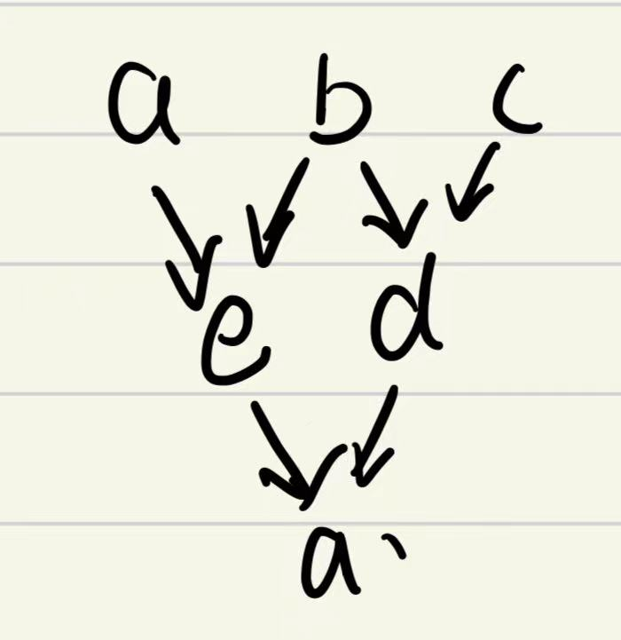

## 编译原理第四次作业

|   学号   |  姓名  |
| :------: | :----: |
| 20319045 | 刘冠麟 |

#### 第一题


##### **（1）用自然语言描述文法所定义语言**

文法定义了一种浮点数的格式，由一个小数点分隔的两个部分组成，两个部分都是由一个或多个数字组成，每个数字取值为0~9.形如：`3.14`、`0.56`、`025.56`。与正常浮点数不同的是，这里定义的格式整数部分前面若干位可以为0，比如`00035.6`。

##### （2）给出翻译模式 其语义为计算⼀个⼗进制 输⼊串的实数值

```kotlin
1. F → N . N { F.val = N1.val + N2.val / 10^N2.digits }
2. N → N D { N.val = 10 * N1.val + D.val; N.digits = N1.digits + 1 }
3. N → D   { N.val = D.val; N.digits = 1 }
4. D → 0|1|2|3|4|5|6|7|8|9  { D.val = 0|1|2|3|4|5|6|7|8|9 }
```

对于输入串`123.456`：

- 首先解析 `1 2 3`：

  ```kotlin
  N1 -> N2 3
  N2 -> N3 2
  N3 -> 1
  ```

  计算过程：

  ```kotlin
  N3.val = 1
  N3.digits = 1
  
  N2.val = 10 * N3.val + 2 = 10 * 1 + 2 = 12
  N2.digits = N3.digits + 1 = 1 + 1 = 2
  
  N1.val = 10 * N2.val + 3 = 10 * 12 + 3 = 123
  N1.digits = N2.digits + 1 = 2 + 1 = 3
  ```

- 然后解析 `4 5 6`：

  ```kotlin
  N4 -> N5 6
  N5 -> N6 5
  N6 -> 4
  ```

  计算过程：

  ```kotlin
  N6.val = 4
  N6.digits = 1
  
  N5.val = 10 * N6.val + 5 = 10 * 4 + 5 = 45
  N5.digits = N6.digits + 1 = 1 + 1 = 2
  
  N4.val = 10 * N5.val + 6 = 10 * 45 + 6 = 456
  N4.digits = N5.digits + 1 = 2 + 1 = 3
  ```

- 最后计算 `F` 的值：

  ```kotlin
  F.val = N1.val + N4.val / 10^N4.digits = 123 + 456 / 10^3 = 123 + 0.456 = 123.456
  ```

##### （3）根据（2）中的翻译模式画出输⼊串 1 2 . 3 4 的带注释的、带动作的分析树

分析树如下：


注释与计算动作如下：

```kotlin
1. D -> 1: D.val = 1
2. N -> D: N.val = D.val = 1, N.digits = 1

3. D -> 2: D.val = 2
4. N -> N D: N.val = 10 * N.val + D.val = 10 * 1 + 2 = 12, N.digits = 1 + 1 = 2

5. D -> 3: D.val = 3
6. N -> D: N.val = D.val = 3, N.digits = 1

7. D -> 4: D.val = 4
8. N -> N D: N.val = 10 * N.val + D.val = 10 * 3 + 4 = 34, N.digits = 1 + 1 = 2

9. F -> N . N: F.val = N1.val + N2.val / 10^N2.digits = 12 + 34 / 10^2 = 12 + 0.34 = 12.34
```


#### 第二题


##### （1）构造该基本块的有向⽆环图(Directed Acyclic Graph，简称 DAG)；

分析代码：

`d = b * c`：依赖于 b和c生成 d

`e = a + b`：依赖于a和b生成e

`f = a - c`：依赖于a和c生成f

`b = b * c`：依赖于b和c重新定义b，生成b’

`a = e - d`：依赖于 e和d重新定义a，生成a‘

构造如下：


##### （2）基于假设分别对构造出来的 DAG 对基本块进⾏优 化。

**假设1：仅变量 a 在基本块的出口是活跃的**

在这种假设下，我们只关心最终变量 `a` 的值。所有不会影响 `a` 的语句都可以被优化掉。

根据DAG分析，`a` 依赖于 `e` 和 `d`，而 `e` 又依赖于 `a1` 和 `b1`，`d` 依赖于 `b1` 和 `c`。在这里我们不考虑重新定义的 `b2`，因为它在 `a2` 的计算中并未用到。考虑到这些依赖关系，我们可以简化如下：

1. `d = b * c`
2. `e = a + b`
3. `a = e - d`

优化后的代码：

```kotlin
d = b * c
e = a + b
a = e - d
```

优化出的DAG如下：



**假设2：变量 f 和 a 在基本块的出口均是活跃的**

在这种情况下，我们需要保留对变量 `f` 和 `a` 都产生影响的计算。

1. `a` 是由 `e` 和 `d` 计算得到的。
2. `d` 是由 `b1` 和 `c` 计算得到的。
3. `e` 是由 `a1` 和 `b1` 计算得到的。
4. `f` 是由 `a1` 和 `c` 计算得到的。
5. `a1` 是初始的 `a` 变量。
6. `b2` 是由 `b1` 和 `c` 计算得到的。

在这种情况下，**所有的计算都需要保留**，因为 `b2` 的重新定义会影响到后续的 `a` 的计算，并且 `f` 也必须保留。


#### 第三题

##### （1）划分基本块并画出控制流图

**基本块 B0**：

```kotlin
1: 		x = 0
2: 		y = 0
```

**基本块 B1**：

```kotlin
3: L0: 	if n / 2 goto L1
```

**基本块 B2**：

```kotlin
4: 		x = x + n
5: 		y = y + 1
6: 		goto L2
```

**基本块 B3**：

```kotlin
7: L1: 	y = y + n
8:		c = 4 / 2
9: 		t1 = x * c
10: 	t2 = c - 1
11: 	x = x + t2
```

**基本块 B4**：

```kotlin
12: L2: n = n - 1
13: 	if n > 0 goto L0
```

**基本块 B5**：

```kotlin
14: 	return x
```

基本块图示为：


##### （2）对第 7-11 条指令⽚段，列出两种代码优化⽅法

**优化方法一：常量传播与常量折叠**

通过计算在编译时即可确定的常量表达式来简化代码。$B_3$中可以对`c=4/2`进行常量折叠，对't2 = c - 1'进行常量传播和折叠：

```kotlin
7: y = y + n
8: c = 2      // 4 / 2
9: t1 = x * 2
10: t2 = 1    // 2 - 1
11: x = x + 1
```

**优化方法二：死代码消除**

`t1` 变量的计算结果 `x * 2` 并未被使用，所以这一行可以被移除。

```kotlin
7: y = y + n
8: c = 2      // 4 / 2
9: t2 = 1     // 2 - 1
10: x = x + 1
```

进一步优化（结合常量折叠和死代码消除）：

```kotlin
7: y = y + n
8: x = x + 1  // 直接将 x + 1 替代原有的多余操作
```


##### （3）在最终⽣成的⽬标代码中，Func 被调⽤时如何访问到 n、x 和 y? 

由于最终生成的目标代码中函数内只有参数n、局部变量y和x。

假定 `Func` 函数的栈布局如下,栈从高地址向低地址增长：

```
| 高地址  ...   |
| 返回地址      | <-- $fp + 8
| 参数 n       | <-- $fp + 4
| 旧的 $fp     | <-- $fp
| 局部变量 x    | <-- $fp - 4
| 局部变量 y    | <-- $fp - 8
| 低地址  ...   |
```

使用栈指针（\$sp）和帧指针（\$fp）来管理这些变量：

**参数 n**: 参数 `n` 是通过帧指针 `$fp` 加上一个偏移量来访问的。假设 `n` 在帧指针上方的第一个位置，它的偏移量是 `$fp + 4`。

```bash
lw $t0, 4($fp)    # 将参数 n 加载到寄存器 $t0
```

**局部变量 x 和 y**: 局部变量通常位于帧指针之下。假设 `x` 和 `y` 分别是第一个和第二个局部变量，它们的偏移量分别是 `$fp - 4` 和 `$fp - 8`。

```bash
# 访问局部变量 x
sw $t1, -4($fp)   # 将寄存器 $t1 中的值存储到局部变量 x
lw $t1, -4($fp)   # 将局部变量 x 的值加载到寄存器 $t1

# 访问局部变量 y
sw $t2, -8($fp)   # 将寄存器 $t2 中的值存储到局部变量 y
lw $t2, -8($fp)   # 将局部变量 y 的值加载到寄存器 $t2
```


#### 第四题

给定控制流图：


##### （1）节点 8 的直接⽀配（immediate **dominator**）?

控制流图中，如果**所有从入口节点到节点B的路径都必须经过节点A，则节点A支配节点B**。直接支配是指离节点**最近**的支配节点。到达节点8必须通过的节点是1、2、3，而离节点8最近的支配节点是3，所以节点8的直接支配（**dominator**）是节点3.

##### （2）画出该 CFG 的⽀配树（dominator tree）；

由以下三个规则：

- 如果从初始节点到 N 的每一条路径都经过 D，则 D 支配 N。
- 每个节点都支配其自身。
- 初始节点支配所有其他节点。

得到节点与支配表如下：

| 节点 | 支配（dominates） |
| :--: | :---------------: |
|  1   |        1-8        |
|  2   |        2-8        |
|  3   |        3-8        |
|  4   |         4         |
|  5   |       5，7        |
|  6   |         6         |
|  7   |         7         |
|  8   |         8         |

可以得到支配树如下：


##### （3）列举出该 CFG 中的所有⾃然循环（natural loops），给出循环的头节点和其他 节点。

首先找到back edge：

```
2 -> 1
6 -> 3
8 -> 2
```

结合支配表，可以找到Loop Induced如下：

| back edge |  Loop Induced   |
| :-------: | :-------------: |
|  2 -> 1   |      {1,2}      |
|  6 -> 3   |    {3,4,5,6}    |
|  8 -> 2   | {2,3,4,5,6,7,8} |


