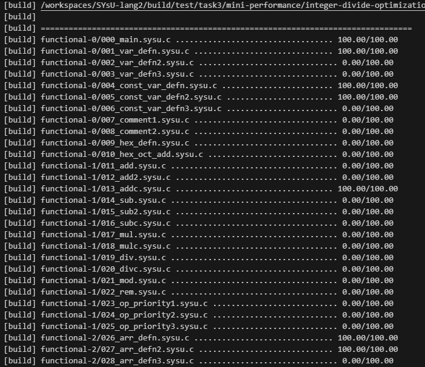
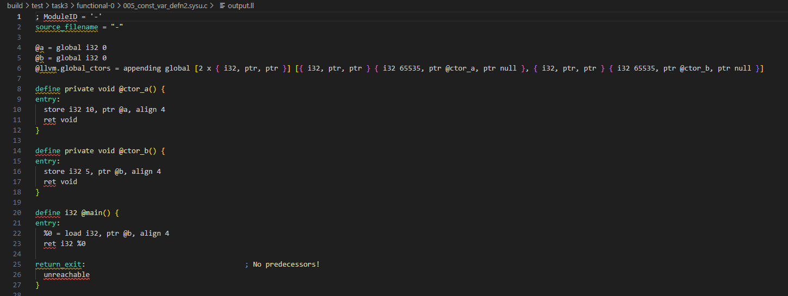

## quiz4

| 学号     | 姓名   |
| -------- | ------ |
| 20319045 | 刘冠麟 |


#### 第一大题

1. 对于aacBb，由于cB是句柄，所以该句型的可行前缀是包括cB在内的所有前缀，而且不能越过句柄，所以可以知道活前缀为：
   - a
   - aa
   - aac
   - aacB

2. LR(1)、SLR和LALR的关联关系：
   - SLR、LALR和LR(1)都是自底向上的语法。
   - 解析能力:LR(1) > LALR(1) > SLR > LR(0)
   - SLR：SLR意为simple LR，使用从LR（0）导出的FIRST/FOLLOW中获取向前看的信息，可以保持和LR(0)一样大小的分析表。
   - 对于LR(1)：表示**从左到右**扫描输入、反向构造最**右**推导、向前看**一个**字符。在三者中提供最强大的解析能力，但是其代价是计算成本更高、分析表更大。
   - LALR：LALR意为look ahead LR，使用与 SLR(1) 相同的 LR(0) 自动机进行更精细的向前看分析。LALR是对LR(1)的优化，减少了状态数量但保留了大部分解析能力，解析能力比SLR更强。

3. 不构成。因为在Y.y = f(A.a, Z.z)中非终结符 Y 的属性 y 依赖于Z的属性z,而在生成式中Z在Y的右侧,不符合L-SSD的定义。

4. 不可以。因为如果A.a是综合属性的话，它的值就会依赖于A的子节点，也就是X，Y，Z。即有可能依赖于Y。而由于规则二中Y.y = f(A.a, X.x)中Y.y会由A.a决定，而A.a又有可能被Y的属性推出，这就会产生循环，所以不可以为综合属性。

5. SDT形式：

   ```
   A -> X {Y.y = f(A.a, X.x)} Y Z
   ```

   

#### 第二大题

测例总数：



测例结果：

005：

