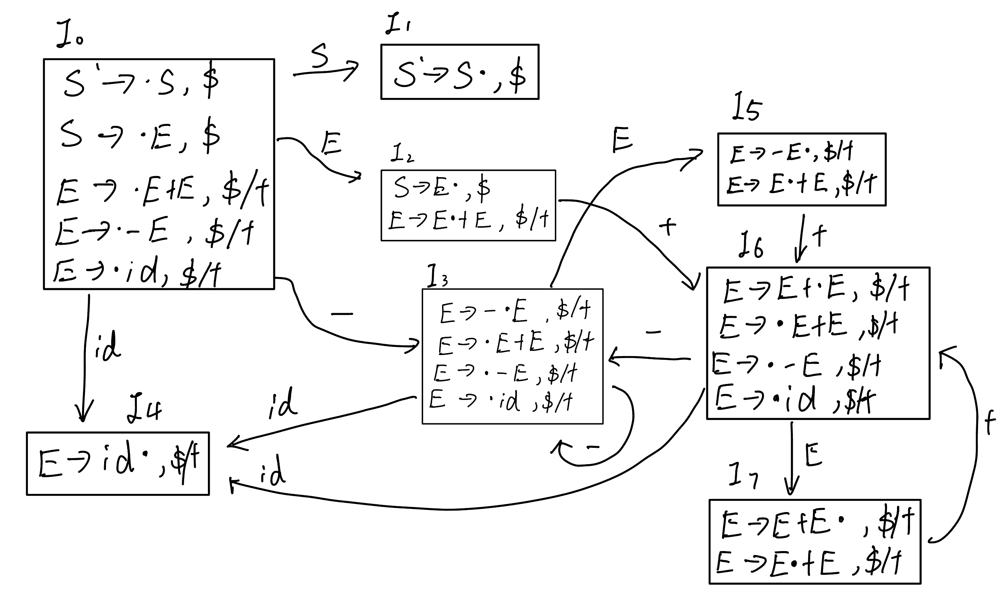

## hw3

|   学号   |  姓名  |
| :------: | :----: |
| 20319045 | 刘冠麟 |

#### 第一题

##### （1）求文法G的增广文法G'

增广文法 G'是在原文法G的基础上新增一个起始符号S'并引入相应的产生式

所以增广文法为：

```
S' -> E
E -> XY
X -> cXa|b
Y -> d
```

##### (2)


##### (3)

| State | ACTION |      |      |      |      | GOTO |      |      |      |
| :---: | :----: | :--: | :--: | :--: | :--: | :--: | :--: | :--: | :--: |
|       |   a    |  b   |  c   |  d   |  $   |  E   |  X   |  Y   |      |
|   0   |        |  s4  |  s3  |      |      |  1   |  2   |      |      |
|   1   |        |      |      |      | acc  |      |      |      |      |
|   2   |        |      |      |  s6  |      |      |      |  5   |      |
|   3   |        |  s4  |  s3  |      |      |      |  7   |      |      |
|   4   |   r3   |  r3  |  r3  |  r3  |  r3  |      |      |      |      |
|   5   |   r1   |  r1  |  r1  |  r1  |  r1  |      |      |      |      |
|   6   |   r4   |  r4  |  r4  |  r4  |  r4  |      |      |      |      |
|   7   |   s8   |      |      |      |      |      |      |      |      |
|   8   |   r2   |  r2  |  r2  |  r2  |  r2  |      |      |      |      |

##### (4)

在表中添加了一列以表述更清晰。

| State Stack | Stack | Input | Action |
| :---------: | :---: | :---: | ------ |
|      0      |   $   | cbad$ | s3     |
|     0 3     |  $c   | bad$  | s4     |
|    0 3 4    |  $cb  |  ad$  | r3     |
|    0 3 7    |  $cX  |  ad$  | s8     |
|   0 3 7 8   | $cXa  |  d$   | r2     |
|     0 2     |  $X   |  d$   | s6     |
|    0 2 6    |  $Xd  |   $   | r4     |
|    0 2 5    |  $XY  |   $   | r1     |
|     0 1     |  $E   |   $   | acc    |


#### 第二题

##### (1)构建该⽂法 LR(1)解析的 DFA

G的拓展文法G'如下：

```
S' -> S
S -> E
E -> E + E
E -> -E
E -> id
```

带向前搜索符的项目规范族如下：

```
I0 = 
S' -> .S, $
S -> .E, $
E -> .E+E, $/+
E -> -E, $/+
E -> id, $/+
```

由此构建出DFA：



##### (2)对每⼀个含有冲突的状态，列出状态的编号、引起冲突的输⼊符号、以及冲突 的类型；

| 状态编号 | 输入符号 |   冲突类型    |
| :------: | :------: | :-----------: |
|    I2    |    $     | 移进-规约冲突 |
|    I5    |   $/+    | 移进-规约冲突 |
|    I7    |   $/+    | 移进-规约冲突 |

##### (3)画出句⼦ id + − id + id 的所有分析树，并判断⽂法 G 是否具有⼆义性；

句子在此文法下共有三种分析树，如下：


##### (4)

**优先级**:

- 负号在语法分析树中处于加号的下一层，所以其优先级比加号高。
- 加号的优先级低于负号。
- **优先级**: `- > +`

**结合性**:

- 加号是**左结合**的，表达式中从左到右进行计算。
- 负号是**右结合**的。

##### (5)

在I5的“移进-规约”冲突中：

```
I5:
E -> -E. , $/+
E -> E.+E, $/+
```

由于负号的优先级比加号的高，所以应该优先选择规约。


#### 第三题

##### (1)

G1的拓广文法G3及其编号如下：

```
G3:
(0)S' -> S
(1)S -> E+T
(2)E -> (E)
(3)E -> a
(4)T -> b
```

##### (2)

DFA如下：


##### (3)

LR(0)分析表如下：

| State | ACTION |      |      |      |      |      | GOTO |      |      |
| :---: | :----: | :--: | :--: | :--: | :--: | :--: | :--: | :--: | :--: |
|       |   a    |  b   |  （  |  ）  |  +   |  $   |  S   |  E   |  T   |
|   0   |   s4   |      |  s3  |      |      |      |  1   |  2   |      |
|   1   |        |      |      |      |      | acc  |      |      |      |
|   2   |        |      |      |      |  s5  |      |      |      |      |
|   3   |   s4   |      |  s3  |      |      |      |      |  6   |      |
|   4   |   r3   |  r3  |  r3  |  r3  |  r3  |  r3  |      |      |      |
|   5   |        |  s8  |      |      |      |      |      |      |  7   |
|   6   |        |      |      |  s9  |      |      |      |      |      |
|   7   |   r1   |  r1  |  r1  |  r1  |  r1  |  r1  |      |      |      |
|   8   |   r4   |  r4  |  r4  |  r4  |  r4  |  r4  |      |      |      |
|   9   |   r2   |  r2  |  r2  |  r2  |  r2  |  r2  |      |      |      |


##### (4)

分析栈变化及动作表如下：

| Step# | Symbols Stack | States Stack | Input  | Action |
| :---: | :-----------: | :----------: | :----: | :----: |
|   0   |       $       |      0       | (a)+b$ |   s3   |
|   1   |      $(       |     0 3      | a)+b$  |   s4   |
|   2   |      $(a      |    0 3 4     |  )+b$  |   r3   |
|   3   |      $(E      |    0 3 6     |  )+b$  |   s9   |
|   4   |     $(E)      |   0 3 6 9    |  +b$   |   r2   |
|   5   |      $E       |     0 2      |  +b$   |   s5   |
|   6   |     $E +      |    0 2 5     |   b$   |   s8   |
|   7   |    $E + b     |   0 2 5 8    |   $    |   r4   |
|   8   |     $E+T      |   0 2 5 7    |   $    |   r1   |
|   9   |      $S       |     0 1      |   $    |  acc   |


##### (5)

存在冲突。因为该状态中既存在规约`T->b.`也存在移进（`T->b.E`），而LR(0)没有向前看的能力，所以当存在规约和移进在同一个状态中同时出现时在LR(0)分析过程中发生"移进-规约"冲突。

若使用SLR(1)，则要看`FOLLOW(T)`是否与E推出的第一个终结符存在交集，对G2文法中T求FOLLOW集如下：

```
FOLLOW(S) = $
FOLLOW(T) = FOLLOW(S) = $
```

所以`FOLLOW(T)`只包含`{$}`。

该状态中存在移进`T->b.E`，而在此状态中

```
E -> .(E)
E -> .a
```

而`FOLLOW(T)`与`{(,a}`不存在交集，即通过SLR(1)判断出不存在"移入-规约"冲突。

所以可以通过SLR(1)可以解析该冲突。


##### (6)简述 LR(1)是如何进⼀步改进 SLR(1) 分析技术的，并基于 LR(1)有效项⽬构造 识别⽂法 G2 所有活前缀的 DFA 初始状态

SLR(1)是通过使用FOLLOW集来决定规约时机的，即对于文法

```
X -> X.aY
V -> X.
```

SLR(1)通过判断冲突的条件为：

- 两个产生式处于同一个状态中
- FOLLOW(V)与{a}存在交集

而FOLLOW集包含所有可能在特定非终结符之后出现的终结符。SLR(1)在某些情况下可能过于保守，因为FOLLOW集可能包含不相关的符号，从而导致“移进-规约”冲突。”规约-规约“冲突同理。


而LR(1)中每个项目不仅包含一个项集和点的位置，还包括一个特定的向前看符号。这使得LR(1)分析器能够更加精确地决定是否规约，因为它只在向前看符号匹配的情况下才进行规约。

同样的例子，LR(1)判断冲突的条件除了判断是否处于同一个状态以外，只需**判断两条产生式包括的向前看符号集是否存在交集**即可，而不是判断更加粗糙笼统的FOLLOW(V)。这使得LR(1)的状态划分更加细致，能够区分更多的解析场景，减少冲突。


LR(1)中G2的DFA的初始状态：

```
I0:
S -> .E+T, $
E -> .(E), +
E -> .a, +
```

