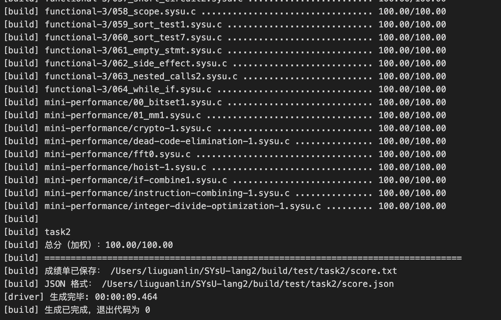
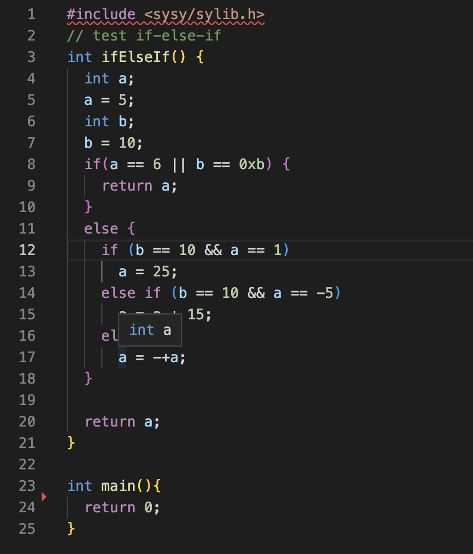
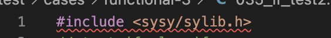
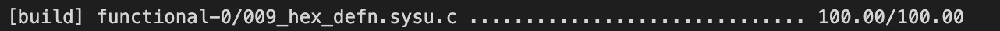
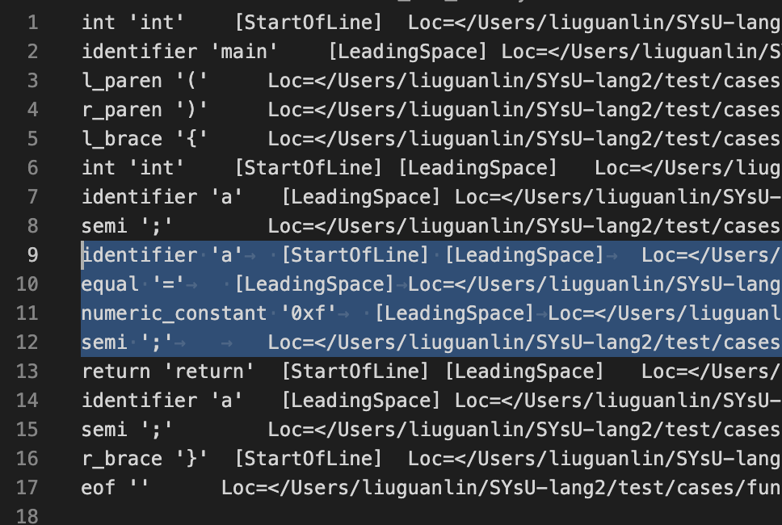
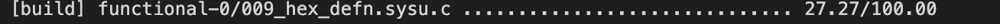

## Task2-语法分析器

|   学号   |  姓名  |
| :------: | :----: |
| 20319045 | 刘冠麟 |

### 实验结果

### 改进建议

#### 某些测试样例安排得不太妥当

测例中出现的情况个人觉得应该循环递进，将新的结构或者类型一起出现容易让人难以定位问题，比如测例35:

在这个测例中**if-elseif-else、逻辑与或和函数的定义**同时第一次出现。

我认为应该将**考察函数定义单独划分为一种类型的测例**，而不是混杂在其他类型的测例中，否则会让人以为是当前测例考察的文法出了错误，从而花费大量的时间重复推导、编写原本已经正确的文法和cpp代码。

我在实验时其他的if测例都能通过，唯独这一条不能通过，我一开始以为是if-else的文法定义或者`|| &&`的定义有问题，修改和尝试很久以后才逐渐定位到原来是函数的声明没有能够处理导致出错，导致浪费了大量的时间在错误的方向上。

#### 应该提示一下`#include`	语句考察的实际上是函数的声明（或者说提示一下会转换成函数声明）

在测例根目录中`test\cases`中未编译的源码如下：

然而实际上真正进行测试输入的源码是在`build`文件夹下的`test\cases`，在这里面源码中的include会被转化成一系列函数声明：

我一开始发现凡是有`#include`的测例都出现了断错误，本来以为是没能处理include，反复查看lexer、文法和测例后才发现是没能处理函数声明

#### 应该提供较为简便的测试自己编写测例的途径

现在的版本想要测试自己修改或者编写的测例来定位问题，只能修改根目录`test\cases`下的测例并且删除`build`文件夹后再重新构建才能测试，这个过程比较漫长，很浪费时间，而且有忘记备份修改测例的风险。

还有群中提到的**修改task1\answer.txt**的方法治标不治本，这种方法**只是修改了输入的token流，用来对比的答案并不会因此改变**，只能用来定位导致ABORT或者断错误等导致文件输出错误的问题，对于其他情况需要更改源代码进行定位的情况并不适用。比如对于原本能通过测例09：

我删除answer.txt中选中的行：

测试的结果分数反而下降了，推测是因为答案已经生成（根据根目录下的源代码），修改answer.txt后反而导致没有识别被删除的token从而导致分数下降：

所以我觉得应该提供一种快速测试自定义测例的途径。

#### 助教团队都非常非常认真细心负责!!教学上已经非常好了，这点不需要改进^ ^

