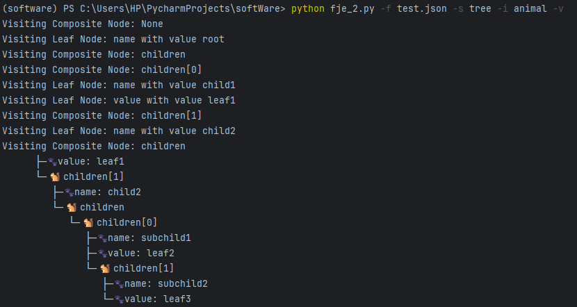

# Funny JSON Explorer 设计文档-V2

### 介绍与使用说明

Funny JSON Explorer（**FJE**），是一个JSON文件可视化的命令行界面小工具：

- 使用python编写完成，**支持所有复杂json格式文档**的可视化；
- FJE可以快速切换**风格**（style），并且内置了包括树形（tree）和矩形（rectangle）在内的两种两种可视化风格的实现；
- 也可以指定**图标族**（icon family），为中间节点或叶节点指定一套icon。工具自带超过五种图标族，同时使用者也**可以自行更改配置文件**修改或者添加个性化的图标族；
- 程序采用了抽象工厂的设计模式，使用者可以在不改变原有代码的情况下添加新的风格。
- **后续更改了第二版，增加了迭代器+访问者模式**

#### 使用方法

将`fje.py`文件存放到要进行可视化的json文件的同一个文件夹下，运行以下指令：

```shell
python fje.py -f <json file> -s <style> -i <icon family>
```

程序就可以读取目标json文件，并将其可视化内容以指定的风格以及图标族在命令行中输出。

假如指定输出风格为矩形`rectangle`，图标族为`tree`，则在命令行中输入以下指令：

```shell
python fje.py -f test.json -s rectangle -i tree
```

则可以得到如下风格的可视化输出：

```
┌─🌳library──────────────────────────────────────────────────┐
│  ├─🌳books─────────────────────────────────────────────────┤
│  │  ├─🌳books[0]───────────────────────────────────────────┤
│  │  │  ├─🍂title: Effective Java───────────────────────────┤
│  │  │  ├─🌳editions────────────────────────────────────────┤
│  │  │  │  ├─🌳editions[0]──────────────────────────────────┤
│  │  │  │  │  ├─🍂edition: 1────────────────────────────────┤
│  │  │  │  │  └─🍂year: 2001────────────────────────────────┤
│  │  │  │  ├─🌳editions[1]──────────────────────────────────┤
│  │  │  │  │  ├─🍂edition: 2────────────────────────────────┤
│  │  │  │  │  └─🍂year: 2008────────────────────────────────┤
│  │  ├─🌳books[1]───────────────────────────────────────────┤
│  │  │  ├─🍂title: Clean Code───────────────────────────────┤
│  │  │  ├─🌳editions────────────────────────────────────────┤
│  │  │  │  ├─🌳editions[0]──────────────────────────────────┤
│  │  │  │  │  ├─🍂edition: 1────────────────────────────────┤
│  │  │  │  │  └─🍂year: 2008────────────────────────────────┤
│  ├─🌳magazines─────────────────────────────────────────────┤
│  │  ├─🌳magazines[0]───────────────────────────────────────┤
│  │  │  ├─🍂title: The Pragmatic Programmer─────────────────┤
│  │  │  └─🍂year: 2019──────────────────────────────────────┤
│  │  ├─🌳magazines[1]───────────────────────────────────────┤
│  │  │  ├─🍂title: Code Complete────────────────────────────┤
│  │  │  └─🍂year: 2004──────────────────────────────────────┤
│  ├─🌳newspapers────────────────────────────────────────────┤
│  │  ├─🌳daily──────────────────────────────────────────────┤
│  │  │  ├─🍂name: The Times─────────────────────────────────┤
│  │  │  ├─🌳sections────────────────────────────────────────┤
│  │  │  │  ├─🍂sections[0]: news────────────────────────────┤
│  │  ├─🌳weekly─────────────────────────────────────────────┤
│  │  │  ├─🍂name: The Sunday Times──────────────────────────┤
│  │  │  ├─🌳sections────────────────────────────────────────┤
│  │  │  │  ├─🍂sections[0]: news────────────────────────────┤
│  │  │  │  ├─🍂sections[1]: lifestyle───────────────────────┤
└──┴──┴──┴──┴─🍂sections[2]: magazine────────────────────────┘
```

同时可以通过修改代码中的配置文件添加新的图标族：

```python
    icon_family = {
        'default': [' ', ' '],
        'tree': ['🌳', '🍂'],
        'star': ['⭐️', '✨'],
        'animal': ['🐿️', '🐾'],
        'tech': ['💻', '📱'],
        'food': ['🍎', '🍏'],
    }[args.icon]
```

例如增加`happy`图标族：

```python
    icon_family = {
        'default': [' ', ' '],
        'tree': ['🌳', '🍂'],
        'star': ['⭐️', '✨'],
        'animal': ['🐿️', '🐾'],
        'tech': ['💻', '📱'],
        'food': ['🍎', '🍏'],
        'happy': ['👌', '😄'],
    }[args.icon]
```

指定风格为`gesture`：

```shell
python fje.py -f test.json -s rectangle -i gesture
```

输出如下：

```
├─😄name: root
└─👌children
   └─👌children[0]
      ├─😄name: child1
      ├─😄value: leaf1
      └─👌children[1]
         ├─😄name: child2
         └─👌children
            └─👌children[0]
               ├─😄name: subchild1
               ├─😄value: leaf2
               └─👌children[1]
                  ├─😄name: subchild2
                  └─😄value: leaf3
```

**第二版更新：**

增加了访问者模式，**增加了迭代器+访问者模式**，代码中引入了Visitor接口。

指令增加了参数`--visit, -v`，可以在命令行中执行访问者操作。为了演示起见，这里只实现了访问模式中访问节点树结构的操作。后续使用者可以根据需求自行增加访问者操作。

```shell
python fje.py -f test.json -s tree -i animal -v
```



### 设计模式

第二版设计模式，**增加了迭代器+访问者模式**，对代码进行了重构，类图也有所变化和更新。

#### 类图

更新后类图如下：


第二版新增了两个模块：

##### 迭代器模式：

**迭代器模式**是一种行为设计模式，它提供了一种方法顺序访问一个聚合对象中的各个元素，而又不需要暴露该对象的内部表示。迭代器模式将遍历聚合对象的行为封装到迭代器对象中，从而使得遍历行为和聚合对象的实现分离开。

第二版中迭代器模式体现在 `JSONIterator` 类，用于迭代地遍历 JSON 数据结构，用于遍历复杂的 JSON 数据结构，并将其逐步展开，以便构建相应的节点结构。

```python
class JSONIterator:
    """
    JSON迭代器
    """

    def __init__(self, json_data):
        self.stack = [(None, json_data)]

    def __iter__(self):
        return self

    def __next__(self):
        if not self.stack:
            raise StopIteration

        key, value = self.stack.pop()
        if isinstance(value, dict):
            for k, v in reversed(list(value.items())):
                self.stack.append((k, v))
            return key, value, 'dict'
        elif isinstance(value, list):
            for i, v in reversed(list(enumerate(value))):
                self.stack.append((f"{key}[{i}]", v))
            return key, value, 'list'
        else:
            return key, value, 'leaf'
```


##### 访问者模式

访问者模式是一种行为设计模式，允许在不改变对象结构的情况下添加新的操作。它将操作的逻辑从对象结构中分离出来，使得使用者可以在对象结构不变的情况下添加新的操作。

在第二版中，访问者模式用于处理树形节点（包括叶子节点和复合节点）：

- **Visitor（访问者）接口**：定义了访问不同类型节点的方法。这里包括 `visit_leaf_node` 和 `visit_composite_node` 方法。
- **具体访问者类（PrintVisitor）**：实现 `Visitor` 接口中的方法。它定义了访问具体节点时要执行的操作。PrintVisitor` 类定义了如何访问和打印叶子节点和复合节点。
- **Node（节点）接口**：定义了节点的基本行为，包括接受访问者的 `accept` 方法和显示节点的 `display` 方法。
- **具体节点类（TreeLeafNode 和 TreeCompositeNode）**：实现 `Node` 接口。每个节点类都实现了 `accept` 方法，用于接受访问者并调用访问者的相应方法。

-------

### 设计模式（第一版）

#### 类图

程序类图如下：


#### 设计模式说明

##### 工厂方法

工厂方法模式是一种创建型设计模式，提供了一种将实例化延迟到子类的方法，使得一个类的实例化延迟到子类实现。

程序中`NodeFactory` 抽象类定义了用于创建节点的方法，具体的节点工厂类如 `TreeNodeFactory` 和 `RectangleNodeFactory` 则实现了这些方法，以创建相应的节点类型。创建对象的责任被延迟到子类，代码不需要知道实例化的具体类，体现了工厂方法模式的应用。实现了节点创建的灵活性和扩展性，使得程序可以轻松地支持不同类型的节点和展示风格。

##### 抽象工厂方法

抽象工厂模式提供一个接口，用于创建一系列相关或相互依赖的对象，而无需指定它们的具体类。通过使用抽象工厂模式，可以在不改变客户端代码的情况下更换产品系列。

- **抽象工厂类 `NodeFactory`**：定义了两个方法 `create_leaf_node` 和 `create_composite_node`，用于创建叶子节点和复合节点。
- **具体工厂类 `TreeNodeFactory` 和 `RectangleNodeFactory`**：分别实现了创建树形结构节点和矩形结构节点的方法。


#####  组合模式

组合模式用于将对象组合成树形结构以表示“部分-整体”的层次结构。组合模式使得用户对单个对象和组合对象的使用具有一致性。

- **抽象基类 `Node`**：定义了 `display` 方法，用于展示节点信息。
- **具体类 `TreeLeafNode` 和 `TreeCompositeNode`**：实现了树形结构的叶子节点和复合节点。
- **具体类 `RectangleLeafNode` 和 `RectangleCompositeNode`**：实现了矩形结构的叶子节点和复合节点。


##### 建造者模式

建造者模式将一个复杂对象的构建与它的表示分离，使得同样的构建过程可以创建不同的表示。通过建造者模式，可以一步步地创建一个复杂的对象。

- **类 `JSONBuilder`**：接收一个节点工厂和图标族，通过解析 JSON 数据来构建节点树。

  


#### 运行截图

采用树风格和矩形风格，并且使用`tree`和`animal`图标族的运行结果如下：

（1）


（2）


（3）


（4）


#### 源代码库

公开可访问的Github repo URL：https://github.com/BasaErmi/Funny-JSON-Explorer-FJE

