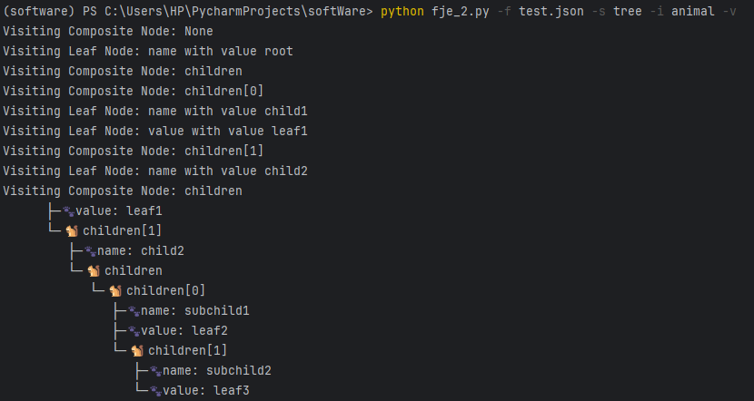

# Funny JSON Explorer 设计文档-V2

### 介绍与使用说明

Funny JSON Explorer（**FJE**），是一个JSON文件可视化的命令行界面小工具：

- 使用python编写完成，**支持所有复杂json格式文档**的可视化；
- FJE可以快速切换**风格**（style），并且内置了包括树形（tree）和矩形（rectangle）在内的两种两种可视化风格的实现；
- 也可以指定**图标族**（icon family），为中间节点或叶节点指定一套icon。工具自带超过五种图标族，同时使用者也**可以自行更改配置文件**修改或者添加个性化的图标族；
- 程序采用了抽象工厂的设计模式，使用者可以在不改变原有代码的情况下添加新的风格。
- **后续更改了第二版，增加了迭代器+访问者模式**

#### 使用方法

将`fje.py`文件存放到要进行可视化的json文件的同一个文件夹下，运行以下指令：

```shell
python fje.py -f <json file> -s <style> -i <icon family>
```

程序就可以读取目标json文件，并将其可视化内容以指定的风格以及图标族在命令行中输出。

假如指定输出风格为矩形`rectangle`，图标族为`tree`，则在命令行中输入以下指令：

```shell
python fje.py -f test.json -s rectangle -i tree
```

则可以得到如下风格的可视化输出：

```
┌─🌳library──────────────────────────────────────────────────┐
│  ├─🌳books─────────────────────────────────────────────────┤
│  │  ├─🌳books[0]───────────────────────────────────────────┤
│  │  │  ├─🍂title: Effective Java───────────────────────────┤
│  │  │  ├─🌳editions────────────────────────────────────────┤
│  │  │  │  ├─🌳editions[0]──────────────────────────────────┤
│  │  │  │  │  ├─🍂edition: 1────────────────────────────────┤
│  │  │  │  │  └─🍂year: 2001────────────────────────────────┤
│  │  │  │  ├─🌳editions[1]──────────────────────────────────┤
│  │  │  │  │  ├─🍂edition: 2────────────────────────────────┤
│  │  │  │  │  └─🍂year: 2008────────────────────────────────┤
│  │  ├─🌳books[1]───────────────────────────────────────────┤
│  │  │  ├─🍂title: Clean Code───────────────────────────────┤
│  │  │  ├─🌳editions────────────────────────────────────────┤
│  │  │  │  ├─🌳editions[0]──────────────────────────────────┤
│  │  │  │  │  ├─🍂edition: 1────────────────────────────────┤
│  │  │  │  │  └─🍂year: 2008────────────────────────────────┤
│  ├─🌳magazines─────────────────────────────────────────────┤
│  │  ├─🌳magazines[0]───────────────────────────────────────┤
│  │  │  ├─🍂title: The Pragmatic Programmer─────────────────┤
│  │  │  └─🍂year: 2019──────────────────────────────────────┤
│  │  ├─🌳magazines[1]───────────────────────────────────────┤
│  │  │  ├─🍂title: Code Complete────────────────────────────┤
│  │  │  └─🍂year: 2004──────────────────────────────────────┤
│  ├─🌳newspapers────────────────────────────────────────────┤
│  │  ├─🌳daily──────────────────────────────────────────────┤
│  │  │  ├─🍂name: The Times─────────────────────────────────┤
│  │  │  ├─🌳sections────────────────────────────────────────┤
│  │  │  │  ├─🍂sections[0]: news────────────────────────────┤
│  │  ├─🌳weekly─────────────────────────────────────────────┤
│  │  │  ├─🍂name: The Sunday Times──────────────────────────┤
│  │  │  ├─🌳sections────────────────────────────────────────┤
│  │  │  │  ├─🍂sections[0]: news────────────────────────────┤
│  │  │  │  ├─🍂sections[1]: lifestyle───────────────────────┤
└──┴──┴──┴──┴─🍂sections[2]: magazine────────────────────────┘
```

同时可以通过修改代码中的配置文件添加新的图标族：

```python
    icon_family = {
        'default': [' ', ' '],
        'tree': ['🌳', '🍂'],
        'star': ['⭐️', '✨'],
        'animal': ['🐿️', '🐾'],
        'tech': ['💻', '📱'],
        'food': ['🍎', '🍏'],
    }[args.icon]
```

例如增加`happy`图标族：

```python
    icon_family = {
        'default': [' ', ' '],
        'tree': ['🌳', '🍂'],
        'star': ['⭐️', '✨'],
        'animal': ['🐿️', '🐾'],
        'tech': ['💻', '📱'],
        'food': ['🍎', '🍏'],
        'happy': ['👌', '😄'],
    }[args.icon]
```

指定风格为`gesture`：

```shell
python fje.py -f test.json -s rectangle -i gesture
```

输出如下：

```
├─😄name: root
└─👌children
   └─👌children[0]
      ├─😄name: child1
      ├─😄value: leaf1
      └─👌children[1]
         ├─😄name: child2
         └─👌children
            └─👌children[0]
               ├─😄name: subchild1
               ├─😄value: leaf2
               └─👌children[1]
                  ├─😄name: subchild2
                  └─😄value: leaf3
```

**第二版更新：**

增加了访问者模式，**增加了迭代器+访问者模式**，代码中引入了Visitor接口。

指令增加了参数`--visit, -v`，可以在命令行中执行访问者操作。为了演示起见，这里只实现了访问模式中访问节点树结构的操作。后续使用者可以根据需求自行增加访问者操作。

```shell
python fje.py -f test.json -s tree -i animal -v
```

