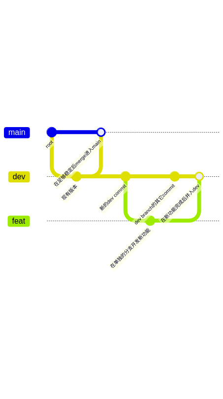
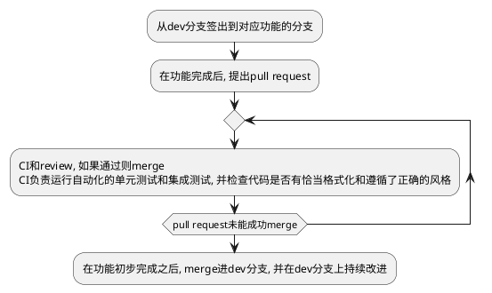
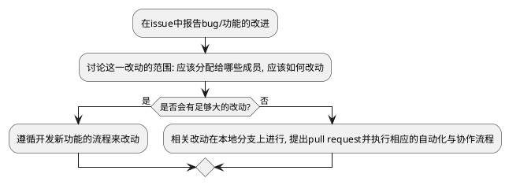

# 工作流程

我们使用了git这一分布式版本管理工具, 并且使用了monorepo的风格, 将我们的应用以及所有模块都在同一个git repo中实现.

我们使用的分支模型如下:

我们用github这一平台来实现我们的自动化和协作流程, 在开发新功能时, 我们遵循如下的流程:

在改进现有功能和修复bug时, 我们遵循如下的流程:

我们的CD脚本会对每个dev分支上的提交在成功构建时打包对应的可执行文件, 生成pre-release;
对每个main分支上的提交在成功构建时生成一个release并分发.

# 具体工作措施

我们的事项追踪通过github的issue系统和project系统来实现: 每个要实现的功能和要修复的bug都会新建一个issue,
github提供了将issue分配给具体的人的功能, project则负责将一个模块对应的一些功能和要修复的bug绑定成一个project,
同时追踪和显示. 另外, project系统也提供了milestone功能, 我们利用这一功能来维护和追踪下一个release前应该完成的工作,
以便发布releases.

由于是桌面应用程序, 我们发布时无需进行运行环境管理. 我们在CD上的运行环境由github提供的matrix功能完成,
我们创建了一个操作系统和运行环境的矩阵, CD自动在这个矩阵中的所有运行环境上运行.

我们的包管理, 脚手架和测试功能均由rust语言自身提供. rust有自己的cargo包管理工具, 可以自动追踪和维护项目的所有依赖,
甚至包括ocr模型这种外部依赖. rust自身有完整的单元测试和集成测试工具链, 可以直接在CI中使用 `cargo test` 运行.
我们对每个模块都有单元测试系统, 并且对整个应用也有集成测试; rust的工具链保证了所有这些测试代码都只在测试环境中生效,
单元测试可以以模块自身的视角访问每个模块内的方法, 而集成测试则只能以外部用户的视角访问模块.
rust的工具链也保证了所有这些测试会并行地运行.

我们还利用CD工具从项目的提交记录中生成了改动日志等发布信息.
