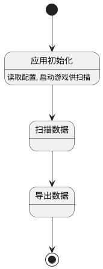
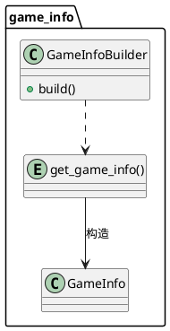
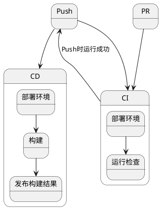

应用的整体状态如下:

```plantuml
@startuml
[*] --> start
start --> scan
scan --> export
export --> [*]

state start as "应用初始化"
state scan as "扫描数据"
state export as "导出数据"
start: 读取配置, 启动游戏供扫描
@enduml
```

# 系统控制: 窗口焦点管理和分辨率控制

这两个模块是初始化部分的一部分.

这是game_info包的一部分, 类图如下:

```plantuml
@startuml
    package game_info {
        entity get_game_info as "get_game_info()"
        class GameInfoBuilder {
            +build()
        }
        class GameInfo {}
        GameInfoBuilder ..> get_game_info
        get_game_info --> GameInfo: 构造
    }
@enduml
```

`get_game_info()` 负责获取和设置游戏窗口的基本属性, 其中就包括了将游戏窗口置于前台和初始化游戏的分辨率.

# CI & CD

系统的状态图如下:

```plantuml
@startuml

Push --> CI
PR --> CI

CI --> Push: Push时运行成功
Push --> CD

state CI {
    state cienv as "部署环境"
    state chk as "运行检查"
    cienv --> chk
}

state CD {
    state cdenv as "部署环境"
    state build as "构建"
    state deploy as "发布构建结果"
    cdenv --> build
    build --> deploy
}
@enduml
```
