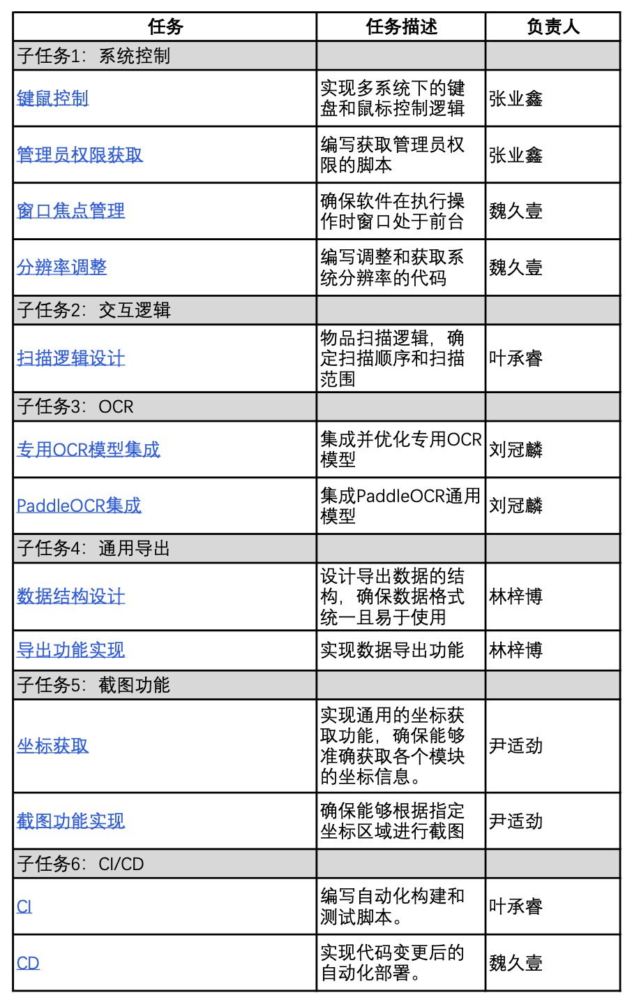

# Yas 团队分工

|   学号   |      姓名      |                          分工                          | 贡献率 |
| :------: | :------------: | :----------------------------------------------------: | :----: |
| 20319045 | 刘冠麟（组长） | 项目组织与管理、文档整理与汇总、OCR设计与Coding、答辩  |  17%   |
| 21307302 |     叶承睿     | 项目代码核心架构Coding、交互逻辑与CI设计与Coding、答辩 |  19%   |
| 21307365 |     张业鑫     |        软件工程协作化设计、系统控制设计与Coding        |  16%   |
| 21307332 |     尹适劲     |        软件配置与运维设计、截图功能设计与Coding        |  16%   |
| 21307364 |     林梓博     |        软件工程自动化设计、通用导出设计与Coding        |  16%   |
| 21307385 |     魏久壹     |      软件测试与质量保证设计、系统控制设计与Coding      |  16%   |

***需求工程、系统建模与架构设计由所有组员共同完成，并由组长统一汇总。**

# 详细任务描述与分工

# 具体贡献

| 子任务\小组成员 | 刘冠麟 | 叶承睿 | 张业鑫 | 尹适劲 | 林梓博 | 魏久壹 |
| :-------------: | :----: | :----: | :----: | :----: | :----: | :----: |
|    系统控制     |   -    |   -    |  50%   |   -    |   -    |  50%   |
|    交互逻辑     |   -    |  100%  |   -    |   -    |   -    |   -    |
|       OCR       |  100%  |   -    |   -    |   -    |   -    |   -    |
|    通用导出     |   -    |   -    |   -    |   -    |  100%  |   -    |
|    截图功能     |   -    |   -    |   -    |  100%  |   -    |   -    |
|      CI/CD      |   -    |  50%   |   -    |   -    |   -    |  50%   |

