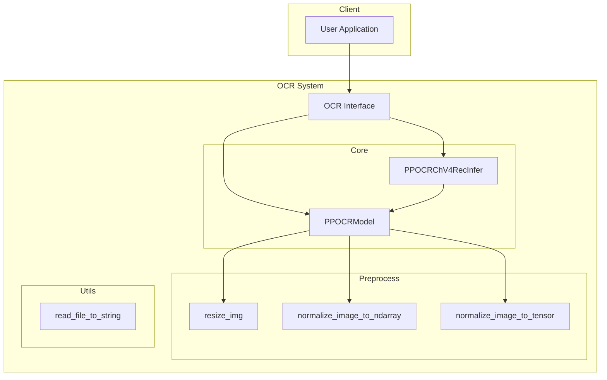
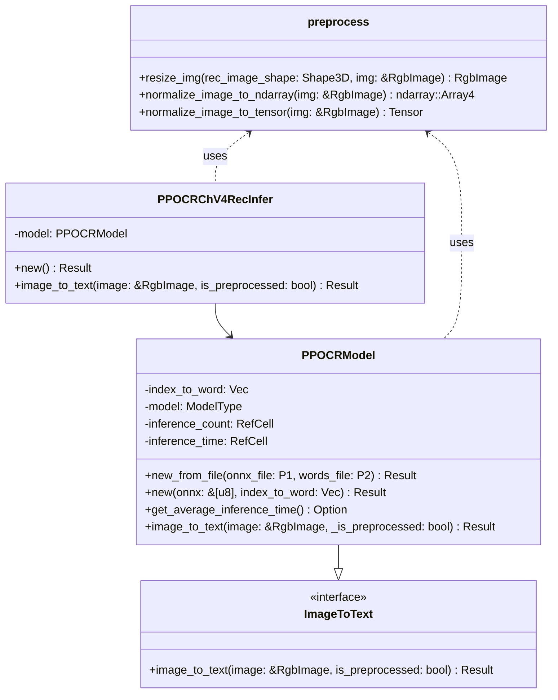
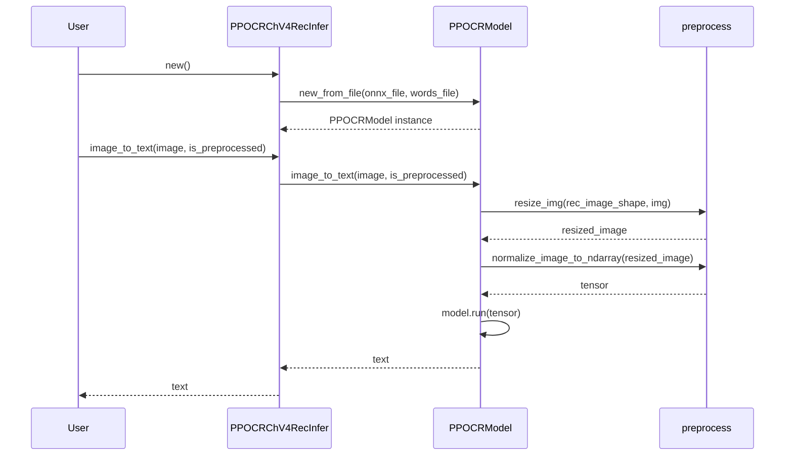
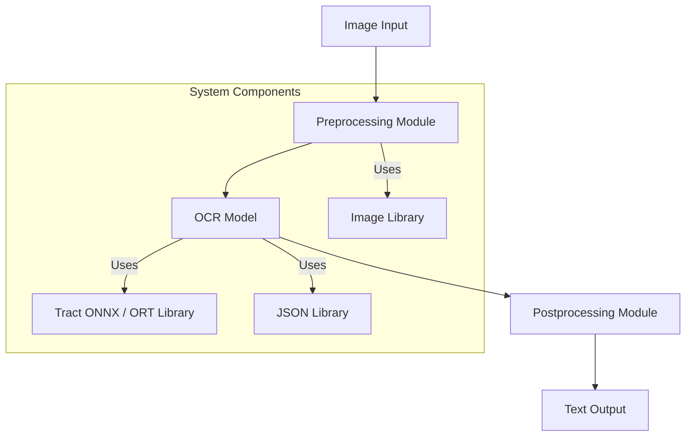
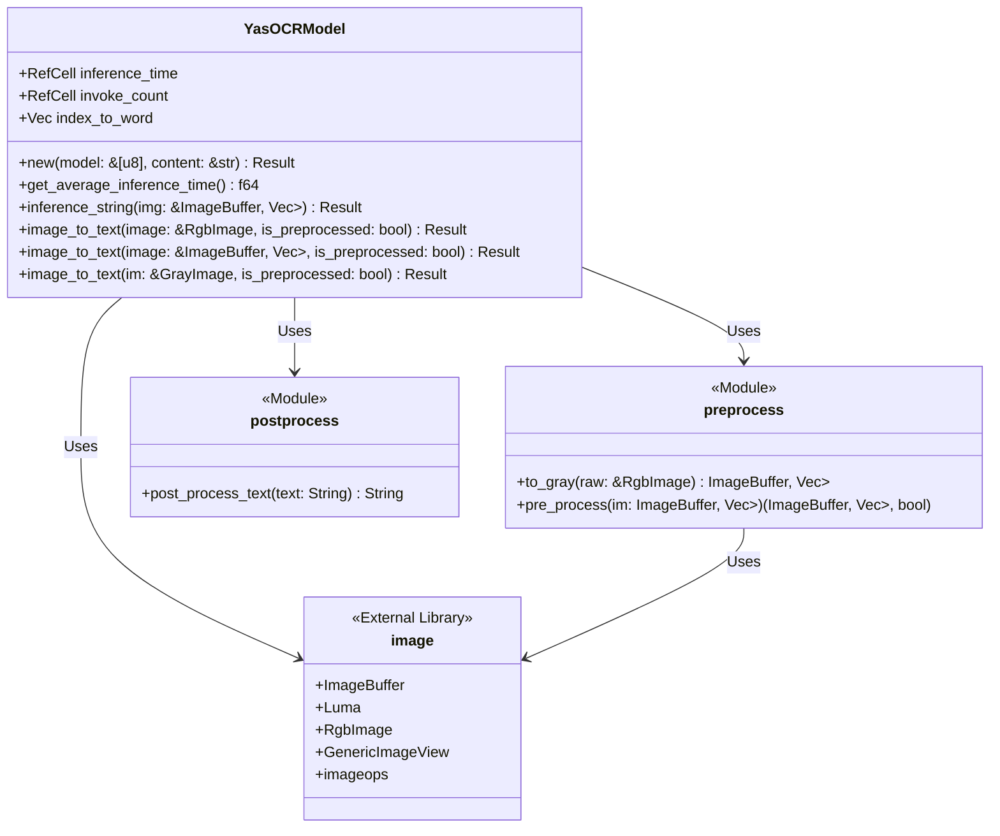
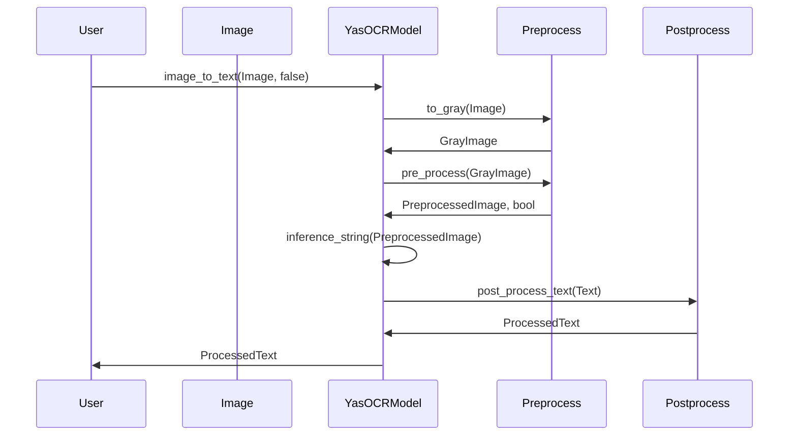

## OCR架构设计

### PaddleOCR系统架构

#### 技术栈
- **编程语言**：Rust
- **模型框架**：ONNX、Tract、ORT
- **图像处理**：Image crate
- **依赖管理**：Cargo
- **版本控制**：Git

#### 架构图


### 模块/子系统描述与接口设计

#### 1. OCR Interface
**描述**：提供用户与系统交互的接口，包含OCR模型初始化和图像到文本的转换功能。

**接口设计**：
- `fn new_from_file(onnx_file: P1, words_file: P2) -> Result<PPOCRModel>`
- `fn new(onnx: &[u8], index_to_word: Vec<String>) -> Result<Self>`
- `fn image_to_text(&self, image: &RgbImage, _is_preprocessed: bool) -> Result<String>`
- `fn get_average_inference_time(&self) -> Option<Duration>`

#### 2. Core
**描述**：核心逻辑，包括OCR模型的实现和推理功能。

**接口设计**：
- `PPOCRModel` 类：实现OCR模型的初始化和推理。
- `PPOCRChV4RecInfer` 类：封装了`PPOCRModel`，提供高级接口。

#### 3. Preprocess
**描述**：提供图像预处理功能，包括调整图像大小和归一化。

**接口设计**：
- `fn resize_img(rec_image_shape: Shape3D, img: &RgbImage) -> RgbImage`
- `fn normalize_image_to_ndarray(img: &RgbImage) -> ndarray::Array4<f32>`
- `fn normalize_image_to_tensor(img: &RgbImage) -> Tensor`

#### 4. Utils
**描述**：提供实用功能，如文件读取。

**接口设计**：
- `fn read_file_to_string(path: &Path) -> Result<String>`

### 核心模块设计

#### 类图


#### 序列图
以下是一个使用OCR模型将图像转换为文本的序列图。



### 设计模式

#### 1. 工厂模式
用于创建PPOCRModel和PPOCRChV4RecInfer实例，提供更灵活的对象创建方式。

#### 2. 装饰模式
PPOCRChV4RecInfer作为PPOCRModel的装饰器，提供了更高级的接口和功能封装。

#### 3. 策略模式
在图像归一化过程中，根据编译特性选择不同的归一化策略（normalize_image_to_ndarray或normalize_image_to_tensor）。


### YasOCR系统架构

#### 技术栈
- **编程语言**: Rust
- **图像处理库**: `image`
- **神经网络推理库**: `tract_onnx` 或 `ort`
- **数据序列化/反序列化**: `serde_json`

#### 架构图


### 模块/子系统
#### 描述与接口设计
- **Preprocessing Module**:
  - **接口**: `to_gray`, `pre_process`
  - **功能**: 将RGB图像转换为灰度图像，并进行标准化、裁剪、调整尺寸等预处理步骤。

- **OCR Model**:
  - **接口**: `new`, `inference_string`, `image_to_text`
  - **功能**: 加载OCR模型并对预处理后的图像进行文字识别，输出文本。

- **Postprocessing Module**:
  - **接口**: （假设）`post_process_text`
  - **功能**: 对模型输出的文本进行后处理，如格式化、校正等。

### 核心模块设计
#### 类图


#### 序列图


### 设计模式
#### 工厂模式
用于创建OCR模型实例。

```rust
pub macro yas_ocr_model($model_name:literal, $index_to_word:literal) {
    {
        let model_bytes = include_bytes!($model_name);
        let index_to_word = include_str!($index_to_word);

        YasOCRModel::new(
            model_bytes, index_to_word,
        )
    }
}
```

#### 单例模式
在模型加载和推理过程中使用`RefCell`来管理统计数据，确保推理时间和调用次数的唯一性。

```rust
impl YasOCRModel {
    fn inc_statistics(&self, time: f64) {
        let mut count_handle = self.invoke_count.borrow_mut();
        *count_handle += 1;

        let mut time_handle = self.inference_time.borrow_mut();
        *time_handle += time;
    }

    pub fn get_average_inference_time(&self) -> f64 {
        let count = *self.invoke_count.borrow();
        let total_time = *self.inference_time.borrow();
        total_time / count as f64
    }
}
```
