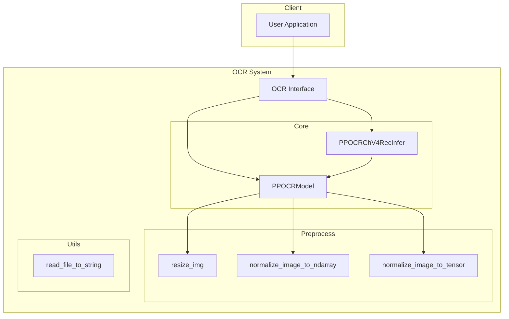
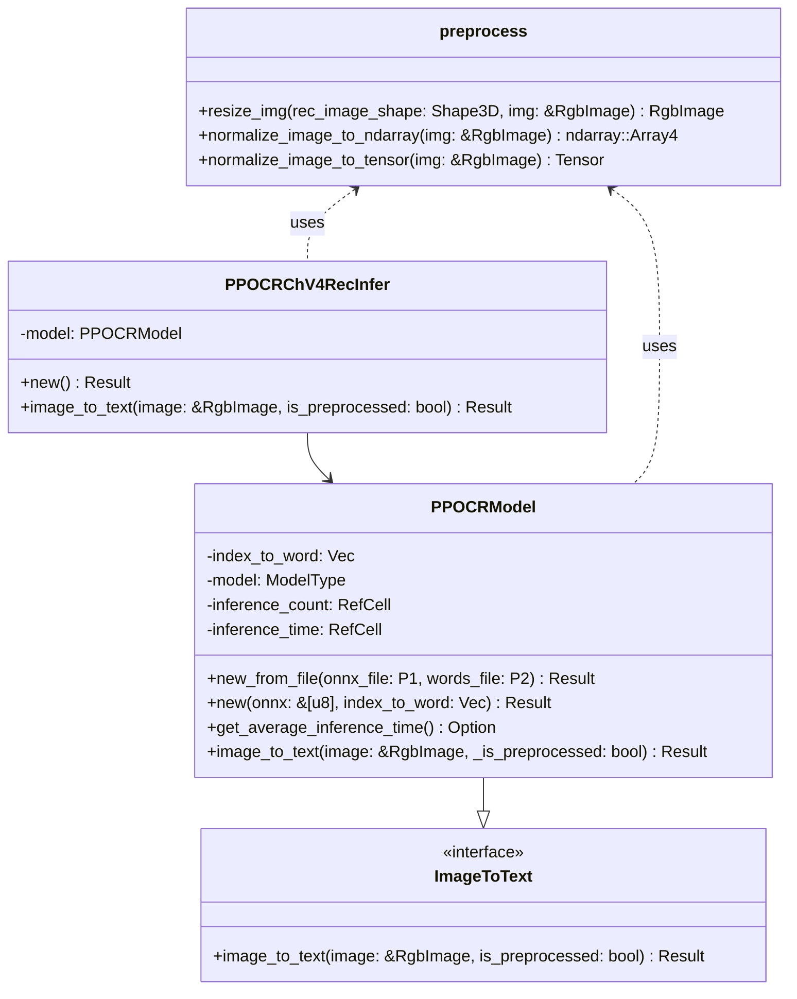
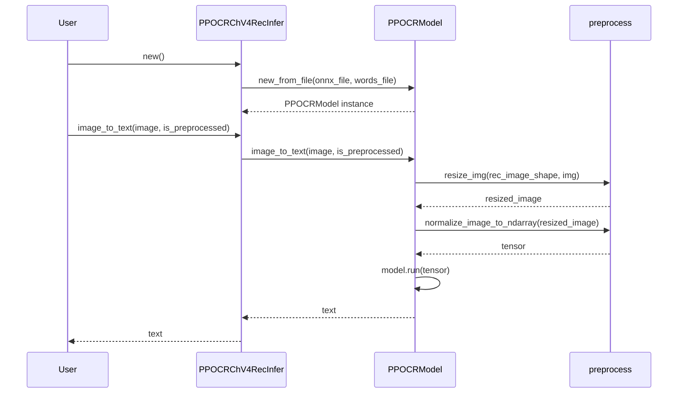
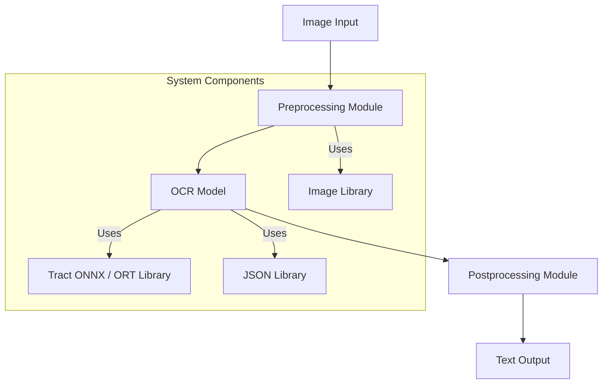
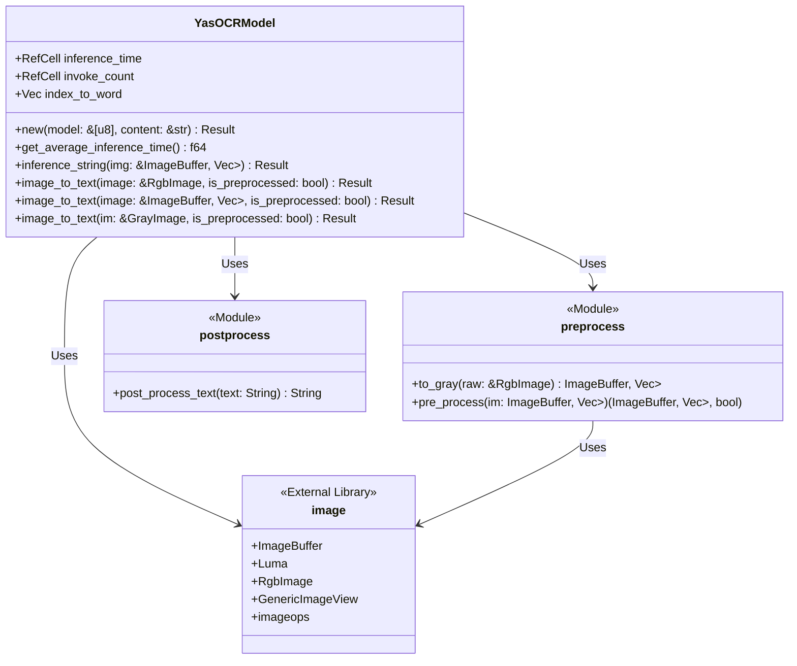
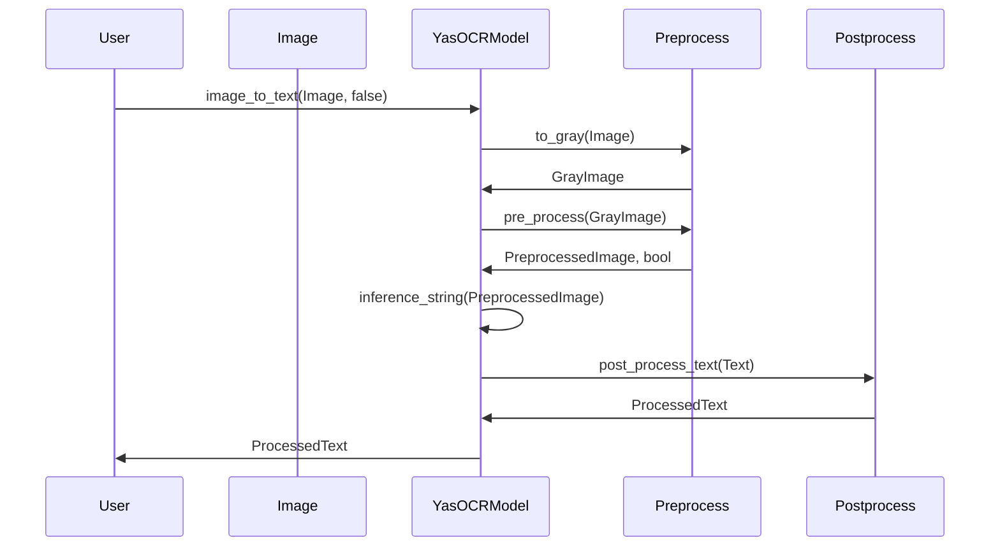
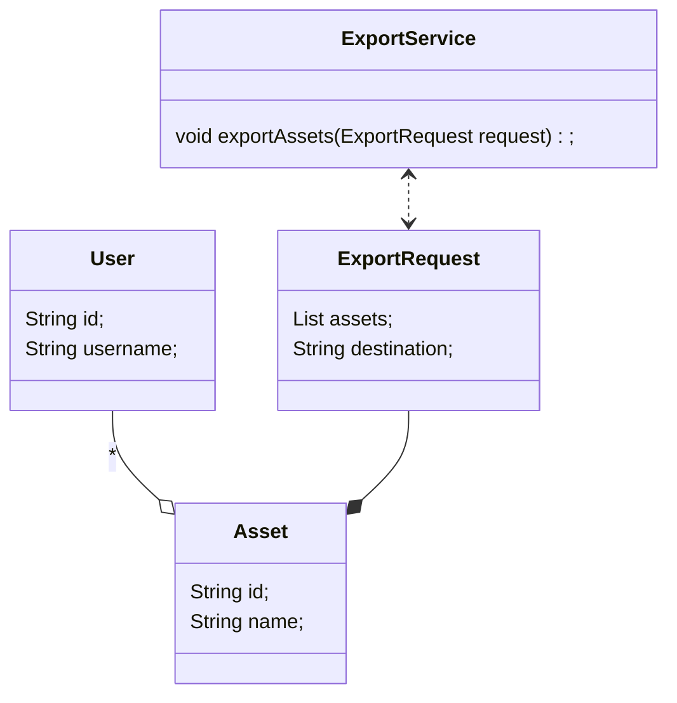
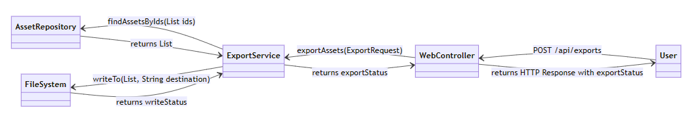

## Yas(Yet Another Genshin Impact Scanner) 架构设计报告

组内组员分工如下：


### 子任务1：系统控制

我们的这一任务集中在 `get_game_info() `函数中, 它的任务就是简单地调用系统调用, 调整游戏窗口的分辨率以及设置一些系统参数, 以及根据系统调用返回的结果构造相应的` GameInfo` 对象.

我们根据不同系统重载了这一函数, 使得在不同的系统上能够使用相同的接口正确地设置游戏窗口和系统, 并得到正确的` GameInfo` 对象.

#### **设计模式**

(1) 策略模式：

使用策略模式来实现不同平台的系统控制功能。通过定义一个系统控制接口，并为每个平台提供不同的实现，从而实现灵活的策略切换。


### 子任务2：交互逻辑

#### 系统概述

本系统提供一个高效、准确的数据处理和分析平台，结合图像识别技术和数据分析技术，自动化处理大量数据，支持数据存储、查询和分析功能。系统特别针对游戏玩家提供圣遗物扫描与识别工具，通过游戏截图自动从游戏内提取圣遗物信息，以满足用户对数据快速访问和深入分析的需求。

####  主要组件

1. **图像捕获器/模块**：负责从游戏窗口或用户提供的游戏截图中捕获圣遗物的图像信息。
2. **图像处理模块**：对捕获的图像进行预处理，提高OCR识别的准确率。
3. **OCR模块/识别模块**：将预处理后的图像转换为文本信息，用于后续的数据处理。
4. **数据解析模块**：解析OCR识别出的文本，提取圣遗物的关键信息，支持后续的查询和分析。
5. **数据处理模块**：对采集到的数据进行预处理，包括数据清洗、格式转换等，以适应后续处理的需要。

#### 关键设计决策

1. **模块化设计**：系统采用模块化设计，将不同的功能划分为独立的模块，提高代码的可维护性和可扩展性。
2. **异步处理**：考虑到图像捕获、处理和OCR识别可能是耗时操作，系统采用异步处理方式，提高系统的响应速度。
3. **错误处理与日志记录**：系统具备完善的错误处理机制和日志记录功能，便于问题的诊断和解决。
4. **扩展性与安全性**：系统设计时考虑到未来可能的功能扩展和数据安全，提供了足够的接口和抽象层，同时采取了多种安全措施。

####  技术栈

1. **Rust**：系统的核心模块使用Rust语言开发，利用其高性能和安全性特点。
2. **OCR技术**：采用先进的OCR技术进行图像到文本的转换，确保数据识别的准确性。


### 子任务3：OCR

**PaddleOCR系统架构**：

#### 技术栈

- **编程语言**：Rust
- **模型框架**：ONNX、Tract、ORT
- **图像处理**：Image crate
- **依赖管理**：Cargo
- **版本控制**：Git

#### 架构图



#### 模块/子系统描述与接口设计

##### 1. OCR Interface

**描述**：提供用户与系统交互的接口，包含OCR模型初始化和图像到文本的转换功能。

**接口设计**：

- `fn new_from_file(onnx_file: P1, words_file: P2) -> Result<PPOCRModel>`
- `fn new(onnx: &[u8], index_to_word: Vec<String>) -> Result<Self>`
- `fn image_to_text(&self, image: &RgbImage, _is_preprocessed: bool) -> Result<String>`
- `fn get_average_inference_time(&self) -> Option<Duration>`

##### 2. Core

**描述**：核心逻辑，包括OCR模型的实现和推理功能。

**接口设计**：

- `PPOCRModel` 类：实现OCR模型的初始化和推理。
- `PPOCRChV4RecInfer` 类：封装了`PPOCRModel`，提供高级接口。

##### 3. Preprocess

**描述**：提供图像预处理功能，包括调整图像大小和归一化。

**接口设计**：

- `fn resize_img(rec_image_shape: Shape3D, img: &RgbImage) -> RgbImage`
- `fn normalize_image_to_ndarray(img: &RgbImage) -> ndarray::Array4<f32>`
- `fn normalize_image_to_tensor(img: &RgbImage) -> Tensor`

##### 4. Utils

**描述**：提供实用功能，如文件读取。

**接口设计**：

- `fn read_file_to_string(path: &Path) -> Result<String>`

#### 核心模块设计

##### 类图



##### 序列图

以下是一个使用OCR模型将图像转换为文本的序列图。



### 设计模式

#### 1. 工厂模式

用于创建PPOCRModel和PPOCRChV4RecInfer实例，提供更灵活的对象创建方式。

#### 2. 装饰模式

PPOCRChV4RecInfer作为PPOCRModel的装饰器，提供了更高级的接口和功能封装。

#### 3. 策略模式

在图像归一化过程中，根据编译特性选择不同的归一化策略（normalize_image_to_ndarray或normalize_image_to_tensor）。


**YasOCR系统架构：**

#### 技术栈

- **编程语言**: Rust
- **图像处理库**: `image`
- **神经网络推理库**: `tract_onnx` 或 `ort`
- **数据序列化/反序列化**: `serde_json`

#### 架构图



#### 模块/子系统

##### 描述与接口设计

- **Preprocessing Module**:
  - **接口**: `to_gray`, `pre_process`
  - **功能**: 将RGB图像转换为灰度图像，并进行标准化、裁剪、调整尺寸等预处理步骤。

- **OCR Model**:
  - **接口**: `new`, `inference_string`, `image_to_text`
  - **功能**: 加载OCR模型并对预处理后的图像进行文字识别，输出文本。

- **Postprocessing Module**:
  - **接口**: （假设）`post_process_text`
  - **功能**: 对模型输出的文本进行后处理，如格式化、校正等。

#### 核心模块设计

##### 类图



##### 序列图



#### 设计模式

##### 工厂模式

用于创建OCR模型实例。

```rust
pub macro yas_ocr_model($model_name:literal, $index_to_word:literal) {
    {
        let model_bytes = include_bytes!($model_name);
        let index_to_word = include_str!($index_to_word);

        YasOCRModel::new(
            model_bytes, index_to_word,
        )
    }
}
```

##### 单例模式

在模型加载和推理过程中使用`RefCell`来管理统计数据，确保推理时间和调用次数的唯一性。

```rust
impl YasOCRModel {
    fn inc_statistics(&self, time: f64) {
        let mut count_handle = self.invoke_count.borrow_mut();
        *count_handle += 1;

        let mut time_handle = self.inference_time.borrow_mut();
        *time_handle += time;
    }

    pub fn get_average_inference_time(&self) -> f64 {
        let count = *self.invoke_count.borrow();
        let total_time = *self.inference_time.borrow();
        total_time / count as f64
    }
}
```


### 子任务4：通用导出

#### 技术栈

- **后端**：Java (Spring Boot), Spring MVC, Hibernate/JPA, MySQL
- **前端**：React/Redux, HTML5, CSS3, JavaScript (可能使用Axios进行HTTP请求)
- **中间件**：Nginx (反向代理和负载均衡)
- **数据库**：MySQL
- **其他**：Docker (容器化部署), Kubernetes (容器编排), Git (版本控制)

#### 核心模块类图



#### 核心模块序列图



#### 设计模式

在核心模块设计中，用到以下设计模式：

- **工厂模式**：用于创建不同类型的资产对象。
- **单例模式**：确保某些服务（如配置服务、日志服务等）只被实例化一次。
- **服务定位器模式**：提供对服务层中不同服务的访问点。
- **模板方法模式**：在`ExportService`中实现导出流程的基本框架，允许子类为不同类型的资产定义特定的导出行为。
- **观察者模式**：在导出过程中，允许多个对象（如日志记录器、进度指示器等）监听导出状态的改变。


### 子任务5：截图功能

#### 坐标获取

##### 1.主要组件

1. **Pos**：Pos结构体表示一个二维空间中的位置，包含x和y两个字段。它实现了trait Add和Sub，可以进行位置的加法和减法操作。此外，它还实现了trait Scalable，可以进行缩放操作。
2. **Size**：Size结构体表示一个二维空间中的尺寸，包含width和height两个字段。它也实现了trait Scalable，可以进行尺寸的缩放操作。
3. **Rect**：Rect结构体表示一个二维空间中的矩形，包含left，top，width和height四个字段。它提供了origin和size方法来获取矩形的原点位置和尺寸。此外，它还实现了trait Scalable，可以进行矩形的缩放操作。

##### 2.**trait Scalable** 

trait Scalable定义了一个scale方法，用于缩放对象。这个trait被Pos，Size和Rect结构体实现，使得这些结构体都可以进行缩放操作。

##### 3.类型转换

支持不同类型之间的转换，例如浮点数和整数之间的转换。这样可以方便地进行不同类型的坐标、尺寸和矩形的操作。

##### 4.显示

支持坐标、尺寸和矩形的显示，以便于进行调试和输出。

#### 截图功能实现

1. 这个系统的设计是模块化的，每个模块都有明确的职责：

   - **Capturer**：这个模块定义了`trait Capturer`，它是所有截图方式的基础。`trait Capturer`定义了`capture_rect`和`capture_color`方法，分别用于捕获屏幕上的图像和颜色。

   - **ScreenshotsCapturer**：这个模块定义了`ScreenshotsCapturer`结构体，它实现了`trait Capturer`。`ScreenshotsCapturer`结构体可以捕获屏幕上的图像和颜色，并返回`RgbaImage`和RgbImage类型的结果。

   - **WinapiCapturer**：这个模块定义了`WinapiCapturer`结构体，它实现了`trait Capturer`。`WinapiCapturer`结构体可以捕获屏幕上的图像和颜色，并返回`RgbImage`和`Rgb<u8>`类型的结果。这个模块只在Windows系统上可用。

   - **GenericCapturer**：这个模块定义了`GenericCapturer`结构体，它实现了`trait Capturer`。`GenericCapturer`结构体可以在不同的系统上使用不同的截图方式，在Windows系统上使用`WinapiCapturer`，在其他系统上使用`ScreenshotsCapturer`。

2. 系统使用了Rust的trait机制来定义截图方式的接口。这使得系统可以方便地添加新的截图方式实现。

3. 通用捕获器的设计：系统设计了一个通用的截图方式，它可以在不同的系统上使用不同的截图方式实现。这使得系统在不同的系统上都可以工作。


### 子任务6：CI/CD

在github的框架中, CI/CD是声明式的yaml文件, 描述了如何从初始环境开始执行构建, 集成和部署工作. 因此我们将我们的状态图翻译为了对应的文件。

我们利用了github的build matrix功能来在多个不同的平台上并行构建和检查, 以保证我们的工作始终是跨平台的。

