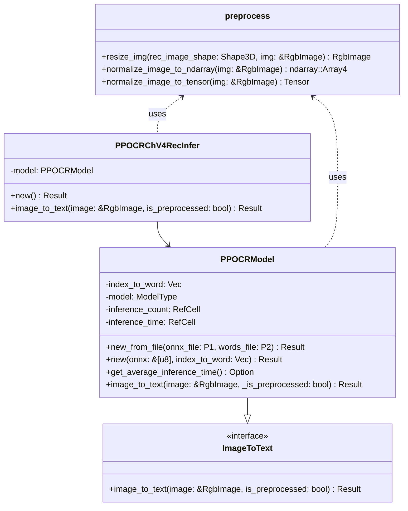
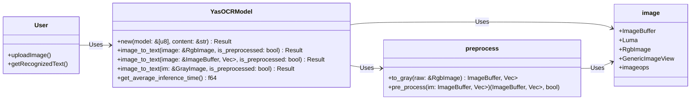
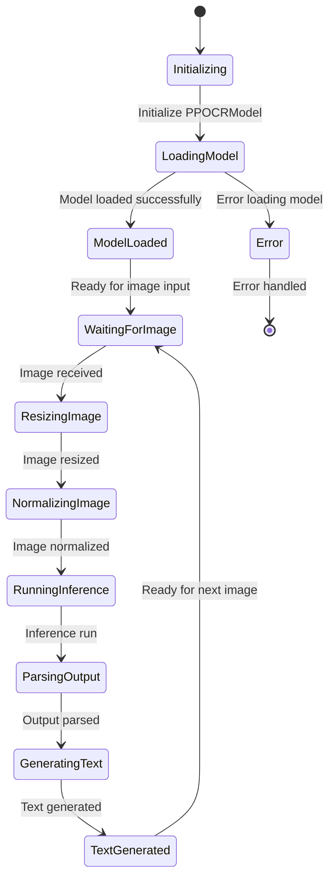
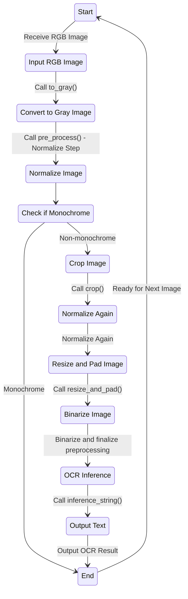
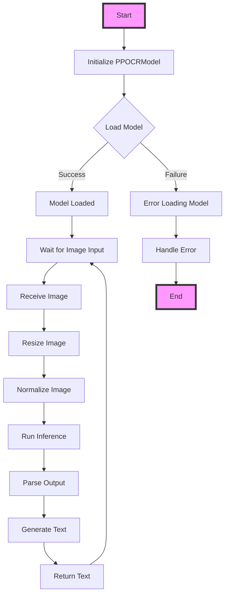
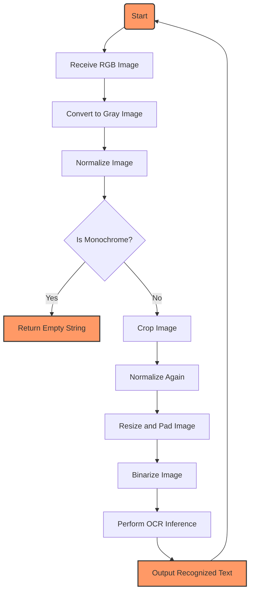

## OCR系统建模报告

### 类图

#### paddleOCR

#### YasOCR

### 状态图

#### paddleOCR

#### YasOCR

### 活动图

#### paddleOCR

#### YasOCR

### 用例描述

#### paddleOCR

##### 用例 1: 创建并初始化 OCR 模型

概述：用户希望创建并初始化一个 OCR 模型实例，从文件或内存中加载模型和字符索引映射文件。

**参与者**：用户

**前置条件：**用户具有 ONNX 模型文件和字符索引映射文件，或者具有嵌入的模型和字符索引映射字节数组。

**基本事件流：**

1. 用户调用 `PPOCRModel::new_from_file` 方法，传入 ONNX 模型文件路径和字符索引映射文件路径。
   - 系统读取字符索引映射文件并解析内容。
   - 系统根据配置特性 (`ort` 或 `tract_onnx`) 加载 ONNX 模型文件。
   - 系统创建并返回一个 `PPOCRModel` 实例。
2. 用户调用 `PPOCRModel::new` 方法，传入嵌入的模型字节数组和字符索引映射。
   - 系统解析字符索引映射。
   - 系统根据配置特性 (`ort` 或 `tract_onnx`) 加载模型字节数组。
   - 系统创建并返回一个 `PPOCRModel` 实例。

**后置条件**：系统创建了一个 `PPOCRModel` 实例，可以用于 OCR 推理。

##### 用例 2: 从图像中提取文本

**概述：**用户希望使用 OCR 模型从图像中提取文本。

**参与者**：用户

**前置条件**：

- 用户已经创建并初始化了一个 `PPOCRModel` 或 `PPOCRChV4RecInfer` 实例。
- 用户具有待识别的图像。

**主要事件流程：**

1. 用户调用 `PPOCRChV4RecInfer::image_to_text` 方法，传入待识别的图像。
   - 系统记录开始时间。
   - 系统调用 `resize_img` 函数调整图像大小。
   - 系统根据配置特性 (`ort` 或 `tract_onnx`) 归一化图像。
   - 系统运行模型推理。
   - 系统解析模型输出，生成文本结果。
   - 系统记录推理时间并更新推理统计数据。
   - 系统返回识别结果文本。

**后置条件：**

- 系统返回了识别出的文本结果。
- 系统更新了模型的推理统计数据。

##### 用例 3: 创建 OCR 推理实例

**概述**：用户希望创建一个 OCR 推理实例 `PPOCRChV4RecInfer`，以便进行中文文本的识别。

**参与者**：用户

**前置条件：**用户具有用于推理的 ONNX 模型文件和字符索引映射文件。

**主要事件流程：**

1. 用户调用 `PPOCRChV4RecInfer::new` 方法。
   - 系统调用 `ppocr_model!` 宏创建 `PPOCRModel` 实例。
   - 系统返回 `PPOCRChV4RecInfer` 实例。

**后置条件：**系统创建了一个 `PPOCRChV4RecInfer` 实例，可以用于中文文本的 OCR 推理。

#### YasOCR

##### 用例1：上传图像

**参与者**：用户

**前置条件**：用户已经准备好要识别的图像文件。

**触发**：用户启动OCR应用程序，并选择上传图像。

**基本事件流**：
1. 用户点击“上传图像”按钮。
2. 系统显示文件选择对话框。
3. 用户选择要上传的图像文件。
4. 系统将图像文件上传并传递给`YasOCRModel`进行处理。

**后置条件**：图像文件成功上传，并准备进行预处理和识别。

**扩展点**：文件选择过程中可能发生的错误（如取消选择文件）。

##### 用例2：获取识别文本

**参与者**：用户

**前置条件**：用户已经上传了图像文件。

**触发**：用户点击“开始识别”按钮。

**基本事件流：**

1. 用户点击“开始识别”按钮。
2. 系统调用`YasOCRModel`的`image_to_text`方法，传递上传的图像。
3. `YasOCRModel`使用`preprocess`模块对图像进行预处理，包括灰度化、归一化、裁剪、调整尺寸等。
4. `YasOCRModel`调用OCR模型进行推理，获取文本结果。
5. 系统将识别结果显示给用户。

**后置条件**：系统显示识别出的文本结果。

**扩展点**：处理过程中可能发生的错误（如图像预处理失败、模型推理失败）。

架构设计：

#### 类和方法对应的用例

#### `YasOCRModel::new`

- **用例**：初始化OCR模型
- **描述**：加载模型文件和字符映射表。

#### `YasOCRModel::image_to_text`

- **用例**：图像到文本的转换
- **描述**：接收输入图像（RGB图像、灰度图像等），进行预处理，然后调用模型进行推理，返回识别出的文本。

#### `preprocess::to_gray`

- **用例**：图像预处理 - 灰度化
- **描述**：将RGB图像转换为浮点型灰度图像。

#### `preprocess::pre_process`

- **用例**：图像预处理 - 综合处理
- **描述**：对灰度图像进行归一化、裁剪、调整尺寸等预处理操作。

### 主要场景示例

1. **用户上传图像并识别文本**
    - 用户启动应用，上传一张RGB图像。
    - 系统调用`YasOCRModel::image_to_text`进行识别。
    - `YasOCRModel`调用`preprocess::to_gray`将图像转换为灰度图。
    - `YasOCRModel`调用`preprocess::pre_process`对灰度图进行处理。
    - 系统调用OCR模型进行推理，返回识别结果。
    - 识别结果显示在用户界面上。
