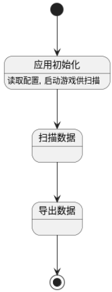

## Yas(Yet Another Genshin Impact Scanner) 系统建模报告

组内组员分工如下：

### 子任务1:系统控制：键鼠控制以及管理员权限获取

####  **用例分析**

上层模块需要与系统进行交互需要使用这个模块，对于一些常用的函数也会放入到utils模块中。模块中的函数需要返回结果，使得上层模块知道系统的状态（成功、失败、具体状态、具体数值等等）。Utils模块中进行划分：

1.  不使用os库的作为通用工具函数 
2. 涉及不同os的api的函数。
3. 对于涉及不同os的函数需要单独编写实现。

##### **用例：调用工具函数**

**参与者**：SystemModule

**前置条件**：无

**后置条件**：执行相应的工具函数

**主要事件流程**：

1. SystemModule 调用 utils 模块的工具函数
2. utils 模块在不同os下选择对应函数执行并返回对应的值

##### **用例：通用工具函数**

**参与者**：Utils 模块

**前置条件**：无

**后置条件**：执行通用工具函数

**主要事件流程**：

1. utils 模块执行通用工具函数

 

##### **用例：Windows系统特定功能**

**参与者**：Utils 模块

**前置条件**：操作系统为 Windows

**后置条件**：执行 Windows 特定功能

**主要事件流程**：

1. utils 模块判断操作系统为 Windows
2. 调用 Windows 特定功能函数
3. utils 模块调用 Windows API (winapi)

 

##### **用例：MacOS特定功能**

**参与者**：Utils 模块

**前置条件**：操作系统为 MacOS

**后置条件**：执行 MacOS 特定功能

**主要事件流程**：

1. utils 模块判断操作系统为 MacOS
2. 调用 MacOS 特定功能函数
3. utils 模块调用 MacOS API (macapi)

#### 类图

****

**utils类：**

**职责**：utils 类是 utils 模块的核心类，提供通用工具函数和系统控制功能。

**主要方法**：

- `sleep(ms: u32)`：使当前线程暂停指定的毫秒数。
- `read_file_to_string<P: AsRef<Path>>(path: P) -> String`：读取文件内容并返回字符串。
- `quit() -> !`：读取标准输入并退出程序。
- `error_and_quit_internal(args: Arguments) -> !`：打印错误信息并退出程序。
- 设计：通过rs预编译的方法，知道当前是服务于win系统还是mac系统，然后一些相同的函数接口会有不同的实现方式。

 

**macos** **类：**

**职责**：提供 macOS 平台特有的功能支持，如系统调用、文件系统操作等。

**主要方法**：

- `get_titlebar_height() -> f64`：获取标题栏高度。
- `get_pid_and_ui() -> (i32, UI)`：获取进程 ID 和 UI 类型。
- `request_capture_access() -> bool`：请求屏幕捕获权限。
- `find_window_by_pid(pid: i32) -> Result<(Rect, String), String>`：根据进程 ID 查找窗口。

 

**windows** **类：**

**职责**：提供 Windows 平台特有的功能支持，如系统调用。

**主要方法**：

- `encode_lpcstr(s: &str) -> Vec<i8>`：将字符串编码为 LPCSTR 格式。
- `encode_wide_with_null(s: impl AsRef<str>) -> Vec<u16>`：将字符串编码为宽字符格式。
- `find_window(title: impl AsRef<str>) -> Result<HWND>`：根据窗口标题查找窗口。
- `get_client_rect(hwnd: HWND) -> Result<Rect<i32>>`：获取窗口的客户区矩形。
- `is_admin() -> bool`：检查当前进程是否具有管理员权限。

 

**misc** **类：**

**职责**：提供其他杂项功能。

**主要方法**：

1. `color_distance(c1: &image::Rgb<u8>, c2: &image::Rgb<u8>) -> usize`：计算两个 RGB 颜色之间的距离。
2. `press_any_key_to_continue()`：等待用户按下任意键继续。

### 子任务1:系统控制：窗口焦点管理和分辨率控制

应用的整体状态如下:

这两个模块是初始化部分的一部分，这是game_info包的一部分, 类图如下:

`get_game_info() `负责获取和设置游戏窗口的基本属性, 其中就包括了将游戏窗口置于前台和初始化游戏的分辨率。

### 子任务2：交互逻辑

#### 用例图

#### 类图

#### 序列图

### 子任务3：OCR

#### 类图

##### paddleOCR

##### YasOCR

#### 状态图

##### paddleOCR

##### YasOCR

### 活动图

##### paddleOCR

##### YasOCR

#### 用例描述

##### paddleOCR

###### 用例 1: 创建并初始化 OCR 模型

概述：用户希望创建并初始化一个 OCR 模型实例，从文件或内存中加载模型和字符索引映射文件。

**参与者**：用户

**前置条件：**用户具有 ONNX 模型文件和字符索引映射文件，或者具有嵌入的模型和字符索引映射字节数组。

**基本事件流：**

1. 用户调用 `PPOCRModel::new_from_file` 方法，传入 ONNX 模型文件路径和字符索引映射文件路径。
   - 系统读取字符索引映射文件并解析内容。
   - 系统根据配置特性 (`ort` 或 `tract_onnx`) 加载 ONNX 模型文件。
   - 系统创建并返回一个 `PPOCRModel` 实例。
2. 用户调用 `PPOCRModel::new` 方法，传入嵌入的模型字节数组和字符索引映射。
   - 系统解析字符索引映射。
   - 系统根据配置特性 (`ort` 或 `tract_onnx`) 加载模型字节数组。
   - 系统创建并返回一个 `PPOCRModel` 实例。

**后置条件**：系统创建了一个 `PPOCRModel` 实例，可以用于 OCR 推理。

###### 用例 2: 从图像中提取文本

**概述：**用户希望使用 OCR 模型从图像中提取文本。

**参与者**：用户

**前置条件**：

- 用户已经创建并初始化了一个 `PPOCRModel` 或 `PPOCRChV4RecInfer` 实例。
- 用户具有待识别的图像。

**主要事件流程：**

1. 用户调用 `PPOCRChV4RecInfer::image_to_text` 方法，传入待识别的图像。
   - 系统记录开始时间。
   - 系统调用 `resize_img` 函数调整图像大小。
   - 系统根据配置特性 (`ort` 或 `tract_onnx`) 归一化图像。
   - 系统运行模型推理。
   - 系统解析模型输出，生成文本结果。
   - 系统记录推理时间并更新推理统计数据。
   - 系统返回识别结果文本。

**后置条件：**

- 系统返回了识别出的文本结果。
- 系统更新了模型的推理统计数据。

###### 用例 3: 创建 OCR 推理实例

**概述**：用户希望创建一个 OCR 推理实例 `PPOCRChV4RecInfer`，以便进行中文文本的识别。

**参与者**：用户

**前置条件：**用户具有用于推理的 ONNX 模型文件和字符索引映射文件。

**主要事件流程：**

1. 用户调用 `PPOCRChV4RecInfer::new` 方法。
   - 系统调用 `ppocr_model!` 宏创建 `PPOCRModel` 实例。
   - 系统返回 `PPOCRChV4RecInfer` 实例。

**后置条件：**系统创建了一个 `PPOCRChV4RecInfer` 实例，可以用于中文文本的 OCR 推理。

##### YasOCR

###### 用例1：上传图像

**参与者**：用户

**前置条件**：用户已经准备好要识别的图像文件。

**触发**：用户启动OCR应用程序，并选择上传图像。

**基本事件流**：

1. 用户点击“上传图像”按钮。
2. 系统显示文件选择对话框。
3. 用户选择要上传的图像文件。
4. 系统将图像文件上传并传递给`YasOCRModel`进行处理。

**后置条件**：图像文件成功上传，并准备进行预处理和识别。

**扩展点**：文件选择过程中可能发生的错误（如取消选择文件）。

###### 用例2：获取识别文本

**参与者**：用户

**前置条件**：用户已经上传了图像文件。

**触发**：用户点击“开始识别”按钮。

**基本事件流：**

1. 用户点击“开始识别”按钮。
2. 系统调用`YasOCRModel`的`image_to_text`方法，传递上传的图像。
3. `YasOCRModel`使用`preprocess`模块对图像进行预处理，包括灰度化、归一化、裁剪、调整尺寸等。
4. `YasOCRModel`调用OCR模型进行推理，获取文本结果。
5. 系统将识别结果显示给用户。

**后置条件**：系统显示识别出的文本结果。

**扩展点**：处理过程中可能发生的错误（如图像预处理失败、模型推理失败）。

### 子任务4：通用导出

#### 用例分析

**用例：导出资产**

- **参与者**：用户
- **描述**：用户希望将一组资产（可能是JSON文件等）导出到指定的位置。
- **前置条件**：用户已登录系统，并有权限执行导出操作。
- 基本流：
  1. 用户选择要导出的资产。
  2. 系统检查用户的选择并验证权限。
  3. 系统将选定的资产导出到指定位置。
  4. 系统生成并显示导出统计信息。
- 异常流：
  - 如果用户没有选择任何资产，系统显示错误消息。
  - 如果系统无法访问指定的导出位置，系统显示错误消息。

#### 类图

#### 状态图

#### 活动图

#### 序列图

### 子任务5：截图功能

这个系统由以下四个模块组成：Capturer、ScreenshotsCapturer、WinapiCapturer和GenericCapturer。其中Capturer是接口，ScreenshotsCapturer、WinapiCapturer和GenericCapturer是类。每个类都定义了一种截图方式，都实现了trait Capturer，因此它们都有capture_rect和capture_color方法用于捕获屏幕上的图像和颜色。ScreenshotsCapturer和WinapiCapturer是GenericCapturer的组成成分，GenericCapturer会根据系统类型来决定使用（Linux）前者还是（Windows）后者。

#### 类图

### 子任务6：CI/CD

系统的状态图如下:

