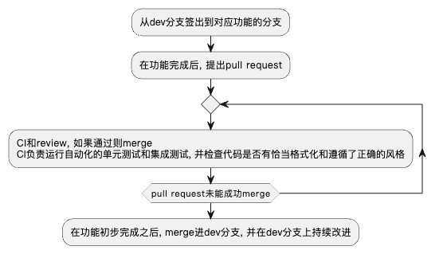
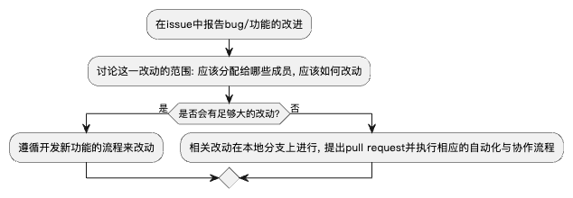
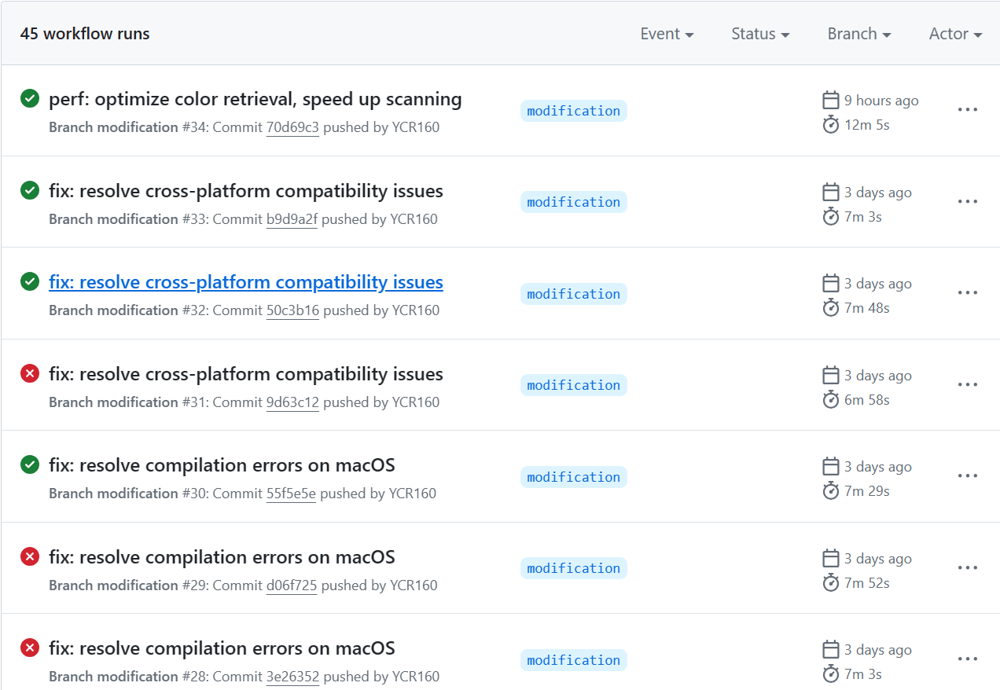
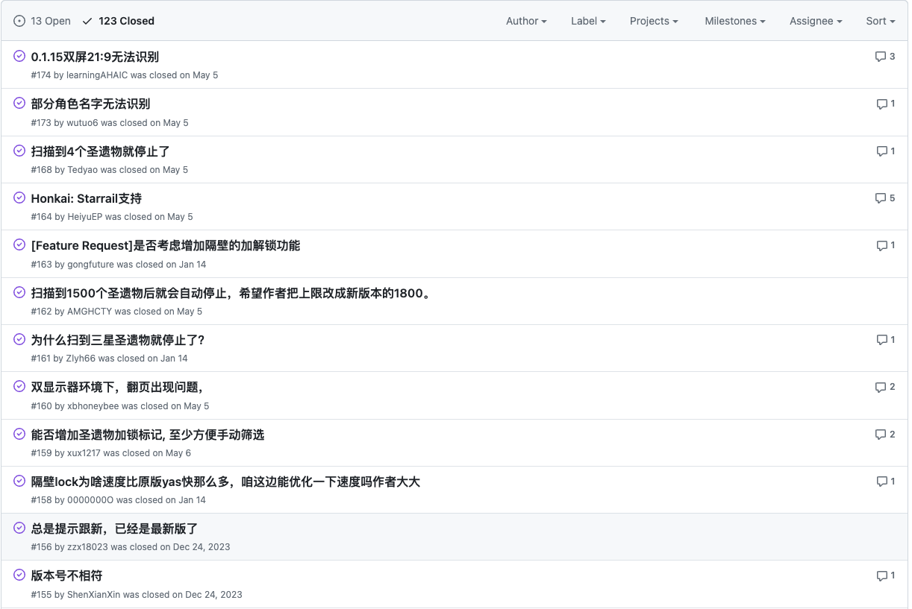
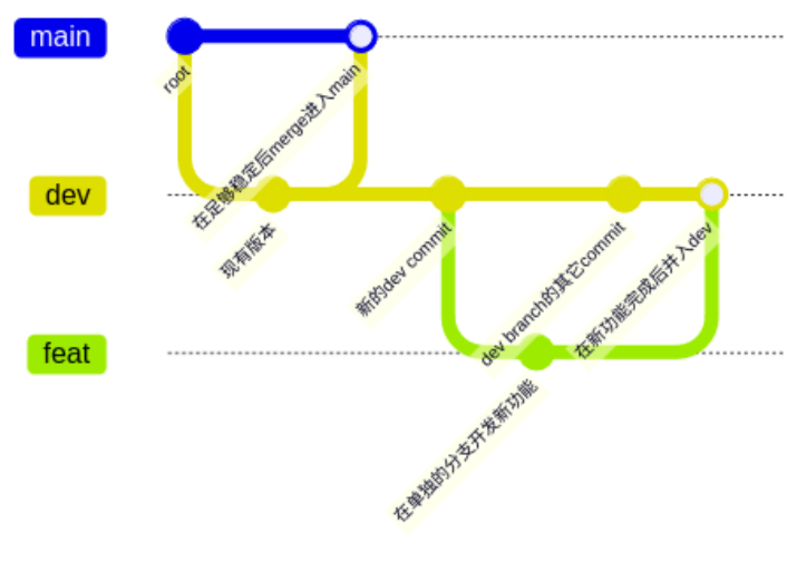
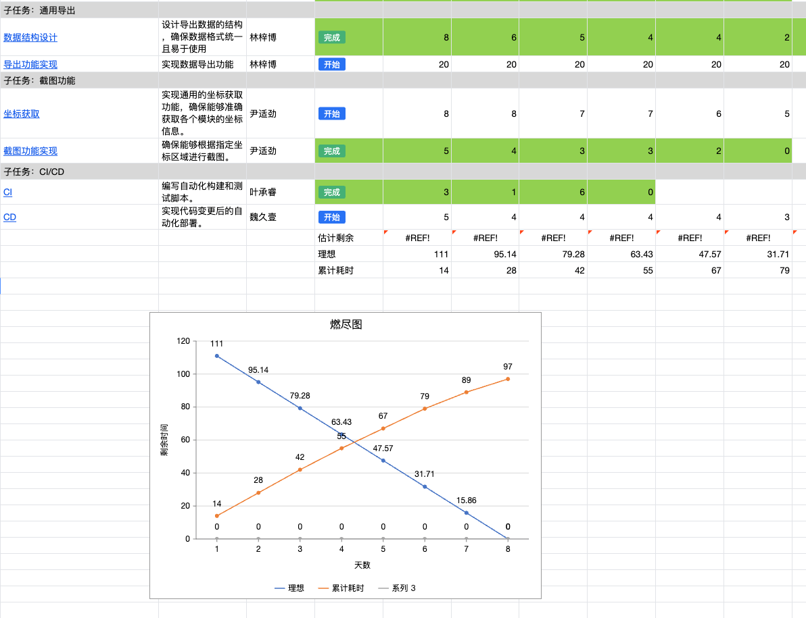

# 软件工程化说明文档

## 1.软件过程说明

#### 项目名称: Yas

#### 项目目标
Yas 是一个用于识别和导出《原神》圣遗物及《崩坏：星穹铁道》遗器信息的工具。它通过模拟人工操作进行识别，并采用 SVTR 字符识别模型，实现高效、准确的字符识别。支持 Windows, Linux 和 macOS 操作系统。

#### 一、开发流程

1. **需求分析**
    - 确定项目需求，详细记录每个功能模块的具体要求。
    - 确定项目的技术栈和工具链。

2. **设计阶段**
    - 设计项目的整体架构，包括模块划分、数据流和控制流。
    - 详细设计每个模块的功能和接口。

3. **实现阶段**
    - 根据设计文档，开始代码编写。
    - 每个功能在完成后，提交到相应的功能分支。

4. **测试阶段**
    - 编写单元测试和集成测试。
    - 使用 CI 自动化测试工具进行持续集成测试。

5. **部署阶段**
    - 通过 CI/CD 工具进行自动化部署。
    - 在各操作系统环境下进行兼容性测试。

6. **维护阶段**
    - 监控系统运行情况，收集用户反馈。
    - 定期更新和优化系统。

#### 二、角色和职责

1. **项目经理**
    - 负责项目整体规划和进度控制。
    - 协调各部门之间的沟通和合作。

2. **开发人员**
    - 负责具体功能模块的开发和实现。
    - 编写单元测试和集成测试。

3. **测试人员**
    - 负责系统的全面测试，包括功能测试、性能测试和兼容性测试。
    - 提交 bug 报告和改进建议。

4. **运维人员**
    - 负责系统的部署和维护。
    - 监控系统运行情况，及时处理突发问题。

#### 三、标准和规范

1. **编码规范**
    - 遵循 Rust 编码规范，代码需格式化整齐，注释清晰。
    - 所有代码变更需通过代码审查，确保代码质量。

2. **文档规范**
    - 所有功能模块需附带详细的设计文档和使用说明。
    - 每次代码提交需更新相关文档，保证文档与代码一致。

3. **测试规范**
    - 每个功能模块需编写单元测试，覆盖率需达到 90%以上。
    - 所有测试需通过 CI 工具自动执行，保证代码的稳定性和可靠性。

#### 四、工具和技术

1. **版本控制**
    - 使用 Git 进行版本控制，所有代码提交需遵循 Git 工作流程。
    - 采用 monorepo 风格，将所有模块都放在同一个 Git 仓库中。

2. **CI/CD**
    - 使用 GitHub Actions 进行持续集成和持续部署。
    - 编写自动化构建和测试脚本，确保每次提交都能顺利构建和通过测试。

3. **包管理**
    - 使用 Rust 的 cargo 工具进行包管理，追踪和维护项目的所有依赖。

4. **测试工具**
    - 使用 Rust 的内置测试工具进行单元测试和集成测试。
    - 通过 `cargo test` 命令运行所有测试。

#### 五、工作流程

1. **新功能开发流程**

    

2. **现有功能改进和bug修复流程**

    

#### 六、沟通和协作

1. **沟通工具**
    - 使用微信进行实时沟通和讨论。
    - 定期召开线上会议，汇报工作进展，讨论项目问题。

2. **协同平台**
    - 使用 GitHub 进行版本管理和代码托管。
    - 使用 GitHub Issues 和 Projects 进行任务管理和进度跟踪。

3. **文档管理**
    - 使用腾讯文档记录项目的详细设计和进展情况。
    - 所有文档需实时更新，确保信息的及时性和准确性。

#### 七、质量保证

1. **代码审查**
    - 所有代码变更需通过 Pull Request 提交，并由团队成员进行代码审查。
    - 确保代码质量和一致性。

2. **自动化测试**
    - 所有功能模块需编写单元测试和集成测试，确保代码的稳定性和可靠性。
    - 使用 CI 工具自动执行测试，保证每次提交都能顺利通过。

3. **定期更新**
    - 根据用户反馈和项目需求，定期更新和优化系统。
    - 确保系统的稳定性和性能。

#### 八、发布流程

1. **预发布**
    - 在 dev 分支上的提交在成功构建时打包生成对应的可执行文件，生成 pre-release。

2. **正式发布**
    - 在 main 分支上的提交在成功构建时生成一个正式的 release 并进行分发。

## 2.软件工程自动化

​		在实现本项目的自动化方面，我们主要聚焦以下几个要素：编译打包，包管理，脚手架，运行环境管理，自动化测试和持续集成。目的是将软件开发过程中，大量重复，程序性和非创造性的工作自动化，在提升项目推进效率的同时，减少人为因素带来的错误和干扰，从而提升项目的总体质量。

#### 编译打包

编译打包是软件开发中的一个关键环节，它可以大大减少在新环境中配置和设置所需的工作量，使得软件的安装、升级和分发变得更加高效和可靠。

- **可分发格式**：它涉及将应用程序的代码、库、依赖项以及配置文件等组合在一起，形成一个可分发的格式。本项目中，借助文件`.github/workflows/modification.yml`触发 GitHub 的 Action系统，每次特定分支有新的提交时将仓库里的代码编译为可执行文件。
- **二进制流下载**：每次编译完成之后，可以通过特定的下载接口，直接下载二进制文件，不需要在本地重复编译而可以直接执行。
- **容器化技术**：开发者可使用容器化技术（如Docker）将所有依赖打包成一个标准化的单元，用于软件开发和部署。

#### 包管理

包管理涉及对软件依赖项和库的管理，确保项目能够正确地构建和运行。开发者可以借助包管理轻松地添加、更新和删除项目中的依赖项，同时解决依赖冲突。

- **rust配置文件**：本项目由 Cargo.toml 作为配置文件，来指定需要的包以及版本，一个项目的 Cargo.toml 可能不止一个。

#### 脚手架

脚手架（Scaffold）作为代码模板，提供通用的代码结构和相关的配置文件，以便开发人员快速开始项目的开发。其中通常包括项目结构、依赖项、配置文件和公共代码库等内容，能够帮助开发人员快速搭建起一个可靠的基础框架。

- **cargo脚手架**：项目开发过程中使用cargo的脚手架功能，使用预定义的模板来生成新的 Rust 项目，期间可以指定一个模板仓库或本地模板目录，并根据模板中的指令生成项目结构和初始代码。

#### 运行环境管理

运行环境包括了硬件支持和软件环境等软件运行所需的平台和条件，涉及对操作系统、数据库、中间件、依赖库等软件组件的配置和管理，确保了软件能够正常运行。

- **运行环境**：项目中，使用`runs-on`字段指定每个作业运行的虚拟环境。分别使用了`windows-latest`、`macos-latest`和`ubuntu-latest`。
- **工具链设置**：项目中，使用`rustup default nightly-msvc`（对于Windows）和`rustup default nightly`（对于macOS和Linux）命令设置Rust工具链的默认版本为nightly。这是因为某些Rust特性或依赖可能需要nightly版本。

#### 自动化测试

自动化测试用于解决手动测试低效繁琐的问题，通过使用自动化工具和脚本来执行测试任务。它包含了单元测试、集成测试和系统测试等。

- **构建和测试**：在Windows环境下，配置了构建（`cargo build --release`）和重命名输出文件的步骤。对于macOS和Linux环境，使用了`cargo check`命令来检查代码，确保没有编译错误。因为虚拟环境不能运行有 GUI 的游戏，但`cargo check`是验证代码健康的一种快速方式。
- **缓存依赖**：使用`actions/cache@v4`来缓存Cargo的依赖项，减少后续运行的构建时间。缓存路径包括Cargo的二进制文件、注册表索引、注册表缓存、git数据库和目标目录。这样，如果`Cargo.lock`文件没有变化，后续运行可以重用这些缓存，加速构建过程。
- **工件上传**：在Windows作业中，构建完成后，将生成的二进制文件（`yas_artifact.exe`和`yas_relic.exe`）重命名并上传为工件。

#### 持续集成

持续集成（CI）支持团队成员将代码频繁地集成到共享的版本控制仓库中。其中也涉及到了自动化测试，目的是尽可能快速发现和解决集成问题。

- **Github Actions系统**：借助Github上提供的持续集成和持续交付 (CI/CD) 平台，可创建工作流程来构建和测试存储库的每个拉取请求或将合并的拉取请求部署到生产环境。

## 3.软件工程协作化

在我们团队的协作化过程中，我们注重以下几个关键方面：版本管理、事项追踪和协同平台的有效整合和运用，以确保团队成员能够高效协作，项目顺利推进。

#### 版本管理

- **分工与依赖管理**： 我们通过明确的分支策略和任务分配，确保每个团队成员都清楚自己的责任范围和依赖关系。每个功能或任务都分配给具体的负责人，确保团队协作的高效性和责任明晰。
- **历史记录与冲突解决**： 我们利用Git作为主要的版本控制工具，详细记录每次代码变更的历史。通过规范的代码提交和分支合并流程，有效管理和解决可能出现的代码冲突，确保代码库的稳定性和一致性。

#### 缺陷/问题/事项/工单追踪

在项目开发和维护过程中，及时有效地追踪和管理缺陷、问题、需求和工单是保证项目顺利进行的关键。

我们的事项追踪通过github的issue系统和project系统来实现: 每个要实现的功能和要修复的bug都会新建一个issue,

github提供了将issue分配给具体的人的功能, project则负责将一个模块对应的一些功能和要修复的bug绑定成一个project,
同时追踪和显示. 另外, project系统也提供了milestone功能, 我们利用这一功能来维护和追踪下一个release前应该完成的工作,
以便发布releases.

每个问题或工单都有详细的历史记录和评论线索，团队成员可以查看和理解问题的起因和解决过程。这种追踪机制能够提升了问题解决的效率，积累过程，为未来的项目提供参考。

#### 协同平台

我们选择了多功能的协同平台来支持项目的各个方面，包括版本管理、代码托管、缺陷追踪、协同开发、代码评审、持续集成/交付、文档管理和社区交流。

##### 版本管理与代码托管

我们主要依托GitHub或类似平台进行版本管理和代码托管。这些平台提供了强大的版本控制功能和代码协作工具，支持多人同时开发和代码审查流程。

##### 缺陷追踪与问题管理

我们使用GitHub的Issue和Project功能来跟踪和管理项目中的缺陷和任务。通过定义millstone和优先级，确保团队能够有序地处理每个问题和改进请求。

##### 协同开发与代码评审

我们通过GitHub的Pull Request功能进行代码评审和合并流程。 

##### 协同开发与Scrum实践

在项目开发过程中，我们团队采用腾讯共享文档来实施Scrum方法，以提高协作效率和项目透明度。我们在腾讯共享文档中创建了一个名为“产品待办列表”的文档，用于记录所有的待办事项和需求。

表格中包含以下列：标题、描述、优先级、状态、负责人。这样便于我们直观地查看和管理所有任务。产品负责人每周定期更新产品待办列表，添加新的需求和任务，并在每次迭代结束后对列表进行清理和调整。通过产品待办列表梳理会议，我们团队可以对任务的优先级进行重新评估，确保高优先级任务优先处理。

文档实时更新，成员能够随时了解迭代进展情况。

##### 文档管理与社区交流

我们利用微信管理项目文档和技术文档，确保团队成员能够随时获取和更新最新的项目信息。另外，通过微信进行实时交流。

### 3.产品待办列表 (Product Backlog, PB) 过程说明

#### 一、PB 在 Yas 项目中的应用

PB 是 Yas 项目的核心管理工具，用于跟踪和管理所有需求、功能、改进和修复任务。它确保团队能够专注于最高优先级的工作，最大化产品价值。

#### 二、PB 的结构和内容

**Yas 项目的 PB 包括以下内容：**

1. **功能需求**
   - 实现识别《原神》圣遗物信息的功能
   - 支持导出识别数据为 CSV 格式
   - 集成并优化 PaddleOCR 模型
2. **改进项**
   - 提高 OCR 模型的识别准确率
   - 优化数据导出的性能
3. **修复任务**
   - 修复键鼠控制在 Linux 系统上的兼容性问题
   - 解决分辨率调整的一个已知 bug
4. **技术任务**
   - 编写 CI 自动化测试脚本
   - 设置 CD 自动化部署流程

#### 三、PB 的维护和管理

**责任人**: 魏久壹

**更新频率**: 每周

**流程**:

1. **收集需求**: 来源于用户反馈、团队讨论。
2. **添加和更新**: 将新需求添加到 PB 中，并对现有任务进行更新。
3. **优先级排序**: 根据业务价值、紧迫性和依赖关系确定任务的优先级。
4. **审查和调整**: 每周进行审查，确保 PB 反映最新的项目需求和优先级。

#### 四、PB 的优先级分类

- **高优先级**
  - 专用 OCR 模型集成
  - 数据导出功能实现
  - 扫描逻辑设计
- **中优先级**
  - 键鼠控制
  - 管理员权限获取
  - 窗口焦点管理
- **低优先级**
  - 分辨率调整
  - 坐标获取
  - 截图功能实现

#### 五、PB 的工具和管理

**工具**: 使用腾讯共享文档的 Scrum 表格管理 PB

**维护频率**: 每周更新和审查

**负责团队**: 由产品负责人维护，团队成员协助更新和审查

**共享文档使用方法**:

1. 创建 PB 表格:
   - 列：任务名称、描述、优先级、状态、负责人、备注
2. 定期更新:
   - 每周在团队会议中更新和审查 PB
3. 跟踪和管理:
   - 实时更新任务状态，确保每个任务都有最新的进展信息

### 4.短期待办列表 (Sprint Backlog, SPB) 过程说明

#### 一、SPB 在 Yas 项目中的应用

在每次冲刺计划会议上，从 PB 中选取高优先级任务，制定当前冲刺周期内需要完成的任务列表。SPB 包含具体任务、时间估算和责任人。

#### 二、示例 SPB

**冲刺周期**: 2024年5月17日 - 2024年5月23日

**任务列表**:

1. **键鼠控制**
   - **负责人**: 张业鑫
   - **时间估算**: 3 天
   - **描述**: 实现多系统下的键盘和鼠标控制逻辑。
2. **管理员权限获取**
   - **负责人**: 张业鑫
   - **时间估算**: 2 天
   - **描述**: 编写获取管理员权限的脚本。
3. **扫描逻辑设计**
   - **负责人**: 叶承睿
   - **时间估算**: 4 天
   - **描述**: 物品扫描逻辑，确定扫描顺序和扫描范围。
4. **专用 OCR 模型集成**
   - **负责人**: 刘冠麟
   - **时间估算**: 5 天
   - **描述**: 集成并优化专用 OCR 模型。
5. **数据结构设计**
   - **负责人**: 林梓博
   - **时间估算**: 2 天
   - **描述**: 设计导出数据的结构，确保数据格式统一且易于使用。

#### 三、SPB 的维护和管理

**制定和更新**:

- **团队成员**: 全体开发团队
- **时间**: 每次冲刺计划会议
- 流程:
  1. 回顾上个冲刺周期任务完成情况。
  2. 从 PB 中选取高优先级任务。
  3. 估算每个任务的时间和难度。
  4. 确定任务责任人。
  5. 制定 SPB。

**执行和审查**:

- **每日站会**: 跟踪任务进展，解决阻碍。
- **冲刺回顾**: 冲刺结束后，回顾任务完成情况，分析成功与不足，更新 PB。
