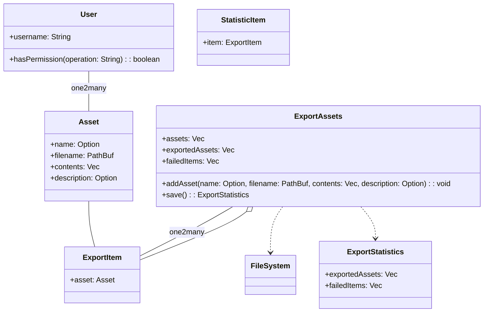
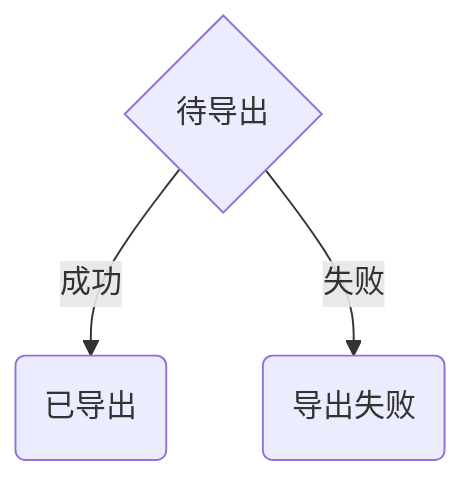
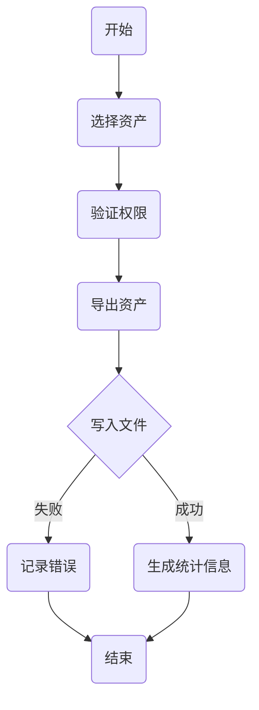
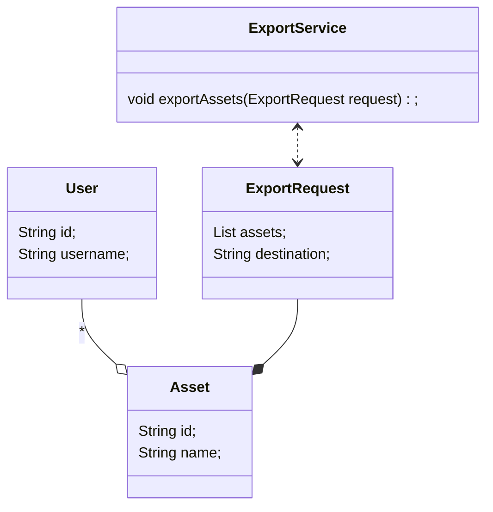

# 子任务：通用导出

## 需求分析报告

### **项目目标**

本软件项目的核心目标是从游戏中提取数据，并将这些数据以不同的数据结构进行导出，以供后续的数据分析、可视化或其他相关处理使用。通用导出部分作为项目的一个重要组件，其目标是提供一个灵活且高效的机制，确保数据能够准确无误地从游戏环境中提取并按照用户需求的格式进行导出。

### **功能需求**

1. **数据提取**：能够从游戏中捕获和提取所需的数据，包括但不限于玩家行为、游戏状态、角色信息等。
2. **格式转换**：支持将数据转换为多种常见的数据结构格式，如CSV、JSON、XML等，以满足不同用户或系统的需求。在本软件项目中，要求导出的JSON结构需要满足不同解析环境的需要，即按照解析环境导出对应的JSON格式。
3. **配置灵活性**：提供配置选项，允许用户根据需要选择导出的数据字段、设定导出格式以及定制导出文件的命名规则等。
4. **数据完整性校验**：在导出过程中对数据进行完整性校验，确保导出的数据准确无误，避免数据丢失或损坏。
5. **日志记录**：记录导出过程中的关键操作和可能出现的错误，便于后续的问题追踪和排查。

### **性能需求**

1. **导出效率**：在保证数据准确性的前提下，优化导出算法和数据处理流程，以减少导出所需的时间。
2. **内存管理**：合理管理内存使用，避免在导出大量数据时造成内存溢出或性能下降。
3. **稳定性**：确保导出功能在高负载或长时间运行时仍能保持稳定，不出现崩溃或数据错误。

### **可维护性需求**

1. **代码可读性**：编写清晰、易读的代码，并添加必要的注释，以便于其他开发人员理解和维护。
2. **模块化设计**：将导出功能划分为独立的模块，每个模块负责特定的任务，降低模块间的耦合度，提高代码的可重用性和可维护性。
3. **错误处理和异常捕获**：在代码中实现完善的错误处理和异常捕获机制，确保在出现问题时能够及时定位并解决。
4. **文档支持**：提供详尽的开发文档和用户手册，帮助开发人员和用户更好地理解和使用导出功能。
5. **扩展性**：设计良好的接口和扩展点，以便在未来能够轻松地添加新的导出格式或功能，而无需对现有代码进行大量修改。

## 系统建模报告

### 用例分析

**用例：导出资产**

- **参与者**：用户
- **描述**：用户希望将一组资产（可能是JSON文件等）导出到指定的位置。
- **前置条件**：用户已登录系统，并有权限执行导出操作。
- 基本流：
  1. 用户选择要导出的资产。
  2. 系统检查用户的选择并验证权限。
  3. 系统将选定的资产导出到指定位置。
  4. 系统生成并显示导出统计信息。
- 异常流：
  - 如果用户没有选择任何资产，系统显示错误消息。
  - 如果系统无法访问指定的导出位置，系统显示错误消息。

### 类图

### 状态图

### 活动图

### 序列图

## 架构设计报告

### 技术栈

- **后端**：Java (Spring Boot), Spring MVC, Hibernate/JPA, MySQL
- **前端**：React/Redux, HTML5, CSS3, JavaScript (可能使用Axios进行HTTP请求)
- **中间件**：Nginx (反向代理和负载均衡)
- **数据库**：MySQL
- **其他**：Docker (容器化部署), Kubernetes (容器编排), Git (版本控制)

### 核心模块类图

### 核心模块序列图

### 设计模式

在核心模块设计中，用到以下设计模式：

- **工厂模式**：用于创建不同类型的资产对象。
- **单例模式**：确保某些服务（如配置服务、日志服务等）只被实例化一次。
- **服务定位器模式**：提供对服务层中不同服务的访问点。
- **模板方法模式**：在`ExportService`中实现导出流程的基本框架，允许子类为不同类型的资产定义特定的导出行为。
- **观察者模式**：在导出过程中，允许多个对象（如日志记录器、进度指示器等）监听导出状态的改变。