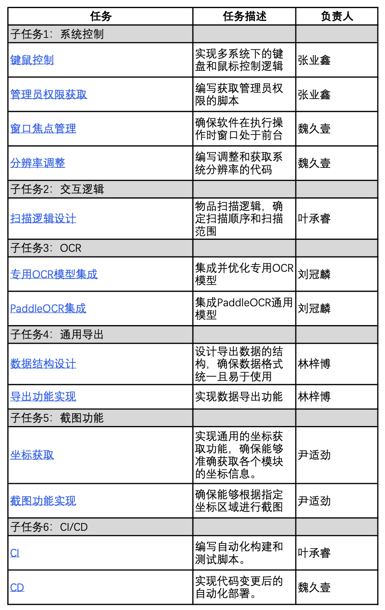

## Yas(Yet Another Genshin Impact Scanner) 需求分析

### 项目目标

YAS 是一个基于RUST编写的高效的原神圣遗物扫描器，旨在快速准确地识别并导出原神游戏中的圣遗物数据。本项目基于 SVTR（基本上是 MobileNetV3_Small + Transformer）字符识别模型，设计并实现了一个基于原神、崩坏：星穹铁道等游戏的圣遗物导出器，主要目标包括：

1. 使用纯视觉的方式扫描并提取游戏中的物品信息以及类别，避免了直接读取游戏内存造成游戏封号等问题；
2. 提供足够高效准确地扫描和识别圣遗物信息的性能；
3. 可输出统一、规范模式的游戏物品类别和具体信息；
4. 提供便捷的导入导出功能，导出结果可以导入分析工具（例如 [莫娜占卜铺](https://mona-uranai.com/) ）进行配装或者其他计算；

### 功能需求

1. **系统控制**
   - 能够获取管理员权限
   - 实现多系统下的键盘和鼠标控制逻辑
2. **交互逻辑**
   - 具有合理的物品扫描逻辑以及扫描顺序和扫描范围
3. **OCR信息识别**
   - 集成并优化通用OCR模型，同时训练专用OCR模型
   - 可以使用纯视觉的方式扫描并提取游戏中的物品信息以及类别
4. **通用导出**
   - 提供便捷的导入导出功能
   - 导出结果可以导入分析工具进行配装或者其他计算；
5. **自定义化**
   - 使用者可以根据需求在预训练模型的基础上训练自己的字符识别模型
6. **多操作系统支持**：
   - 支持在不同的操作系统包括Windows、MacOS、Linux环境下高效运行。
7. **配置管理**：
   - 支持通过配置文件或代码参数设置模型的各种超参数和运行选项。

### 性能需求

1. **高效推理速度**：
   - 确保模型在CPU和GPU上均能高效运行，满足实时处理的要求。
   - 优化模型的计算效率，减少推理时间，以处理大量圣遗物信息。

2. **内存和资源管理**：
   - 优化内存使用，确保在有限的硬件资源下模型能够稳定运行。
   - 提供对大批量数据处理的支持，避免内存溢出问题。

3. **扩展性**：
   - 模型和代码设计应具备良好的扩展性，方便后续集成新的功能模块。
4. **针对特定游戏字符拥有更精准的识别能力**
   - 针对特定游戏字符（原神、崩坏：星穹铁道）拥有更高的准确率，在实际应用中超过当前主流OCR模型在特定游戏上的识别精度。

### 可维护性需求

1. **代码结构清晰**：
   - 采用模块化设计，确保每个功能模块独立且易于理解。
   - 提供详细的注释和文档，方便开发人员和用户理解和使用。

2. **易于调试和测试**：
   - 提供完善的测试用例，确保每个功能模块的正确性。
   - 设计良好的日志记录机制，方便追踪和定位问题。

3. **兼容性和可移植性**：
   - 确保代码能够在不同的操作系统和硬件平台上运行。
   - 提供详细的依赖和安装指南，方便用户部署和使用。

4. **持续集成和更新**：
   - 支持持续集成（CI）和持续部署（CD），确保代码的稳定性和更新的及时性。
   - 定期更新和维护项目，及时修复已知问题和漏洞。

----------

以下是组内组员按照各自分工针对具体子任务的需求报告：

### 子任务1:系统控制

##### **项目目标**

1. 提供一组通用且高效的工具函数，支持跨平台的操作系统特定功能。
2. **简化开发**：为开发者提供常用的工具函数，减少重复代码，提高开发效率。
3. 跨平台支持：实现针对不同操作系统（macOS 和 Windows）的特定功能支持，确保在多平台环境下的兼容性和一致性。
4. **高性能**：提供高效的实现，确保工具函数在各种环境下的快速响应和低资源消耗。
5. **易维护性**：采用模块化设计，提供良好的代码文档和测试覆盖，便于后续的维护和扩展。

##### **功能需求**

**操作系统特定功能：**

能够使用操作系统的api实现功能并封装对外提供与os的api相关的服务，包括：

1) 收集截图所需要的信息，例如窗口位置、大小，需要被截图的进程的信息，获取窗口。
2) 获取截图功能正常运行的条件，例如设置DPI感知，检查和请求权限，设置前景窗口。

**通用工具函数：**

线程休眠，读取文件并以字符串返回的接口，打印错误信息，目录创建，退出程序，计算RGB颜色的距离，等待用户按下任意键继续。

**窗口焦点管理：**

保证游戏的窗口始终在最上方, 以及系统焦点始终位于游戏窗口中, 以保证在扫描过程中始终能够得到完整和最新的游戏窗口内容,以及扫描工具能够正常运行.需要抽象出统一的接口, 以便在不同的系统版本和不同系统间移植时只需加入新的适配, 无需修改上层代码.

**分辨率调整**：

保证游戏窗口的分辨率始终为1600x900, 以使得得到的截图能够直接发送给OCR处理.需要抽象出统一的接口, 以便在不同的系统版本和不同系统间移植时只需加入新的适配, 无需修改上层代码.

##### **性能需求**

**响应时间**：鼠标和键盘操作的响应时间应在可接受的范围内，应在各种操作系统上高效执行，确保低延迟。

**资源消耗**：模块应尽量减少对系统资源的消耗，包括 CPU 和内存的使用，应有效管理系统资源，避免内存泄漏和资源浪费。

##### **可维护性需求**

**代码结构**：代码应具有良好的结构和注释，便于理解和修改，以及日后的扩展。

**模块化设计**：采用模块化设计，确保每个文件和函数职责单一，便于独立测试和维护。

**测试覆盖**：每个工具函数应具备完整的单元测试覆盖，确保功能的正确性和可靠性。

**文档**：为每个函数和模块编写详细的文档，说明其功能、参数和返回值。

### 子任务2：交互逻辑

#### 项目目标

开发一个用于扫描和识别游戏中圣遗物信息的工具，自动化从游戏截图中提取圣遗物的属性、星级等信息，以便玩家能够更高效地管理和优化他们的圣遗物库存。该工具旨在实现一个能够自动化扫描和处理物品的系统，特别是针对游戏中的物品仓库进行扫描，并支持中断、完成和错误处理。

#### 功能需求

1. **自动捕获和识别圣遗物信息**：通过游戏截图自动识别圣遗物的星级、属性等关键信息。
2. **支持不同分辨率和UI布局**：能够适应游戏在不同分辨率和UI布局下的截图。
3. **灵活的配置**：允许用户通过配置文件或命令行参数自定义扫描逻辑，如指定最低星级。
4. **结果输出**：将扫描和识别的结果以某种形式（如JSON、数据库等）输出，方便进一步处理或查看。
5. **中断和恢复扫描**：支持用户在扫描过程中中断扫描，并在之后可恢复。
6. **图像识别**：能够从游戏截图中识别圣遗物的各项信息。
7. **支持多种圣遗物属性**：能够识别包括名称、主要属性、副属性、等级在内的多种信息。
8. **多线程处理**：在独立线程中运行，不阻塞主程序的其他操作。
9. **扫描控制**：能够通过特定函数启动一个协程，逐行逐列扫描物品，直到完成所有物品的扫描或者被中断。
10. **鼠标操作**：包括移动鼠标到指定位置、鼠标点击和滚动，以模拟用户操作。
11. **颜色采样和滚动控制**：在扫描开始前采样初始颜色，用于后续的颜色比较，以判断是否需要滚动屏幕，以便扫描更多的物品。
12. **等待和延时**：在必要的时候等待一定时间，比如等待物品切换或者避免操作过快。

#### 性能需求

1. **扫描速度**：扫描过程应尽可能快，以减少对用户游戏体验的影响。
2. **准确性**：识别圣遗物信息的准确率应高，以确保用户得到可靠的数据。
3. **资源占用**：工具运行时对系统资源（如CPU、内存）的占用应在可接受范围内，不应显著影响游戏或系统的性能。
4. **高效识别**：识别过程应尽可能快速，以处理大量圣遗物信息。
5. **资源优化**：优化内存和CPU使用，确保在不同硬件上的良好性能。
6. **响应时间**：系统应该能够快速响应用户操作和系统事件，特别是鼠标操作和滚动应该尽可能模拟真实用户的速度。

#### 可维护性需求

1. **代码结构**：代码应有良好的结构和注释，便于理解和维护。
2. **扩展性**：设计应考虑未来可能的功能扩展，如支持更多游戏、更复杂的识别任务等。
3. **错误处理**：应有健壮的错误处理机制，能够优雅地处理异常情况，如读取截图失败、识别错误等。
4. **日志记录**：应有详细的日志记录机制，记录关键操作和可能的错误信息，便于问题的调试和解决。
5. **代码清晰**：代码应该易于理解和维护，使用适当的命名和注释。
6. **模块化设计**：功能模块化，便于扩展和重用。
7. **测试支持**：提供单元测试和集成测试，确保代码质量。

#### 安全性需求

1. **数据安全**：处理用户数据时应确保其安全性，不泄露给第三方。
2. **稳定性**：确保工具的稳定运行，不会导致游戏或系统崩溃。
3. **数据处理**：确保用户数据的安全，避免敏感信息泄露。
4. **异常处理**：合理处理异常情况，防止程序崩溃或数据损坏。

### 子任务3：OCR

#### 项目目标

使用RUST语言开发一个基于**PaddleOCR的深度学习模型**，主要目标包括：

- 用于高效且准确地对获取的游戏画面进行图像处理，**根据圣遗物的截图以及文本坐标，从图像中提取文本信息**；
- 通用预训练模型，不用训练即可直接使用；
- 兼容现有的深度学习框架和工具，以便用户可以轻松地集成和扩展；
- 确保模型的高准确性和鲁棒性，能够在面对不同的游戏图像下都能准确识别；
- 支持多种模型格式（如ONNX），并能够在不同的操作系统（Windows、MacOS、Linux）环境下高效运行。

同时，在完成PaddleOCR的同时使用RUST语言开发针对**特定场景的OCR专用模型YasOCR**，主要目标包括：

- 针对特定游戏（原神、崩坏：星穹铁道）字符进行训练的OCR模型，能够提供对于这类字符类型的高精度文本识别；
- 拥有比通用模型更快的处理能力，确保对大规模图像数据进行快速处理，满足大量扫描的实时性需求。
- 具有较高的模块化，便于与其他软件系统集成，并且可以根据需求进行扩展和优化。

#### 功能需求

1. **通用OCR模型的加载**：
   - 提供简洁的接口，用于加载预训练的PaddlePaddle模型。
   - 支持多种模型格式的导入，包括ONNX等。
2. **针对项目应用的专用模型的实现：**
   - 与通用的paddleOCR不同，YasOCR针对项目应用游戏进行特殊优化
   - 再识别特定游戏（原神、崩坏：星穹铁道）字符上拥有更快、精度更高的模型性能。
3. **图像预处理**：
   - 提供一系列图像预处理工具，确保输入图像能够满足模型的要求，包括图像的缩放、裁剪等操作。
   - 提供图像归一化功能，支持不同模型框架（如`ort`和`tract_onnx`）。
4. **模型推理**：
   - 支持对单张图像和批量图像的推理。
   - 提供预测结果的后处理工具，以便用户可以直接使用模型输出。
5. **文本提取和保存**：
   - 提供结果可视化工具，方便用户查看模型预测结果。
   - 支持将预测结果保存为多种格式的文件。
6. **配置管理**：
   - 支持通过配置文件或代码参数设置模型的各种超参数和运行选项。
7. **多操作系统支持**：
   - 支持在不同的操作系统包括Windows、MacOS、Linux环境下高效运行。

#### 性能需求

1. **高效推理速度**：
   - 确保模型在CPU和GPU上均能高效运行，满足实时处理的要求。
   - 优化模型的计算效率，减少推理时间，以处理大量圣遗物信息。

2. **内存和资源管理**：
   - 优化内存使用，确保在有限的硬件资源下模型能够稳定运行。
   - 提供对大批量数据处理的支持，避免内存溢出问题。

3. **扩展性**：
   - 模型和代码设计应具备良好的扩展性，方便后续集成新的功能模块。

#### 可维护性需求

1. **代码结构清晰**：
   - 采用模块化设计，确保每个功能模块独立且易于理解。
   - 提供详细的注释和文档，方便开发人员和用户理解和使用。

2. **易于调试和测试**：
   - 提供完善的测试用例，确保每个功能模块的正确性。
   - 设计良好的日志记录机制，方便追踪和定位问题。

3. **兼容性和可移植性**：
   - 确保代码能够在不同的操作系统和硬件平台上运行。
   - 提供详细的依赖和安装指南，方便用户部署和使用。

4. **持续集成和更新**：
   - 支持持续集成（CI）和持续部署（CD），确保代码的稳定性和更新的及时性。
   - 定期更新和维护项目，及时修复已知问题和漏洞。

### 子任务4:通用导出

#### **项目目标**

本软件项目的核心目标是从游戏中提取数据，并将这些数据以不同的数据结构进行导出，以供后续的数据分析、可视化或其他相关处理使用。通用导出部分作为项目的一个重要组件，其目标是提供一个灵活且高效的机制，确保数据能够准确无误地从游戏环境中提取并按照用户需求的格式进行导出。

#### **功能需求**

1. **数据提取**：能够从游戏中捕获和提取所需的数据，包括但不限于玩家行为、游戏状态、角色信息等。
2. **格式转换**：支持将数据转换为多种常见的数据结构格式，如CSV、JSON、XML等，以满足不同用户或系统的需求。在本软件项目中，要求导出的JSON结构需要满足不同解析环境的需要，即按照解析环境导出对应的JSON格式。
3. **配置灵活性**：提供配置选项，允许用户根据需要选择导出的数据字段、设定导出格式以及定制导出文件的命名规则等。
4. **数据完整性校验**：在导出过程中对数据进行完整性校验，确保导出的数据准确无误，避免数据丢失或损坏。
5. **日志记录**：记录导出过程中的关键操作和可能出现的错误，便于后续的问题追踪和排查。

#### **性能需求**

1. **导出效率**：在保证数据准确性的前提下，优化导出算法和数据处理流程，以减少导出所需的时间。
2. **内存管理**：合理管理内存使用，避免在导出大量数据时造成内存溢出或性能下降。
3. **稳定性**：确保导出功能在高负载或长时间运行时仍能保持稳定，不出现崩溃或数据错误。

#### **可维护性需求**

1. **代码可读性**：编写清晰、易读的代码，并添加必要的注释，以便于其他开发人员理解和维护。
2. **模块化设计**：将导出功能划分为独立的模块，每个模块负责特定的任务，降低模块间的耦合度，提高代码的可重用性和可维护性。
3. **错误处理和异常捕获**：在代码中实现完善的错误处理和异常捕获机制，确保在出现问题时能够及时定位并解决。
4. **文档支持**：提供详尽的开发文档和用户手册，帮助开发人员和用户更好地理解和使用导出功能。
5. **扩展性**：设计良好的接口和扩展点，以便在未来能够轻松地添加新的导出格式或功能，而无需对现有代码进行大量修改。

### 子任务5:截图功能

#### 项目目标

该模块的主要目标是提供一个能够在不同的操作系统上获取屏幕图像和颜色的跨平台的截图库。

#### 功能需求

1. **屏幕获取**：项目需要提供能够获取整个屏幕或屏幕的某个特定区域的图像的方法。
2. **颜色获取**：项目需要提供能够捕获屏幕上特定位置的颜色的方法。
3. **跨平台**：项目需要在不同的操作系统上运行，包括Windows和Linux系统。

#### 性能需求

1. **效率**：屏幕获取和颜色获取的操作需要高效执行，以最小化对用户体验的影响。
2. **资源占用**：项目需要尽可能地减少对系统资源的占用，包括内存和CPU。

#### 可维护性需求

1. **模块化**：项目的代码需要模块化，每个模块都有明确的职责，这样可以方便地添加新的功能或修改现有的功能。
2. **兼容性**：项目需要能够兼容不同的屏幕捕获技术。在Windows系统上可以使用WinAPI，而其他系统上可以使用其他技术。
3. **文档**：项目需要提供详细的文档，包括API文档和使用指南，以帮助开发者理解和使用这个库。

### 子任务6:CI/CD

#### 项目目标

1. 自动化Rust项目的构建和测试流程，确保代码质量和稳定性。
2. 支持多平台构建，包括Windows、macOS和Linux。
3. 在代码推送到特定分支（`modification`）时触发自动化流程。
4. 提供手动触发自动化流程的能力。

#### 功能需求

1. **代码检出**：从GitHub仓库检出代码，支持大文件存储（LFS）。
2. **依赖缓存**：缓存Rust项目的依赖，加快后续构建速度。
3. **环境变量设置**：设置环境变量，如`CARGO_TERM_COLOR`，以优化构建输出。
4. **版本信息提取**：从Git历史中提取版本信息，用于版本标记。
5. **工具链设置**：安装并使用Rust的nightly版本进行构建和测试。
6. **版本号设置**：在`Cargo.toml`中设置基于Git版本信息的版本号。
7. **构建**：对项目进行构建，生成可执行文件。
8. **重命名输出**：根据Git版本信息重命名构建输出，以便区分。
9. **上传构建产物**：将构建好的可执行文件上传为GitHub Actions的工件。

#### 性能需求

1. **构建速度**：通过依赖缓存机制减少构建时间，提高开发效率。
2. **多平台支持**：确保在Windows、macOS和Linux平台上均能顺利构建和测试。

#### 可维护性需求

1. **代码和流程的可读性**：通过清晰的注释和结构化的配置，确保其他开发者能够容易理解和维护这个自动化流程。
2. **易于配置**：通过参数化和环境变量，使得调整构建流程（如更换Rust工具链版本）变得简单。
3. **扩展性**：设计时考虑未来可能的需求变化，如添加新的构建任务或支持更多的操作系统平台。

#### 其他需求

1. **跨平台支持**：表明需要支持多个操作系统，如Windows、Linux和macOS。
2. **用户交互**：虽然是自动化工具，但在某些情况下（如中断操作）需要与用户进行交互。