## 实验过程

### 1、基于Matlab通信工具箱构建通信系统（有线/无线）连接A与B

初始化MATLAB环境，设置发送和接收的基本通信模型的参数：

```matlab
A = 1;                  % 载波幅度
fc = 3;                 % 载波频率
Nsam = 60;              % 每个码元的采样点数, 即采样频率fs
fs  = Nsam;
L_Dseq = 7;             % 码元数目, 数值长度
T = 1;                  % 码元宽度
dt = T / Nsam;          % 波形采样间隔
t = 0:dt:L_Dseq*T-dt;   % 波形采样时间点，0开始，以dt为步长
Lt = length(t);         % 波形采样点数
ct = A * sin(2 * pi * fc * t);  % 载波
```

然后构建发送端，将处理好的好的信源进行编码并调制：（构建通信系统架构，只展示部分代码）

```matlab
%--------------------发送端---------------
s_NRZ = real(dpskmod(binSignal,2));
...

ask = ammod(s_NRZ,fc,fs);
freqdev = 2;
...
```

然后要模拟通信中的信道，在无噪声的情况下信道可以视为直接将发送端的调制信号赋值给接收端进行解调。而信道噪声则通过加入噪声来模拟：

```matlab
%--------------------信道---------------
%   噪声模拟
snr = 10;  %信噪比
...
```

然后对信道传输来的信号进行解调构建接收端：

```matlab
%--------------------接收端---------------
d_ask = amdemod(ask,fc,fs);
rev_ask = intdump(d_ask,fs);
...
```


### 2、分别考虑不同的编码方式和调制方式实现二进制数据传输并调制接收

#### 实现不同的编码方式

首先构建信源和矩阵成波，这里信号设置为**二进制传输**：

```matlab
binSignal = [0, 1, 0, 0, 1, 1, 0];
dpSignal = real(dpskmod(binSignal, 2));
```

然后分别实现单极性、双极性、差分码等三种编码方式：

```matlab
% 单极性
s_NRZ = rectpulse(binSignal, Nsam);
% 双极性
d_NRZ = s_NRZ * 2 - 1;
% 差分码
dp_NRZ = rectpulse(dpSignal, Nsam);
```

将编码方式可视化如下：

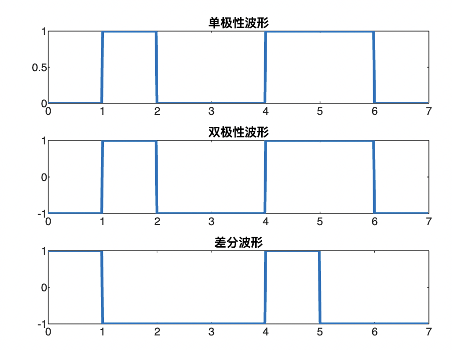

#### 实现不同的调制方式

为了能够较好地观察各个调制波形之间的细微区别，首先选择较低的载波频率进行波形分析。

##### 2ask

通过`ammod`函数对单极性波形进行**幅移键控（ ASK）**调制，函数使用指定的载波频率和采样频率将输入信号 `s_NRZ` 调制到载波上。然后再通过`amdemod`函数通过检测调制信号的幅度变化来恢复原始信号。（由于这里假设没有噪声，所以没有设置信道和噪声，而是直接解调）

```matlab
ask = ammod(s_NRZ,fc,fs);
d_ask = amdemod(ask,fc,fs);
```

调制的过程可以理解为将信号 `s_NRZ` 乘以载波 `cos(2 * pi * fc * t)`，使得信号的幅度随 `s_NRZ` 的变化而变化。调制和解调波形如下：

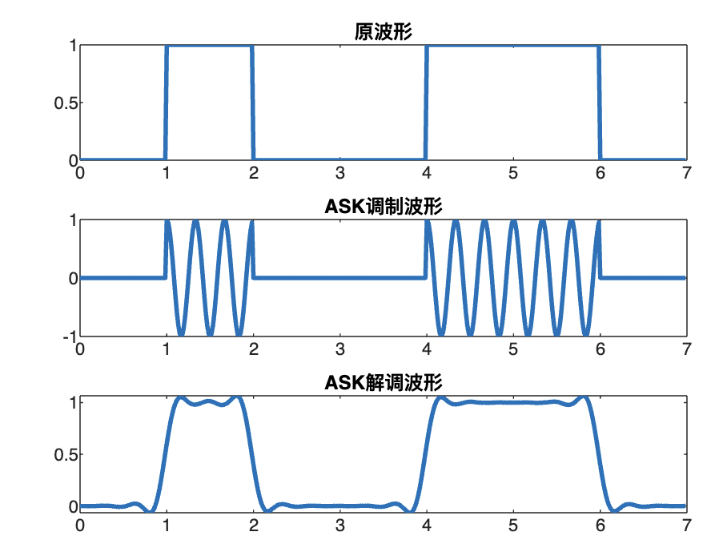

#### 2fsk

首先定义频率偏移量为2，频率偏移量反映了调制过程中频率的变化幅度。然后调用 `fmmod` 函数对单极性波形进行fsk调制，并使用 `fmdemod` 函数对调制信号进行解调，恢复原始信号。

```matlab
freqdev = 2;
fsk = fmmod(s_NRZ,fc,fs,freqdev);
d_fsk = fmdemod(fsk,fc,fs,freqdev);
```

在FSK调制中，当输入信号 `s_NRZ` 为高电平（1）时，载波频率增加 `freqdev`；当输入信号为低电平（0）时，载波频率减少 `freqdev`，调制和解调波形如下：

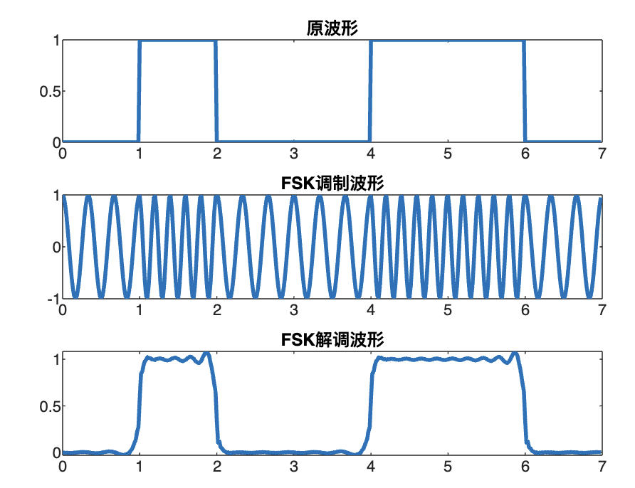

调制波形中当原波形是高电平时频率较高；当原波形是低电平时频率较低。而解调波形中可以看到比ask的要更还原原波形，信号增加或者减少的曲线更加接近于原波形突变的情况，效果更好。

#### 2psk

首先定义相位偏移量``phasedev`，这个值反应调制过程中相位的变化幅度。然后使用 `pmmod` 函数指定载波频率、采样频率和相位偏移量对信号进行**相移键控（psk）调制**，通过改变载波相位来传输信息。然后再直接通过 `pmdemod` 函数对调制信号进行解调，恢复原始信号。

```matlab
phasedev = pi/2;
psk = pmmod(s_NRZ,fc,fs,phasedev);
d_psk = pmdemod(psk,fc,fs,phasedev);
```

输入信号 `s_NRZ` 为高电平时，载波相位会增加 `phasedev`；当输入信号为低电平时，载波相位不变或减少 `phasedev`。调制后的信号 `psk` 会在不同的相位之间切换。调制和解调波形如下：

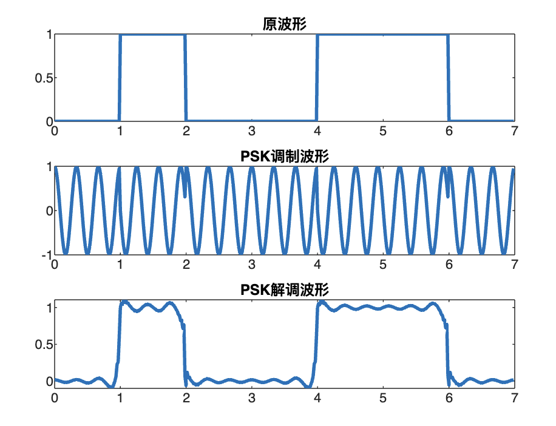

#### 2dpsk

进行**差分相移键控（DPSK）**调制和解调过程基本和psk一致，但是dpsk中进行调制的传入信号使用的是单极性波形的差分码。对dp波形进行psk调制和解调波形如下：

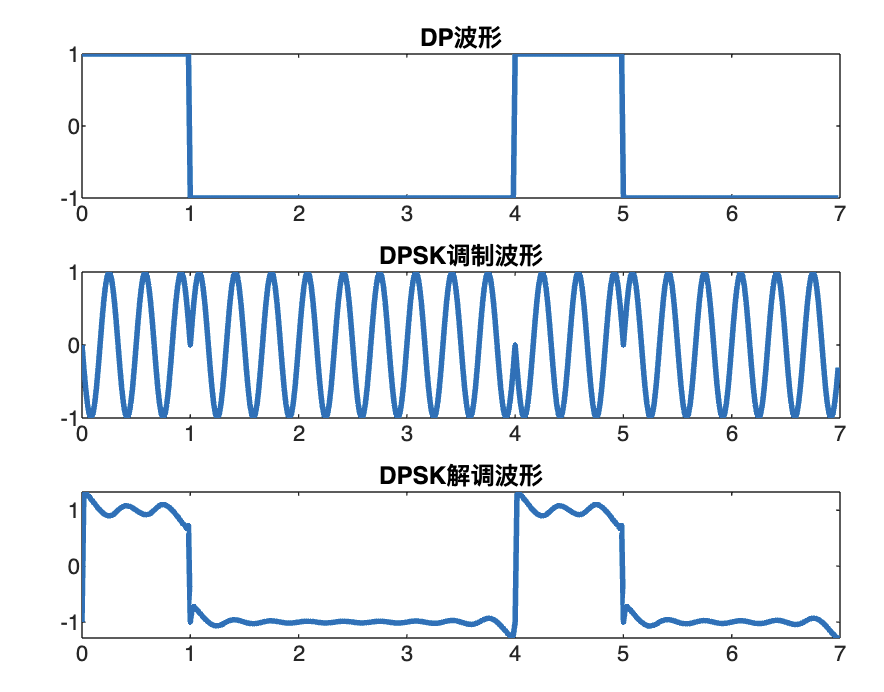

#### 不同载波频率和采样频率对解调波形的影响

多次实验发现，**载波频率fc越大，解调后就越接近原波形**：

- Fc=3，fs = 60

  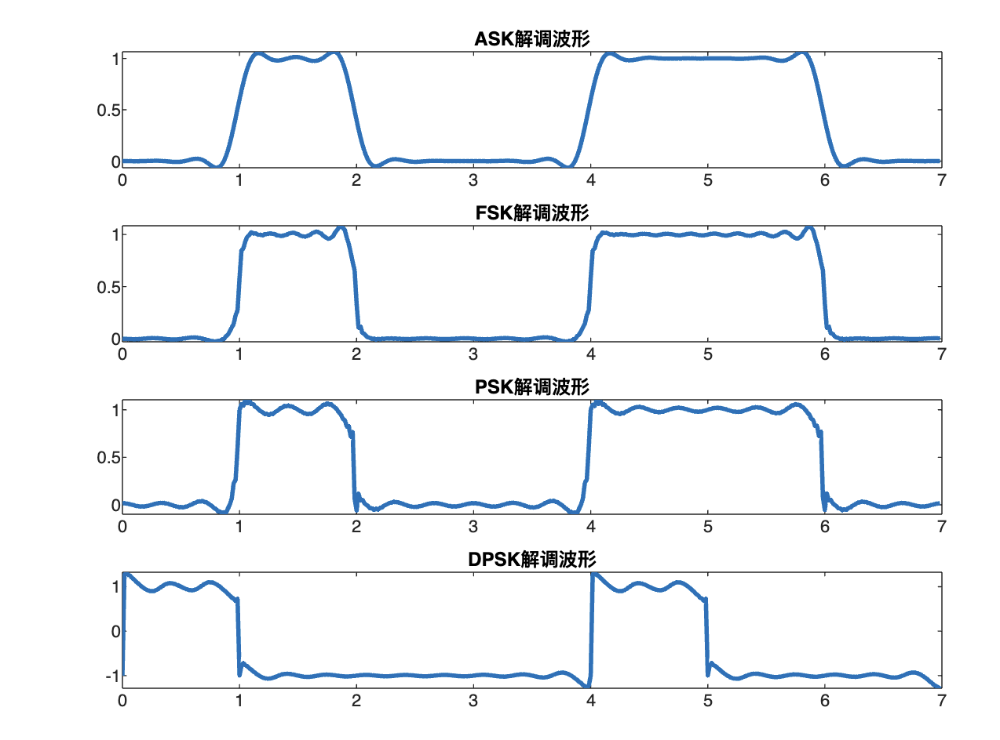

- Fc =10，fs=60

  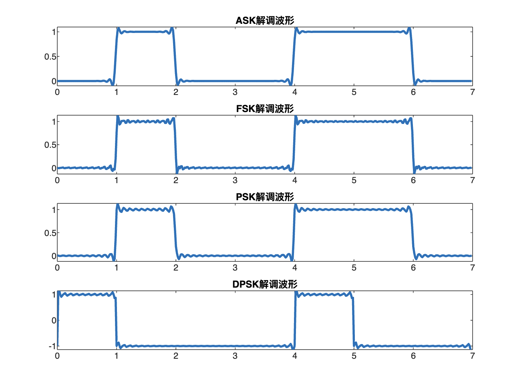

- Fc = 18， fs=60

  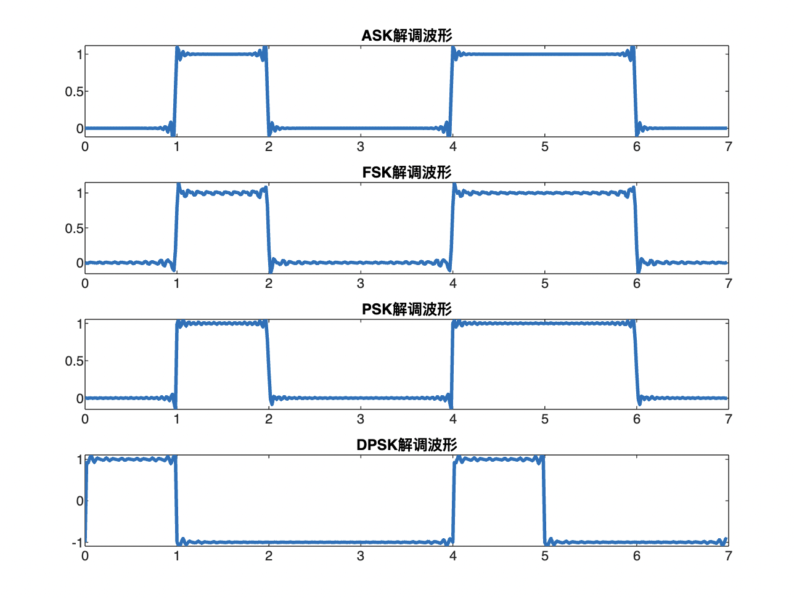

- 但是在**采样频率fs较低时，使用过高的载波频率fc会导致图形失真**：

  Fc = 24， fs=60:

  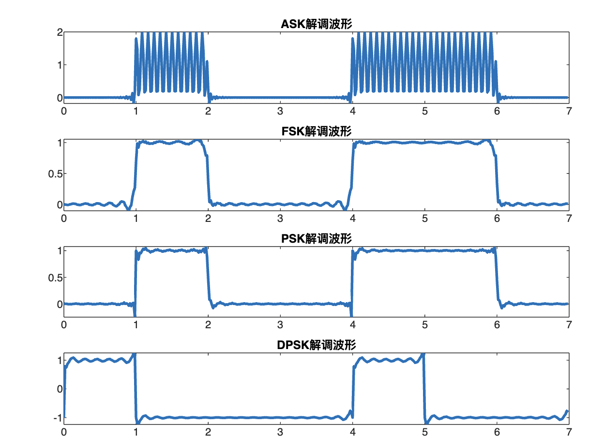

更改**采样频率fs基本不影响解调质量**，但是可以通过提升采样频率，从而在更高的载波频率fc时不会导致失真，从而得到更高的解调质量：

- Fc = 24， fs=100:

  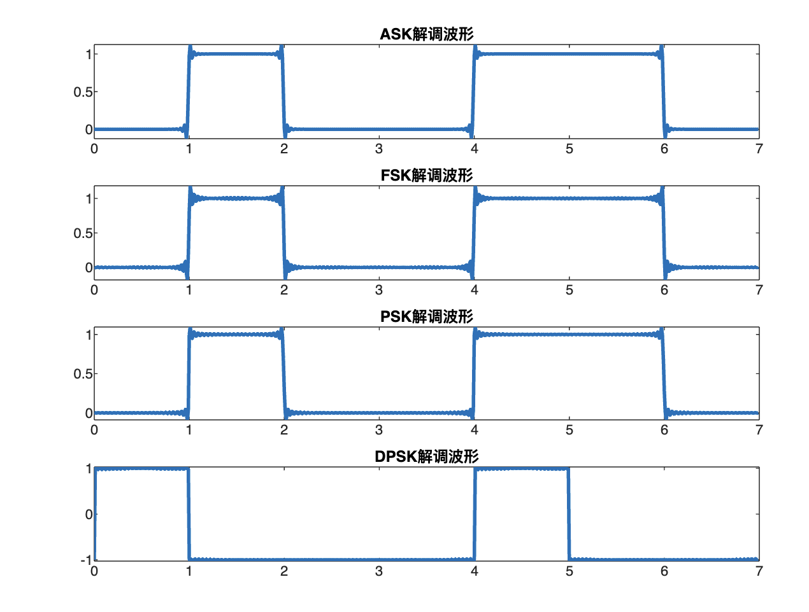

但是当fs过大时会造成**psk突变**的情况：

- Fc=30，fs = 1200

  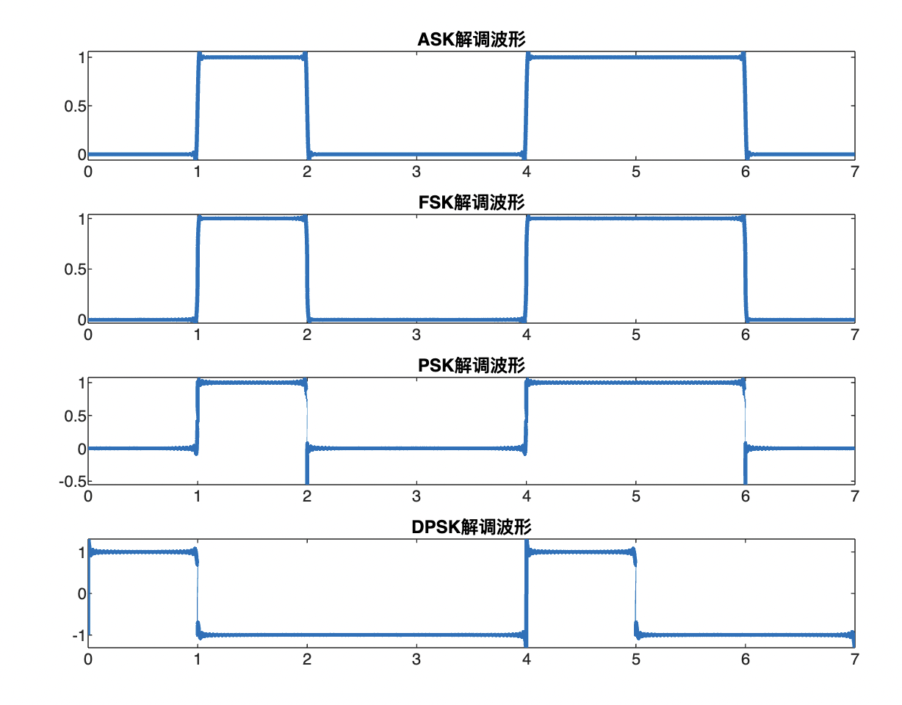

### 3、加入噪声信号

在发送端（调制）和接收端（解调）之间加入噪声，即等同于在模拟通信的两端信道上的噪声。分别加入高斯噪声、瑞丽

#### 高斯白噪声

在定义信噪比`SNR`后使用`awgn`函数在调制和解调之间加入高斯白噪声：

```matlab
% 添加噪声
SNR = 10; % 信噪比，单位为dB
% ask
ask = ammod(s_NRZ,fc,fs);
ask_noisy = awgn(ask, SNR, "measured")% 信道中加入噪声
d_ask = amdemod(ask_noisy,fc,fs);

% fsk
freqdev = 2;
fsk = fmmod(s_NRZ,fc,fs,freqdev);
fsk_noisy = awgn(fsk, SNR, "measured")% 信道中加入噪声
d_fsk = fmdemod(fsk_noisy,fc,fs,freqdev);

% psk
phasedev = pi/2;
psk = pmmod(s_NRZ,fc,fs,phasedev);
psk_noisy = awgn(psk, SNR, "measured")% 信道中加入噪声
d_psk = pmdemod(psk_noisy,fc,fs,phasedev);

% dpsk
phasedev = pi/2;
dpsk = pmmod(dp_NRZ,fc,fs,phasedev);
dpsk_noisy = awgn(dpsk, SNR, "measured")% 信道中加入噪声
d_dpsk = pmdemod(dpsk_noisy,fc,fs,phasedev);
```

分别尝试不同的信噪比：

- SNR=10

  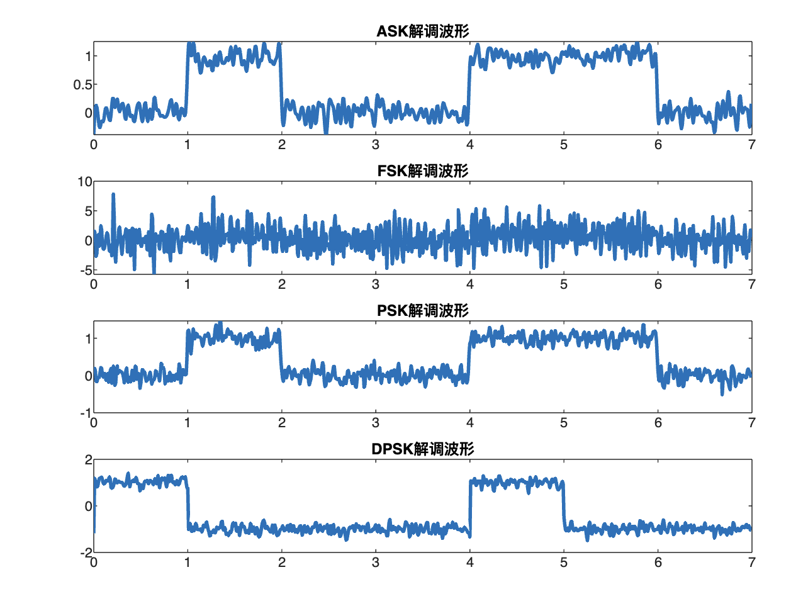

- SNR=20

  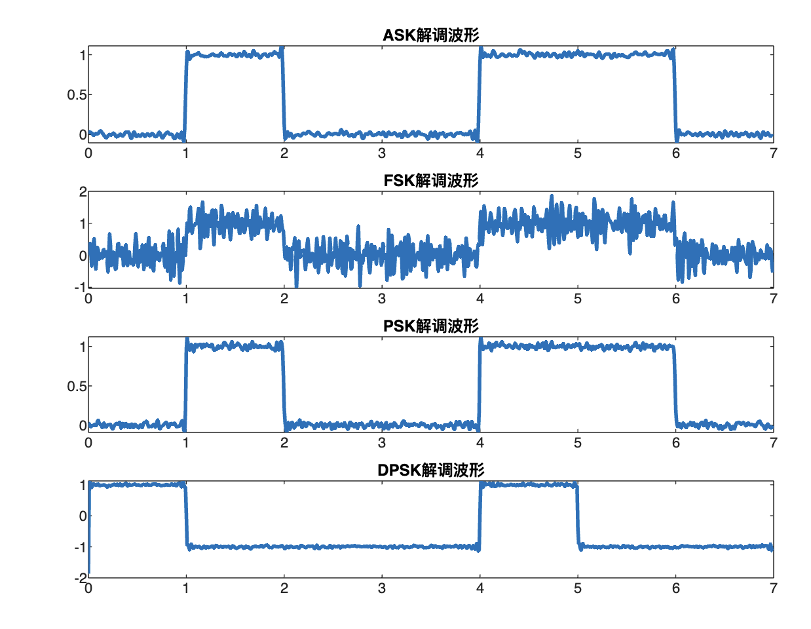

  分析：

  - 从信噪比来看，可以知道在高斯白噪声中，信噪比越大，对于噪声的抵抗效果越好。
  - 各个解调方式横向对比来看：
    1. 可以看到`dpsk`的调制解调方式对于高斯白噪声的抵抗能力最强，当`SNR=20`时可以看到基本还原原始波形。
    2. `ask`与`psk`对于白噪声的抵抗能力相当，但次于`dpsk`
    3. `fsk`对于白噪声的抵抗能力最弱，`SNR=10`时信息基本被抹除，与噪声信号无异；`SNR=20`时的解调恢复效果也远逊于其他调制波形。


#### 瑞丽噪声（无线通信）

瑞丽噪声常见于**无线通信**中，它的特点是噪声的幅度遵循瑞丽分布。

编写生成加性瑞丽分布的噪声函数：

```matlab
% 添加瑞丽噪声函数
function noisy_signal = add_rayleigh_noise(signal, snr)
    % Generate Rayleigh noise
    noise = raylrnd(1, size(signal));
    % Normalize noise to match desired SNR
    signal_power = rms(signal)^2;
    noise_power = rms(noise)^2;
    scaling_factor = sqrt(signal_power / (10^(snr / 10) * noise_power));
    noisy_signal = signal + noise * scaling_factor;
end
```

然后在调制和解调中间加入噪声（其他调制-解调方式同理）：

```matlab
% 添加噪声
SNR = 10; % 信噪比，单位为dB
% ask
ask = ammod(s_NRZ,fc,fs);
ask_noisy = add_rayleigh_noise(ask, SNR);
d_ask = amdemod(ask_noisy,fc,fs);
```

可以得到波形图：

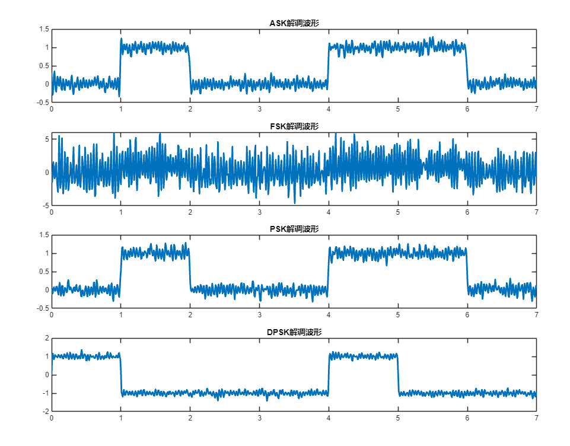

#### 散粒（泊松）噪声（有线通信）

有线通信中会出现散粒噪声，这种噪声由电流的不规则流动引起，通常在半导体器件中出现。因为电子（或光子）通过势垒时的流动符合泊松统计性质，所以散粒噪声通常被建模成泊松噪声。这里使用泊松噪声模拟有线通信中的散粒噪声。

生成泊松噪声，然后加入到调制后的信号中（其他调制-解调方式同理）：

```matlab
lambda = 0.03;  % 泊松噪声强度
poissonNoise = poissrnd(lambda, size(dp_NRZ)); % 生成泊松噪声

ask = ammod(s_NRZ,fc,fs);
ask_noisy = ask + poissonNoise;
d_ask = amdemod(ask_noisy,fc,fs);
```

可以得到噪声强度为0.03时的解调波形：

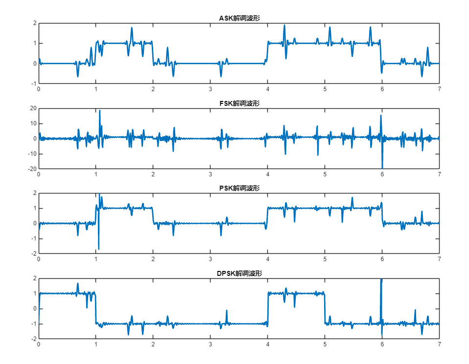

### 4、使用通信系统传输图片

首先将图片转换成位图格式：

```matlab
image = imread('image.png');
image = imresize(image,[256,256]);
grayImage = rgb2gray(image);
binaryImage = imbinarize(grayImage);
img = double(reshape(binaryImage,1,[]));
M = max(img)+1;  %量级
dpSignal = real(dpskmod(img,M));
```

然后使用构建好的通信系统进行传输，沿用之前的参数与发送端、信道和接收端结构（这里之前的流程完全一样）。但是图片传输不同的是在接收端解调后，还需要将接收到的信号重新reshape成原来图像的形状以展示传输效果：

```matlab
imAsk =  reshape(rev_ask,256,256);
imFsk =  reshape(rev_fsk,256,256);
imPsk =  reshape(rev_psk,256,256);
imDPsk =  reshape(rev_dpsk,256,256);
```


