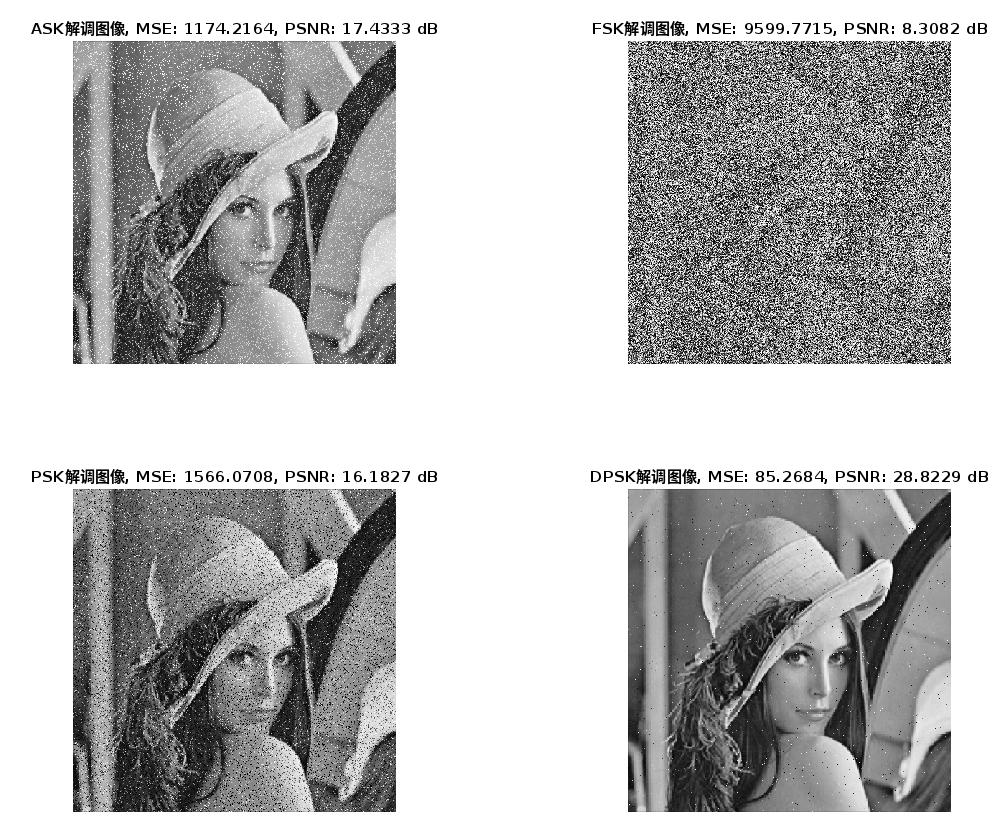

# 通信原理实训作业

| 成员名单 |   学号   | 贡献率 |
| :------: | :------: | :----: |
|  刘冠麟  | 20319045 |  50%   |
|  廖飞羽  | 21307383 |  50%   |

## 实验过程

### 1、基于Matlab通信工具箱构建通信系统（有线/无线）连接A与B

初始化MATLAB环境，设置发送和接收的基本通信模型的参数：

```matlab
A = 1;                  % 载波幅度
fc = 3;                 % 载波频率
Nsam = 60;              % 每个码元的采样点数, 即采样频率fs
fs  = Nsam;
L_Dseq = 7;             % 码元数目, 数值长度
T = 1;                  % 码元宽度
dt = T / Nsam;          % 波形采样间隔
t = 0:dt:L_Dseq*T-dt;   % 波形采样时间点，0开始，以dt为步长
Lt = length(t);         % 波形采样点数
ct = A * sin(2 * pi * fc * t);  % 载波
```

然后构建发送端，将处理好的好的信源进行编码并调制：（构建通信系统架构，只展示部分代码）

```matlab
%--------------------发送端---------------
s_NRZ = real(dpskmod(binSignal,2));
...

ask = ammod(s_NRZ,fc,fs);
freqdev = 2;
...
```

然后要模拟通信中的信道，在无噪声的情况下信道可以视为直接将发送端的调制信号赋值给接收端进行解调。而信道噪声则通过加入噪声来模拟：

```matlab
%--------------------信道---------------
%   噪声模拟
snr = 10;  %信噪比
...
```

然后对信道传输来的信号进行解调构建接收端：

```matlab
%--------------------接收端---------------
d_ask = amdemod(ask,fc,fs);
rev_ask = intdump(d_ask,fs);
...
```


### 2、分别考虑不同的编码方式和调制方式实现二进制数据传输并调制接收

#### 实现不同的编码方式

首先构建信源和矩阵成波，这里信号设置为**二进制传输**：

```matlab
binSignal = [0, 1, 0, 0, 1, 1, 0];
dpSignal = real(dpskmod(binSignal, 2));
```

然后分别实现单极性、双极性、差分码等三种编码方式：

```matlab
% 单极性
s_NRZ = rectpulse(binSignal, Nsam);
% 双极性
d_NRZ = s_NRZ * 2 - 1;
% 差分码
dp_NRZ = rectpulse(dpSignal, Nsam);
```

将编码方式可视化如下：


#### 实现不同的调制方式

为了能够较好地观察各个调制波形之间的细微区别，首先选择较低的载波频率进行波形分析。

##### 2ask

通过`ammod`函数对单极性波形进行**幅移键控（ ASK）**调制，函数使用指定的载波频率和采样频率将输入信号 `s_NRZ` 调制到载波上。然后再通过`amdemod`函数通过检测调制信号的幅度变化来恢复原始信号。（由于这里假设没有噪声，所以没有设置信道和噪声，而是直接解调）

```matlab
%----------------2ask---------------
ask = ammod(s_NRZ,fc,fs);
d_ask = amdemod(ask,fc,fs);
```

调制的过程可以理解为将信号 `s_NRZ` 乘以载波 `cos(2 * pi * fc * t)`，使得信号的幅度随 `s_NRZ` 的变化而变化。调制和解调波形如下：


#### 2fsk

首先定义频率偏移量为2，频率偏移量反映了调制过程中频率的变化幅度。然后调用 `fmmod` 函数对单极性波形进行fsk调制，并使用 `fmdemod` 函数对调制信号进行解调，恢复原始信号。

```matlab
%----------------2fsk---------------
freqdev = 2;
fsk = fmmod(s_NRZ,fc,fs,freqdev);
d_fsk = fmdemod(fsk,fc,fs,freqdev);
```

在FSK调制中，当输入信号 `s_NRZ` 为高电平（1）时，载波频率增加 `freqdev`；当输入信号为低电平（0）时，载波频率减少 `freqdev`，调制和解调波形如下：


调制波形中当原波形是高电平时频率较高；当原波形是低电平时频率较低。而解调波形中可以看到比ask的要更还原原波形，信号增加或者减少的曲线更加接近于原波形突变的情况，效果更好。

#### 2psk

首先定义相位偏移量``phasedev`，这个值反应调制过程中相位的变化幅度。然后使用 `pmmod` 函数指定载波频率、采样频率和相位偏移量对信号进行**相移键控（psk）调制**，通过改变载波相位来传输信息。然后再直接通过 `pmdemod` 函数对调制信号进行解调，恢复原始信号。

```matlab
%----------------2psk---------------
phasedev = pi/2;
psk = pmmod(s_NRZ,fc,fs,phasedev);
d_psk = pmdemod(psk,fc,fs,phasedev);
```

输入信号 `s_NRZ` 为高电平时，载波相位会增加 `phasedev`；当输入信号为低电平时，载波相位不变或减少 `phasedev`。调制后的信号 `psk` 会在不同的相位之间切换。调制和解调波形如下：


#### 2dpsk

进行**差分相移键控（DPSK）**调制和解调过程基本和psk一致，但是dpsk中进行调制的传入信号使用的是单极性波形的差分码。然后再对得到的差分码编码得到二进制信号。

```matlab
%----------------2dpsk---------------
phasedev = pi/2;
dpsk = pmmod(dp_NRZ,fc,fs,phasedev);
d_dpsk = pmdemod(dpsk,fc,fs,phasedev);
rev_dpsk = intdump(d_dpsk,fs); 
rev_dpsk = dpskdemod(rev_dpsk,2); 
rev_dpsk = rectpulse(rev_dpsk,Nsam);
```

对dp波形进行psk调制和解调波形如下：


#### 不同载波频率和采样频率对解调波形的影响

多次实验发现，**载波频率fc越大，解调后就越接近原波形**：

- Fc=3，fs = 60

  

- Fc =10，fs=60

  

- 但是在**采样频率fs较低时，使用过高的载波频率fc会导致图形失真**：

  Fc = 24， fs=60:

  

更改**采样频率fs基本不影响解调质量**，但是可以通过提升采样频率，从而在更高的载波频率fc时不会导致失真，从而得到更高的解调质量。但是当fs过大时会造成**psk突变**的情况：

- Fc=30，fs = 1200

  

### 3、加入噪声信号

在发送端（调制）和接收端（解调）之间加入噪声，即等同于在模拟通信的两端信道上的噪声。分别加入高斯噪声、瑞丽以及泊松噪声对各个解调方式进行横向对比。

**（这里为了更直观的对比不同不同编码方式的抗噪声效果，在DPSK的波形图中选择直接展示差分码的传输效果）**

#### 高斯白噪声

在定义信噪比`SNR`后使用`awgn`函数在调制和解调之间加入高斯白噪声：

```matlab
% 添加噪声
SNR = 10; % 信噪比，单位为dB
% ask
ask = ammod(s_NRZ,fc,fs);
ask_noisy = awgn(ask, SNR, "measured")% 信道中加入噪声
d_ask = amdemod(ask_noisy,fc,fs);

% fsk
freqdev = 2;
fsk = fmmod(s_NRZ,fc,fs,freqdev);
fsk_noisy = awgn(fsk, SNR, "measured")% 信道中加入噪声
d_fsk = fmdemod(fsk_noisy,fc,fs,freqdev);

% psk
phasedev = pi/2;
psk = pmmod(s_NRZ,fc,fs,phasedev);
psk_noisy = awgn(psk, SNR, "measured")% 信道中加入噪声
d_psk = pmdemod(psk_noisy,fc,fs,phasedev);

% dpsk
phasedev = pi/2;
dpsk = pmmod(dp_NRZ,fc,fs,phasedev);
dpsk_noisy = awgn(dpsk, SNR, "measured")% 信道中加入噪声
d_dpsk = pmdemod(dpsk_noisy,fc,fs,phasedev);
```

分别尝试不同的信噪比：

- SNR=10

  

  

- SNR=20

  

  分析：

  - 从信噪比来看，可以知道在高斯白噪声中，信噪比越大，对于噪声的抵抗效果越好。
  - 各个解调方式横向对比来看：
    1. 可以看到`dpsk`的调制解调方式对于高斯白噪声的抵抗能力最强，当`SNR=20`时可以看到基本还原原始波形。
    2. `ask`与`psk`对于白噪声的抵抗能力相当，但次于`dpsk`
    3. `fsk`对于白噪声的抵抗能力最弱，`SNR=10`时信息基本被抹除，与噪声信号无异；`SNR=20`时的解调恢复效果也远逊于其他调制波形。


#### 瑞丽噪声（无线通信）

瑞丽噪声常见于**无线通信**中，它的特点是噪声的幅度遵循瑞丽分布。

编写生成加性瑞丽分布的噪声函数：

```matlab
% 添加瑞丽噪声函数
function noisy_signal = add_rayleigh_noise(signal, snr)
    % Generate Rayleigh noise
    noise = raylrnd(1, size(signal));
    % Normalize noise to match desired SNR
    signal_power = rms(signal)^2;
    noise_power = rms(noise)^2;
    scaling_factor = sqrt(signal_power / (10^(snr / 10) * noise_power));
    noisy_signal = signal + noise * scaling_factor;
end
```

然后在调制和解调中间加入噪声（其他调制-解调方式同理）：

```matlab
% 添加噪声
SNR = 10; % 信噪比，单位为dB
% ask
ask = ammod(s_NRZ,fc,fs);
ask_noisy = add_rayleigh_noise(ask, SNR);
d_ask = amdemod(ask_noisy,fc,fs);
```

可以得到波形图：


#### 散粒（泊松）噪声（有线通信）

有线通信中会出现散粒噪声，这种噪声由电流的不规则流动引起，通常在半导体器件中出现。因为电子（或光子）通过势垒时的流动符合泊松统计性质，所以散粒噪声通常被建模成泊松噪声。这里使用泊松噪声模拟有线通信中的散粒噪声。

生成泊松噪声，然后加入到调制后的信号中（其他调制-解调方式同理）：

```matlab
lambda = 0.03;  % 泊松噪声强度
poissonNoise = poissrnd(lambda, size(dp_NRZ)); % 生成泊松噪声

ask = ammod(s_NRZ,fc,fs);
ask_noisy = ask + poissonNoise;
d_ask = amdemod(ask_noisy,fc,fs);
```

可以得到**噪声强度为0.03**时的解调波形：


### 4、使用通信系统传输图片

首先将图片转换成二进制序列：

```matlab
% 读取图像
img = imread('image.png'); % 替换为你的图像文件路径
gray_img = rgb2gray(img); % 转换为灰度图像


% 将灰度图像转换为二进制序列
bin_img = de2bi(gray_img(:), 8, 'left-msb')';
bin_img = bin_img(:);
```

然后使用构建好的通信系统进行传输，沿用之前的参数与发送端、信道和接收端结构（这里之前的流程完全一样）。但是图片传输不同的是在接收端解调后，还需要将接收到的信号重新转换成二进制序列，然后再转换回图像以展示传输效果：（这里以ask调制为例，其他调制方法同理）

```matlab
% 将解调后的信号转换回二进制序列
d_ask(d_ask > 0.5) = 1;
d_ask(d_ask <= 0.5) = 0;
d_ask_bin = d_ask(1:Nsam:end);

% 将二进制序列转换回图像
d_img = reshape(bi2de(reshape(d_ask_bin, 8, []).', 'left-msb'), size(gray_img));
```

无噪声理想环境下的解调效果如下：


从肉眼上看可以看到无噪声时每种方法解调效果基本都和原图一致，也就是说这四种方法在无噪声环境下都能很好地完成调制-解调的传输。


### 5、分析原图与接收图的误差

使用**均方误差**以及**峰值信噪比**来衡量传输图像的恢复效果，通过下面代码实现解调图像与原图的均方误差以及峰值信噪比的计算：

```matlab
% 计算均方误差（MSE）
mse_value = immse(uint8(d_img), gray_img);

% 计算峰值信噪比（PSNR）
psnr_value = psnr(uint8(d_img), gray_img);
```

计算无噪声环境下四种调制-解调方式的均方误差和峰值信噪比：


可以看到`ASK`、`PSK`、`DPSK`和原图的**均方误差都为0**，并且峰值信噪比为**无穷大**，说明这三种方式的解调图像都基本完全恢复原图。只有`FSK`的解调方式均分误差为**1.2404**，说明`fsk`哪怕在无噪环境下也可能存在质量损失。


### 6、加入各种噪声重复测试

#### 高斯白噪声

加入高斯白噪声

##### 选择SNR=5:


##### 选择SNR=10：


##### 选择SNR=20：


由上面的测试可以看出，对于高斯白噪声，由MSE的量化指标可以得出四种算法的抗噪性能对比为**DPSK>ASK>PSK>FSK**，当SNR=5时四种算法的解调结果都有较大噪声，但是**性能较好的DPSK和ASK已经基本能看清内容**；当SNR=10时**性能最好的DPSK的MSE值已经接近于0，肉眼无法看到噪声**；SNR=15时ASK和DPSK都已经接近**无损解调**，而PSK仍有一部分噪点。**FSK的抗噪性能最差**，三个信噪比条件下解调的图片基本都无法看出原图。

#### 瑞丽噪声

##### SNR=5


##### SNR=10


##### SNR=15


由上面的测试可以看出，对于瑞丽噪声，抗噪能力**ASK>DPSK>PSK>FSK**。不同的是在瑞丽噪声中，ASK的抗噪能力要强于DPSK，而FSK的抗噪能力依旧是最差的，而且其抗瑞丽噪声的能力远比抗白噪声能力弱。

#### 泊松噪声

##### lambda = 0.1



##### lambda = 0.03


##### lambda = 0.01


由上面的测试可以看出，对于泊松噪声，抗噪能力**DPSK>ASK>PSK>FSK**。不同的是在泊松噪声中，DPSK的抗噪能力**断崖领先**，在其他解调方式都有明显的噪点时，DPSK的解调图像已经肉眼观察不到噪点，同等lambda下的MSE也远远小于其他的解调方式。


### 分析讨论

####  数据传输模拟系统的设计与工作原理分析

#####  数据传输模拟系统设计

广义的数据传输模拟系统的模型如下所示：


这里实验中为了简化模型，对基本的数据传输模拟系统进行以下设计：

- 采用了**ASK、FSK、PSK以及DPSK**四种调制-解调方法，将其作为调制-解调器放在发送和接收两端，并对四种方法的传输效果、抗噪能力进行了横向对比。

- 为了实验方便，这里只选了进行**有线传输**的信道模型，即在传输过程中不考虑衰减，只考虑收到的噪声影响。

- 在信道的传输过程中的噪声部分，选用了噪声中最常见的**高斯白噪声**、无线传输中经常出现的**瑞丽噪声**以及有线传输中的**泊松噪声**作为加性噪声加在有线信道上，并对三种噪声、四种调制-解调方法进行了横向对比，用来模拟各自噪声环境。

- 总的来说本实验基于广义的数据传输模拟系统进行了简化，总体传输流程为**编码器输出 -> 调制器 -> 有线传输 -> 加噪 -> 有线传输 -> 解调器 -> 译码器输入 **，系统的大体示意图如下所示：

  

##### 工作原理分析

工作原理主要对调制-解调器系统进行分析。调制器和解调器通过将数字信号和模拟信号之间进行转换，可以实现数据在不同传输介质上的高效可靠的传输。调制-解调系统主要分为两个部分：

**1.调制器：**

调制器的主要功能是将数字信号转换成适合在传输介质上传输的模拟信号。这一过程称为调制。常见的调制方式包括幅度调制（AM）、频率调制（FM）和相位调制（PM）。调制器经过以下两个步骤：

- **生成载波信号**：调制器首先接收来自数据源的数字信号（二进制序列）。然后产生一个**高频**的载波信号，这是一个纯正弦波，频率远高于输入信号的频率。

- **然后对载波信号进行调制，主要进行以下三种方式**：

  - **幅度调制（AM）**：将数字信号的幅度值映射到载波信号的幅度上。
  - **频率调制（FM）**：根据数字信号的值改变载波信号的频率。
  - **相位调制（PM）**：根据数字信号的值改变载波信号的相位。

  最后调制器再对调制后的信号发送到传输介质中进行传输。

**2.解调器：**

解调器的主要将接收到的模拟信号转换回数字信号。对应调制器同样分为两个部分：

- **载波信号恢复**：解调器接收经过传输介质传输过来的高频调制信号，然后需要对调制信号恢复成原始的载波信号，以便于与接收到的信号进行比较和处理。
- **解调**：同样根据不同的调制方式分**幅度解调、频率解调以及相位解调**三种。经过这三种解调后生成数字信号，送到接收端的数据处理系统。

以上三种调制-解调方法分别对应实验中的**ASK、FSK以及PSK**，同时**我们在实验中还拓展使用了DPSK进行传输**。

使用调制-解调方法可以将数字信号转换成模拟信号，并输送到介质中进行传输。由于低频信号在传输介质中容易衰减，传输距离有限，相反，**高频信号能够更好地穿过各种障碍物和环境**，减少信号的衰减和失真，因此通过调制将低频信号加载到高频载波上可以显著提高信号的传输距离；而且**高频信号对电磁干扰和噪声的抗干扰能力更强**，通过调制可以提高信号在传输过程中的稳定性和可靠性。

此外，不同的信号可以使用不同的载波频率进行调制，这样就可以在同一传输介质中同时传输多个信号，即频分多路复用（FDM），提高了频谱利用率，允许不同类型的服务（如语音、数据、视频）共存于同一传输通道中，提高了通信系统的效率和灵活性。

对于设计中的传输部分，由于模拟的是有线传输，我们是直接将生成的信号经过调制函数输出后再传入自己编写的加性噪声函数加到信号上直接传递给解调函数，最后再复原输出。


#### 编码方式的影响

我们在实验中实现了单极性、双极性以及差分编码三种编码方式，波形示意图如下：


##### 单极性编码

优点：
- 简单，易于实现和理解。
- 适合短距离传输。

缺点：
- 容易受噪声和干扰影响。
- 直流分量高，不适合长距离传输或需要通过变压器耦合的系统。
- 无法自同步，因为信号中缺乏足够的电平变化，接收端难以准确同步。

##### 双极性编码

优点：
- 较低的直流分量，适合长距离传输。
- 改善了信号的抗干扰能力。
- 电平变化有助于自同步。

缺点：
- 需要更复杂的电路来产生和检测不同的电平。
- 如果长时间没有“1”信号，可能会导致同步问题（归零码部分改善了这一问题）。

##### 差分编码

优点：
- 对于信号反转（如由于传输介质的问题），能够保持数据完整性，因为解码依赖电平变化。
- 更好的抗噪声能力，因为信号依赖于相对变化而非绝对值。
- 电平变化有助于时钟同步。

缺点：
- 实现相对复杂，需要专门的电路来检测电平变化。
- 由于依赖于电平变化，传输效率可能略低。


可以看到编码方式的选择对通信系统的性能有着显著影响。**单极性编码实现简单，但抗干扰能力差**，适合短距离传输；而差分编码虽然实现复杂，但是**抗噪能力强，适合高干扰环境**。在我们的实验中也验证了这一点我们在实验中实现的**PSK**和**DPSK**区别在于前者我们使用了单极性编码作为输入信号；后者选用差分编码作为输入信号，而在图像抗噪的实验中可以明显看到，相同信噪比（或者噪声强度）的情况下，**DPSK的抗噪能力全面优于PSK**，这也印证了差分编码的编码方式抗噪能力更强：


#### 调制解调方式的影响

调制解调方式的影响主要体现在**传输质量**以及**抗噪能力**的不同。

##### 传输质量

从传输质量上来看，经过波形图的直观观察可以看到**DPSK具有最好的传输质量**，同时也再次侧面证明了差分编码具有更好的传输质量。


同时结合带有误差量化值的图像传输实验来看，当fc和fs足够高时，在无噪声环境下可以看到`ASK`、`PSK`、`DPSK`和原图的**均方误差都为0**，并且峰值信噪比为**无穷大**，说明这三种方式的解调图像都基本完全恢复原图。而`FSK`的解调方式哪怕在无噪环境下也可能存在质量损失，传输质量最差。


##### 抗噪能力

其次从抗噪能力上来看，综合表现抗噪能力**DPSK>ASK>PSK>FSK**，使用差分编码传输的DPSK具有最强的抗噪能力，与之相反的是FSK基本不具有抗噪的功能。

波形图与加噪传播的图形可视化（详细对比可以看实验过程）：


综合对比下来，**DPSK无论传输质量还是抗噪能力都是最好的**，但是缺点在于使用的差分编码实现相对复杂，需要专门的电路来检测电平变化，同时传输效率可能较低；**而ASK的传输质量次之**，但好处在于使用单极性编码实现简单。综合下来ASK更适合短程传输；DPSK适合远程传输。


#### 噪声类型、噪声强度对误差的影响

##### 噪声类型

根据上面的实验对比可以发现，对于最为常见的**白噪声**，四种算法的抗噪性能对比为**DPSK>ASK>PSK>FSK**；而对于无线通信中常见的**瑞丽噪声**，抗噪能力**ASK>DPSK>PSK>FSK**；对于有线通信中常见的**泊松噪声**，抗噪能力**DPSK>ASK>PSK>FSK**。

因此可以发现不同的调制方式对于不同的噪声类型的抗噪能力也不尽相同，对于白噪声、泊松噪声，使用**DPSK**能有更好的抗噪能力，特别是对于泊松噪声，其抗噪性能远远优于其他三种调制-解调方式；而对于瑞丽噪声，则使用**ASK**会更好，同时由于其使用单极性编码，传输效率和性能上也更有优势。

##### 噪声强度

其次是噪声强度，多次实验中**显而易见的是随着噪声强度的减少（信噪比增大、lambda值或者噪声密度减小），图像的传输质量越高**，误差也就越小。（可见实验过程）


#### 有线传输、无线传输的影响

有线传输和无线传输的区别主要在于**传输质量**。

##### 有线传输
对于有线传输来说，其优点主要在于**传输质量更好**：

- **稳定性高**：有线传输一般受环境干扰较小，信号稳定，传输速率较高且稳定，并且不会有较大的衰减。

- **带宽大**：有线传输可以提供极高的带宽。

但是对于有线传输来说其需要物理布线，限制了设备的移动性和灵活性，需要进行物理布线，同时部署成本也较高。

##### 无线传输
相反无线传输无需布线，设备可以随时随地移动和连接，具有较强的灵活性，并且部署成本很低。但是其**传输质量却远远不如有线传输**不仅容易容易受到环境（如墙壁、电磁干扰）影响，导致信号不稳定或速率下降，随着传播距离的增加，其**信息传输也会有比有线传输更大的衰减**。

##### 噪声

同时，我们还从**噪声角度**对有线传输和无线传输进行了分析，对于有线传输，特别是通过光纤、光缆进行传输的情况，光子的统计波动通常会导致**泊松噪声**，而实验证明在**泊松噪声的情况下DPSK的抗噪性能最好**；相反，对于无线传输，信号通过多个路径到达接收端，这些路径可能由于反射、折射和散射等原因产生不同的延迟和相位。这种多径效应会导致接收到的信号幅度呈现瑞丽分布，从而引入**瑞丽噪声**。我们通过实验证明了在**瑞丽噪声的情况下ASK的抗噪性能最好**。

所以我们认为对于无线通信，最好选用**ASK**作为调制-解调方式；对于有线通信，最好选用**DPSK**进行调制-解调。

