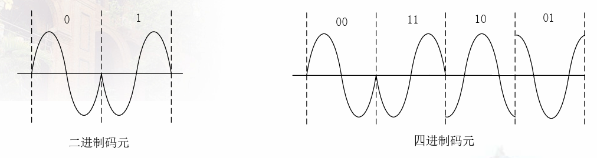

<<<<<<< HEAD
## 第一章 通信概论

### 1.2 消息、信息和信号

- 信息：通信的有效、实质性内容
- 消息：语音、文字、图形、图像等
- 编码：消息的数值表示
- 信号：消息的载体

- 码元：数字通信中一个基带**波形**所对应的二进制码组

- 比特：码元（二进制码组）中的一个二进制位
- 带宽=**信道最高信号频率-信道最低信号频率**，单位为Hz，要和计算机网络语境中的带宽区分开：
  - 信道容量：信道的最高比特率，bps
- 信息的度量：衡量一个消息包含信息的数量
  - 定义：$I=log_a \frac{1}{P(x)}=-log_a{P(x)}$
  - 通常取a=2，此时单位为bit
  - 对于一个等概率的$N=2^k$进制码元信息（这类信息共有$2^k$个），每种信息其信息量为$k$bit
  - 为什么要加log？为了使得信息量具有相加性，即总量是每件**独立**消息的信息量总和
=======
2.2.2

- 自相关函数
  物理含义：t时刻和t+tao时刻的方向是否一致
- 互相关函数
  两个信号之间的相关性

2.6.2

- 平稳随机过程：任何时刻统计特性都不随时间变化（期望一阶矩、方差等）
- 广义平稳随机过程：放宽要求，只要求平均值、方差和自相关函数与时间起点无关就行了。
  - 期望在任意时间点上都一样；
  - 方差、自相关函数都一样等

2.6.3

- 各态历经性
  - 平稳随机过程的一个实现可以经历此过程的所有状态
  - 各态历经的特点：没有办法通过实例确定时刻的平均值，但是经历过一段时间以后，可以通过这段时间的平均值代替某一时刻的平均值

平稳随机过程的实现：平稳随机过程的任意一个实例（某一条确定的曲线）
>>>>>>> c5e5e7934b11e35044c7d4e5f2767c4ca8a68d8c

